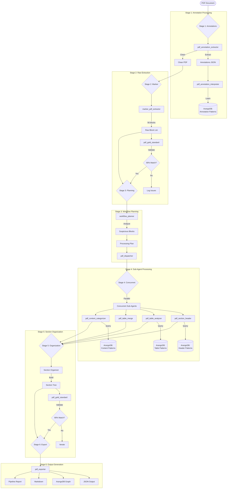
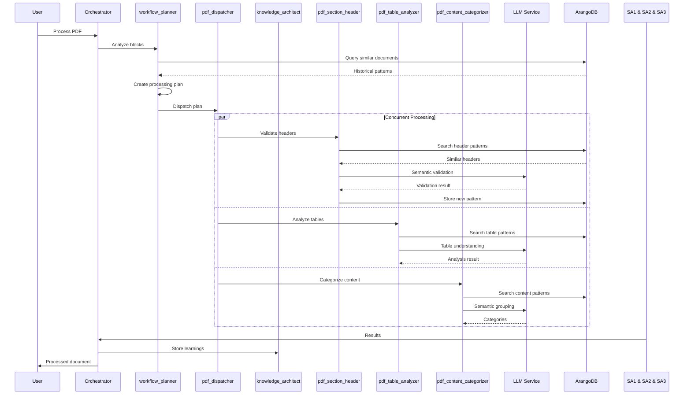
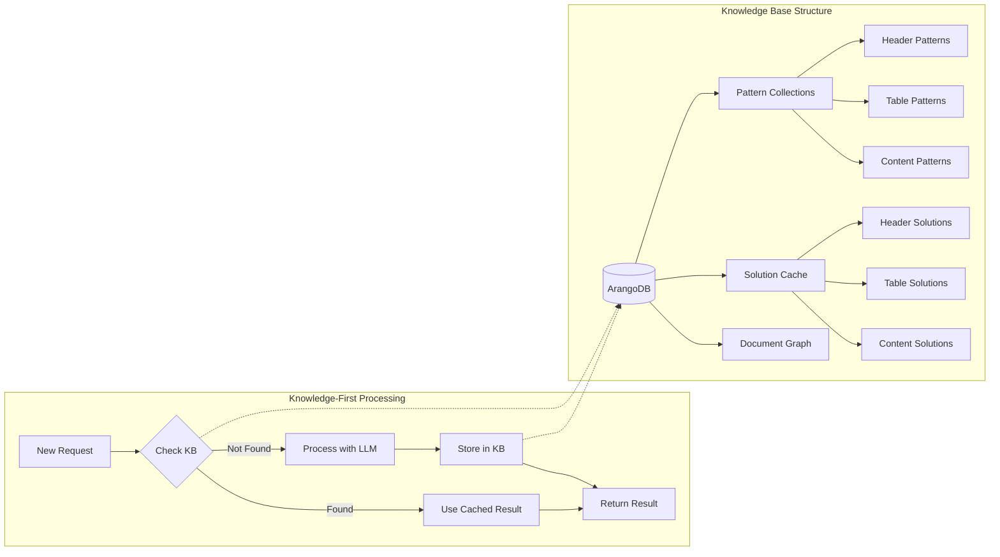
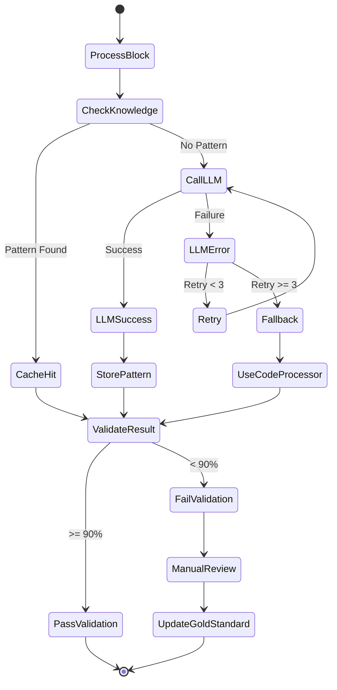
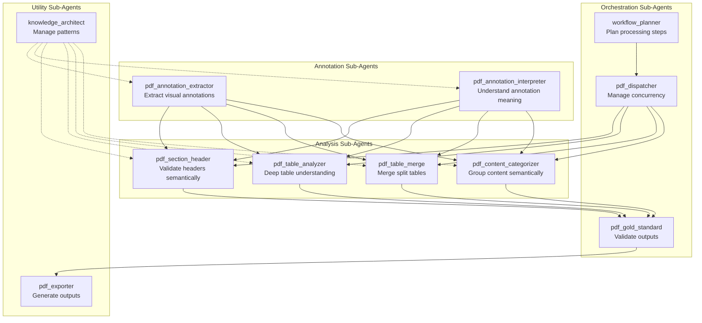
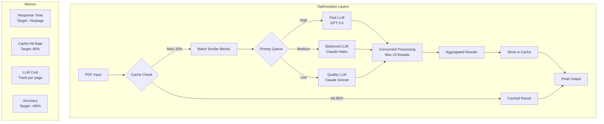

# PDF Sub-Agent Pipeline Architecture - Visual Guide

## Overview

This document provides clear visual representations of how the PDF sub-agent pipeline works, showing the transformation from the current code-based approach to the new sub-agent orchestrated system.

## 1. Current Architecture vs Sub-Agent Architecture

```mermaid
graph TB
    subgraph "Current Code-Based Pipeline"
        PDF1[PDF Input] --> AE1[Annotation Extractor]
        AE1 --> MP1[Marker PDF]
        MP1 --> CP1[Code Processors]
        CP1 --> |"Pattern Matching"| SH1[SectionHeader Processor]
        CP1 --> |"Rules"| TP1[Table Processor]
        CP1 --> |"Hardcoded"| ST1[Stage3 Transformer]
        ST1 --> VAL1[Validation: 77.9%]
        VAL1 --> |"FAIL"| OUT1[Output]
    end
    
    subgraph "New Sub-Agent Pipeline"
        PDF2[PDF Input] --> SA1[pdf_annotation_extractor]
        SA1 --> |"Clean PDF"| SA2[marker_pdf_extractor]
        SA2 --> |"Raw Blocks"| WP[workflow_planner]
        WP --> |"Dispatch"| PD[pdf_dispatcher]
        PD --> |"Concurrent"| SAG{Sub-Agent Group}
        SAG --> SA3[pdf_section_header]
        SAG --> SA4[pdf_table_analyzer]
        SAG --> SA5[pdf_content_categorizer]
        SA3 & SA4 & SA5 --> |"Semantic Understanding"| SA6[pdf_gold_standard]
        SA6 --> VAL2[Validation: >90%]
        VAL2 --> |"PASS"| OUT2[Output]
    end
    
    style VAL1 fill:#f96,stroke:#333,stroke-width:2px
    style VAL2 fill:#9f6,stroke:#333,stroke-width:2px
```

## 2. Detailed Sub-Agent Pipeline Flow

## 3. Sub-Agent Communication Pattern

## 4. Knowledge-First Pattern Flow

## 5. Error Handling and Recovery Flow

## 6. Sub-Agent Types and Responsibilities

## 7. Performance Optimization Strategy

## Key Architecture Decisions

1. **Knowledge-First**: Every sub-agent checks ArangoDB before making LLM calls
2. **Concurrent Processing**: Multiple sub-agents run in parallel for efficiency
3. **Semantic Understanding**: LLMs provide the semantic analysis that code cannot
4. **Learning System**: Every result is stored for future improvement
5. **Graceful Degradation**: Falls back to code processors if LLMs fail
6. **Validation Gates**: Gold standard checks at each major stage

## Implementation Priority

1. **Phase 1**: Core infrastructure (pdf_base, pdf_dispatcher)
2. **Phase 2**: Annotation agents (already partially exists)
3. **Phase 3**: Analysis agents (critical for 90% goal)
4. **Phase 4**: Validation agent (ensures quality)
5. **Phase 5**: Integration layer
6. **Phase 6**: Testing and optimization

This architecture enables the semantic understanding required to achieve >90% validation while maintaining performance through caching and concurrent processing.