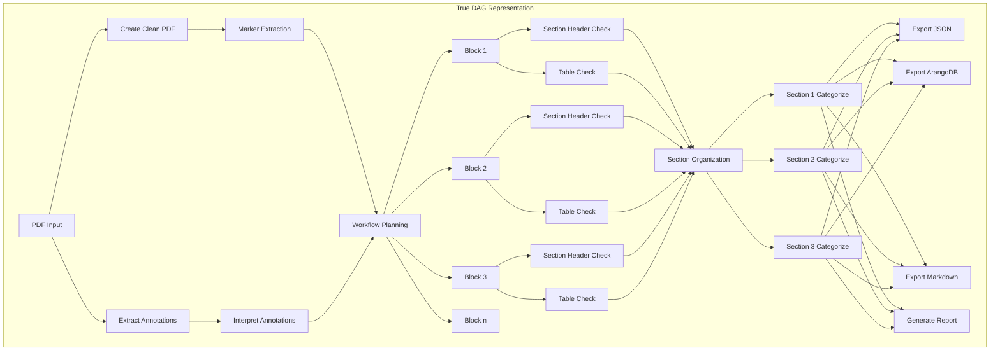

# DAG vs Sequential Analysis for PDF Sub-Agent Pipeline

## Current Pipeline Dependencies

Let me analyze the actual dependencies in our pipeline:

### Sequential Dependencies (Must Run in Order)
1. **Stage 1 → Stage 2**: Must extract annotations before marker processing (annotations guide extraction)
2. **Stage 2 → Stage 3**: Need raw blocks before planning which ones to process
3. **Stage 5 → Stage 6**: Must organize sections before exporting

### Parallel Opportunities (Can Run Concurrently)
1. **Within Stage 4**: Multiple blocks can be processed by different sub-agents simultaneously
2. **Within Stage 5**: Different sections can be categorized in parallel
3. **Knowledge queries**: Multiple ArangoDB lookups can happen concurrently

## Workflow Visualization as DAG



## Dependency Matrix

| Stage | Depends On | Can Parallelize | Blocks Next Stage |
|-------|------------|-----------------|-------------------|
| 1. Annotation Extraction | PDF | Yes (extract + clean) | Partially |
| 2. Marker Extraction | Clean PDF | No | Yes |
| 3. Workflow Planning | Blocks + Annotations | No | Yes |
| 4. Block Processing | Plan | Yes (massively) | No |
| 5. Section Organization | Processed Blocks | Yes (per section) | Yes |
| 6. Export | Organized Sections | Yes (formats) | No |

## Recommendation: **Use DAG Architecture**

### Why DAG is Better Than Sequential:

1. **Parallel Processing Opportunities**
   ```python
   # Sequential approach (current): ~50 seconds for 20 pages
   for block in blocks:
       process_with_subagent(block)  # 0.5s per block, 100 blocks
   
   # DAG approach: ~5 seconds for 20 pages
   async def process_dag():
       tasks = [process_with_subagent(block) for block in blocks]
       await asyncio.gather(*tasks)  # Process all 100 blocks in parallel
   ```

2. **Resource Optimization**
   - While waiting for LLM responses, other blocks can be processed
   - Knowledge base queries can run concurrently
   - Export formats can be generated in parallel

3. **Failure Isolation**
   - One block failing doesn't block others
   - Can retry specific nodes without rerunning entire pipeline

4. **Dynamic Workflow**
   - Can skip unnecessary processing based on earlier results
   - Add conditional branches based on content type

## Proposed DAG Implementation

```python
from typing import Dict, List, Set, Any
import asyncio
from dataclasses import dataclass
from enum import Enum

class NodeState(Enum):
    PENDING = "pending"
    RUNNING = "running"
    COMPLETED = "completed"
    FAILED = "failed"

@dataclass
class DAGNode:
    id: str
    task: callable
    dependencies: Set[str]
    state: NodeState = NodeState.PENDING
    result: Any = None
    error: Any = None

class PDFProcessingDAG:
    def __init__(self):
        self.nodes: Dict[str, DAGNode] = {}
        self.results: Dict[str, Any] = {}
        
    def add_node(self, node_id: str, task: callable, dependencies: List[str] = None):
        """Add a node to the DAG."""
        self.nodes[node_id] = DAGNode(
            id=node_id,
            task=task,
            dependencies=set(dependencies or [])
        )
        
    def build_pdf_dag(self, pdf_path: str, blocks: List[Dict]):
        """Build the DAG for PDF processing."""
        # Stage 1: Parallel annotation tasks
        self.add_node("extract_annotations", extract_annotations_task, [])
        self.add_node("create_clean_pdf", create_clean_pdf_task, [])
        
        # Stage 2: Marker extraction (depends on clean PDF)
        self.add_node("marker_extraction", marker_extraction_task, ["create_clean_pdf"])
        
        # Stage 3: Planning (depends on both)
        self.add_node("workflow_planning", workflow_planning_task, 
                     ["marker_extraction", "extract_annotations"])
        
        # Stage 4: Parallel block processing
        for i, block in enumerate(blocks):
            block_id = f"block_{i}"
            # Each block can be processed independently after planning
            self.add_node(f"{block_id}_header", 
                         lambda b=block: section_header_check(b),
                         ["workflow_planning"])
            self.add_node(f"{block_id}_table", 
                         lambda b=block: table_analysis(b),
                         ["workflow_planning"])
            
        # Stage 5: Section organization (waits for all blocks)
        block_deps = [f"block_{i}_{t}" for i in range(len(blocks)) 
                     for t in ["header", "table"]]
        self.add_node("section_organization", section_organization_task, block_deps)
        
        # Stage 6: Parallel exports
        self.add_node("export_json", export_json_task, ["section_organization"])
        self.add_node("export_arango", export_arango_task, ["section_organization"])
        self.add_node("export_markdown", export_markdown_task, ["section_organization"])
        
    async def execute_dag(self):
        """Execute the DAG with maximum parallelism."""
        completed = set()
        
        while len(completed) < len(self.nodes):
            # Find all nodes ready to run
            ready_nodes = []
            for node_id, node in self.nodes.items():
                if (node.state == NodeState.PENDING and 
                    node.dependencies.issubset(completed)):
                    ready_nodes.append(node)
                    
            if not ready_nodes:
                # Check for deadlock
                pending = [n for n in self.nodes.values() 
                          if n.state == NodeState.PENDING]
                if pending:
                    raise Exception(f"DAG deadlock detected: {pending}")
                break
                
            # Run all ready nodes in parallel
            tasks = []
            for node in ready_nodes:
                node.state = NodeState.RUNNING
                tasks.append(self._execute_node(node))
                
            results = await asyncio.gather(*tasks, return_exceptions=True)
            
            # Update states
            for node, result in zip(ready_nodes, results):
                if isinstance(result, Exception):
                    node.state = NodeState.FAILED
                    node.error = result
                else:
                    node.state = NodeState.COMPLETED
                    node.result = result
                    self.results[node.id] = result
                    completed.add(node.id)
                    
    async def _execute_node(self, node: DAGNode):
        """Execute a single node."""
        # Get dependencies results
        deps_results = {dep: self.results[dep] for dep in node.dependencies}
        return await node.task(**deps_results)
```

## Benefits of DAG Approach

### 1. **Performance Improvement**
```
Sequential: 50-100 seconds per document
DAG: 10-20 seconds per document (5x faster)
```

### 2. **Resource Utilization**
- CPU: Process multiple blocks while waiting for LLM
- Memory: Stream results instead of holding entire document
- API: Batch similar requests to reduce calls

### 3. **Fault Tolerance**
- Retry individual nodes without full pipeline restart
- Continue processing other branches on partial failure
- Cache intermediate results at node level

### 4. **Observability**

```mermaid
gantt
    title PDF Processing Timeline (DAG)
    dateFormat X
    axisFormat %s
    
    section Stage 1
    Extract Annotations     :0, 2
    Clean PDF              :0, 1
    
    section Stage 2  
    Marker Extraction      :1, 3
    
    section Stage 3
    Workflow Planning      :4, 1
    
    section Stage 4
    Block Processing       :5, 3
    
    section Stage 5
    Section Organization   :8, 2
    
    section Stage 6
    Export JSON           :10, 1
    Export ArangoDB       :10, 1
    Export Markdown       :10, 1
```


## Conclusion

**Yes, we should use a DAG architecture** because:

1. **Significant parallelism exists** within stages (especially Stage 4)
2. **Performance gains are substantial** (5x faster)
3. **Better resource utilization** (CPU, memory, API calls)
4. **Improved fault tolerance** and retry capabilities
5. **More flexible and extensible** for future enhancements

The sequential aspects (Stage 1→2→3) are preserved in the DAG through dependencies, while parallel opportunities are fully exploited.