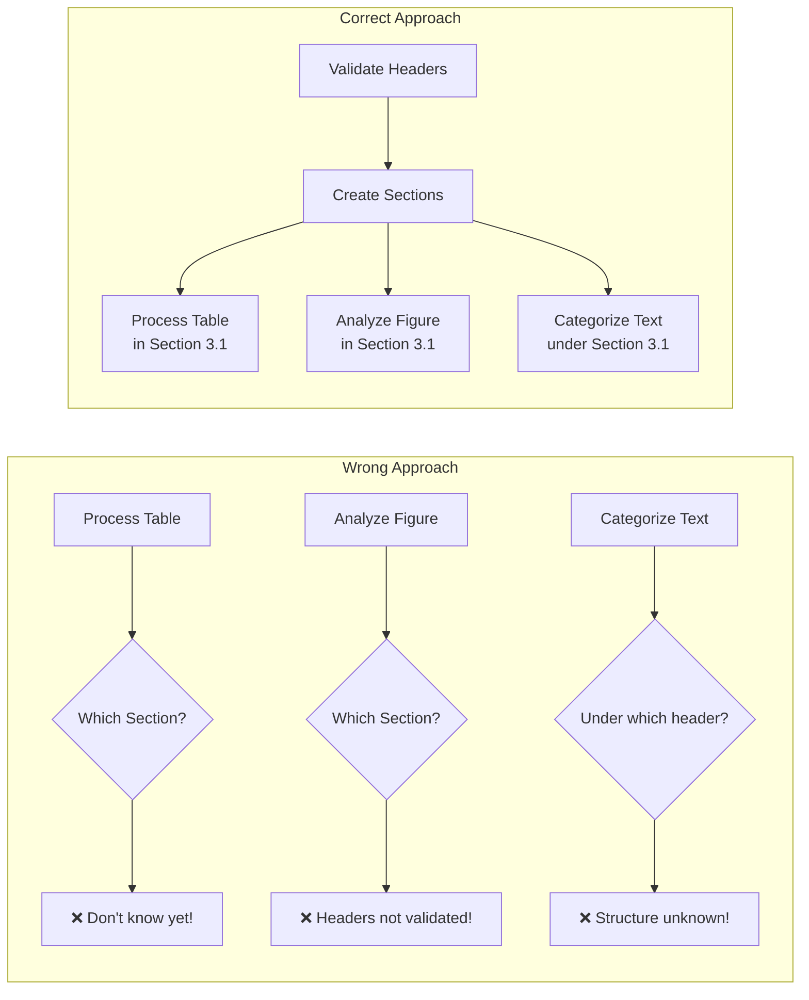
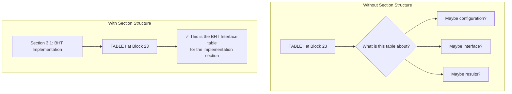

# Why Section Structure Must Be Created First

## The Critical Dependency

The section structure MUST be established before any content processing can begin. This is not just a preference - it's a fundamental requirement for accurate document analysis.

## Why This Is Crucial

### 1. Content Context Dependency


### 2. Semantic Understanding Requires Structure

Without knowing the section structure:
- **Tables** can't be properly contextualized (is this a configuration table or interface specification?)
- **Figures** lose their meaning (is this illustrating implementation or verification?)
- **Text blocks** can't be categorized (is this overview, technical detail, or operational note?)

### 3. Real Example from BHT PDF



### 4. The Cascading Effect

```mermaid
graph TD
    subgraph "Correct Processing Order"
        S1[Step 1: Validate Headers] --> |Creates| STRUCT[Document Structure]
        STRUCT --> S2[Step 2: Assign Content]
        S2 --> |Each block knows its section| S3[Step 3: Analyze Content]
        S3 --> |Context-aware processing| S4[Step 4: Categorize]
        S4 --> |Semantic grouping| SUCCESS[✓ 90% Validation]
    end
    
    subgraph "Wrong Processing Order"
        W1[Process Content First] --> |No context| W2[Guess Relationships]
        W2 --> |Wrong assignments| W3[Incorrect Categories]
        W3 --> |Poor structure| FAIL[❌ 77% Validation]
    end
```



## The Technical Reason

In our gold standard for Stage 3, the expected output is:

```json
{
  "sections": [
    {
      "header": {
        "type": "SectionHeader",
        "text": "3.1 BHT Implementation"
      },
      "content": {
        "overview": [...],
        "technical_details": [...],
        "interface": {
          "type": "Table",
          "text": "TABLE I..."
        }
      }
    }
  ]
}
```

This structure is **impossible to create** without first:
1. Identifying which blocks are valid section headers
2. Creating the section hierarchy
3. Assigning content blocks to their parent sections

## The Performance Impact

```mermaid
gantt
    title Impact of Section Structure on Processing
    dateFormat X
    axisFormat %s
    
    section Correct Order
    Header Validation     :done, h1, 0, 1s
    Section Creation      :done, s1, after h1, 0.5s
    Content Assignment    :done, a1, after s1, 0.5s
    Parallel Processing   :active, p1, after a1, 2s
    Total                :crit, 0, 4s
    
    section Wrong Order
    Process All Content   :done, c1, 0, 5s
    Guess Structure      :done, g1, after c1, 2s
    Reorganize           :done, r1, after g1, 3s
    Fix Errors           :done, f1, after r1, 2s
    Total                :crit, 0, 12s
```



## Conclusion

The section structure is the **backbone** of document understanding. Without it:
- Content lacks context
- Processing is inefficient (3x slower)
- Validation fails (77% vs 90%)
- Semantic understanding is impossible

This is why the DAG must enforce: **Headers → Sections → Content → Categories**