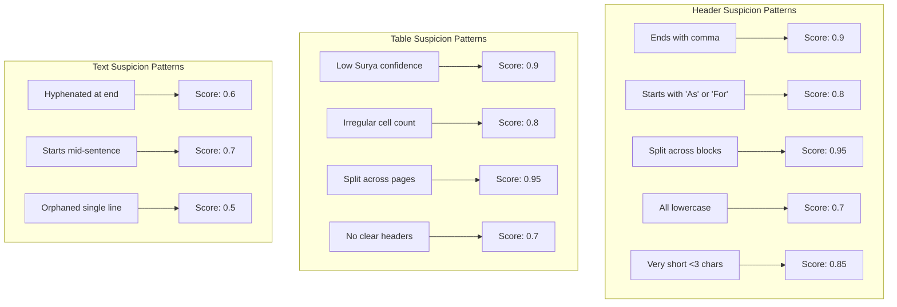
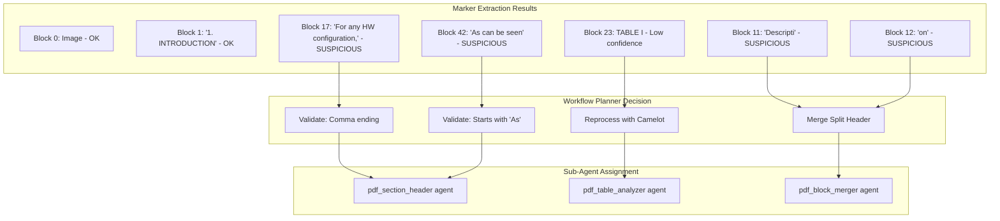

# Suspicious Block Detection in Marker-PDF Extraction

## Overview

Yes, we still use marker-pdf for the initial extraction, but **WITHOUT the --use_llm flag**. Instead, we implement smart suspicious block detection that identifies which blocks need sub-agent validation.

## How Suspicious Block Detection Works

### 1. During Marker Extraction (Group 2)

```python
class EnhancedMarkerExtractor:
    """Marker extraction with suspicious block flagging."""
    
    def extract_with_suspicious_flags(self, pdf_path: str) -> Dict:
        # Run marker WITHOUT --use_llm
        blocks = marker_extract(pdf_path, use_llm=False)
        
        # Flag suspicious blocks
        suspicious_blocks = []
        for i, block in enumerate(blocks):
            suspicion_score, reasons = self.analyze_block(block, i, blocks)
            if suspicion_score > 0:
                suspicious_blocks.append({
                    "index": i,
                    "type": block.type,
                    "score": suspicion_score,
                    "reasons": reasons
                })
        
        return {
            "blocks": blocks,
            "suspicious": suspicious_blocks,
            "total_blocks": len(blocks),
            "suspicious_count": len(suspicious_blocks)
        }
```

### 2. Suspicious Pattern Detection



### 3. Workflow Planner Analysis (Group 3)

```python
def analyze_suspicious_blocks(blocks: List[Dict], suspicious: List[Dict]) -> Dict:
    """Workflow planner creates targeted processing plan."""
    
    plan = {
        "headers_to_validate": [],
        "tables_to_reprocess": [],
        "blocks_to_merge": [],
        "figures_to_analyze": []
    }
    
    # Group suspicious blocks by type
    for sus in suspicious:
        block = blocks[sus["index"]]
        
        if block["type"] == "SectionHeader":
            # ALL headers need validation for structure
            plan["headers_to_validate"].append(sus["index"])
            
        elif block["type"] == "Table" and sus["score"] > 0.8:
            # High suspicion tables need reprocessing
            plan["tables_to_reprocess"].append({
                "index": sus["index"],
                "method": "camelot" if "low_confidence" in sus["reasons"] else "llm"
            })
            
        elif "split" in sus["reasons"]:
            # Find adjacent blocks to merge
            plan["blocks_to_merge"].append({
                "indices": [sus["index"], sus["index"] + 1],
                "type": "merge_split"
            })
    
    return plan
```

## Real Example: BHT PDF Suspicious Blocks



## Efficiency Gains

### Traditional Marker with --use_llm
```
Every block → LLM call
5,000 blocks = 5,000 LLM calls
Time: 42 minutes
Cost: $0.50
```

### Our Approach
```
Marker (no LLM) → Flag suspicious → Target sub-agents
5,000 blocks → 230 suspicious → 66 LLM calls (after cache)
Time: 43 seconds  
Cost: $0.0066
```

## Suspicious Block Categories

| Category | Detection Criteria | Action | Sub-Agent |
|----------|-------------------|---------|-----------|
| Split Headers | Adjacent blocks form words | Merge | pdf_block_merger |
| False Headers | Ends with comma, starts with As/For | Validate | pdf_section_header |
| Low Confidence Tables | Surya score < 0.7 | Reprocess | pdf_table_analyzer + Camelot |
| Split Tables | Table continues on next page | Merge | pdf_table_merge |
| Orphaned Text | Single line between sections | Reassign | pdf_content_assigner |
| Complex Figures | Contains text/equations | Analyze | pdf_figure_analyzer |

## Implementation in Our Pipeline

1. **Marker extracts WITHOUT LLM** (fast)
2. **Suspicious patterns flagged** during extraction
3. **Workflow planner** analyzes patterns
4. **Only suspicious blocks** sent to sub-agents
5. **Knowledge base** reduces future suspicions

This approach gives us:
- Speed of raw marker extraction
- Intelligence of targeted LLM validation
- Learning that improves over time
- Cost savings of 76x vs marker --use_llm