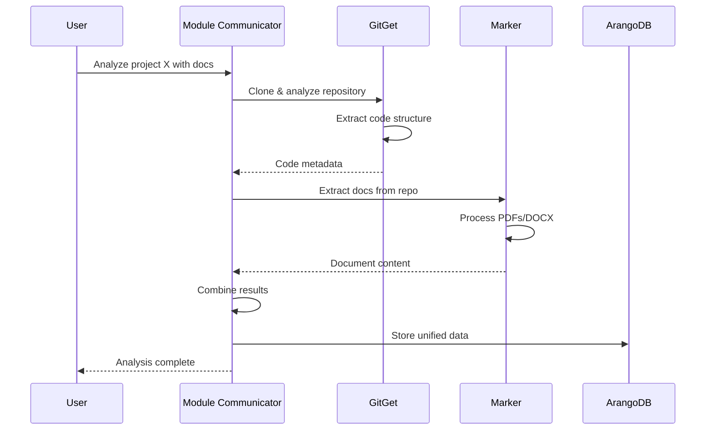
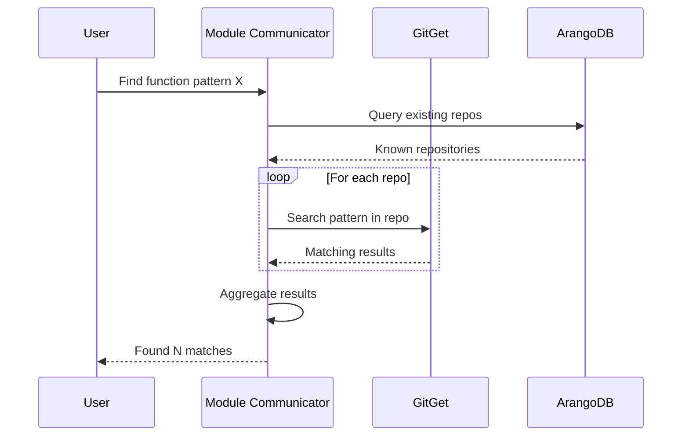

# GitGet Integration with Granger Ecosystem

## Executive Summary

This document outlines the implementation plan for integrating GitGet as a spoke module in the Granger ecosystem, following the hub-and-spoke architecture where claude-module-communicator serves as the central orchestrator. GitGet will maintain its focused responsibility for GitHub repository analysis while providing standardized interfaces for seamless integration with other Granger modules.

## Architecture Overview

```
┌─────────────────────────────┐
│  claude-module-communicator │ ← Central HUB (Orchestrator)
└──────────┬──────────────────┘
           │
    ┌──────┴──────┬──────────┬─────────┬────────┐
    │             │          │         │        │
┌───▼───┐   ┌────▼────┐ ┌───▼───┐ ┌──▼───┐ ┌─▼──┐
│Marker │   │ GitGet  │ │SPARTA │ │ArXiv │ │... │ ← Spoke Modules
└───┬───┘   └────┬────┘ └───┬───┘ └──┬───┘ └─┬──┘
    │            │          │         │       │
    └────────────┴──────────┴─────────┴───────┘
                       │
                ┌──────▼──────┐
                │  ArangoDB   │ ← Knowledge Store
                └─────────────┘
```

## Integration Components

### 1. MCP Server Implementation

**File**: `src/gitget/mcp/server.py`

```python
from mcp import Server, Tool
from typing import Dict, Any, List
import psutil
import os

class GitGetMCPServer(Server):
    """MCP Server for GitGet repository analysis capabilities"""
    
    def __init__(self):
        super().__init__("gitget")
        self._setup_tools()
        self._check_system_resources()
    
    def _setup_tools(self):
        """Define MCP tools for GitGet operations"""
        
        # Repository cloning tool
        self.add_tool(Tool(
            name="gitget-clone",
            description="Clone a GitHub repository with sparse checkout",
            parameters={
                "type": "object",
                "properties": {
                    "url": {
                        "type": "string",
                        "description": "GitHub repository URL"
                    },
                    "extensions": {
                        "type": "array",
                        "items": {"type": "string"},
                        "description": "File extensions to include"
                    },
                    "depth": {
                        "type": "integer",
                        "default": 1,
                        "description": "Clone depth"
                    }
                },
                "required": ["url"]
            }
        ))
        
        # Repository analysis tool
        self.add_tool(Tool(
            name="gitget-analyze",
            description="Analyze a repository's code structure and content",
            parameters={
                "type": "object",
                "properties": {
                    "url": {
                        "type": "string",
                        "description": "Repository URL or local path"
                    },
                    "chunk_size": {
                        "type": "integer",
                        "default": 2000,
                        "description": "Token size for chunking"
                    },
                    "include_llm_summary": {
                        "type": "boolean",
                        "default": false,
                        "description": "Generate LLM summaries"
                    },
                    "extract_code_metadata": {
                        "type": "boolean",
                        "default": true,
                        "description": "Extract function/class metadata"
                    }
                },
                "required": ["url"]
            }
        ))
        
        # Code search tool
        self.add_tool(Tool(
            name="gitget-search",
            description="Search code repositories for specific patterns",
            parameters={
                "type": "object",
                "properties": {
                    "repository": {
                        "type": "string",
                        "description": "Repository identifier"
                    },
                    "pattern": {
                        "type": "string",
                        "description": "Search pattern (regex supported)"
                    },
                    "file_types": {
                        "type": "array",
                        "items": {"type": "string"},
                        "description": "File types to search"
                    }
                },
                "required": ["repository", "pattern"]
            }
        ))
    
    def _check_system_resources(self) -> Dict[str, Any]:
        """Check available system resources"""
        return {
            "cpu_percent": psutil.cpu_percent(interval=1),
            "memory_available_gb": psutil.virtual_memory().available / (1024**3),
            "disk_free_gb": psutil.disk_usage('/').free / (1024**3)
        }
    
    async def handle_tool(self, name: str, args: Dict[str, Any]) -> Dict[str, Any]:
        """Handle tool invocations"""
        if name == "gitget-clone":
            return await self._handle_clone(args)
        elif name == "gitget-analyze":
            return await self._handle_analyze(args)
        elif name == "gitget-search":
            return await self._handle_search(args)
        else:
            raise ValueError(f"Unknown tool: {name}")
```

### 2. Module Communicator Integration

**File**: `src/gitget/integrations/gitget_module.py`

```python
from typing import Dict, Any, List, Optional
from pydantic import BaseModel
import asyncio
from gitget.api import analyze_repository
from gitget.models import ProcessingOptions

class GitGetInput(BaseModel):
    """Input schema for GitGet module"""
    action: str  # "clone", "analyze", "search"
    repository_url: str
    options: Optional[Dict[str, Any]] = {}

class GitGetModule:
    """GitGet integration for claude-module-communicator"""
    
    def __init__(self):
        self.name = "gitget"
        self.version = "1.0.0"
        self.capabilities = [
            "repository_cloning",
            "code_analysis", 
            "tree_sitter_parsing",
            "code_summarization",
            "metadata_extraction"
        ]
    
    async def start(self):
        """Initialize the module"""
        # Setup any required resources
        pass
    
    async def stop(self):
        """Cleanup module resources"""
        # Cleanup temp files, close connections
        pass
    
    async def process(self, input_data: Dict[str, Any]) -> Dict[str, Any]:
        """Process a request from the module communicator"""
        try:
            # Validate input
            request = GitGetInput(**input_data)
            
            if request.action == "analyze":
                # Convert options to ProcessingOptions
                processing_options = ProcessingOptions(**request.options)
                
                # Run analysis
                result = await asyncio.to_thread(
                    analyze_repository,
                    request.repository_url,
                    processing_options
                )
                
                return {
                    "status": "success",
                    "action": request.action,
                    "repository": request.repository_url,
                    "result": result.model_dump()
                }
            
            elif request.action == "clone":
                # Handle sparse cloning
                pass
            
            elif request.action == "search":
                # Handle code search
                pass
            
        except Exception as e:
            return {
                "status": "error",
                "error": str(e),
                "action": input_data.get("action", "unknown")
            }
    
    def get_input_schema(self) -> Dict[str, Any]:
        """Return JSON schema for module input"""
        return GitGetInput.model_json_schema()
    
    def get_capabilities(self) -> List[str]:
        """Return module capabilities"""
        return self.capabilities
```

### 3. Slash Command Implementation

**File**: `src/gitget/cli/slash_commands/base.py`

```python
import typer
from typing import Optional, List
from gitget.cli.slash_commands import CommandGroup

app = typer.Typer()

class GitGetCommands(CommandGroup):
    """GitGet slash commands for repository analysis"""
    
    def __init__(self):
        super().__init__(
            name="gitget",
            help="GitHub repository analysis commands"
        )
    
    @app.command("clone")
    def clone(
        self,
        url: str = typer.Argument(..., help="Repository URL"),
        extensions: Optional[List[str]] = typer.Option(
            None,
            "--ext",
            help="File extensions to include"
        ),
        depth: int = typer.Option(1, help="Clone depth")
    ):
        """Clone a repository with sparse checkout"""
        # Implementation
        pass
    
    @app.command("analyze")
    def analyze(
        self,
        url: str = typer.Argument(..., help="Repository URL"),
        output_format: str = typer.Option(
            "json",
            "--format",
            help="Output format: json, markdown, arangodb"
        ),
        chunk_size: int = typer.Option(
            2000,
            "--chunk-size",
            help="Token size for chunking"
        )
    ):
        """Analyze repository structure and content"""
        # Implementation
        pass
```

### 4. Output Renderers

**File**: `src/gitget/core/renderers/base.py`

```python
from abc import ABC, abstractmethod
from typing import Dict, Any
from gitget.models import ProcessingResult

class BaseRenderer(ABC):
    """Base class for GitGet output renderers"""
    
    @abstractmethod
    def render(self, result: ProcessingResult) -> Any:
        """Render processing result to specific format"""
        pass

class JSONRenderer(BaseRenderer):
    """Render to JSON format"""
    
    def render(self, result: ProcessingResult) -> Dict[str, Any]:
        return {
            "repository": result.repository_url,
            "processed_at": result.processed_at,
            "statistics": result.statistics,
            "tree": result.tree,
            "chunks": result.chunks,
            "metadata": result.metadata
        }

class ArangoDBRenderer(BaseRenderer):
    """Render to ArangoDB-compatible format"""
    
    def render(self, result: ProcessingResult) -> Dict[str, Any]:
        return {
            "_key": self._generate_key(result.repository_url),
            "type": "code_repository",
            "source": "gitget",
            "repository": {
                "url": result.repository_url,
                "name": result.repository_name,
                "processed_at": result.processed_at
            },
            "content": {
                "tree": result.tree,
                "functions": result.extracted_functions,
                "classes": result.extracted_classes,
                "dependencies": result.dependencies
            },
            "metadata": {
                "file_count": result.statistics["total_files"],
                "languages": result.detected_languages,
                "chunk_count": len(result.chunks)
            }
        }
    
    def _generate_key(self, url: str) -> str:
        """Generate unique key for ArangoDB document"""
        import hashlib
        return f"gitget_{hashlib.md5(url.encode()).hexdigest()[:8]}"

class MarkdownRenderer(BaseRenderer):
    """Render to Markdown report format"""
    
    def render(self, result: ProcessingResult) -> str:
        md_lines = [
            f"# Repository Analysis: {result.repository_name}",
            f"\n**URL**: {result.repository_url}",
            f"**Analyzed**: {result.processed_at}",
            "\n## Statistics",
            f"- Total Files: {result.statistics['total_files']}",
            f"- Languages: {', '.join(result.detected_languages)}",
            f"- Functions: {len(result.extracted_functions)}",
            f"- Classes: {len(result.extracted_classes)}",
            "\n## File Structure"
        ]
        
        # Add tree structure
        for path in result.tree:
            depth = path.count('/')
            md_lines.append(f"{'  ' * depth}- {path.split('/')[-1]}")
        
        return '\n'.join(md_lines)
```

### 5. Unified Schema for Cross-Module Communication

**File**: `src/gitget/schema/unified_code.py`

```python
from pydantic import BaseModel, Field
from typing import List, Dict, Any, Optional
from datetime import datetime

class CodeFunction(BaseModel):
    """Represents a function/method in code"""
    name: str
    file_path: str
    line_start: int
    line_end: int
    signature: str
    docstring: Optional[str] = None
    language: str
    complexity: Optional[int] = None

class CodeClass(BaseModel):
    """Represents a class/type in code"""
    name: str
    file_path: str
    line_start: int
    line_end: int
    methods: List[CodeFunction] = []
    attributes: List[str] = []
    docstring: Optional[str] = None
    language: str

class CodeRepository(BaseModel):
    """Unified schema for code repository data"""
    # Metadata
    source_type: str = Field(default="github", const=True)
    extractor: str = Field(default="gitget", const=True)
    
    # Repository info
    url: str
    name: str
    branch: str = "main"
    commit_hash: Optional[str] = None
    
    # Processing metadata
    processed_at: datetime
    processing_version: str = "1.0.0"
    
    # Content structure
    file_tree: Dict[str, Any]  # Hierarchical file structure
    total_files: int
    total_lines: int
    
    # Extracted elements
    functions: List[CodeFunction] = []
    classes: List[CodeClass] = []
    imports: Dict[str, List[str]] = {}  # file -> imports
    
    # Language statistics
    languages: Dict[str, int] = {}  # language -> line count
    
    # Optional summaries
    summary: Optional[str] = None
    key_components: List[str] = []
    dependencies: List[str] = []
```

## Integration Workflows

### Workflow 1: Analyze GitHub Project Documentation



### Workflow 2: Code Search Across Repositories



## Implementation Phases

### Phase 1: Core Integration (Week 1-2)
1. Implement MCP server with basic tools
2. Create module communicator integration
3. Add JSON and ArangoDB renderers
4. Basic testing with HUB

### Phase 2: Enhanced Features (Week 3-4)
1. Add slash command support
2. Implement Markdown renderer
3. Add resource monitoring
4. Create unified schema converters

### Phase 3: Advanced Workflows (Week 5-6)
1. Implement cross-module workflows
2. Add caching for processed repos
3. Performance optimization
4. Integration testing

## Configuration

### GitGet Module Configuration

```yaml
# gitget_config.yaml
gitget:
  # Processing defaults
  default_chunk_size: 2000
  max_file_size_mb: 10
  
  # LLM settings
  llm_model: "gpt-4o-mini"
  enable_summaries: true
  
  # Tree-sitter languages
  enabled_languages:
    - python
    - javascript
    - typescript
    - go
    - rust
    - java
  
  # Resource limits
  max_repo_size_gb: 5
  max_concurrent_clones: 3
  
  # Output settings
  output_base_path: "./repos"
  cache_enabled: true
  cache_ttl_days: 7
```

### Integration with Module Communicator

```python
# In claude-module-communicator configuration
modules:
  gitget:
    enabled: true
    module_path: "gitget.integrations.gitget_module"
    class_name: "GitGetModule"
    mcp_server: "gitget.mcp.server:GitGetMCPServer"
    capabilities:
      - repository_analysis
      - code_search
      - metadata_extraction
```

## Testing Strategy

### Unit Tests
- Test individual components (renderers, parsers)
- Mock external dependencies (git, LLM calls)
- Validate schema conversions

### Integration Tests
- Test MCP server tool handling
- Verify module communicator protocol
- Test renderer outputs

### End-to-End Tests
- Full workflow testing with sample repos
- Cross-module communication tests
- Performance benchmarks

## Security Considerations

1. **Repository Access**
   - Validate repository URLs
   - Handle private repo authentication
   - Respect rate limits

2. **Resource Protection**
   - Limit clone sizes
   - Monitor disk usage
   - Timeout long operations

3. **Data Privacy**
   - Don't store credentials
   - Sanitize sensitive data
   - Respect license files

## Monitoring and Observability

1. **Metrics to Track**
   - Repository processing times
   - Clone sizes and speeds
   - LLM token usage
   - Error rates by operation

2. **Logging Standards**
   - Use structured logging
   - Include correlation IDs
   - Log at appropriate levels

3. **Health Checks**
   - Disk space availability
   - Git command availability
   - Tree-sitter parser status

## Future Enhancements

1. **Advanced Analysis**
   - Dependency graph generation
   - Security vulnerability scanning
   - Code quality metrics

2. **Additional Integrations**
   - GitLab support
   - Bitbucket support
   - Local repository analysis

3. **Performance Optimizations**
   - Incremental updates
   - Distributed processing
   - Smart caching strategies

## Conclusion

This implementation plan positions GitGet as a powerful spoke module in the Granger ecosystem, maintaining its focused responsibility for code repository analysis while providing standardized interfaces for seamless integration. The modular design ensures GitGet can evolve independently while contributing to the larger Granger vision of intelligent orchestration and knowledge management.