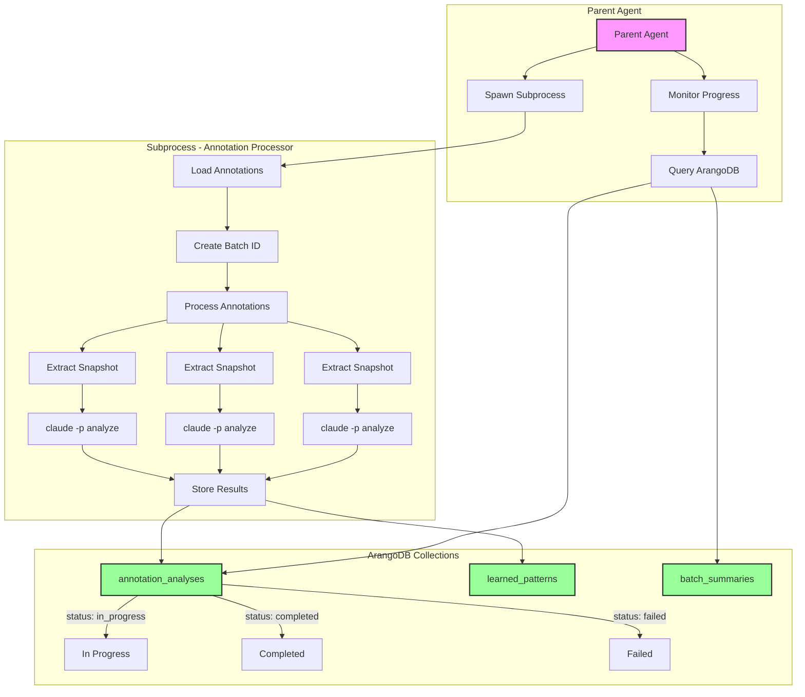

# Annotation Pipeline with ArangoDB Storage Architecture

## Overview

The annotation pipeline uses ArangoDB as the central memory/state store, allowing real-time progress monitoring and knowledge accumulation.

## Architecture Flow



## Key Components

### 1. Parent Agent (`monitor_annotation_batch.py`)
- Spawns the annotation processing subprocess
- Monitors progress via ArangoDB queries
- Aggregates results when complete
- Handles failures gracefully

### 2. Subprocess (`analyze_annotations_with_storage.py`)
- Processes annotations in parallel (up to 10 concurrent)
- Each `claude -p` call stores directly to ArangoDB
- No need to return bulky results to parent
- Progress visible in real-time

### 3. ArangoDB Collections

#### `annotation_analyses`
```json
{
    "_key": "batch_123_p0_a5",
    "batch_id": "batch_123",
    "status": "completed",  // in_progress|completed|failed
    "annotation": {
        "bbox": [70.5, 234.0, 543.0, 313.0],
        "type": "IMPORTANT_CONTENT",
        "page": 0
    },
    "analysis": {
        "reasoning": "Technical definition of BHT...",
        "pattern_tags": ["technical_definition", "complete_component"],
        "visual_features": [...],
        "textual_features": [...]
    },
    "started_at": "2024-12-09T10:15:00Z",
    "completed_at": "2024-12-09T10:15:30Z"
}
```

#### `learned_patterns`
```json
{
    "_key": "hash_of_pattern_and_example",
    "pattern_tag": "technical_definition",
    "example_id": "batch_123_p0_a5",
    "confidence": 0.95,
    "learned_at": "2024-12-09T10:15:30Z"
}
```

#### `batch_summaries`
```json
{
    "_key": "batch_123",
    "duration": 45.2,
    "final_status": {
        "completed": 8,
        "failed": 2
    },
    "patterns_learned": [
        {"pattern": "technical_definition", "count": 5},
        {"pattern": "algorithm_description", "count": 3}
    ],
    "success_rate": 0.8,
    "completed_at": "2024-12-09T10:16:00Z"
}
```

## Progress Monitoring

The parent agent can query progress in real-time:

```python
# AQL query for progress
FOR doc IN annotation_analyses
    FILTER doc.batch_id == "batch_123"
    COLLECT status = doc.status WITH COUNT INTO count
    RETURN {status, count}

# Returns:
[
    {"status": "completed", "count": 7},
    {"status": "in_progress", "count": 3},
    {"status": "failed", "count": 0}
]
```

## Benefits

1. **Crash Recovery** - If subprocess fails, completed work persists
2. **Real-time Visibility** - Parent sees progress without waiting
3. **Knowledge Accumulation** - Patterns stored for future use
4. **Memory Efficiency** - No large result objects in memory
5. **Parallel Processing** - Multiple batches can run simultaneously
6. **Audit Trail** - Complete history of all analyses

## Usage Pattern

```python
# Parent agent spawns batch
batch_id = await spawn_and_monitor_batch(
    annotations_file="annotations.json",
    pdf_path="document.pdf",
    poll_interval=2.0  # Check progress every 2 seconds
)

# Progress automatically displayed:
# [MONITOR] Progress at 5.2s:
#   Status: {"completed": 3, "in_progress": 7}
#   Avg completion time: 1.8s
#   Patterns found: ['technical_definition', 'algorithm_step']
```

## Integration with Knowledge First Approach

This aligns with the Knowledge First pattern from CLAUDE.md:

1. **Check existing patterns** before processing
2. **Store new discoveries** immediately
3. **Build knowledge graph** of annotation patterns
4. **Reuse learned patterns** in future extractions

The system learns from every human annotation, building a knowledge base that improves automated extraction over time.