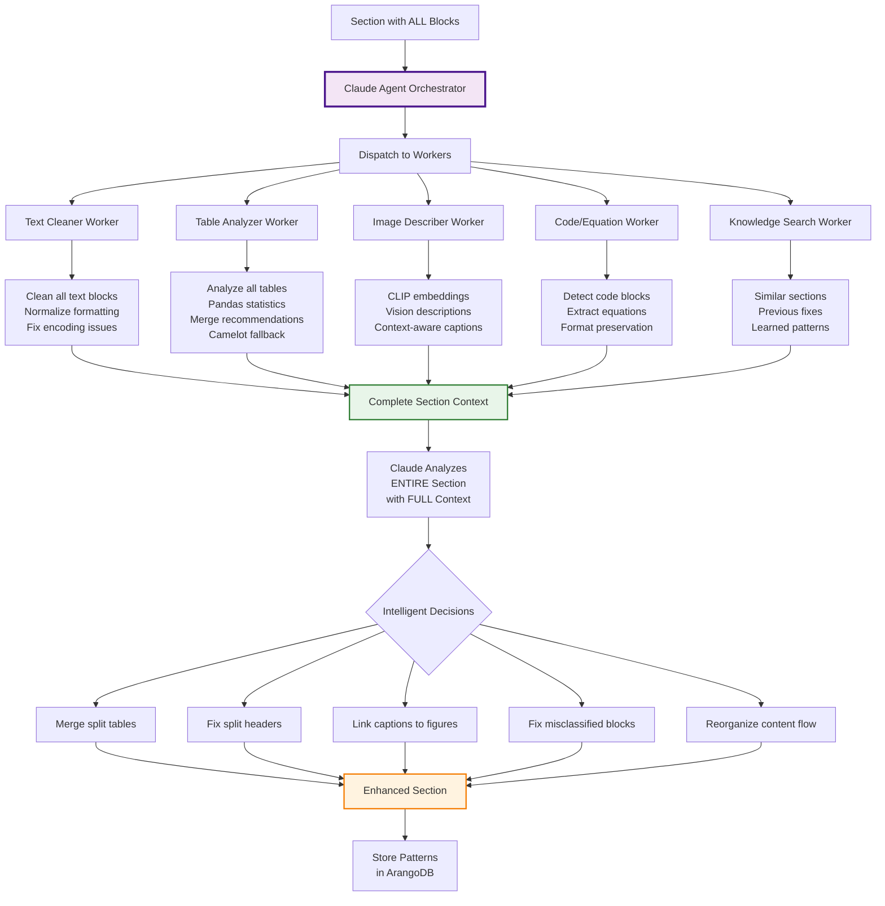

# Claude Agent Section Processing Architecture

## Overview

The Claude agent processes ENTIRE SECTIONS, not individual blocks. This is fundamentally different from marker-pdf's block-by-block approach.

## Architecture Diagram



## Key Concepts

### 1. Section as Unit of Analysis

```python
# NOT THIS (marker-pdf approach):
for block in blocks:
    if block.type == "table":
        process_table(block)  # No context about other blocks
    elif block.type == "text":
        process_text(block)   # Doesn't know about nearby tables

# BUT THIS (our approach):
section = {
    "blocks": [
        {"type": "header", "text": "4.1.5.4 BHT"},
        {"type": "text", "text": "The BHT is implemented..."},
        {"type": "table", "cells": [["Signal", "IO", "Descripti"], ["", "", "on"]]},
        {"type": "table", "cells": [["clk", "I", "Clock signal"]]},
        {"type": "figure", "caption": "BHT Architecture"}
    ]
}

# Claude sees EVERYTHING and understands relationships
enhanced_section = claude_agent.process_section(section, all_context)
```

### 2. Workers Provide Specialized Analysis

Each worker analyzes ALL relevant blocks in the section:

#### Text Cleaner Worker
- Processes ALL text blocks together
- Understands paragraph flow across blocks
- Fixes formatting consistently across section

#### Table Analyzer Worker  
- Examines ALL tables for relationships
- Identifies split tables that should merge
- Runs pandas analysis on table sets
- Recommends Camelot fallback for complex tables

#### Knowledge Search Worker
- Finds similar annotated sections
- Retrieves successful fix patterns
- Provides historical context

### 3. Claude Makes Holistic Decisions

With all context available, Claude can:

1. **Understand Relationships**:
   - "These two tables are actually one table split across pages"
   - "This text block is describing the figure above"
   - "This header belongs to the content below, not above"

2. **Fix Cross-Block Issues**:
   - Merge "Descripti" + "on" → "Description"
   - Combine related tables
   - Associate orphaned captions

3. **Apply Learned Patterns**:
   - "BHT sections usually have this structure"
   - "Signal tables often split at page boundaries"
   - "This annotation pattern means merge tables"

## Example: BHT Section Processing

### Input Section
```json
{
  "section_id": 0,
  "blocks": [
    {"type": "header", "text": "4.1.5.4. BHT (Branch History Table) submodule"},
    {"type": "text", "text": "The BHT is implemented as a memory..."},
    {"type": "figure", "id": "fig1"},
    {"type": "table", "text": "Signal|IO|Descripti|connexi|Type"},
    {"type": "table", "text": "||on|on|"},
    {"type": "text", "text": "The BHT is never flushed."}
  ]
}
```

### Worker Analysis
1. **Text Worker**: "Two text blocks, can be merged into continuous description"
2. **Table Worker**: "Two tables with matching column count, split header pattern detected"
3. **Knowledge Worker**: "Found 8 similar BHT sections, 6 had split table headers"
4. **Image Worker**: "Figure shows signal flow diagram, relates to table below"

### Claude Decision
```json
{
  "merge_tables": true,
  "fix_headers": {"Descripti|on": "Description", "connexi|on": "connexion"},
  "associate_figure_table": true,
  "confidence": 0.95,
  "reasoning": "Classic split table pattern in hardware documentation"
}
```

### Output Enhanced Section
```json
{
  "section_id": 0,
  "blocks": [
    {"type": "header", "text": "4.1.5.4. BHT (Branch History Table) submodule"},
    {"type": "text", "text": "The BHT is implemented as a memory...The BHT is never flushed."},
    {"type": "figure", "id": "fig1", "relates_to": "table_0"},
    {"type": "table", "text": "Signal|IO|Description|connexion|Type", "id": "table_0"}
  ]
}
```

## Benefits Over Block-by-Block

1. **Context Awareness**: Every decision made with full section understanding
2. **Relationship Detection**: Identifies connections between blocks
3. **Pattern Learning**: Learns section-level patterns, not just block patterns
4. **Intelligent Fixes**: Can fix issues that span multiple blocks
5. **Holistic Understanding**: Treats document as coherent whole, not isolated chunks

## Implementation

See `src/extractor/core/processors/semantic_section_processor.py` for the complete implementation of this architecture.