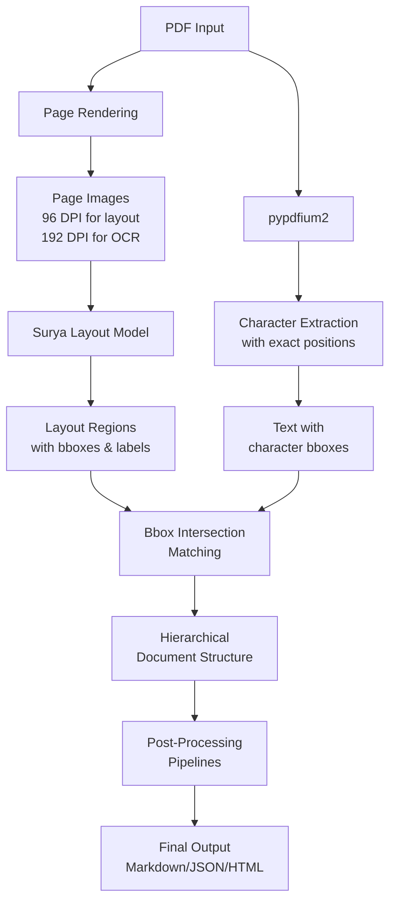
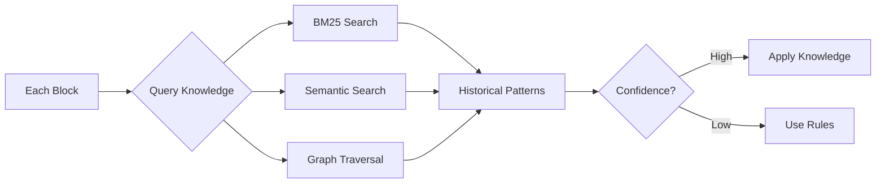

# Marker-PDF Processing Flow

## Core Architecture

Yes, you've understood the marker-pdf flow correctly! Here's the detailed breakdown:



## Detailed Flow

### 1. **PDF Parsing (pypdfium2)**
```python
# PdfProvider extracts:
- Character-level text with exact positions
- Font information
- Page dimensions
- Renders page images at different DPIs
```

### 2. **Layout Detection (Surya)**
```python
# LayoutBuilder uses Surya's models:
- LayoutPredictor: Detects regions (text, table, figure, equation)
- DetectionPredictor: Finds text lines within regions
- RecognitionPredictor: OCR for text in images
```

### 3. **Bbox Intersection Matching**
```python
def matrix_intersection_area(bboxes1, bboxes2):
    """
    Core algorithm that matches:
    - Surya's detected regions (from image analysis)
    - pypdfium2's extracted text (with positions)
    
    This is THE KEY to marker's approach!
    """
    # Vectorized numpy computation for efficiency
    # Calculates intersection area between all bbox pairs
```

### 4. **Hierarchical Structure Building**
```python
Document
├── Page 1
│   ├── TextBlock (from text region + matched text)
│   ├── TableBlock (from table region + matched content)
│   └── FigureBlock (from figure region)
└── Page 2
    └── ...
```

## Key Insights

### Why This Works Well
1. **Dual Approach**: Combines PDF structure (pypdfium2) with visual understanding (Surya)
2. **Accurate Matching**: Bbox intersections ensure text goes to the right region
3. **Handles Complex Layouts**: Visual models understand multi-column, tables, figures
4. **Preserves Formatting**: Character positions maintain original layout

### The Intersection Magic
```python
# Example: Matching header text to layout region
pdf_text = "1. Introduction"  # bbox: [100, 50, 200, 70]
layout_region = "SectionHeader"  # bbox: [95, 48, 205, 72]

# High intersection area → text belongs to this region
intersection = calculate_intersection(pdf_bbox, layout_bbox)
if intersection > threshold:
    assign_text_to_region(pdf_text, layout_region)
```

## Knowledge-Aware Enhancement

With our knowledge-aware processors, we add:



This means every classification decision benefits from:
- Historical patterns across all processed PDFs
- Semantic understanding of similar content
- Graph relationships between document elements

## Performance Considerations

1. **Surya Models**: GPU acceleration recommended
2. **Bbox Matching**: Vectorized numpy operations
3. **Knowledge Queries**: Batched for efficiency
4. **Caching**: Results cached to avoid recomputation