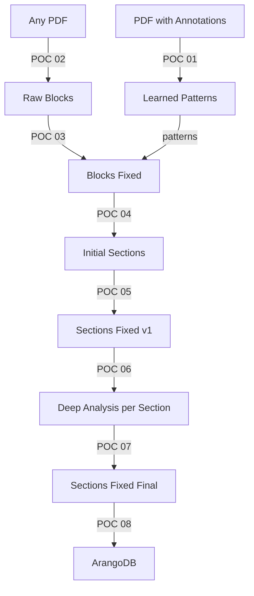

# Correct Pipeline Flow

## Current Issues

The current pipeline has illogical ordering:
- POC 06 exports to ArangoDB
- POC 07 does deep analysis AFTER export

This makes no sense because you want to analyze and fix BEFORE storing in the database.

## Proposed Correct Flow

### Detailed Steps

1. **POC 01: Extract Annotations**
   - Learn from human annotations
   - Store patterns in ArangoDB

2. **POC 02: Marker Extraction**
   - Extract raw blocks from PDF
   - Add UUIDs and metadata

3. **POC 03: Identify & Fix Suspicious Blocks**
   - Fix misclassified blocks
   - Apply learned patterns
   - Clean OCR errors

4. **POC 04: Create Section JSON**
   - Build initial section structure
   - Group blocks by headers
   - Create hierarchy

5. **POC 05: Fix Section JSON (Round 1)**
   - Send to Claude with context
   - Fix obvious issues
   - Merge/split sections

6. **POC 06: Deep Section Analysis** 
   - Analyze EACH section individually
   - 5-stage validation pipeline
   - Compare to gold standards
   - Generate improvement list

7. **POC 07: Fix Sections from Analysis**
   - Apply improvements from POC 06
   - Final Claude review
   - Produce clean, validated sections

8. **POC 08: Export to ArangoDB**
   - Store only high-quality data
   - Create graph relationships
   - Link to patterns used

## Why This Order?

1. **Progressive Refinement**: Each step improves quality
2. **Validation Before Storage**: Only store validated data
3. **Deep Analysis Integration**: Section-level analysis informs final fixes
4. **Gold Standard Comparison**: Happens before final storage

## File Renaming Needed

Current files need renaming:
- `poc_06_export_to_arangodb.py` → `poc_08_export_to_arangodb.py`
- `poc_07_deep_section_analysis.py` → `poc_06_deep_section_analysis.py`
- (new) `poc_07_fix_sections_final.py`

## Quality Gates

Each step has validation:
- POC 03: Block classification accuracy
- POC 05: Section structure score
- POC 06: Deep analysis score per section
- POC 07: Final validation before storage
- POC 08: Storage verification

Only data passing all quality gates reaches the database.