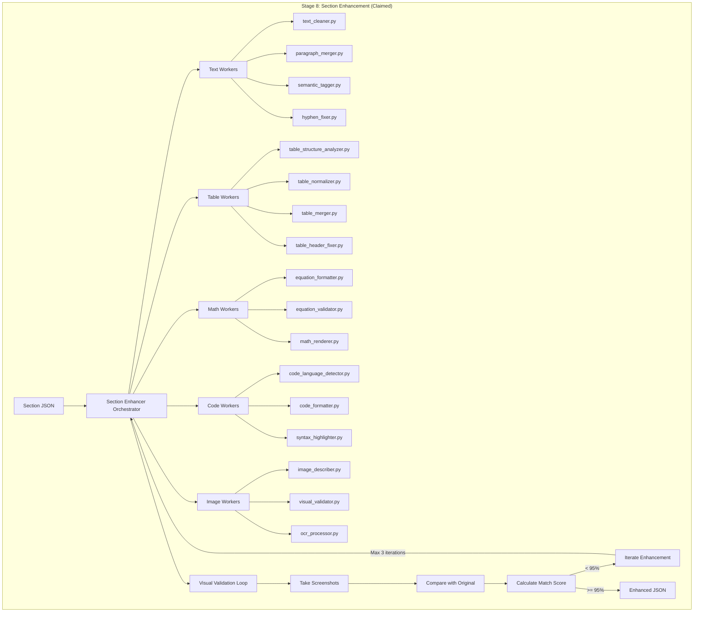
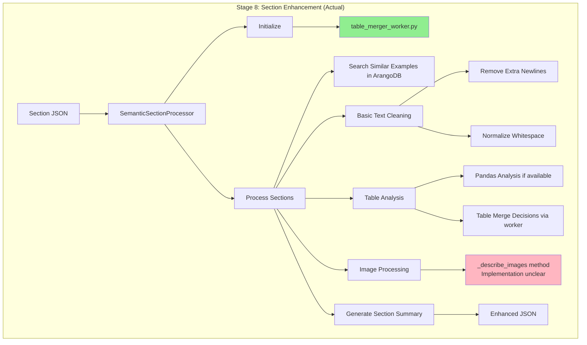

# Stage 8: Claimed vs Actual Implementation

## Claimed Architecture (From Prompts)

## Actual Implementation

## Gap Analysis

### Workers Status

| Category | Claimed Workers | Actual Implementation |
|----------|----------------|----------------------|
| **Text** | 4+ workers (cleaner, merger, tagger, hyphen_fixer) | Basic string operations inline |
| **Tables** | 4+ workers (analyzer, normalizer, merger, header_fixer) | 1 worker (table_merger_worker) |
| **Math** | 3+ workers (formatter, validator, renderer) | None |
| **Code** | 3+ workers (detector, formatter, highlighter) | None |
| **Images** | 3+ workers (describer, validator, OCR) | Placeholder method |
| **Validation** | Visual validation system | None |

### Functionality Gap

| Feature | Claimed | Actual |
|---------|---------|---------|
| OCR Error Correction | ✅ | ❌ |
| Split Paragraph Merging | ✅ | ❌ |
| Table Structure Analysis | ✅ | Partial (pandas only) |
| Table Merging | ✅ | ✅ (via worker) |
| Equation Formatting | ✅ | ❌ |
| Code Language Detection | ✅ | ❌ |
| Image Description | ✅ | ❓ (method exists, implementation unclear) |
| Visual Validation | ✅ | ❌ |
| Iterative Enhancement | ✅ | ❌ |
| Knowledge Base Integration | ❌ | ✅ (searches similar examples) |

### Summary

- **30+ workers claimed** → **1 worker implemented**
- **Complex visual validation** → **No validation**
- **Iterative enhancement** → **Single pass processing**
- **Rich content processing** → **Basic text cleaning**

The actual implementation is approximately **5-10%** of what's described in the documentation.