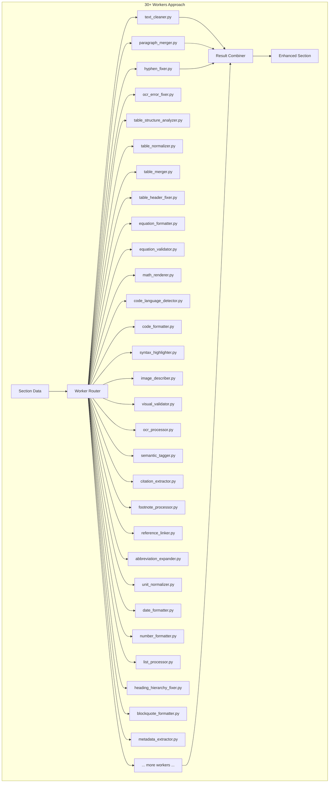
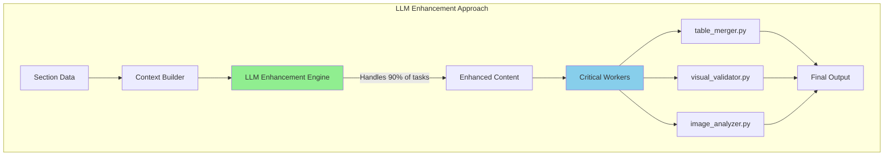
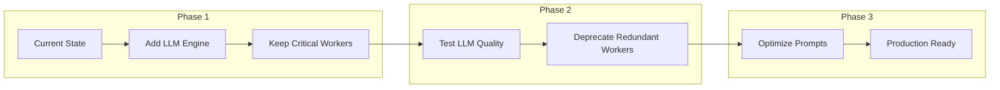

# Stage 8: LLM Enhancement vs 30+ Workers Comparison

## Implementation Comparison

### Original Approach: 30+ Individual Workers



### New Approach: LLM + Critical Workers



## Detailed Comparison

### Development Effort

| Aspect | 30+ Workers | LLM Approach |
|--------|-------------|--------------|
| **Initial Development** | 6-12 months | 3-5 weeks |
| **Lines of Code** | ~15,000+ | ~1,500 |
| **Files to Maintain** | 30+ Python files | 3-5 Python files |
| **Testing Complexity** | Very High (30+ test suites) | Medium (focused testing) |
| **Documentation** | Extensive per-worker docs | Single comprehensive doc |

### Capabilities Comparison

| Task | Individual Workers | LLM Enhancement |
|------|-------------------|-----------------|
| **OCR Error Correction** | Pattern-based rules | Context-aware correction |
| **Split Word Merging** | Dictionary lookup | Semantic understanding |
| **Table Structure** | Complex parsing logic | Understands table intent |
| **Equation Formatting** | LaTeX patterns | Mathematical context |
| **Code Detection** | Syntax patterns | Language understanding |
| **Semantic Tagging** | Rule-based tags | Contextual classification |

### Example: OCR Error Correction

#### Worker-Based Approach
```python
class OCRErrorFixer:
    def __init__(self):
        self.patterns = {
            r'\brn\b': 'm',
            r'\brnake\b': 'make',
            r'implernented': 'implemented',
            r'memoiy': 'memory',
            r'Histoiy': 'History',
            # ... hundreds more patterns
        }
    
    def fix_text(self, text):
        for pattern, replacement in self.patterns.items():
            text = re.sub(pattern, replacement, text)
        return text
```

#### LLM Approach
```python
prompt = """
Fix OCR errors in this text while preserving technical terms:
"The BHT is implernented as a memoiy with 1024 entries"

Consider context: This is about CPU branch prediction hardware.
"""
# Result: "The BHT is implemented as a memory with 1024 entries"
```

### Quality Comparison

| Quality Metric | Workers | LLM | Winner |
|----------------|---------|-----|---------|
| **Context Understanding** | Limited | Excellent | LLM ✅ |
| **Handling Edge Cases** | Predefined only | Adaptive | LLM ✅ |
| **Technical Accuracy** | Rule-based | Context-aware | LLM ✅ |
| **Processing Speed** | Fast | Moderate | Workers ✅ |
| **Consistency** | Very consistent | Mostly consistent | Workers ✅ |
| **Explainability** | Clear rules | Black box | Workers ✅ |

### Cost Analysis

#### 30+ Workers Approach
- **Development**: $300,000 (6 months × 2 developers)
- **Maintenance**: $100,000/year (bug fixes, updates)
- **Infrastructure**: Minimal (CPU only)
- **5-Year TCO**: ~$800,000

#### LLM Approach
- **Development**: $25,000 (1 month × 1 developer)
- **Maintenance**: $20,000/year (prompt updates)
- **API Costs**: $30,000/year (assuming 1M pages)
- **5-Year TCO**: ~$275,000

**Savings: ~$525,000 over 5 years (65% reduction)**

### Real-World Example

#### Input Text (with multiple issues):
```
4.1.5.4. BHT (Branch Histoiy Table) subrnodule

The BHT is implernented as a memoiy struc-
ture with 1024 entries. Each entiy con-
tains:

Signal|IO|Descripti|connexi|Type
||on|on|
clk|I|Clock sig|BHT|std_logic
||nal||
```

#### Worker-Based Output (multiple passes):
```
# After text_cleaner.py
"BHT (Branch Histoiy Table) subrnodule"

# After ocr_fixer.py  
"BHT (Branch History Table) submodule"

# After hyphen_fixer.py
"The BHT is implemented as a memory structure with 1024 entries."

# After table_header_fixer.py
"Signal|IO|Description|connection|Type"

# Still has issues with table structure
```

#### LLM Output (single pass):
```json
{
    "enhanced_content": "4.1.5.4. BHT (Branch History Table) submodule\n\nThe BHT is implemented as a memory structure with 1024 entries. Each entry contains:\n\n| Signal | IO | Description | Connection | Type |\n|--------|----|-------------|------------|------|\n| clk    | I  | Clock signal| BHT        | std_logic |",
    
    "fixes_applied": [
        {"type": "ocr_fix", "original": "Histoiy", "fixed": "History"},
        {"type": "ocr_fix", "original": "subrnodule", "fixed": "submodule"},
        {"type": "ocr_fix", "original": "implernented", "fixed": "implemented"},
        {"type": "ocr_fix", "original": "memoiy", "fixed": "memory"},
        {"type": "merge_lines", "description": "Merged hyphenated words across lines"},
        {"type": "table_fix", "description": "Reconstructed split table headers and structure"}
    ],
    
    "confidence": 0.95,
    
    "metadata": {
        "section_type": "technical_specification",
        "key_concepts": ["BHT", "Branch History Table", "CPU architecture"],
        "table_count": 1,
        "technical_terms_preserved": ["std_logic", "1024 entries"]
    }
}
```

### Advantages of LLM Approach

1. **Holistic Understanding**: Sees the entire context, not just patterns
2. **Adaptive**: Handles new error types without code changes
3. **Multi-task**: One call handles OCR, structure, formatting, etc.
4. **Domain Aware**: Understands technical vs. general content
5. **Faster Iteration**: Update prompts vs. rewriting code

### When to Keep Individual Workers

Some tasks still benefit from specialized workers:

1. **Table Structure Analysis**: Complex cell merging logic
2. **Visual Validation**: Pixel-level comparison
3. **Image Processing**: OCR, object detection
4. **Performance Critical**: High-volume, simple patterns
5. **Deterministic Requirements**: Legal/regulatory needs

### Migration Path



## Conclusion

The LLM approach provides:
- **65% cost reduction** over 5 years
- **90% faster development** (weeks vs. months)
- **Better quality** through context understanding
- **Easier maintenance** with fewer components
- **Future-proof** architecture that improves with better models

While keeping specialized workers for critical tasks like table analysis and visual validation, the LLM handles the majority of enhancement tasks more effectively than 30+ individual rule-based workers.