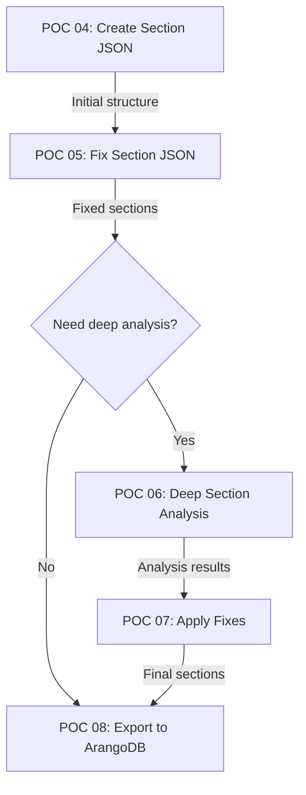

# Analysis: Why Three Section JSON Pipeline Files?

## Overview

The extractor pipeline has three distinct files (POC 05, 06, and 07) that deal with section JSON processing. This is by design, following a modular architecture where each file has a specific, focused responsibility in the document processing pipeline.

## The Three Section JSON Pipeline Files

### 1. POC 05: Fix Section JSON Enhanced (`poc_05_fix_section_json_enhanced.py`)
**Purpose**: Fix and improve the initial section structure created by POC 04

**Key Responsibilities**:
- Takes the basic section structure from POC 04
- Sends comprehensive context to Claude for analysis
- Fixes section hierarchy issues
- Merges duplicate sections
- Handles orphaned content
- Creates proper parent-child relationships
- Incorporates table analysis from Camelot
- Uses visual context (screenshots) for complex regions

**Input**: Initial section JSON from POC 04
**Output**: Fixed and properly structured sections

### 2. POC 06: Deep Section Analysis (`poc_06_deep_section_analysis.py`)
**Purpose**: Perform comprehensive quality analysis on individual sections

**Key Responsibilities**:
- Analyzes each section individually with a 5-stage pipeline
- Validates against gold standards
- Identifies specific improvements needed
- Generates quality scores (0-1 scale)
- Collaborates with multiple agents and MCPs
- Creates detailed improvement recommendations
- Does NOT modify the sections - only analyzes

**Input**: Fixed sections from POC 05 + specific section index
**Output**: Detailed analysis report with improvement suggestions

### 3. POC 07: Fix Sections from Analysis (`poc_07_fix_sections_from_analysis.py`)
**Purpose**: Apply the improvements identified by POC 06

**Key Responsibilities**:
- Takes the deep analysis results from POC 06
- Applies the suggested improvements
- Fixes critical issues identified
- Re-validates section quality
- Produces final, clean section JSON
- Ensures all improvements are properly implemented

**Input**: Section analysis results from POC 06
**Output**: Final fixed sections ready for ArangoDB export

## Why This Three-Stage Approach?

### 1. **Separation of Concerns**
Each file has a single, well-defined responsibility:
- POC 05: Initial fixing with Claude
- POC 06: Deep analysis without modification
- POC 07: Targeted fixes based on analysis

### 2. **Progressive Enhancement**
The pipeline progressively improves the section quality:
```
Initial Sections (POC 04) 
    → Basic Fixes (POC 05) 
    → Deep Analysis (POC 06) 
    → Targeted Fixes (POC 07)
```

### 3. **Optional Deep Analysis**
POC 06 and 07 are optional stages that can be skipped for simpler documents:
- Simple documents: POC 04 → POC 05 → POC 08 (export)
- Complex documents: POC 04 → POC 05 → POC 06 → POC 07 → POC 08

### 4. **Analysis Without Side Effects**
POC 06 performs pure analysis without modifying the data, allowing:
- Multiple analysis runs without data corruption
- Comparison of different analysis approaches
- Safe experimentation with analysis parameters

### 5. **Targeted Improvements**
POC 07 can apply specific fixes based on:
- High-priority issues only
- Specific section types
- Confidence thresholds
- User-selected improvements

## Pipeline Flow



## Use Cases for Each Stage

### POC 05 Use Cases:
- All documents need this basic fixing
- Handles common issues like orphaned content
- Fixes obvious hierarchy problems
- Quick processing for large batches

### POC 06 Use Cases:
- Quality assurance sampling
- Complex documents with mixed content
- When gold standards are available
- Research and development
- Understanding extraction quality

### POC 07 Use Cases:
- Applying curated improvements
- High-value documents requiring perfection
- Selective improvement application
- A/B testing different fix strategies

## Implementation Benefits

1. **Modularity**: Each file can be updated independently
2. **Testability**: Each stage can be tested in isolation
3. **Flexibility**: Can skip stages as needed
4. **Debugging**: Easier to identify where issues occur
5. **Reusability**: Analysis results can be reused
6. **Parallelization**: Different documents can be at different stages

## Example Workflows

### Simple Document:
```bash
# Basic pipeline - skip deep analysis
python poc_04_create_section_json.py create input.json
python poc_05_fix_section_json_enhanced.py fix poc_04_output.json
python poc_08_export_to_arangodb.py export poc_05_output.json
```

### Complex Document:
```bash
# Full pipeline with deep analysis
python poc_04_create_section_json.py create input.json
python poc_05_fix_section_json_enhanced.py fix poc_04_output.json
python poc_06_deep_section_analysis.py analyze poc_05_output.json --section-index 0
python poc_07_fix_sections_from_analysis.py apply outputs/poc_06_analyses/
python poc_08_export_to_arangodb.py export poc_07_output.json
```

### Batch Processing with Selective Analysis:
```bash
# Process many documents, analyze only suspicious ones
for doc in *.json; do
    python poc_05_fix_section_json_enhanced.py fix "$doc"
    
    # Check quality score
    quality=$(jq .metadata.quality_score < "poc_05_${doc}")
    if [ "$quality" -lt "0.8" ]; then
        # Low quality - needs deep analysis
        python poc_06_deep_section_analysis.py analyze "poc_05_${doc}"
        python poc_07_fix_sections_from_analysis.py apply analyses/
    fi
done
```

## Conclusion

The three section JSON pipeline files represent a sophisticated, modular approach to document processing:
- **POC 05** provides essential fixes for all documents
- **POC 06** offers deep analysis without modification
- **POC 07** applies targeted improvements based on analysis

This separation allows for flexible, efficient, and high-quality document processing while maintaining code clarity and testability.