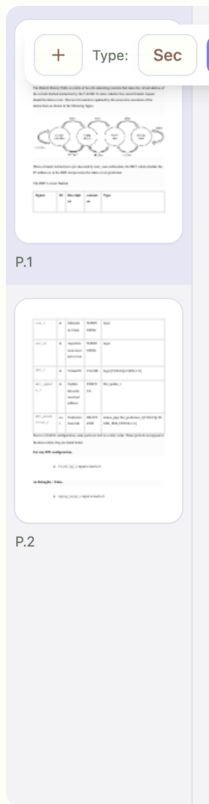
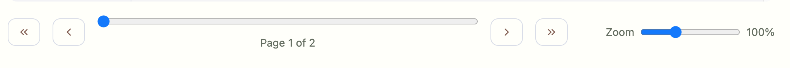

MB: /main Thumbnails — Filmstrip/Left/Off Toggle

Assignees:
Labels: micro-brief, status:proposed
Milestone:
Projects:

Context
- Route/Element: /main · Thumbnails/pager
- Screenshots:  · 

Friction
- Vertical thumbnail rail can unnecessarily consume space on short documents; need a quick way to switch to bottom filmstrip or hide entirely.

Target Feel
- A simple control toggles thumbnail mode between Left rail, Bottom filmstrip, and Off. Choice persists across reloads. Slider and page number continue to work in all modes.

Acceptance
- [ ] Toggle shows three modes: Left, Bottom, Off; switching updates immediately
- [ ] Persist last chosen mode (reload restores)
- [ ] Slider + page nav remain functional in all modes
- [ ] No layout jumps or overflow when switching modes at any zoom

Verify (60–120s)
1) Switch to Bottom → thumbnails render horizontally below canvas; navigate via thumbs
2) Switch to Off → only slider remains; page nav still works
3) Reload → last chosen mode is restored

Out of Scope
- Heuristic auto‑selection by page count (track as a separate brief)
