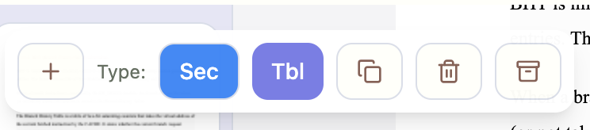

MB: /main Labeler — Palette + New (Draw Mode) + Draggable/Attach + Persistence

Assignees:
Labels: micro-brief, status:proposed
Milestone:
Projects:

Context
- Screenshots: 
- The labeler (HUD) needs to be usable without covering content and must expose more than two labels.

Friction
- “+” does nothing; label set is limited to Sec/Tbl.
- HUD can obscure the page and isn’t movable; no option to attach/dock.
- Boxes should persist per page and survive reload at least for pages 1–2 of the sample.

Target Feel
- Palette: “+” opens a label palette (Section, Table, Figure). Easy to extend via a small labels registry.
- New (crosshair): toggles Draw mode. Cursor switches to crosshair; next pointer drag on the canvas draws a box, then Draw mode auto-disarms. ESC cancels Draw mode with no box created.
- HUD: draggable within the canvas OR toggled to “Attach to selection” (hugs selected box and avoids edges). Press H to toggle; R to reset.
- Persistence: boxes are stored per page and saved to localStorage (keyed to demo doc) so they remain when switching between P.1 and P.2 and after reload.

Acceptance
- [ ] Clicking “+” opens a palette with at least: Section, Table, Figure (icons)
- [ ] Selecting a palette item sets the selected box type (or sets the default new‑box type when none is selected)
- [ ] New (N) arms Draw mode (crosshair appears); next drag draws a box; ESC cancels; after create, Draw mode disarms automatically
- [ ] HUD is draggable and persists position; H toggles attach‑to‑selection; R resets
- [ ] Creating boxes on P.1 and P.2, switching pages, and reloading preserves boxes on both pages
- [ ] Only one “+” icon exists in HUD (palette). The New‑box button uses a distinct icon (crosshair) and tooltip “New (N)”.

Verify (60–120s)
1) Click “+” → palette appears; pick Figure → selected box type changes to Figure (chip color/icon updates)
2) Click New (or press N) → cursor becomes crosshair; click‑drag draws; ESC cancels; after first box, New disarms
3) Drag HUD to bottom‑right → reload → position persists; press H → HUD follows selection without going off‑canvas; press R → HUD resets
4) Draw one box on P.1 and another on P.2 → reload → both are present on their respective pages

Out of Scope
- Full label taxonomy management UI beyond adding Figure and wiring an extensible list in code

Automated check (Puppeteer)
- Start dev server: `cd prototypes/tabbed/html && npm run dev`
- In another terminal (repo root):
  - `npm i -D puppeteer` (first time only)
  - `node scripts/ux_mb003.mjs` (uses `BASE_URL=http://localhost:8080/main` by default)
- The script asserts:
  - Single “+” icon exists (palette)
  - “+” palette sets selected label to Figure
  - New → draw box; ESC cancels (to add once implemented)
  - HUD drag persists across reload
  - Boxes drawn on P.1 and P.2 persist after reload

Labels registry (easy extension)
- We will generate the palette from `src/lib/labels.ts`:
  - Example default export:
    - `[{ id: 'Section', color: 'annotation-section', icon: 'Heading' }, { id: 'Table', color: 'annotation-table', icon: 'Table' }, { id: 'Figure', color: 'annotation-figure', icon: 'Image' }]`
- Acceptance for registry:
  - [ ] Adding a new entry to `labels.ts` surfaces it in the palette without touching HUD code
