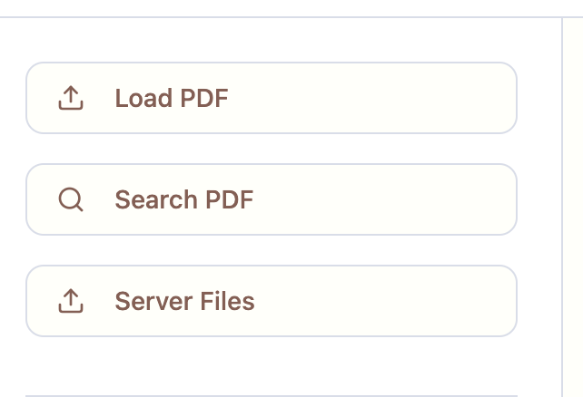
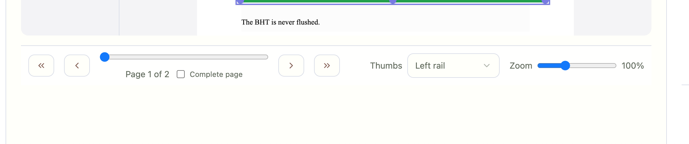
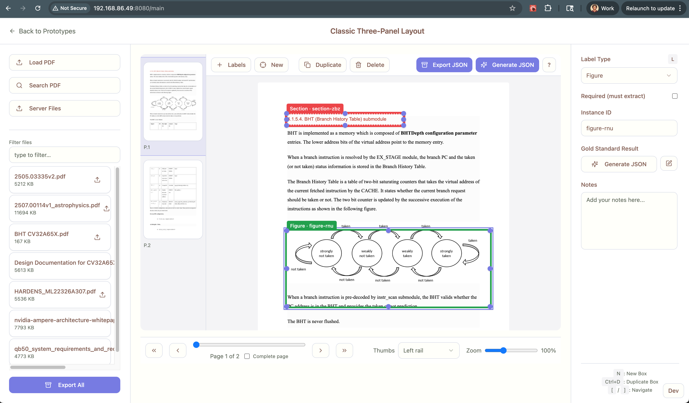

- Why do we have 'Load PDF' and 'Server Files'
Should we hav a single button that gets the pdf we need? Or are you specifyign that Load PDF is local and Server Files are external. This is confusing. Is there a best practice UX design for this?

- The Middle Pane is not mouse scrollable meaning that the bottom part of the PDF can no be labeled

- the bottom pane is too tall. It should be efficient size to not take remove screen real esatte from the pdf annotator center pane

- the search Button in the left pane does not work

- the entire page screenshot for context:
