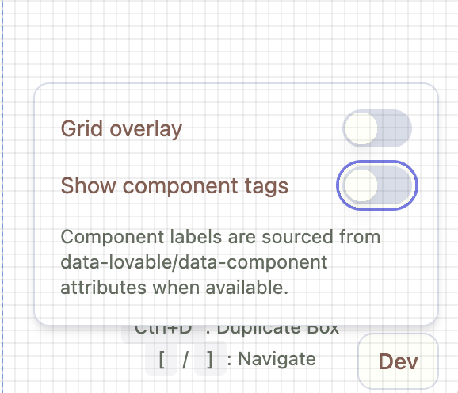
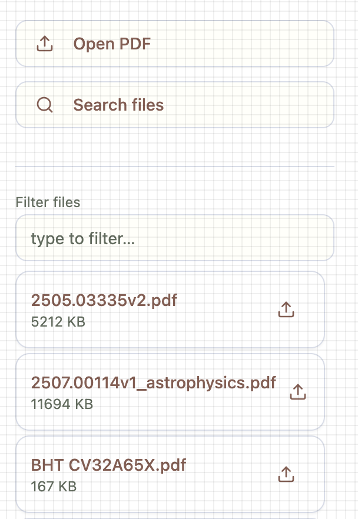
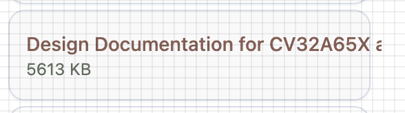

- Once you toggle the grid button in the dev button, the modal is no longer operable and you can't toggle either 'grid' or 'show component tags'

- Component tags are not specific to component areas byond gererall div areas like 'Classic Layout main'?
shouldn't each componet like left pane buttons have their own label?

- Left pane buttons label text is cut off. We need a betetr way to display...perhaps with using ... and a mouse-over give the full title?
