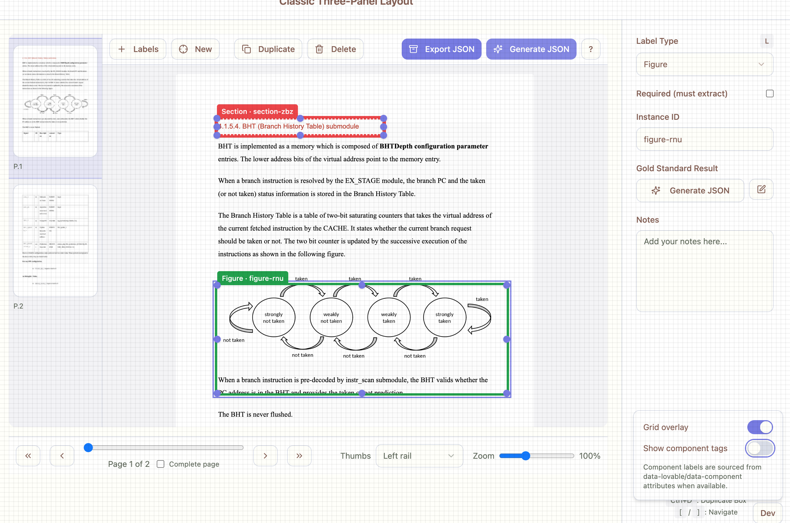
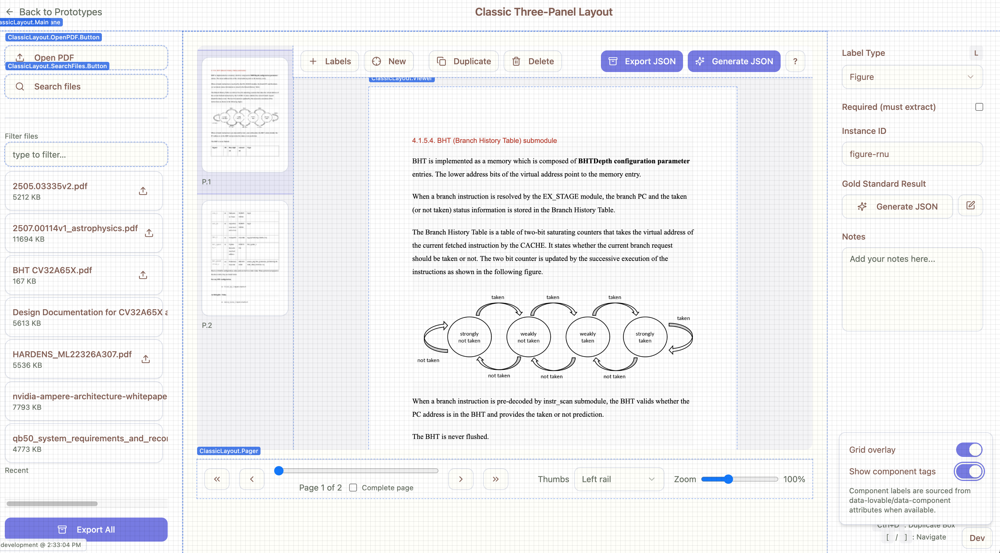
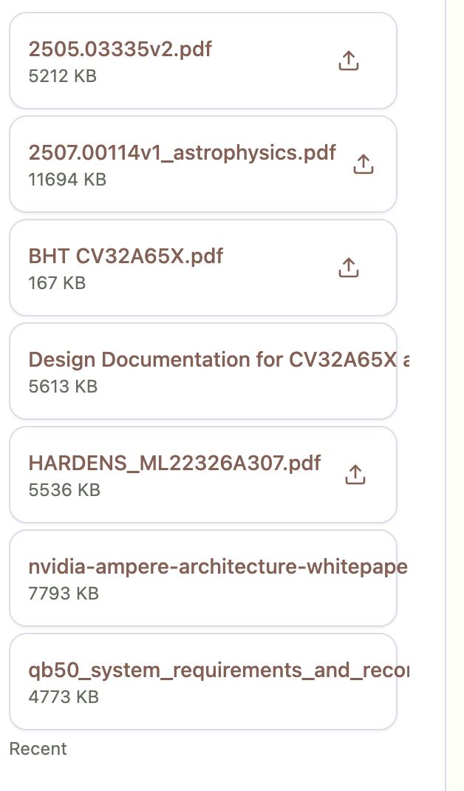
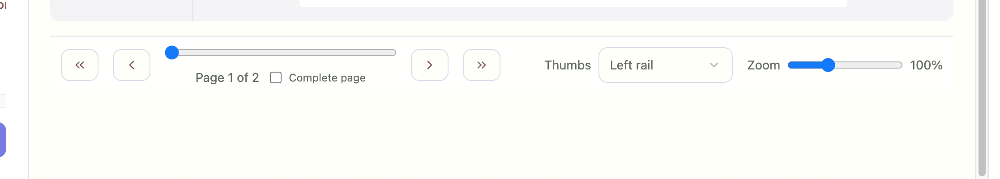

# right pane: dev button
- show component tags button disabled the pdf annotation boxes when enabled. We need the annotation boxes to remain enabled
- show component tags disabled

- show component tags enabled

# left pane: pdf label text
- the pdf button text needs to be truncated with .... When the user mouse overs the pdf title text, the full name appears.

# Bottom Page is too tall
- the botoom pane for page scrollinng is obviously incorrect and is 3x+ to tall. Place at the bottom so we have maximum space for pdf annotation

