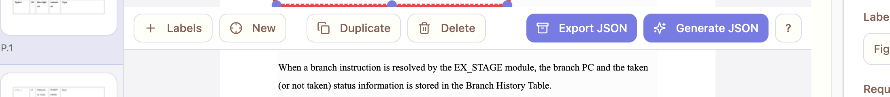

# fixed top menu
This top menu should be fixed in place like the bootm menu where scrolling the centrer pane pdf doesn
't collide with top menu

---

Resolution (2025-09-12)
- Implemented a fixed top toolbar in Tabbed prototype. The toolbar is now sticky within the center scroll container, mirroring the behavior of the bottom pager. Scrolling the PDF no longer collides with the top menu.
- Files changed: `prototypes/tabbed/html/src/pages/TabbedLayout.tsx`.

Acceptance
- Visual: Top toolbar stays pinned while the center content scrolls; bottom pager stays pinned; no overlap onto the canvas center.
- Scripted checks passed on both Classic and Tabbed routes (Puppeteer + CDP):
  - `uiReady=true`, `pointerDrawOk=true`, `toolbarClear=true`.

Artifacts
- Classic (/main)
  - scripts/artifacts/ux_check_2025-09-12T20-38-24-653Z.png
  - scripts/artifacts/ux_check_2025-09-12T20-38-24-653Z.log
  - scripts/artifacts/ux_check_cdp_2025-09-12T20-38-29-163Z.png
  - scripts/artifacts/ux_check_cdp_2025-09-12T20-38-29-163Z.log
- Tabbed (/tabbed)
  - scripts/artifacts/ux_check_2025-09-12T20-38-27-612Z.png
  - scripts/artifacts/ux_check_2025-09-12T20-38-27-612Z.log
  - scripts/artifacts/ux_check_cdp_2025-09-12T20-38-29-918Z.png
  - scripts/artifacts/ux_check_cdp_2025-09-12T20-38-29-918Z.log

Notes
- Bottom filmstrip height reduced in both Classic and Tabbed to keep maximum space for annotation (64px, narrower thumbs).
- Dev overlay labels have `pointer-events: none`, ensuring annotation boxes remain interactive when component tags are shown.
