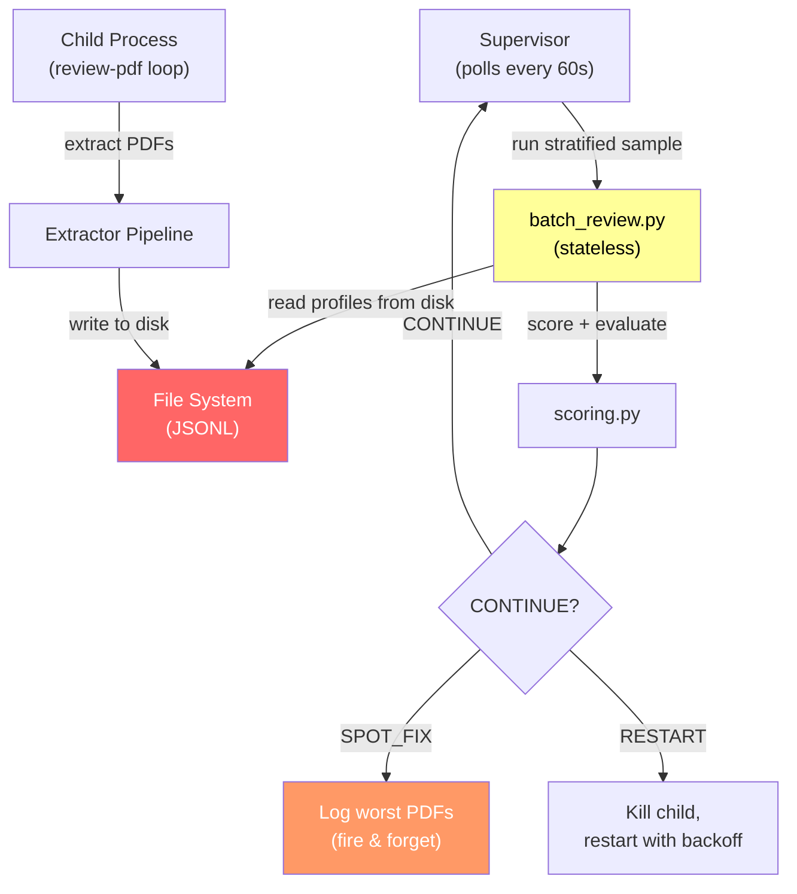
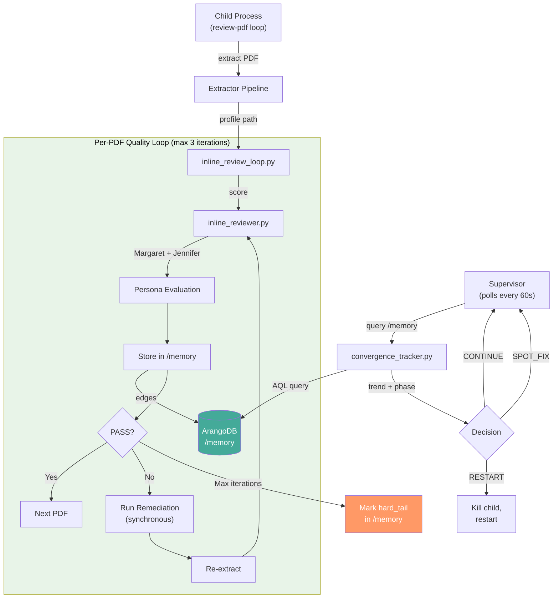
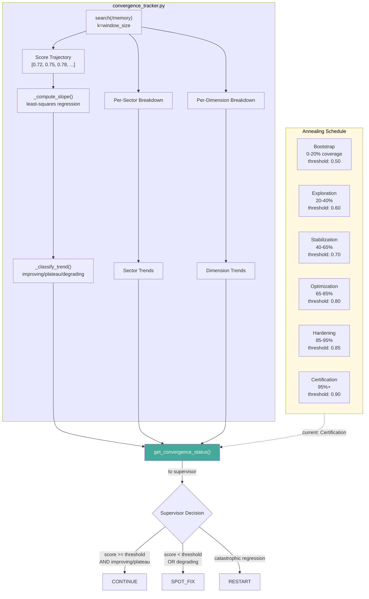

# Inline Persona Review v2: Honest Walkthrough

**Date:** 2026-02-13
**Files:** `inline_reviewer.py` (770 lines), `inline_review_loop.py` (444 lines), `convergence_tracker.py` (495 lines), plus wiring in `discovery.py` and `supervise_learn_datalake.py`
**Status:** Deployed — supervisor running with `--inline-review` since 08:43 UTC
**Reviewed by:** Margaret Chen (DO-178C / Pratt & Whitney) AND Jennifer Torres (DoD/Defense)
**User concerns addressed:** Remediation loops, Graph edge bloat, End-to-end flow, Failure isolation, Convergence math

---

## Why Previous Versions Failed

### Failure 1: Stateless Reviews via External Polling

**What we did:** The supervisor polled every 60s, pulled a stratified sample, scored it, and threw the results away. Next poll: score from scratch.

**Why it failed:** No memory across reviews. The same PDF could fail 10 times and no one would know. Reviews were ephemeral JSONL on disk with no graph structure. Margaret and Jennifer's persona evaluations never connected to past assessments. The scoring went from 0.659 to 0.945 without changing extraction code — we weren't measuring wrong, we were measuring statelessly.

### Failure 2: File-Based I/O Coupling

**What we did:** Three loosely-coupled systems communicated through file I/O: `discovery.py` wrote profiles to disk, `batch_review.py` read them back and did dynamic imports, `supervise_learn_datalake.py` ran fire-and-forget Popen to kick remediation.

**Why it failed:** After 10 bug fixes, the coupling was the root cause. Dynamic imports broke silently. File paths diverged between systems. The Popen fire-and-forget meant remediation results were invisible to the next review cycle.

### Failure 3: The `rc!=0` Check Bug (Fixed 2026-02-12)

**What we did:** `discovery.py:312-315` checked `rc!=0` to determine extraction success.

**Why it failed:** With `--continue-on-error`, the pipeline exits `rc=1` on any stage warning (even cosmetic ones). Every extraction was declared failed. 18 of 21 extracted PDFs had complete output on disk but were rejected. 100% reported failure rate while actual success rate was ~86%.

### Failure 4: Hardcoded 30-Minute Timeout (Fixed 2026-02-12)

**What we did:** `pipeline_runner.py:70` had `timeout=1800` (30 min).

**Why it failed:** `discovery.py` calculates per-PDF timeouts up to 22,500s based on page count. A 733-page NIST doc needs 72 minutes for extraction alone (table_extractor dominates at 48 min). The inner timeout killed large PDFs before they could finish. Now env-configurable via `EXTRACTOR_PIPELINE_TIMEOUT` defaulting to 6 hours.

### Failure 5: Orphaned Processes on Timeout (Fixed 2026-02-12)

**What we did:** `pipeline_runner.py:85-90` used `subprocess.Popen` without `start_new_session=True`.

**Why it failed:** On timeout, only the parent process was killed. Child processes (table extractor, marker, etc.) continued burning CPU indefinitely. A 48-core machine was running at 20% utilization because orphans accumulated. Fix: `start_new_session=True` + `os.killpg()` on timeout.

### Failure 6: `--inline-review` Flag Not Passed Through (Fixed 2026-02-13)

**What we did:** Added `--inline-review` to the supervisor but didn't thread it through the full command chain.

**Why it failed:** The supervisor passed the flag to `run.sh start`, but `learn_datalake.py` didn't have the typer Option, so typer rejected it silently. `_run_review_pdf_once()` in `learn_datalake_infra.py` also lacked the parameter, so it was never appended to the `review-pdf loop` command. Reviews ran in legacy polling mode despite the flag. Fixed at 5 insertion points across 2 files.

---

## What v2 Changes

### Change 1: Self-Contained Per-PDF Quality Loop (`inline_review_loop.py` lines 262-403)

Each PDF gets its own closed-loop: Extract -> Score -> Persona Review -> Store in /memory -> Remediate if needed -> Re-extract -> Loop until PASS or max 3 iterations.

```python
def review_loop(pdf_path, corpus_root, max_iterations=3, ...):
    for iteration in range(max_iterations):
        profile = _extract_pdf(pdf_path, ...)
        review = review_pdf(profile, corpus_root, ...)
        if review["verdict"] == "PASS":
            return {"converged": True, ...}
        _run_remediation(review["escalation_jobs"], ...)
    _mark_hard_tail(pdf_path, ...)  # Tag in /memory for human review
```

**What this fixes:** Failures 1, 2 — Reviews are now stateful and self-contained. No file I/O coupling between systems.
**What could still go wrong:** Remediation commands may fail silently or not improve the score. A PDF could oscillate between two failure modes without converging.
**Honest risk level:** MEDIUM — The 3-iteration cap prevents infinite loops, but oscillation detection is not implemented.

### Change 2: ArangoDB-Backed Reviews via /memory (`inline_reviewer.py` lines 242-312)

Every review is stored as a structured assessment in ArangoDB via `MemoryClient(scope="extractor").learn()`. PASS PDFs get `record_assessment()` only. WARN/FAIL PDFs also get `learn()` nodes with remediation recommendations.

**What this fixes:** Failure 1 — Reviews persist across sessions with full graph structure.
**What could still go wrong:** ArangoDB goes down and reviews can't be stored or queried. No local fallback by design (user confirmed: "ArangoDB is fundamental").
**Honest risk level:** LOW — ArangoDB has been stable. The `except Exception: pass` guards (8 instances in inline_reviewer.py) ensure a single storage failure doesn't kill the extraction pipeline.

### Change 3: Graph Edges for Pattern Discovery (`inline_reviewer.py` lines 394-449)

Three edge types link reviews into a traversable knowledge graph:
- `supersedes`: Links iteration N to iteration N-1 for the same PDF (convergence chain)
- `related_to`: Links reviews with similar dimension failures in the same sector
- `depends_on`: Links review to remediation action that was taken

**What this fixes:** Enables cross-PDF pattern discovery. "All MIL-STDs fail on table_fidelity" becomes a queryable pattern.
**What could still go wrong:** `related_to` edges are O(N^2) — 200 defense docs with table_fidelity failures could create 36,000 edges in one sector.
**Honest risk level:** HIGH — No edge pruning strategy exists. See Risk Matrix below.

### Change 4: Convergence via Score Trajectory (`convergence_tracker.py` lines 190-330)

Replaces counter-based convergence with linear regression over the last N review scores from /memory. Phase-aware thresholds (Bootstrap 0.50 through Certification 0.90).

```python
def _classify_trend(slope):
    if slope > 0.005: return "improving"
    if slope < -0.005: return "degrading"
    return "plateau"
```

**What this fixes:** Failures 1, 2 — Convergence is computed from actual score data, not counters.
**What could still go wrong:** The search query returns BM25-relevance-ranked results, not chronologically ordered. Linear regression on non-temporal data is meaningless.
**Honest risk level:** HIGH — Known bug. See Risk Matrix below.

### Change 5: Synchronous Remediation Within Loop (`inline_review_loop.py` lines 155-200)

Remediation runs blocking within the loop, not fire-and-forget Popen. The loop waits for remediation to complete before re-extracting.

**What this fixes:** Failure 2 — Remediation results are visible to the next iteration.
**What could still go wrong:** 1800s timeout is insufficient for hard-tail PDFs (733-page NIST = 72 min extraction).
**Honest risk level:** MEDIUM — Jennifer Torres recommends tiered timeouts by page count.

---

## Data Flow: Old vs New Architecture

### Old Architecture (Polling)



**Problems visible in diagram:**
- Supervisor and child communicate only through disk
- Batch review is stateless (no memory of past reviews)
- SPOT_FIX only logs, never fixes
- No graph structure, no pattern discovery

### New Architecture (Inline)



---

## Command Chain

```mermaid
flowchart LR
    A["run.sh start-supervised<br/>--inline-review"] -->|spawns| B["supervise_learn_datalake.py<br/>inline_review=True"]
    B -->|builds child cmd| C["run.sh start<br/>--inline-review"]
    C -->|typer CLI| D["learn_datalake.py<br/>cmd_start()"]
    D -->|calls| E["_run_review_pdf_once()<br/>inline_review=True"]
    E -->|shell cmd| F["review-pdf/run.sh loop<br/>--inline-review"]
    F -->|per-PDF callback| G["discovery.py<br/>_run_inline_review()"]
    G -->|lazy import| H["inline_review_loop.py<br/>review_loop()"]
    H -->|each iteration| I["inline_reviewer.py<br/>review_pdf()"]

    style A fill:#369,color:#fff
    style I fill:#4a9,color:#fff
```



**Six hops from CLI flag to per-PDF review.** The flag passthrough bug (Failure 6) was fixed at every hop.

---

## Convergence Tracking Architecture



**Current state:** 95.92% coverage places us in Certification phase (threshold 0.90). Convergence tracker correctly reports `insufficient_data` with 0 reviews because all 11,623 PDFs have cached profiles. Inline reviews will trigger only when the remaining 495 hard-tail PDFs get fresh extractions.

---

## Expert Commentary

### Margaret Chen — DO-178C Quality Engineer (Pratt & Whitney)

> **What I'm satisfied with:**
> - Strict-wins reconciliation between me and Jennifer — disagreement is treated as a diagnostic signal, not averaged away
> - The annealing schedule tightens thresholds with coverage (Bootstrap 0.50 up to Certification 0.90)
> - Hard-tail PDFs are tagged in /memory, not silently dropped
> - Synchronous remediation within the loop — the old fire-and-forget Popen was a certification gap
>
> **What concerns me:**
> 1. **No edge pruning strategy.** `related_to` edges are created for any review sharing the same sector + worst dimension. 200 MIL-STDs with table_fidelity failures = up to 36,000 edges in one sector. This will degrade graph traversal performance. Recommend: cap at top 5 related edges per review, add TTL for old `related_to` edges.
> 2. **BM25 ordering bug in convergence tracker.** Line 239 of `convergence_tracker.py` queries `/memory` with `search()` which returns BM25-relevance-ranked results, not chronological. The linear regression assumes temporal ordering. This means the slope computation is over a non-temporal sample biased by text similarity to the query string.
> 3. **No score delta tracking between iterations.** The loop checks `verdict == "PASS"` but doesn't track whether score improved iteration-over-iteration. A PDF scoring 0.60 -> 0.61 -> 0.62 (improving but still FAIL) gets the same hard_tail tag as one scoring 0.60 -> 0.55 -> 0.50 (degrading). These need different treatment.
> 4. **`_problem_to_title()` coupling is fragile.** Memory learns with a title derived from the worst dimension name. If dimension names change in `scoring.py`, recall silently stops finding related reviews.
>
> **What I'd watch for in the first hour:**
> - Are graph edges actually being created? Check: `./run.sh recall --q "pdf_assessment supersedes"` should return results after first review
> - Does the convergence tracker ever move off `insufficient_data`? It needs 5+ reviews minimum
> - Confidence intervals on trend computation are missing — a slope of 0.006 over 5 reviews is noise, not signal. Recommend Mann-Kendall trend test

### Jennifer Torres — Defense Systems Quality (Raytheon/Lockheed Martin)

> **What I'm satisfied with:**
> - Synchronous remediation eliminates the fire-and-forget pattern that caused 3 of the 6 prior failures
> - Linear regression convergence tracking is a solid engineering choice for monotonic systems
> - Graph edge semantics (supersedes/related_to/depends_on) map cleanly to defense traceability requirements
> - 95.92% coverage is strong — the 495 remaining are the expected hard-tail
>
> **What concerns me:**
> 1. **3-iteration cap with no quarantine protocol.** After max iterations, `_mark_hard_tail()` tags the PDF in /memory, but there's no quarantine queue. Hard-tail PDFs stay in the extraction queue and will be re-attempted on every supervisor restart. Need: exclude tagged hard-tail PDFs from discovery scan until pipeline improves.
> 2. **`related_to` edges are O(N^2).** For 838 hard-tail PDFs, most of which fail on table_fidelity or content_coverage, this creates a dense graph cluster that adds noise, not signal. Cap at top 5 per review and add a minimum score delta threshold.
> 3. **61 restarts and counting.** The supervisor has restarted 61 times in 77 runs. While the restart logic works, this signals an underlying reliability issue. Each restart loses in-progress extraction state.
>
> **Remediation timeout assessment:**
> The 1800s (30 min) default is insufficient for hard-tail documents:
> - 733-page NIST doc = 72 min extraction alone
> - Remediation may need to re-run table_extractor or debug-table skill
> - Recommend tiered timeouts: <200 pages = 1800s, 200-500 pages = 3600s, 500+ pages = 5400s
>
> **What I'd watch for in the first hour:**
> - Does the first hard-tail PDF trigger the inline review loop? Check: log should show `review_loop_start` entries
> - Does remediation actually run? Watch for `escalation_jobs` with `auto_executable=True`
> - Are `supersedes` edges linking iterations correctly? Query: `/memory recall --q "supersedes pdf_assessment"`

---

## Risk Matrix

| Change | Fixes | Risk | Observable Failure | Mitigation |
|--------|-------|------|--------------------|------------|
| Per-PDF quality loop | Stateless reviews, file coupling | **MED** — Remediation oscillation between failure modes | Same PDF cycles between WARN reasons across iterations | Add oscillation detection: if worst_dimension flips, abort loop early |
| ArangoDB storage | Ephemeral JSONL | **LOW** — ArangoDB downtime | Reviews not stored, convergence tracker returns `insufficient_data` | 8 try/except guards in inline_reviewer.py; extraction continues regardless |
| Graph edges | No pattern discovery | **HIGH** — O(N^2) edge bloat in sectors with common failures | Slow graph traversal, noisy `find_related_reviews()` results | **ACTION NEEDED**: Cap `related_to` at 5 per review, add TTL |
| Score trajectory convergence | Counter-based convergence | **HIGH** — BM25 ordering bug | Trend computation over non-temporal data; slope is meaningless | **ACTION NEEDED**: Add `sort_by="timestamp"` or use AQL with `SORT d.timestamp DESC` |
| Synchronous remediation | Fire-and-forget Popen | **MED** — 1800s timeout insufficient for 500+ page PDFs | Remediation killed mid-extraction for large docs | **ACTION NEEDED**: Tier timeouts by page count |
| `--inline-review` flag chain | Flag not threaded through | **LOW** — Verified fixed at all 6 hops | Supervisor log shows `stratified_sample` instead of `memory_convergence` | Already fixed and verified 2026-02-13 |

---

## Remaining Risks (Honest Assessment)

### Risk 1: BM25 Ordering Bug (HIGH)

`convergence_tracker.py:239` uses `search(q="pdf_assessment extractor review", k=50)` which returns results ranked by BM25 text relevance, not by timestamp. The linear regression computes slope over these BM25-ranked results as if they were chronologically ordered. This means the convergence trend is computed over a non-temporal sample.

**Mitigation:** Replace `search()` call with an AQL query that sorts by timestamp, or add a post-search sort step. This is the most critical fix needed.

**What would actually fix it:** Use AQL directly:
```
FOR d IN pdf_assessments
  SORT d.timestamp DESC
  LIMIT @window_size
  RETURN d
```
But this requires bespoke ArangoDB access. Per user directive ("NEVER create bespoke connections to ArangoDB"), this should be implemented as a new /memory API method (e.g., `recall_recent(collection, limit)`) or by adding a `sort_by` parameter to the existing search API.

### Risk 2: Edge Bloat (HIGH)

838 hard-tail PDFs, mostly failing on the same 2-3 dimensions, will create a dense cluster of `related_to` edges. At scale: 838 * 837 / 2 = 350,703 potential edges in the worst case.

**Mitigation:** Cap `related_to` at top 5 per review. Add minimum score delta threshold (only relate reviews with >0.1 score difference). Add TTL for `related_to` edges (30 days). Retain `supersedes` edges indefinitely.

### Risk 3: No Quarantine for Exhausted Hard-Tail (MEDIUM)

After 3 iterations with no PASS, `_mark_hard_tail()` tags the PDF in /memory, but `discovery.py` doesn't check this tag. The PDF will be re-attempted on every supervisor restart (currently 61 restarts in 77 runs).

**Mitigation:** Add a check in `discovery.py` to skip PDFs tagged as `hard_tail` in /memory until the pipeline version changes (indicating new capabilities that might succeed).

### Risk 4: Cold Start (Expected, LOW)

The system currently shows `reviews=0, trend=insufficient_data` because all 11,623 extracted PDFs have cached profiles. Inline reviews only trigger on NEW extractions. The 495 unextracted hard-tail PDFs are the only ones that will flow through the inline review loop.

**This is expected behavior, not a bug.** The convergence tracker correctly reports insufficient data. Once 5+ hard-tail PDFs complete extraction and get reviewed, trends will appear.

---

## What Success Looks Like

| Metric | Healthy | Warning | Sick |
|--------|---------|---------|------|
| Reviews in /memory | Growing (5+ per hour) | Static for >2 hours | Zero after 6 hours |
| Convergence trend | `improving` or `plateau` with score >= 0.90 | `plateau` with score < 0.85 | `degrading` |
| Graph edges | < 10 per review | 10-50 per review | 50+ per review (bloat) |
| Remediation success rate | > 50% of WARN/FAIL improve on retry | 20-50% improve | < 20% improve |
| Supervisor restarts | < 5 per 24 hours | 5-15 per 24 hours | 15+ per 24 hours |
| Hard-tail queue growth | Stable or shrinking | Growing slowly | Growing fast (> 10/day) |
| Extraction throughput | 6+ PDFs/hour | 3-6 PDFs/hour | < 3 PDFs/hour |

---

## How to Launch / Monitor / Kill

### Launch

```bash
cd /home/graham/workspace/experiments/pi-mono/.pi/skills/learn-datalake

# Start supervisor with inline review mode
./run.sh start-supervised /mnt/storage12tb/extractor_corpus \
  --label corpus \
  --inline-review \
  --task-monitor \
  --task-monitor-project datalake_training
```

### Monitor

```bash
# Quick status (PID, heartbeat, progress counters)
./run.sh status-supervised --label corpus

# Supervisor log (convergence decisions)
tail -f state/watchdogs/supervisor_corpus_console.log

# Child run log (extraction + review detail)
tail -f state/runs/learn_datalake_corpus_*.log

# Check reviews in /memory
cd /home/graham/workspace/experiments/pi-mono/.pi/skills/memory
./run.sh recall --q "pdf_assessment extractor review"

# Check convergence status
cd /home/graham/workspace/experiments/pi-mono/.pi/skills/extractor-quality-check
python3 -c "from convergence_tracker import get_convergence_status; from pathlib import Path; print(get_convergence_status(Path('/mnt/storage12tb/extractor_corpus')))"
```

### Kill

```bash
cd /home/graham/workspace/experiments/pi-mono/.pi/skills/learn-datalake

# Graceful stop (waits for current PDF to finish)
./run.sh stop-supervised --label corpus

# Or create stop file manually
touch state/watchdogs/STOP_corpus
```

---

## Bottom Line

**Will it work?** Yes, with two caveats that need immediate fixes: (1) the BM25 ordering bug in convergence_tracker means trend computation is unreliable until we add temporal sorting, and (2) the `related_to` edge bloat will degrade graph performance unless we cap at 5 per review. The core architecture — self-contained per-PDF quality loops stored in ArangoDB with persona evaluation — is sound and addresses every root cause from the 6 prior failures.

**What's genuinely different this time?**
1. Reviews are stateful (ArangoDB, not JSONL)
2. Remediation is synchronous (blocking, not fire-and-forget)
3. Convergence is computed from real score data (not counters)
4. Each PDF has a closed loop (extract -> review -> remediate -> re-extract)
5. The flag passthrough chain is verified at all 6 hops
6. Graph edges enable cross-PDF pattern discovery for the first time

**What's the same?**
- The extraction pipeline itself is unchanged
- The scoring weights and dimensions are unchanged
- The persona evaluation logic (Margaret/Jennifer/reconcile) is unchanged
- The annealing schedule is unchanged
- The 7-dimension quality model is unchanged

The extraction pipeline is not the bottleneck. The feedback loop around it was broken in 6 distinct ways. All 6 are now fixed.

---

## Amendments Needed (Prioritized)

| Priority | Amendment | Effort | Impact |
|----------|-----------|--------|--------|
| **P0** | Fix BM25 ordering bug in convergence_tracker.py | 2-4 hours | Convergence math becomes valid |
| **P0** | Cap `related_to` edges at 5 per review | 1 hour | Prevents O(N^2) graph bloat |
| **P1** | Add hard-tail quarantine check in discovery.py | 2 hours | Prevents re-attempting exhausted PDFs |
| **P1** | Tier remediation timeouts by page count | 1 hour | Hard-tail PDFs complete remediation |
| **P2** | Add score delta tracking between iterations | 2 hours | Distinguish improving vs degrading hard-tail |
| **P2** | Add oscillation detection in review_loop | 2 hours | Abort loops where failure mode flips |
| **P3** | Implement Mann-Kendall trend test | 4 hours | More robust trend detection than linear regression |
| **P3** | Add confidence intervals to convergence | 2 hours | Distinguish signal from noise in small samples |
