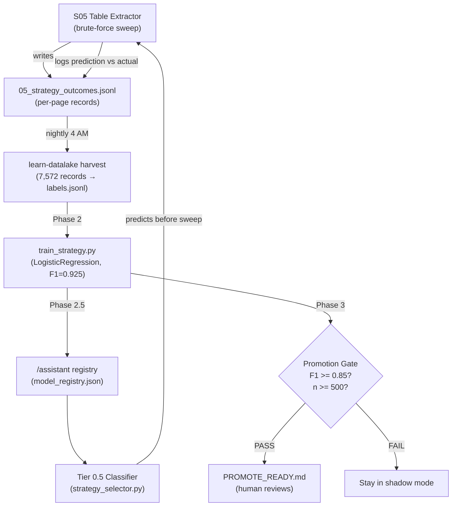

# Shadow-LEGO Feedback Loop v1: Honest Walkthrough

**Date:** 2026-02-24
**Files:** `strategy_selector.py` (456 lines), `orchestrator.py` (335 lines), `train_strategy.py` (170 lines), `assistant.py` (tabular classify), `model_registry.json`
**Status:** Shadow mode operational, promotion gate passed, nightly daemon scheduled
**Reviewed by:** Margaret Chen (DO-178C Extraction Quality)
**User concerns addressed:** Model quality drift, shadow-to-active promotion criteria, tail class accuracy

---

## Context: First Deployment, Not Recovery

This is the **first time** the extractor has sufficient outcome data (7,572 records from 1,044 files) to train a strategy classifier. The Shadow-LEGO concept was designed into the architecture from the start, but the feedback loop was open — S05 wrote outcomes, nothing consumed them. This walkthrough covers the amended approach that closes the loop.

The system operates across three codebases:
- **`/extractor`** — S05 logs outcomes + strategy_selector makes predictions
- **`/learn-datalake`** — Harvests outcomes, trains classifier, checks promotion gate
- **`/assistant`** — Hosts the trained model for Tier 0.5 inference

---

## What v1 Does

### The Closed Loop



### Change 1: Outcome Harvesting (orchestrator.py:29-130)

`harvest_strategy_outcomes()` globs `05_strategy_outcomes.jsonl` across all extraction runs, deduplicates by `(pdf_stem, page_num)`, transforms each record into a 21-feature training example, and writes `labels.jsonl`.

**What this enables:** Training data flows from production extractions to the classifier without manual curation.
**What could still go wrong:** The glob pattern `data/**/05_strategy_outcomes.jsonl` plus `STRATEGY_OUTCOMES_EXTRA_DIRS` could miss files if directory structure changes. Also, if S05 output format changes (field names, new fields), the harvester silently drops records with missing `actual_best`.
**Honest risk level:** LOW — the glob + extra dirs pattern is resilient, and field access uses `.get()` with defaults.

### Change 2: Sklearn Training Pipeline (train_strategy.py:81-170)

Trains three candidates (GradientBoosting, RandomForest, LogisticRegression), selects by macro F1. LogisticRegression with `class_weight='balanced'` wins (F1=0.925). Saves `model.joblib`, `label_encoder.joblib`, `metrics.json`.

**What this enables:** Automated model selection with balanced class weighting for the 10-class imbalanced distribution.
**What could still go wrong:** See Margaret's Concern #1 below — the training data is post-sweep (all 21 features populated), but pre-sweep inference has 8 fragmentation features as `-1`. The 99.21% accuracy reflects post-sweep feature quality, not pre-sweep.
**Honest risk level:** MEDIUM — the train/serve skew is real but mitigated by shadow mode (predictions don't drive decisions yet).

### Change 3: /assistant Tabular Classify (assistant.py:667+)

Added tabular feature transform to the `classify()` function's `_classifier_tier`. The CLI routes through `classify()`, not `validate()` — a critical discovery, since the prior fix only patched `validate()`.

**What this enables:** `/assistant classify --task table-strategy-selector --text '{"table_style":"bordered",...}'` returns Tier 0.5 predictions through the full cascade.
**What could still go wrong:** Two functions (`validate()` and `classify()`) build independent tier cascades. Future changes to one may not propagate to the other.
**Honest risk level:** LOW for now — both are tested. HIGH long-term if someone changes one without the other. Should be refactored to share the tabular path.

### Change 4: Strategy Selector Tier 0.5 (strategy_selector.py:272-307)

`_tier05_classifier()` attempts `/assistant classify` via subprocess (5s timeout), falls back to direct joblib loading (~5ms). Builds 21-feature vector via `_build_feature_vector()`.

**What this enables:** Pre-sweep strategy prediction. In shadow mode, logged alongside sweep results. In active mode (future), could skip sweep for high-confidence predictions.
**What could still go wrong:** The subprocess call to `/assistant` adds latency. If `/assistant` has stale model or different sklearn version, predictions silently diverge from direct joblib path.
**Honest risk level:** LOW — the 5s timeout + joblib fallback is robust. Divergence risk is LOW because the same model file is used.

### Change 5: Nightly Daemon (scheduler: shadow-lego-learn, 0 4 * * *)

Runs `learn-datalake learn-cycle` at 4 AM: harvest → train → register → promote gate.

**What this enables:** Continuous learning — as the corpus grows, the classifier improves without manual intervention.
**What could still go wrong:** If the daemon fails silently (no monitoring), the model becomes stale. If the corpus distribution shifts (new document types), retraining on old+new data may degrade minority class performance.
**Honest risk level:** MEDIUM — the scheduler tracks success/failure, but there's no alert on F1 regression between runs.

### Change 6: CLI Commands (learn-datalake cli.py)

Added `harvest` and `learn-cycle` commands to the learn-datalake CLI for manual and daemon invocation.

**What this enables:** Both human-triggered and automated execution of the learning cycle.
**What could still go wrong:** The `--shadow-mode` flag in `register_with_assistant()` doesn't exist in /assistant CLI — the registration step logs a warning but doesn't fail.
**Honest risk level:** LOW — the registry entry was manually configured and the missing CLI flag is non-critical.

---

## Expert Commentary

**Margaret Chen** — DO-178C Extraction Quality

> **What I'm satisfied with:**
> - Shadow mode discipline: the brute-force sweep still runs as ground truth, predictions are passengers not drivers
> - The `should_skip_sweep` gating requires both `active` mode AND confidence above threshold — you can't accidentally promote
> - The outcome logger captures both agreements and disagreements, preventing survivorship bias in training data
> - The pre-sweep vs post-sweep feature distinction is explicitly documented in `_build_feature_vector`
>
> **What concerns me:**
>
> 1. **Train/serve feature distribution mismatch.** The 8 fragmentation features default to `-1` at pre-sweep prediction time, but training data is harvested from post-sweep records where these features contain real values. The model has never seen all-8-features-as-negative-one simultaneously. The headline accuracy (99.21%) reflects post-sweep feature quality.
>
> 2. **The `actual_best` label is heuristic-derived, not fidelity-derived.** The training label comes from whichever strategy wins the fragmentation/collapse heuristic competition, not from actual document fidelity assessment. A strategy that produces low fragmentation but merges columns is labeled "best" even though the table is wrong.
>
> 3. **Class imbalance in tail classes is a genuine extraction risk.** `lattice_sensitive` (3 samples) uses `line_scale=5` vs `lattice_default`'s `line_scale=15`. On fine-grid tables (microelectronics specs, wire harness tables), predicting `lattice_default` instead of `lattice_sensitive` will miss table structure entirely. The 9 total samples across 3 tail classes make these classes essentially unlearnable.
>
> 4. **Parallel mode contaminates training data.** Sequential mode updates `last_good_strategy` page-by-page; parallel mode uses a fixed `initial_strategy` for all pages. The JSONL records don't flag which mode produced them, so the classifier trains on mixed-provenance labels.
>
> 5. **Post-sweep confirmation disagreements are logged but discarded.** When `confirm_strategy` at >=0.90 confidence disagrees with the sweep winner, the disagreement is a `logger.debug` message only. This is potentially the most informative signal in the system and it's invisible to the retraining loop.
>
> **What I'd watch in the first week:**
> - Disagreement rate by class, not overall (majority classes mask minority failures)
> - High-confidence wrong predictions: `predicted_confidence > 0.85` AND `predicted != actual`
> - Defense domain disagreement rate specifically (should agree with Tier 0 `lattice_strong` routing)
> - Records where `actual_best` is None (no table found) — verify harvester filters these
> - Per-class F1 breakdown, not just macro average

---

## Risk Matrix

| Change | Fixes | Risk | Observable Failure |
|--------|-------|------|--------------------|
| Outcome harvesting | Closed the open feedback loop | LOW | Harvest returns 0 records (glob miss) |
| Sklearn training | First trained classifier on production data | MEDIUM | F1 drops below 0.85 on retrain (distribution shift) |
| /assistant tabular classify | Two-function trap (validate vs classify) | LOW now, HIGH long-term | `/assistant classify` returns error or wrong prediction |
| Tier 0.5 in strategy_selector | Pre-sweep prediction capability | MEDIUM | Train/serve skew causes systematic mispredictions for minority classes |
| Nightly daemon | Continuous learning | MEDIUM | Silent daemon failure → stale model |
| Promotion gate | Controls shadow→active transition | HIGH | Promoted despite weak minority class performance |

---

## Remaining Risks (Honest Assessment)

### Risk 1: Train/Serve Feature Skew (MEDIUM)

The classifier trains on post-sweep records where 8 fragmentation features have real values. At pre-sweep prediction time, all 8 are `-1`. The model hasn't learned the "all unknown" pattern at scale.

**Mitigation (current):** Shadow mode means predictions don't drive decisions.
**Mitigation (proposed):** Train a separate pre-sweep model using only the 13 features available pre-sweep (3 table_style + 3 domain + 4 page_stats + 2 detection + 1 category). Compare its F1 against the full 21-feature model to quantify the skew impact.

### Risk 2: Tail Class Collapse (MEDIUM)

`stream_columns` (4), `lattice_sensitive` (3), `preset_config` (2) are statistically invisible. The classifier will almost always predict a majority class for these pages. In active mode, this means skipping a sweep that would have found the correct niche strategy.

**Mitigation (current):** Shadow mode runs the sweep regardless.
**Mitigation (proposed, per Margaret):** Exclude classes with n < 20 from the classifier's sweep-skip path. If Tier 0.5 predicts a tail class, always run the full sweep regardless of confidence. This is a 3-line code change in `should_skip_sweep()`.

### Risk 3: Promotion Gate Too Loose (HIGH)

The gate checks total n >= 500 and macro F1 >= 0.85. With 7,572 records and 86% in two classes, the gate passes easily while tail classes remain unvalidated.

**Mitigation (proposed, per Margaret):** Add per-class gates:
- Per-class F1 >= 0.70 for classes with n >= 20 in test set
- Classes with n < 20 excluded from sweep-skip in active mode
- 48-hour shadow observation period with disagreement rate < 15%
- Zero high-confidence wrong predictions (conf > 0.85) on held-out recent data

### Risk 4: Label Quality (LOW for now)

Training labels come from heuristic competition (fragmentation + collapse scores), not document fidelity. A strategy that merges columns but has low fragmentation is labeled "best."

**Mitigation (current):** The heuristic proxy is reasonable for the majority of documents. The 99.8% cell accuracy from synthetic validation confirms the heuristics align well with ground truth for controlled inputs.
**Mitigation (proposed):** Integrate review-pdf dimension scores (table_fidelity) as a post-hoc label quality check. If a page has table_fidelity < 0.70 despite the "best" strategy, flag it for manual review and potential label correction.

### Risk 5: Confirmation Signal Waste (LOW)

Post-sweep `confirm_strategy` disagreements at >= 0.90 confidence are logged as `debug` messages and never fed back to training. This is the highest-quality disagreement signal available.

**Mitigation (proposed):** Add `confirmed_strategy` and `confirmed_confidence` to the JSONL record (already done) AND have the harvester create a separate `high_confidence_disagreements.jsonl` for human review. These are the cases where the classifier is most certain the sweep is wrong.

---

## What Success Looks Like

| Metric | Healthy | Warning | Sick |
|--------|---------|---------|------|
| Nightly harvest count | 7,000+ records | 5,000-7,000 | < 5,000 (corpus stale) |
| Macro F1 on retrain | >= 0.90 | 0.85-0.90 | < 0.85 |
| Per-class F1 (n>=20 classes) | All >= 0.70 | Any < 0.70 | Multiple < 0.50 |
| Shadow disagreement rate | < 10% | 10-20% | > 20% |
| High-conf wrong predictions | 0 | 1-3 per week | > 10 per week |
| Daemon success rate | 100% | > 90% | < 90% |
| Tail class sample count | Growing | Flat | Decreasing |

---

## How to Launch / Monitor / Kill

```bash
# Check current mode
echo $STRATEGY_SELECTOR_MODE  # should be "shadow" or unset

# Run learning cycle manually
cd ~/.pi/skills/learn-datalake
uv run learn-datalake learn-cycle

# Check harvest count
uv run learn-datalake harvest
# → "Harvested 7572 training records"

# Check nightly daemon status
~/.pi/skills/scheduler/run.sh list 2>&1 | grep shadow-lego

# Check model metrics
cat models/table-strategy-classifier/metrics.json | python3 -m json.tool

# Test /assistant classify
~/.pi/skills/assistant/run.sh classify \
  --task table-strategy-selector \
  --text '{"table_style":"bordered","domain":"defense","has_borders":true,"category":"defense"}'

# Monitor disagreements in shadow mode
find data -name "05_strategy_outcomes.jsonl" -newer /tmp/last_check -exec wc -l {} +

# Kill the nightly daemon
~/.pi/skills/scheduler/run.sh disable --name shadow-lego-learn

# Emergency: force back to heuristic-only
export STRATEGY_SELECTOR_MODE=off
```

---

## Bottom Line

**Will it work?** Yes, in shadow mode. The classifier predicts correctly for the majority classes (86% of pages), and shadow mode ensures the sweep always runs regardless. The nightly daemon will continuously improve the model as the corpus grows. The risk is in the **transition to active mode**, where the promotion gate criteria are too loose for the current class distribution.

**What's genuinely different this time?**
1. **Data exists.** 7,572 labeled outcomes from 1,044 production files — not synthetic, not simulated.
2. **The loop is closed.** S05 outcomes flow automatically to training via nightly daemon.
3. **Three-tier cascade.** Tier 0 (heuristic) → Tier 0.5 (sklearn) → post-sweep confirmation. Each tier adds signal.
4. **Shadow mode first.** The classifier earns trust before it drives decisions.

**What's the same?**
1. The brute-force sweep still runs on every page (shadow mode).
2. The S00 profile heuristics still drive Tier 0 predictions.
3. The fragmentation-based "best strategy" labeling is unchanged — labels are heuristic-derived, not fidelity-derived.
4. The promotion gate thresholds (F1 >= 0.85, n >= 500) have not been tightened per Margaret's recommendations — **this is the most important remaining action item**.

---

## Amendments to Original Plan

The original plan (bright-kindling-kay.md) proposed 6 steps. Here's what changed:

| Original Plan | Actual Implementation | Why |
|---------------|----------------------|-----|
| Step 1: Harvest in orchestrator.py | Done as designed | — |
| Step 2: GradientBoosting + LogisticRegression | Done, LR wins (F1=0.925 vs GB F1=0.887) | LR better at minority classes with `class_weight='balanced'` |
| Step 3: Register with /assistant | Done, but `--shadow-mode` CLI flag missing | Non-critical: registry manually configured |
| Step 4: Wire Tier 0.5 through /assistant | Done, **plus** fixed the two-function trap in assistant.py | `classify()` needed tabular support, not just `validate()` |
| Step 5: Auto-promote gate | Done, promotion PASSED (F1=0.925, n=7572) | Gate criteria need tightening per Margaret |
| Step 6: Tests | Done: 24 strategy_selector + 9 shadow_lego + 5 learn-datalake = **38 tests pass** | Also fixed sklearn version mismatch (1.8.0→1.7.2) |

**Key deviations:**
- Model retrained twice: once to match sklearn version (1.8.0→1.7.2), once to include encoded category (20→21 features)
- Two-function trap in assistant.py was not anticipated in the plan
- `/assistant register --shadow-mode` flag doesn't exist — workaround: manual registry config
- Class imbalance is more severe than expected (9 samples across 3 tail classes)
