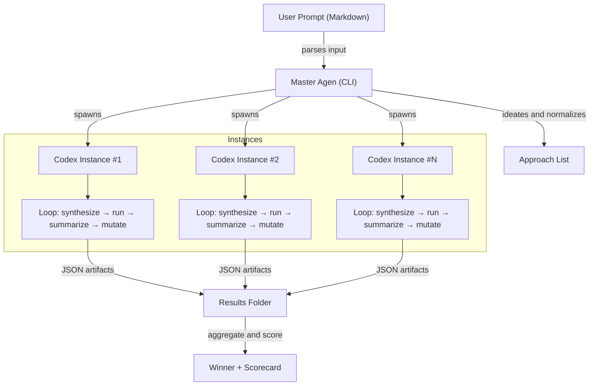
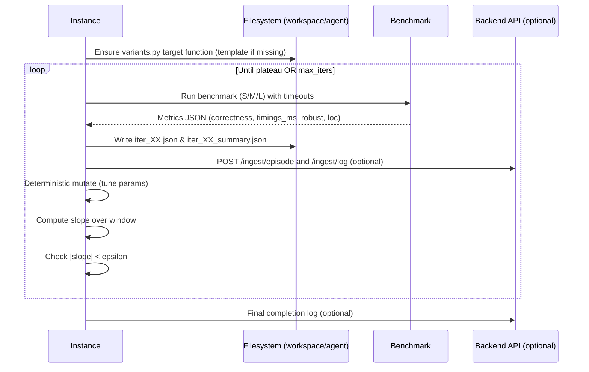
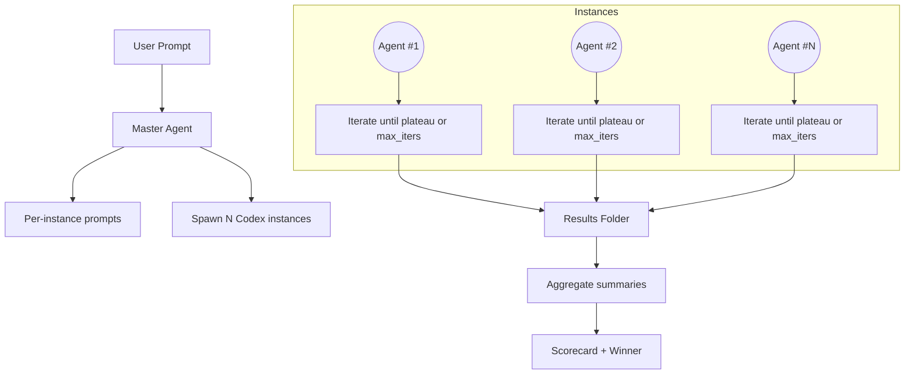
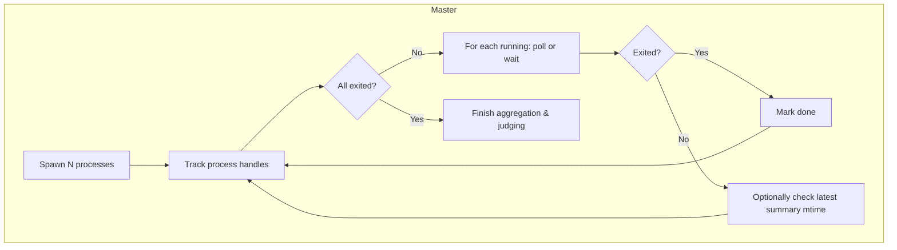

Can you create a similar tasks list with our new system to this project below:
### `prototypes/gamified/DEPRECATED.md`

``````markdown
Deprecated components (moved under `prototypes/gamified/deprecated/`).

These belonged to the earlier manifest/harness/JS-variants flow and are retained only for reference:

- `harness/` — manifest adapter and Node evaluator for title-case JS variants
- `variants/` — JS title-case examples
- `web/` — static logger demo page
- `tests/` — tests for the legacy harness flow
- `orchestrator_smoke.py` — JS-only orchestrator smoke

Use the prompt-driven CLI instead:

```
python scripts/gamified.py run --prompt-file prototypes/gamified/docs/prompt_multiplication_poc.md --codebase .
```


``````

### `prototypes/gamified/README.md`

``````markdown
# Gamified Orchestrator — Prompt‑Driven, Codex‑Exec Compatible

This prototype is now prompt‑first. You write a single, well‑structured Markdown prompt (codebase + approaches + optional tasks), and the CLI+agent does the rest:
- Parses approaches → N variants
- Autostarts the backend (FastAPI) and the React dashboard
- Launches one Codex instance per approach (iterative with plateau detection)
- Streams logs and episodes to the ingest API
- Scores and declares a winner; writes a scorecard JSON

---

## Quick Start

Prompt examples:
- `prototypes/gamified/docs/prompt_multiplication_poc.md`
- `prototypes/gamified/docs/prompt_multiplication_with_tasks.md`

Run with a prompt file (autostarts backend + dashboard):
```
python scripts/gamified.py run \
  --prompt-file prototypes/gamified/docs/prompt_multiplication_poc.md \
  --codebase .
```

What happens:
- Backend → `http://localhost:8000` (autostart unless disabled)
- Dashboard → `http://localhost:5199` (React; logs stream live)
 - One variant agent per approach, under Codex exec if available
  - Each instance gets its own self‑contained prompt file (`workspace/agent/<run>_<variant>/prompt.md`) with: original prompt, codebase path, output dir, and rules summary.
- Scorecard written to `bench/results/multiply_scorecard.json`
- Winner posted to `/ingest/episode`

---

## Prompt Anatomy (Minimal)

Use our template `prototypes/gamified/docs/MD_RULES_TEMPLATE.md` or copy the multiplication POC prompt. Key sections:
- Codebase (repo root or directory)
- Approaches (bullet list; names become variants)
- Optional Tasks (in a `json tasks` fenced block) with scopes: `pre`, `per_variant`, `post`

Optional flags:
- `--instances` caps concurrency (defaults to min(#approaches, CPU))
- `--no-autostart-backend`, `--no-start-dashboard` to disable autostart

---

## How It Works (Under the Hood)

1) CLI parses the prompt, extracts approaches, and ensures minimal artifacts (baseline/variants/bench) for the POC.
2) Starts FastAPI ingest and React dashboard.
3) Runs `scripts/variant_agent.py` per approach. Each agent:
   - Benchmarks, computes an iteration score, posts `/ingest/episode` and `/ingest/log`
   - Detects plateau via epsilon/window; stops when stabilized
4) The CLI aggregates the latest metrics, computes the cross‑variant scoreboard, saves JSON, and logs the winner.

---

## Dashboards

- React (dev on 5199): `cd prototypes/gamified/dashboard && npm run dev`
- Classic (zero setup): `GET /proto/dashboard` on the backend

---

## Deprecated (moved to `deprecated/`)

The previous manifest/harness/JS‑variant flow is archived. Prefer the prompt‑driven CLI above.
- `harness/` (manifest adapter, JS eval)
- `variants/` (JS title‑case examples)
- `web/` (static logger demo)
- `tests/` (legacy tests for JS flow)
- `orchestrator_smoke.py`

---

## Preflight

- Ensure Python and uvicorn are available.
- Optional: Node ≥ 18 for the React dashboard.
- Backend health:
  - `curl -fsS http://localhost:8000/scoreboard`
  - `curl -fsS -X POST http://localhost:8000/ingest/log -H 'Content-Type: application/json' -d '{"ts":0,"run_id":"smoke","variant":"noop","episode_id":null,"stream":"app","source":"preflight","message":"ping","meta":{}}'`

``````

### `prototypes/gamified/TODO.md`

``````markdown
# TODO: Prompt‑Driven Gamified Orchestration

Goal: Make the entire UX prompt‑first (Markdown), with N Codex instances iterating under internal rules until plateau, and a winner chosen from measurements.

Done
- Prompt file support (`--prompt` / `--prompt-file`) in `scripts/gamified.py`
- Backend/dashboard autostart
- Per‑variant agent with plateau detection (`scripts/variant_agent.py`)
- Tasks block (pre / per_variant / post) in prompt
- Scorecard generation and winner posting
- Deprecated legacy harness/JS orchestrator under `deprecated/`

Next
- Add `mutate_cmd` or LLM‑driven patch step between iterations for each variant
- Richer per‑iteration metadata logs (diff summaries, hyperparameters)
- Optional `--use-llm` to compile freeform prompts into structured rules
- Dashboard tiles for agent iteration state (running / plateau / best score)


``````

### `prototypes/gamified/dashboard/index.html`

```html
<!doctype html>
<html>
  <head>
    <meta charset="utf-8" />
    <meta name="viewport" content="width=device-width, initial-scale=1" />
    <title>Gamified Dashboard</title>
  </head>
  <body>
    <div id="root"></div>
    <script type="module" src="/src/main.tsx"></script>
  </body>
  </html>


```

### `prototypes/gamified/dashboard/package.json`

```json
{
  "name": "gamified-dashboard",
  "private": true,
  "version": "0.0.1",
  "type": "module",
  "scripts": {
    "dev": "vite",
    "build": "vite build",
    "preview": "vite preview"
  },
  "devDependencies": {
    "@vitejs/plugin-react-swc": "^3.6.0",
    "autoprefixer": "^10.4.21",
    "postcss": "^8.4.47",
    "tailwindcss": "^3.4.10",
    "tailwindcss-animate": "^1.0.7",
    "typescript": "^5.6.2",
    "vite": "^5.4.0"
  },
  "dependencies": {
    "@radix-ui/react-label": "^2.1.1",
    "class-variance-authority": "^0.7.1",
    "clsx": "^2.1.1",
    "lucide-react": "^0.446.0",
    "react": "^18.3.1",
    "react-dom": "^18.3.1"
  }
}

```

### `prototypes/gamified/dashboard/postcss.config.js`

```javascript
export default {
  plugins: {
    tailwindcss: {},
    autoprefixer: {},
  },
}


```

### `prototypes/gamified/dashboard/src/App.tsx`

```typescript
import React, { useEffect, useState } from 'react'
import { Card, CardTitle } from './components/ui/card'
import { Button } from './components/ui/button'
import { Input } from './components/ui/input'
import { Table, THead, TBody, TR, TH, TD } from './components/ui/table'

const API = (import.meta as any).env?.VITE_API_BASE || 'http://localhost:8000'

type ScoreItem = { run_id: string; variant: string; last_ts: number; last_score: number; error_count: number }
type EpisodeItem = { ts: number; run_id: string; variant: string; episode_id: string; score: number; error_count: number }
type LogItem = { ts: number; run_id?: string; variant?: string; source?: string; stream?: string; message?: string }

export default function App() {
  const [runId, setRunId] = useState('')
  const [status, setStatus] = useState<Record<string, ScoreItem>>({})
  const [episodes, setEpisodes] = useState<EpisodeItem[]>([])
  const [logs, setLogs] = useState<LogItem[]>([])
  const [logFilter, setLogFilter] = useState({ runId: '', variant: '', source: '', stream: '', limit: 50 })

  useEffect(() => {
    const es = new EventSource(`${API}/stream`)
    es.onmessage = (e) => {
      try {
        const msg = JSON.parse(e.data)
        if (msg.type === 'episode') {
          const d = msg.data || {}
          setStatus((prev) => ({ ...prev, [d.variant]: { run_id: d.run_id, variant: d.variant, last_ts: d.ts, last_score: d.score, error_count: d.error_count || 0 } }))
          setEpisodes((prev) => [d as EpisodeItem, ...prev].slice(0, 50))
        } else if (msg.type === 'log') {
          const d = msg.data || {}
          setLogs((prev) => [d as LogItem, ...prev].slice(0, logFilter.limit))
        }
      } catch {}
    }
    return () => es.close()
  }, [logFilter.limit])

  async function fetchScoreboard() {
    const qs = runId ? `?run_id=${encodeURIComponent(runId)}` : ''
    const res = await fetch(`${API}/scoreboard${qs}`)
    const js = await res.json()
    if (js.ok) {
      const map: Record<string, ScoreItem> = {}
      for (const it of js.items) map[it.variant] = it
      setStatus(map)
    }
  }

  async function fetchEpisodes() {
    const p = new URLSearchParams()
    if (runId) p.set('run_id', runId)
    p.set('limit', '25')
    const res = await fetch(`${API}/episodes?${p.toString()}`)
    const js = await res.json()
    if (js.ok) setEpisodes(js.items || [])
  }

  async function fetchLogs() {
    const p = new URLSearchParams()
    if (logFilter.runId) p.set('run_id', logFilter.runId)
    if (logFilter.variant) p.set('variant', logFilter.variant)
    if (logFilter.source) p.set('source', logFilter.source)
    if (logFilter.stream) p.set('stream', logFilter.stream)
    p.set('limit', String(logFilter.limit || 50))
    const res = await fetch(`${API}/logs?${p.toString()}`)
    const js = await res.json()
    if (js.ok) setLogs(js.items || [])
  }

  function tsFmt(t?: number) {
    if (!t) return ''
    return new Date(t * 1000).toLocaleTimeString()
  }

  return (
    <div className="min-h-screen bg-background text-foreground p-4">
      <h2 className="text-xl font-semibold mb-4">Gamified Dashboard</h2>
      <div className="flex items-center gap-2 mb-3">
        <label className="text-sm opacity-80">Run</label>
        <Input value={runId} onChange={(e) => setRunId(e.target.value)} placeholder="run-..." className="w-48" />
        <Button variant="outline" onClick={() => { fetchScoreboard(); fetchEpisodes(); }}>Apply</Button>
      </div>

      <div className="flex flex-wrap gap-4">
        {Object.keys(status).sort().map((k) => {
          const s = status[k]
          const color = s.error_count ? 'text-red-400' : 'text-emerald-400'
          return (
            <Card key={k} className="min-w-[240px]">
              <CardTitle>Variant: {k}</CardTitle>
              <div className={`text-3xl font-bold ${color}`}>{s.last_score?.toFixed?.(2)}</div>
              <div className="opacity-80 text-sm">Run: {s.run_id}</div>
              <div className="opacity-80 text-sm">Updated: {tsFmt(s.last_ts)}</div>
              <div className="opacity-80 text-sm">Errors: {s.error_count}</div>
            </Card>
          )
        })}
      </div>

      <Card className="mt-4">
        <CardTitle>Recent Episodes</CardTitle>
        <Table>
          <THead>
            <TR><TH>Time</TH><TH>Run</TH><TH>Variant</TH><TH>Episode</TH><TH>Score</TH><TH>Errors</TH></TR>
          </THead>
          <TBody>
            {episodes.map((e, i) => (
              <TR key={i}>
                <TD>{tsFmt(e.ts)}</TD>
                <TD>{e.run_id}</TD>
                <TD>{e.variant}</TD>
                <TD>{e.episode_id}</TD>
                <TD>{e.score?.toFixed?.(2)}</TD>
                <TD>{e.error_count}</TD>
              </TR>
            ))}
          </TBody>
        </Table>
      </Card>

      <Card className="mt-4">
        <CardTitle>Logs</CardTitle>
        <div className="flex flex-wrap items-center gap-2">
          <label className="text-sm opacity-80">Run</label>
          <Input value={logFilter.runId} onChange={(e) => setLogFilter({ ...logFilter, runId: e.target.value })} placeholder="run-..." className="w-40" />
          <label className="text-sm opacity-80">Variant</label>
          <Input value={logFilter.variant} onChange={(e) => setLogFilter({ ...logFilter, variant: e.target.value })} placeholder="variant" className="w-40" />
          <label className="text-sm opacity-80">Source</label>
          <Input value={logFilter.source} onChange={(e) => setLogFilter({ ...logFilter, source: e.target.value })} placeholder="codex|server|research|codereview" className="w-56" />
          <label className="text-sm opacity-80">Stream</label>
          <Input value={logFilter.stream} onChange={(e) => setLogFilter({ ...logFilter, stream: e.target.value })} placeholder="stdout|stderr|app|frontend" className="w-56" />
          <label className="text-sm opacity-80">Limit</label>
          <Input type="number" value={logFilter.limit} onChange={(e) => setLogFilter({ ...logFilter, limit: Number(e.target.value || 50) })} className="w-24" />
          <Button variant="outline" onClick={fetchLogs}>Apply</Button>
        </div>
        <Table>
          <THead><TR><TH>Time</TH><TH>Run</TH><TH>Variant</TH><TH>Source</TH><TH>Stream</TH><TH>Message</TH></TR></THead>
          <TBody>
            {logs.map((l, i) => (
              <TR key={i}>
                <TD>{tsFmt(l.ts)}</TD>
                <TD>{l.run_id}</TD>
                <TD>{l.variant}</TD>
                <TD>{l.source}</TD>
                <TD>{l.stream}</TD>
                <TD className="max-w-[800px] truncate">{String(l.message || '')}</TD>
              </TR>
            ))}
          </TBody>
        </Table>
      </Card>
    </div>
  )
}

```

### `prototypes/gamified/dashboard/src/components/ui/button.tsx`

```typescript
import * as React from 'react'
import { cva, type VariantProps } from 'class-variance-authority'
import { cn } from '../../utils/cn'

const buttonVariants = cva(
  'inline-flex items-center justify-center whitespace-nowrap rounded-md text-sm font-medium transition-colors focus-visible:outline-none focus-visible:ring-1 disabled:opacity-50 disabled:pointer-events-none',
  {
    variants: {
      variant: {
        default: 'bg-white text-black hover:bg-neutral-200',
        outline: 'border border-neutral-700 hover:bg-neutral-800',
        ghost: 'hover:bg-neutral-800',
      },
      size: {
        default: 'h-9 px-3',
        sm: 'h-8 px-2',
        lg: 'h-10 px-4',
      },
    },
    defaultVariants: { variant: 'default', size: 'default' },
  }
)

export interface ButtonProps extends React.ButtonHTMLAttributes<HTMLButtonElement>, VariantProps<typeof buttonVariants> {}

export const Button = React.forwardRef<HTMLButtonElement, ButtonProps>(({ className, variant, size, ...props }, ref) => (
  <button ref={ref} className={cn(buttonVariants({ variant, size, className }))} {...props} />
))
Button.displayName = 'Button'


```

### `prototypes/gamified/dashboard/src/components/ui/card.tsx`

```typescript
import * as React from 'react'
import { cn } from '../../utils/cn'

export const Card = ({ className, ...props }: React.HTMLAttributes<HTMLDivElement>) => (
  <div className={cn('bg-neutral-900 border border-neutral-800 rounded-lg p-4', className)} {...props} />
)

export const CardTitle = ({ className, ...props }: React.HTMLAttributes<HTMLDivElement>) => (
  <div className={cn('font-semibold mb-2', className)} {...props} />
)


```

### `prototypes/gamified/dashboard/src/components/ui/input.tsx`

```typescript
import * as React from 'react'
import { cn } from '../../utils/cn'

export interface InputProps extends React.InputHTMLAttributes<HTMLInputElement> {}

export const Input = React.forwardRef<HTMLInputElement, InputProps>(({ className, ...props }, ref) => (
  <input ref={ref} className={cn('h-9 rounded-md border border-neutral-700 bg-neutral-900 px-3 text-sm outline-none focus:ring-1', className)} {...props} />
))
Input.displayName = 'Input'


```

### `prototypes/gamified/dashboard/src/components/ui/table.tsx`

```typescript
import * as React from 'react'
import { cn } from '../../utils/cn'

export const Table = ({ className, ...props }: React.HTMLAttributes<HTMLTableElement>) => (
  <table className={cn('w-full border-collapse', className)} {...props} />
)
export const THead = (props: React.HTMLAttributes<HTMLTableSectionElement>) => (<thead {...props} />)
export const TBody = (props: React.HTMLAttributes<HTMLTableSectionElement>) => (<tbody {...props} />)
export const TR = (props: React.HTMLAttributes<HTMLTableRowElement>) => (<tr {...props} />)
export const TH = ({ className, ...props }: React.ThHTMLAttributes<HTMLTableCellElement>) => (
  <th className={cn('text-left border-b border-neutral-800 py-2 px-2 text-sm text-neutral-300', className)} {...props} />
)
export const TD = ({ className, ...props }: React.TdHTMLAttributes<HTMLTableCellElement>) => (
  <td className={cn('border-b border-neutral-800 py-2 px-2 text-sm', className)} {...props} />
)


```

### `prototypes/gamified/dashboard/src/index.css`

```css
@tailwind base;
@tailwind components;
@tailwind utilities;

:root {
  --background: 222.2 84% 4.9%;
  --foreground: 210 40% 98%;
  --card: 222.2 84% 4.9%;
  --card-foreground: 210 40% 98%;
  --popover: 222.2 84% 4.9%;
  --popover-foreground: 210 40% 98%;
  --primary: 210 40% 98%;
  --primary-foreground: 222.2 47.4% 11.2%;
  --secondary: 217.2 32.6% 17.5%;
  --secondary-foreground: 210 40% 98%;
  --muted: 217.2 32.6% 17.5%;
  --muted-foreground: 215 20.2% 65.1%;
  --accent: 217.2 32.6% 17.5%;
  --accent-foreground: 210 40% 98%;
  --destructive: 0 62.8% 30.6%;
  --destructive-foreground: 210 40% 98%;
  --border: 217.2 32.6% 17.5%;
  --input: 217.2 32.6% 17.5%;
  --ring: 212.7 26.8% 83.9%;
  --radius: 0.5rem;
}

body {
  background-color: hsl(var(--background));
  color: hsl(var(--foreground));
}


```

### `prototypes/gamified/dashboard/src/main.tsx`

```typescript
import { createRoot } from 'react-dom/client'
import App from './App'
import './index.css'

createRoot(document.getElementById('root')!).render(<App />)

```

### `prototypes/gamified/dashboard/src/utils/cn.ts`

```typescript
export function cn(...classes: (string | undefined | null | false)[]) {
  return classes.filter(Boolean).join(' ')
}


```

### `prototypes/gamified/dashboard/tailwind.config.ts`

```typescript
import type { Config } from 'tailwindcss'

const config: Config = {
  darkMode: ['class'],
  content: [
    './index.html',
    './src/**/*.{ts,tsx}',
  ],
  theme: {
    extend: {
      colors: {
        border: 'hsl(var(--border))',
        input: 'hsl(var(--input))',
        ring: 'hsl(var(--ring))',
        background: 'hsl(var(--background))',
        foreground: 'hsl(var(--foreground))',
        primary: {
          DEFAULT: 'hsl(var(--primary))',
          foreground: 'hsl(var(--primary-foreground))',
        },
        secondary: {
          DEFAULT: 'hsl(var(--secondary))',
          foreground: 'hsl(var(--secondary-foreground))',
        },
        destructive: {
          DEFAULT: 'hsl(var(--destructive))',
          foreground: 'hsl(var(--destructive-foreground))',
        },
        muted: {
          DEFAULT: 'hsl(var(--muted))',
          foreground: 'hsl(var(--muted-foreground))',
        },
        accent: {
          DEFAULT: 'hsl(var(--accent))',
          foreground: 'hsl(var(--accent-foreground))',
        },
        popover: {
          DEFAULT: 'hsl(var(--popover))',
          foreground: 'hsl(var(--popover-foreground))',
        },
        card: {
          DEFAULT: 'hsl(var(--card))',
          foreground: 'hsl(var(--card-foreground))',
        },
      },
      borderRadius: {
        lg: `var(--radius)`,
        md: `calc(var(--radius) - 2px)`,
        sm: 'calc(var(--radius) - 4px)',
      },
      keyframes: {
        'accordion-down': {
          from: { height: '0' },
          to: { height: 'var(--radix-accordion-content-height)' },
        },
        'accordion-up': {
          from: { height: 'var(--radix-accordion-content-height)' },
          to: { height: '0' },
        },
      },
      animation: {
        'accordion-down': 'accordion-down 0.2s ease-out',
        'accordion-up': 'accordion-up 0.2s ease-out',
      },
    },
  },
  plugins: [require('tailwindcss-animate')],
}

export default config

```

### `prototypes/gamified/dashboard/tsconfig.json`

```json
{
  "compilerOptions": {
    "target": "ES2020",
    "lib": ["ES2020", "DOM", "DOM.Iterable"],
    "module": "ESNext",
    "jsx": "react-jsx",
    "moduleResolution": "bundler",
    "noEmit": true,
    "skipLibCheck": true,
    "strict": true
  }
}


```

### `prototypes/gamified/dashboard/vite.config.ts`

```typescript
import { defineConfig } from 'vite'
import react from '@vitejs/plugin-react-swc'

export default defineConfig({
  plugins: [react()],
  server: { port: 5199 }
})


```

### `prototypes/gamified/data/cases.jsonl`

```jsonl
{"input":"the quick brown fox","expected":"The Quick Brown Fox"}
{"input":"war and peace","expected":"War and Peace"}
{"input":"a tale of two cities","expected":"A Tale of Two Cities"}
{"input":"lord of the rings","expected":"Lord of the Rings"}
{"input":"rock-and-roll history","expected":"Rock-and-Roll History"}
{"input":"o'reilly media guide","expected":"O'Reilly Media Guide"}
{"input":"to be or not to be","expected":"To Be or Not to Be"}
{"input":"gone with the wind","expected":"Gone with the Wind"}
{"input":"the hitchhiker's guide to the galaxy","expected":"The Hitchhiker's Guide to the Galaxy"}
{"input":"a study in scarlet","expected":"A Study in Scarlet"}

```

### `prototypes/gamified/data/sample_tasks.json`

```json
{
  "tasks": [
    { "type": "box", "page": 1, "region": [0.1, 0.1, 0.5, 0.25] },
    { "type": "box", "page": 2, "region": [0.2, 0.15, 0.6, 0.3] },
    { "type": "highlight", "page": 1, "region": [0.15, 0.5, 0.8, 0.6] }
  ]
}


```

### `prototypes/gamified/docs/002_gamified_concurrent_annotation.md`

``````markdown
# Gamified, Concurrent PDF Annotation Prototyping (with Judges, Plateau Detection, and MCTS)

This document proposes a practical, repeatable way to run multiple PDF‑annotation UI prototypes in parallel, continuously score them against the same paper and transcript, and automatically iterate each prototype until its performance plateaus. A central judge selects the current best prototype; optional Monte Carlo Tree Search (MCTS) guides exploration of design choices.

The approach builds on the existing `prototypes/tabbed/html` React+Vite baseline and uses concurrent Codex CLI instances (one per prototyper) plus a judge/orchestrator. It emphasizes fast feedback, measurable outcomes, and hot‑reloading UX iteration.

---

## Goals

- Run 3 concurrent prototype variants that evolve independently.
- Score each variant continuously on the same PDF and task set (derived from the paper and transcript).
- Detect plateaus (score slope ~ 0) to stop wasteful iterations.
- Use a judge/orchestrator to pick the current “champion”.
- Optionally apply MCTS to explore UI configuration spaces efficiently.

---

## Inputs & Artifacts

- Paper PDF: `prototypes/docs/2509.06503v1.pdf`
- Transcript: A text or JSON transcript aligned to the paper sections (assumed available, or generate via LLM + PDF parsing). Place under `data/transcripts/<paper_id>.json`.
- Baseline UI: `prototypes/tabbed/html` (React + Tailwind + shadcn UI)
- Metrics logs (per run): `logs/proto/<variant>/<timestamp>.jsonl`
- Screenshots/recordings (per run): `artifacts/<variant>/<timestamp>/`

---

## Roles & Processes

- Prototyper A/B/C (3 Codex CLI instances):
  - Each owns a variant of the baseline UI and iterates its code autonomously.
  - Hot‑reloads via Vite dev server; emits telemetry for scoring.

- Judge/Orchestrator (1 process):
  - Runs scheduled evaluations, aggregates telemetry, computes scores, detects plateaus, and manages tournaments.
  - Coordinates optional MCTS to drive each variant’s design moves.

- Validator (headless, automated):
  - Uses MCP Puppeteer to run scripted user journeys, collect timings, console errors, and screenshots across all variants.

---

## Prototype Variants

Use the tabbed baseline to seed three differentiated UX philosophies. Keep deltas small and targeted at first to ensure measurable effects.

- Variant A: “Rail‑First”
  - Persistent left rail for page thumbnails + quick tools.
  - Emphasis on keyboard shortcuts; tooltip hints for discoverability.

- Variant B: “Canvas‑First”
  - Maximal canvas, floating tool palette, transient UI chrome.
  - Command‑palette for actions (spotlight style).

- Variant C: “Task‑First”
  - Right side “Tasks/Transcript” panel drives workflow (next best action).
  - Inline guidance chips and auto‑advance after each annotation.

Implementation choices:
- EITHER clone baseline into three folders:
  - `prototypes/rail_first/html`
  - `prototypes/canvas_first/html`
  - `prototypes/task_first/html`
- OR keep a single codebase and switch with `VITE_UI_VARIANT` and a variant config file. This is usually faster for iteration and reduces duplication.

---

## Telemetry & Scoring

Instrument the React app to emit granular events. Use a lightweight client emitter that posts to a local HTTP or WebSocket endpoint (Python server in orchestrator) and mirrors events to `logs/proto/<variant>/<timestamp>.jsonl`.

Event schema (JSONL, one per line):
```
{
  "ts": 1725852345.123,
  "variant": "rail_first",
  "session_id": "<uuid>",
  "event": "annotation.create",  // or nav.page, pdf.loaded, tool.select, keypress, error, etc.
  "page": 7,
  "meta": {"tool": "highlight", "latency_ms": 42}
}
```

Derived metrics (per evaluation episode):
- Efficiency
  - Time‑to‑first‑annotation (TTFA)
  - Median time per annotation (TPA)
  - Actions per minute (APM) and proportion keyboard vs mouse
  - Nav cost (avg time between page switches and action)
- Accuracy/Intent Fit
  - Task completion rate vs defined task list
  - Annotation type match with task intent (e.g., highlight vs box)
  - Text span containment vs intended transcript segments (heuristic overlap)
- Stability/Quality
  - Console errors/warnings per minute
  - FPS or render jank incidents (optional)
- Delight/UX Heuristics
  - Undo/redo success rate and latency
  - Discoverability proxies: first‑attempt success rate on tool change

Score function (versioned, normalized 0..100):
```
score = 0.55 * Efficiency + 0.20 * Accuracy + 0.15 * Stability + 0.10 * UX
```
Notes:
- Normalize each subscore to 0..100 with robust scaling (e.g., median/IQR) per experiment.
- Version your rubric: `score_v1`, `score_v2`, … to keep results comparable within a run.

---

## Tasks from Paper + Transcript

Define a consistent evaluation task list per paper, ground‑truthed by the transcript (human or LLM‑structured). Example:

- T1: Highlight all instances of “Monte Carlo Tree Search” in Section 2
- T2: Add a note on page 5 summarizing the UCB formula
- T3: Draw a box around the primary algorithm diagram
- T4: Tag 3 key results with labels [baseline, ablation, sota]

Represent tasks as JSON (for validator scripts):
```
{
  "paper": "2509.06503v1",
  "tasks": [
    {"id":"T1","type":"highlight","query":"Monte Carlo Tree Search","scope":"section:2"},
    {"id":"T2","type":"note","page":5,"text":"UCB formula summary"},
    {"id":"T3","type":"box","page":7,"region_hint":"diagram:primary"},
    {"id":"T4","type":"tag","count":3,"labels":["baseline","ablation","sota"]}
  ]
}
```

---

## Plateau Detection

Plateau = recent incremental improvement falls below epsilon for N windows. Use a small window (e.g., last 5 episodes) to compute a robust slope.

- Maintain per‑variant rolling EMA of scores and a linear fit slope.
- Stop or pause active iteration when `|slope| < epsilon` for `N` consecutive windows (e.g., epsilon=0.15 score/episode, N=3).
- Optionally trigger an exploration jump (larger param mutation) when plateauing to escape local maxima.

Pseudo:
```
if stable(slope(score_history[-5:])):
    mark_variant_plateaued()
    if allow_escape:
        expand_search_radius()
    else:
        stop_iterating()
```

---

## MCTS for UI Exploration (Optional but Recommended)

Treat each variant’s UI configuration as a state in a search tree. Edges are discrete UI mutations (e.g., toggle rail, change default zoom, reorder tools, adjust shortcut mapping).

- Selection: Traverse with UCB1 using node value = mean score; exploration constant `c` (e.g., 1.4).
- Expansion: Add child for an untried UI mutation from the current node.
- Simulation: Run a scripted evaluation episode via Puppeteer to obtain a score.
- Backpropagation: Update visit counts and mean score up the path.

UCB1:
```
UCB(node) = Q(node) + c * sqrt( ln(N(parent)) / (N(node) + 1e-9) )
```

Stop per‑variant search when plateau detection triggers or a budget is exhausted (time/episodes). Compare “best found” nodes across variants for the judge.

---

## Orchestration & Concurrency

Recommended layout uses `tmux` with 4 panes/windows:

- Orchestrator/Judge (Python)
- Prototyper A (Codex CLI + Vite dev server)
- Prototyper B (Codex CLI + Vite dev server)
- Prototyper C (Codex CLI + Vite dev server)

High‑level loop:
```
for episode in range(BUDGET):
  for variant in [A, B, C] in parallel:
    build_if_needed(variant)
    start_dev_if_needed(variant)
    run_validator_episode(variant)  # Puppeteer script
    score = compute_score(variant, logs, screenshots)
    record(score)
    if use_mcts:
      mcts_update(variant, score)
      maybe_apply_next_ui_mutation(variant)
  update_champion()
  check_plateaus_and_budget()
```

---

## Validation: MCP Puppeteer

Use MCP Puppeteer to automate the same task list across all variants. For each episode:

- Open `http://localhost:<port>/` for the variant.
- Load the paper PDF.
- Execute tasks T1..T4 with realistic timings (small jitter for robustness).
- Capture timestamps, console errors, and screenshots.
- Emit a JSON result per episode with task outcomes and timings.

Screenshots ensure no blank pages or React errors; they’re also artifacts for qualitative review.

---

## Data & Logging

- Session logs: `logs/proto/<variant>/<run_id>.jsonl`
- Episode summaries: `logs/proto/<variant>/<run_id>.episodes.jsonl`
- Judge scoreboard: `logs/judge/<run_id>.jsonl`
- Artifacts: `artifacts/<variant>/<run_id>/[screenshots|videos]/`

All logs should be append‑only JSONL with a stable schema. Include `score_version`, `paper_id`, and `taskset_id` for reproducibility.

---

## Getting Started (Local)

Prereqs:
- Python venv bootstrapped; Node installed.

Run the baseline prototype quickly:
- `make dev-proto`  (serves `prototypes/tabbed/html`)

Spin up three variants (suggested):

Option 1 — Single codebase with variants via env:
```
# Terminal A
cd prototypes/tabbed/html
VITE_UI_VARIANT=rail_first npm run dev -- --port 5173

# Terminal B
cd prototypes/tabbed/html
VITE_UI_VARIANT=canvas_first npm run dev -- --port 5174

# Terminal C
cd prototypes/tabbed/html
VITE_UI_VARIANT=task_first npm run dev -- --port 5175
```

Option 2 — Folder clones (heavier, but simpler mentally):
```
cp -r prototypes/tabbed/html prototypes/rail_first/html
cp -r prototypes/tabbed/html prototypes/canvas_first/html
cp -r prototypes/tabbed/html prototypes/task_first/html

(cd prototypes/rail_first/html && npm run dev -- --port 5173)
(cd prototypes/canvas_first/html && npm run dev -- --port 5174)
(cd prototypes/task_first/html && npm run dev -- --port 5175)
```

Run orchestrator/judge (skeleton command):
```
python scripts/orchestrator.py run \
  --paper prototypes/docs/2509.06503v1.pdf \
  --transcript data/transcripts/2509.06503v1.json \
  --tasks data/tasks/2509.06503v1.tasks.json \
  --episodes 30 --parallel 3 --score-version v1 \
  --targets http://localhost:5173 http://localhost:5174 http://localhost:5175
```

Run validator only (per variant):
```
python scripts/validator_puppeteer.py episode \
  --target http://localhost:5173 \
  --paper prototypes/docs/2509.06503v1.pdf \
  --tasks data/tasks/2509.06503v1.tasks.json \
  --out logs/proto/rail_first/<run_id>.episodes.jsonl
```

---

## Implementation Outline

Minimal new files (suggested paths; adjust to repo conventions):

- `scripts/orchestrator.py`
  - Starts/stops validator episodes; aggregates metrics; computes scores; detects plateaus; manages rounds.

- `scripts/score_session.py`
  - Transforms raw telemetry into subscores and final score. Implements `score_v1` rubric with robust scaling.

- `scripts/validator_puppeteer.py`
  - MCP Puppeteer integration; runs scripted tasks; writes episode outputs and screenshots.

- `src/extractor/proto/telemetry.py`
  - Lightweight HTTP/WebSocket receiver; writes JSONL logs. (Alternatively integrate into existing server if available.)

- `prototypes/tabbed/html/src/lib/telemetry.ts`
  - Client emitter + event helpers (debounced, error‑safe).

- `prototypes/tabbed/html/src/lib/variant.ts`
  - Reads `VITE_UI_VARIANT`; applies config toggles (rail, palette, shortcuts, defaults).

Notes:
- Keep all scoring code pure/deterministic for testability.
- Version all schemas and score functions.

---

## Tournament & Champion Logic

- Round Robin: Each iteration, compare current scores across variants; promote the best as “champion”.
- Bracket Mode: After burn‑in, freeze two lower performers; fork the champion into two children with different mutation seeds; continue exploration.
- Human‑in‑the‑loop: On ties or marginal differences, open pairwise A/B review using screenshots; record outcome as a tiebreaker.

Stopping criteria:
- All active variants plateaued, or
- Budget exhausted (time or episodes), or
- Champion surpasses threshold score (e.g., 85/100) with sustained slope > 0 for M windows.

---

## Plateau Escape Strategies

- Increase exploration constant `c` in UCB temporarily.
- Apply larger UI mutations (multi‑param change) for 1–2 episodes.
- Randomize initial zoom or tool ordering to probe new affordances.
- Expand task set slightly to promote generality, then re‑evaluate.

---

## Metrics Quality & Sanity Checks

- Validate that episodes produce similar scores when replayed (± small jitter).
- Ensure Puppeteer step timings are stable across variants (no extra waits).
- Confirm no console errors; treat errors as a heavy penalty in `Stability`.
- Keep screenshot diffing as a backup smoke check (blank canvas detection).

---

## Security & Reproducibility

- Never commit secrets; keep `.env` local.
- Pin `score_version`, `paper_id`, `taskset_id`, and `variant` in every log record.
- Store `orchestrator.yaml` per run to capture parameters (budget, epsilon, c, seeds, ports).

---

## What “Good” Looks Like

- Median TPA < 2.5s for simple highlights; TTFA < 5s.
- Zero console errors; low jank on zoom/pan.
- Keyboard‑first flows reduce APM without harming accuracy.
- Transcript‑guided “Task‑First” variant often wins early; “Canvas‑First” may dominate after shortcut optimizations.

---

## Appendix A: Example Score v1

```
Efficiency = 100 * sigmoid( k1 * (target_tpa / tpa) )
Accuracy   = 100 * (tasks_done / tasks_total)
Stability  = 100 * max(0, 1 - error_rate)
UX         = 100 * (undo_success_rate * 0.6 + discoverability * 0.4)
```
Where `sigmoid(x) = 1 / (1 + exp(-x))`, tuned with `k1`.

---

## Appendix B: MCTS Pseudocode

```
def mcts_step(root, budget, c=1.4):
    for _ in range(budget):
        node = select(root, c)
        child = expand(node)
        score = simulate(child)   # run validator episode
        backpropagate(child, score)
    return argmax(root.children, key=Q)

def select(node, c):
    while node.fully_expanded and node.children:
        node = argmax(node.children, key=lambda n: n.Q + c * sqrt(log(node.N+1) / (n.N+1e-9)))
    return node
```

---

## Appendix C: tmux Layout

```
tmux new -s proto
tmux split-window -h  # right: Prototyper B
tmux split-window -v  # bottom-right: Prototyper C
tmux select-pane -L   # left: Orchestrator/Judge
```

In each pane, start the respective process as outlined above.

---

## Next Steps

1) Add minimal telemetry emitter to `prototypes/tabbed/html` and a simple Python receiver under `src/extractor/proto/telemetry.py`.
2) Implement `scripts/validator_puppeteer.py` for a single happy‑path episode; verify screenshots/artifacts.
3) Implement `scripts/score_session.py` with `score_v1`; confirm stability on 5–10 episodes.
4) Use the prompt‑driven CLI `scripts/gamified.py run --prompt-file <file> --codebase <dir>`; it launches 3+ variant agents and detects plateaus per variant.
5) Layer in MCTS (initially over a small set of toggles) and evaluate gains.

``````

### `prototypes/gamified/docs/003_llm_orchestrated_interface_search.md`

``````markdown
# LLM‑Orchestrated Interface Search with MCP (Perplexity, Context7, GPT‑5)

This document explains how to leverage the “programming as a game” research paradigm to build the best PDF annotation interface using our available MCP tools: Perplexity Ask, Context7 docs, and GPT‑5 (via LiteLLM). We combine research‑driven priors, doc‑aware constraints, and an iterative search (MCTS + plateau detection) to converge on high‑performing UX variants.

---

## Objective

- Treat UI design as a scored game with measurable rewards (speed, accuracy, stability, UX heuristics) from automated episodes.
- Use LLMs in two roles:
  - Policy/Priors: Suggest promising UI changes based on current state, research, and docs.
  - Value/Judge: Predict and/or evaluate quality, perform pairwise comparisons, and explain failures.
- Run 3+ concurrent prototyping instances, each guided by LLM priors and validated by headless episodes. Stop or branch when score plateaus.

---

## Why These Tools Together

- MCP Perplexity Ask: Rapid, citation‑backed research to derive modern annotation UX heuristics, best practices, and competitive insights. Converts external knowledge to a living checklist.
- MCP Context7: Fetch authoritative, up‑to‑date API docs (pdf.js, react‑pdf, ShadCN, virtualization libs) to keep proposals feasible and efficient.
- GPT‑5 (LiteLLM route):
  - Policy head: Propose next UI mutations with probabilities (priors P(a|s)).
  - Value head: Predict expected score V(s) and act as a JSON‑only judge for pairwise UX comparisons.

Together, Perplexity + Context7 ground the model’s reasoning in facts, while GPT‑5 plans, proposes, and judges.

---

## Game Formulation

- State s: Current variant’s UI config + recent telemetry summary + known defects + paper/task context.
- Actions a: Discrete, reversible UI mutations (toggle rail, palette mode, shortcuts map, default zoom, tool ordering, transcript panel behavior, thumbnail density, virtualized rendering flags, etc.).
- Reward R: Normalized 0..100 score from automated episode:
  - Efficiency (TTFA, TPA, APM, nav cost)
  - Accuracy/Intent fit (task completion, span overlap)
  - Stability (console errors/jank)
  - UX heuristics (undo reliability, discoverability proxies)
- Episode: Headless run via Puppeteer against `http://localhost:<port>` using fixed tasks from the paper/transcript.

---

## MCTS with LLM Priors (pUCT)

Use pUCT to guide selection by blending exploitation (mean return) with exploration weighted by policy priors from GPT‑5.

- pUCT: UCB = Q(s,a) + c_puct * P(a|s) * sqrt(N(s)) / (1 + N(s,a))
- Policy P(a|s): GPT‑5 returns top‑k UI mutations with probabilities informed by Perplexity/Context7 knowledge and current telemetry.
- Value V(s): Optional GPT‑5 prior for expected score; use as initialization/backoff when episode data is sparse.
- Simulation: Real episode run via Puppeteer returns ground‑truth reward to backpropagate.

Stop per variant when slope of recent scores ~ 0 (plateau) or budget exhausted.

---

## Roles & Data Flow

1) Research Agent (Perplexity)
- Prompted with: “Modern, fast PDF annotation UI heuristics; evidence for keyboard‑first flows, thumbnail rails, command palettes, virtualization patterns, pdf.js/react‑pdf performance.”
- Output: JSON checklist + citations. Cached in `data/heuristics/pdf_annotation.<date>.json`.

2) Docs Agent (Context7)
- Fetch docs for libs used/by candidates:
  - pdf.js (or `react-pdf`), canvas virtualization, gesture libs, ShadCN components.
- Output: Summaries with API limits and gotchas. Cached in `data/docs_summaries/*.json`.

3) Policy/Value Agent (GPT‑5)
- Inputs: state features, heuristics JSON, docs summaries, last N scores.
- Outputs:
  - `policy`: ranked actions with probabilities and reason codes.
  - `value`: predicted score range and uncertainty.
  - `judge`: pairwise preference JSON when needed.

4) Simulator/Validator (Puppeteer)
- Executes the standardized task list; returns timings, errors, screenshots.

5) Orchestrator
- Runs the loop, updates tree stats, detects plateaus, switches champions.

---

## JSON Schemas (Strict, Versioned)

Policy prior (v1):
```
{
  "schema": "policy_prior_v1",
  "variant": "rail_first",
  "state_id": "<uuid>",
  "actions": [
    {"id":"toggle_command_palette","p":0.33,"params":{}},
    {"id":"increase_thumb_density","p":0.24,"params":{"step":1}},
    {"id":"rebind_shortcut","p":0.21,"params":{"key":"H","action":"highlight"}}
  ],
  "notes": "Why these actions rank high"
}
```

Value prediction (v1):
```
{
  "schema": "value_pred_v1",
  "state_id": "<uuid>",
  "predicted_score_mean": 71.2,
  "predicted_score_p80": 78.5,
  "uncertainty": 0.18,
  "rationale": "Key drivers"
}
```

Judge pairwise (v1):
```
{
  "schema": "judge_pairwise_v1",
  "paper": "2509.06503v1",
  "taskset": "v1",
  "compare": [
    {"id":"A","metrics":{...},"screens": ["pathA1.png","pathA2.png"]},
    {"id":"B","metrics":{...},"screens": ["pathB1.png","pathB2.png"]}
  ],
  "winner": "A|B|tie",
  "confidence": 0.72,
  "explanations": ["A reduces nav cost via ..."]
}
```

All LLM outputs must be JSON only; reject and retry if schema not matched.

---

## Prompt Patterns (Canonical)

- Perplexity (Heuristics):
```
You are a UX research assistant. Return JSON only with a checklist of evidence‑based heuristics for fast, accurate PDF annotation interfaces. Include citations and short “why it matters” notes.
Schema: {"schema":"heuristics_v1", "items":[{"name":"...","evidence":["url"],"notes":"..."}]}.
```

- Context7 (Docs constraints):
```
Fetch official docs for [pdf.js/react‑pdf/ShadCN/virtualization]. Return JSON with APIs relevant to fast page rendering, thumbnail virtualization, text selection, and annotation overlays. Include breaking changes and performance caveats.
```

- GPT‑5 (Policy/Value):
```
System: You are a meticulous, production‑grade frontend optimizer. Output must be strict JSON.
User: Given STATE, HEURISTICS, DOCS, and LAST_SCORES, propose top‑k UI mutations with probabilities (policy_prior_v1). Then predict expected score (value_pred_v1).
```

- GPT‑5 (Judge):
```
System: You are a careful UX judge. Compare two variants’ episode metrics and screenshots. Output JSON per judge_pairwise_v1 only.
```

---

## Connecting to Our Stack

- Use the LiteLLM router (`src/extractor/pipeline/utils/litellm_call.py`) to call GPT‑5 with `--wrap-json` for predictable JSON.
- Use MCP Perplexity (`functions.perplexity-ask__perplexity_ask`) with short, targeted queries; cache results.
- Use Context7 (`resolve-library-id` → `get-library-docs`) to pull exact docs and keep an offline summary.
- Replayability: Pin model, temperature, and seeds; persist prompts + outputs to `logs/llm/` with schema + hash.

Sanity check path (expected {"ok":true}):
```
python src/extractor/pipeline/utils/litellm_call.py sanity --wrap-json --model "${LITELLM_MODEL:-gpt-4o-mini}"
```

---

## Implementation Steps (Minimal to Effective)

1) Instrument baseline UI
- Add `telemetry.ts` emitter; capture key events + timings; mirror to local receiver.

2) Validator episode
- Implement `scripts/validator_puppeteer.py` to run T1..T4 against a single variant; capture JSON + screenshots.

3) Scoring
- Implement `scripts/score_session.py` (score_v1) with robust scaling; include heavy penalty for console errors.

4) Orchestrator + pUCT
- Implement `scripts/orchestrator.py` that:
  - (a) Queries Perplexity once per run to build heuristics JSON.
  - (b) Queries Context7 for docs and caches summaries.
  - (c) Calls GPT‑5 for policy priors + value each step.
  - (d) Runs episode, backpropagates reward, updates plateau detector.

5) Concurrent variants
- Launch three Vite dev servers with `VITE_UI_VARIANT` and route Puppeteer to 5173/5174/5175.

---

## How the Research Changes the Game

- From “ask an LLM for UI ideas” → to “search a scored design space”.
- Priors (policy) grounded by external evidence (Perplexity) and real docs (Context7) reduce wasted exploration and impossible moves.
- Value estimates help in early phases (few samples); real episodes dominate as data accumulates.
- MCTS + plateau control stabilizes convergence and reduces local maxima lock‑in.

---

## Risks & Mitigations

- Hallucinated priors → Always cite and cache Perplexity outputs; prefer doc‑confirmed actions.
- JSON drift → Strict schemas + auto‑retry with explicit correction prompts.
- Overfitting to scripted tasks → Maintain multiple tasksets per paper and randomize minor details.
- Non‑stationary performance (hot reload churn) → Cooldown between episodes; detect jank.

---

## Quickstart (Updated: Prompt‑Driven)

Use the prompt‑first CLI to launch concurrent variant agents under Codex exec. The CLI parses approaches from the prompt, autostarts the backend and dashboard, and aggregates a winner.

```
python scripts/gamified.py run \
  --prompt-file prototypes/gamified/docs/prompt_multiplication_poc.md \
  --codebase .
```

Legacy split‑server workflow is archived under `prototypes/gamified/deprecated/`.
```
python scripts/orchestrator.py run \
  --paper prototypes/docs/2509.06503v1.pdf \
  --transcript data/transcripts/2509.06503v1.json \
  --tasks data/tasks/2509.06503v1.tasks.json \
  --episodes 24 --parallel 3 --score-version v1 \
  --targets http://localhost:5173 http://localhost:5174 http://localhost:5175 \
  --use-puct --priors --value
```

---

## What to Expect

- Early wins from transcript‑guided “Task‑First” layouts.
- Medium‑term gains from keyboard‑first optimizations and thumbnail density tuning.
- Stable champion emerges once console errors are eliminated and nav cost minimized.

---

## Appendix: Example GPT‑5 Policy Prompt (Truncated)

```
System: You are a production‑grade frontend optimizer. Output JSON only (policy_prior_v1 followed by value_pred_v1). No prose.
User: STATE={...}, HEURISTICS={...}, DOCS={...}, LAST_SCORES={...}. Propose 5 actions with probabilities that are feasible per DOCS and beneficial per HEURISTICS. Then predict expected score and uncertainty.
```

``````

### `prototypes/gamified/docs/004_codex_exec_gamified_variations.md`

``````markdown
# Codex‑Exec Orchestrated, Gamified UI Variations (Unified Logging)

This runbook explains exactly how to iterate multiple PDF‑annotation UI variants using Codex headless execution, with unified ArangoDB logging and a live dashboard. It references your provided paper and transcript, and shows how to drive the whole flow via a simple prompt (codebase path + N + design prompt).

---

## What This Does

- Spins up N concurrent prototype instances from a codebase (e.g., `prototypes/tabbed/html`).
- Runs headless “episodes” that execute a fixed task list derived from your paper/transcript and compute a score.
- Iterates each variant until its score plateaus; promotes a champion.
- Sends stdout/stderr + episode summaries to ArangoDB and streams them to a live HTML dashboard.
- Optionally uses Codex‑exec LLM calls to propose design mutations (policy priors + value) between rounds.

---

## Inputs

- Codebase directory: `prototypes/tabbed/html` (React + Vite baseline)
- Paper PDF: `prototypes/docs/2509.06503v1.pdf`
- Transcript JSON: `data/transcripts/2509.06503v1.json` (create if missing)
- Tasks JSON: `data/tasks/2509.06503v1.tasks.json` (included)
- N variants: at least 3 (`rail_first`, `canvas_first`, `task_first`)
- Design prompt: plain text guiding the LLM for UI mutations (optional in phase 1)

---

## Components Involved

- Orchestrator: `scripts/orchestrator.py` (can run under `codex exec`)
- Headless validator: `scripts/validator_puppeteer.py` (Playwright)
- FastAPI server (ingest + dashboard): `src/extractor/core/scripts/server.py`
- Prototype telemetry client: `prototypes/tabbed/html/src/lib/telemetry.ts`
- Arango collections: `proto_events`, `proto_episodes`, `proto_status`, `proto_logs`

---

## Live Dashboard

- Open: `http://localhost:8000/proto/dashboard`
- Data sources:
  - `GET /scoreboard` → last score per variant
  - `GET /episodes` → recent episodes
  - `GET /logs` → filterable logs (run_id, variant, source, stream)
  - `GET /stream` (SSE) → episodes + log lines in real time
  - The dashboard now includes a Logs panel with client-side filters.

---

## How It References the Paper + Transcript

- Paper: supplied PDF is loaded by the prototype and used by the validator for screenshots.
- Transcript: converted to a task list (see `data/tasks/2509.06503v1.tasks.json`) with concrete actions like highlight note/box/tag on specific pages/regions.
- Accuracy is measured against the task list (e.g., tasks_done/tasks_total); Efficiency is TTFA/TPA; Stability uses console errors; UX uses simple proxies.

---

## One‑Time Setup

1) Python env + dev deps
- `uv venv` (or `python -m venv .venv`)
- `source .venv/bin/activate && uv pip install -e .[dev]`
- `python -m playwright install chromium`

2) Arango + server
- Ensure Arango env in `.env` (`ARANGO_HOST/PORT/USERNAME/PASSWORD/ARANGO_DB`).
- Start API: `make dev-backend` (FastAPI on `:8000`).
- Open dashboard: `http://localhost:8000/proto/dashboard`.

3) Start N prototype servers (single codebase)
- `cd prototypes/tabbed/html && npm install`
- Examples:
  - `VITE_API_PROXY=http://localhost:8000 VITE_UI_VARIANT=rail_first npm run dev -- --port 5173`
  - `VITE_API_PROXY=http://localhost:8000 VITE_UI_VARIANT=canvas_first npm run dev -- --port 5174`
  - `VITE_API_PROXY=http://localhost:8000 VITE_UI_VARIANT=task_first npm run dev -- --port 5175`

---

## Run Under Codex (Headless)

- Single orchestrator command (Codex owns sandbox/approvals; all child stdout/stderr logged to Arango):

```
codex exec --dangerously-bypass-approvals-and-sandbox -- \
  python scripts/orchestrator.py run \
    --paper prototypes/docs/2509.06503v1.pdf \
    --transcript data/transcripts/2509.06503v1.json \
    --tasks data/tasks/2509.06503v1.tasks.json \
    --targets http://localhost:5173 http://localhost:5174 http://localhost:5175 \
    --episodes 24 --parallel 3 \
    --use-codex --codex-bin codex --yolo
```

- Watch `http://localhost:8000/proto/dashboard` for live scores, episodes, and logs.
- The orchestrator auto‑posts episode summaries to `/ingest/episode` and line‑streams child stdout/stderr to `/ingest/log`.

---

## Prompting the Agent (Simple Pattern)

Give the agent this minimal prompt (replace paths/ports and your design goals):

```
Goal: Run N concurrent PDF‑annotation variants and iterate until plateau.
Codebase: prototypes/tabbed/html
Paper: prototypes/docs/2509.06503v1.pdf
Transcript: data/transcripts/2509.06503v1.json
Tasks: data/tasks/2509.06503v1.tasks.json
Variants (ports): rail_first@5173, canvas_first@5174, task_first@5175
Design Prompt: Optimize for TTFA/TPA & low nav cost; minimize console errors; keep keyboard‑first flows; prefer discoverable shortcuts.
Run: start FastAPI + 3 dev servers; then run orchestrator under codex exec (episodes=24, parallel=3, use-codex, yolo).
Deliverables: live dashboard at /proto/dashboard; champion + scores at end.
```

The agent can then execute exactly the commands from this runbook, no extra ceremony.

---

## Unified Logging (What’s Captured)

- `proto_events`: UI telemetry from the prototype (`pdf.loaded`, errors, nav, etc.)
- `proto_episodes`: headless episode results (score, timings, screenshots)
- `proto_status`: last score per variant (dashboard scoreboard)
- `proto_logs`: line‑streamed stdout/stderr from Codex‑exec episodes and orchestrator

Retention & indexing (recommended):
- Add hash index on (`run_id`, `variant`) for `proto_status`, `proto_episodes`, `proto_logs`.
- TTL/purge job on `proto_logs` if logs are large.

---

## (Optional) LLM‑Guided Mutations

- You can bring a design prompt to propose small, feasible UI changes between episodes (e.g., tool ordering, default zoom, rail/palette toggles). For strict JSON schemas (policy/value/judge) and pUCT details, see `prototypes/docs/003_llm_orchestrated_interface_search.md`.
- These LLM calls should also run under `codex exec` so they inherit the same MCPs/permissions as the main agent.

Auto‑research triggers:
- When a variant plateaus, the orchestrator automatically runs MCP research (Perplexity Ask + Context7) and saves results to `data/research/` and `data/docs_summaries/`.
- When the validator surfaces recurring API/docs-like errors, a targeted research pass is triggered with those error snippets.

---

## Troubleshooting

- Dashboard blank → ensure API is running (`make dev-backend`) and Arango env is correct.
- No screenshots → validator needs Chromium (`python -m playwright install chromium`).
- Console errors penalize scores → fix UI errors first; gate fatal failures before scoring.
- Ports busy → choose different ports for variants and update `--targets`.

---

## Summary

- You provide: a codebase directory, a paper/transcript, a task list, and optionally a design prompt.
- We run: one Codex‑exec orchestrator with N servers, headless episodes, unified logging to Arango, and a live dashboard.
- We iterate: score → mutate → repeat, with plateau detection and a final champion.

``````

### `prototypes/gamified/docs/005_generalized_codex_exec_variations.md`

``````markdown
# Generalized Codex‑Exec Gamified Variations (Any Codebase, N Instances, Unified Logging)

This document describes a generalized, Codex‑exec–driven approach to spawn N concurrent prototype instances for any codebase directory, apply gamified scoring rules, iterate until plateau, and stream all logs/metrics to ArangoDB with a live HTML dashboard.

It also defines the Typer CLI contract the orchestrator should expose so you can launch runs by providing only: a codebase directory, a prompt (design rules), and the number of instances.

---

## Policy Prior (Context)

- A “policy prior” is a set of action probabilities proposed before acting, conditioned on the current state. Here, the state is the interface configuration + recent telemetry; actions are UI mutations. An LLM (e.g., GPT‑5 via Codex exec) returns P(a|s) over feasible design moves. We blend these priors with on‑policy rewards using pUCT/MCTS to choose the next mutation to try.

---

## Goals

- Accept any codebase directory and spawn N concurrent instances under Codex exec.
- Apply gamified rules to score headless episodes (Efficiency, Accuracy, Stability, UX).
- Iterate per instance until plateau (slope ~ 0), promote champion.
- Stream stdout/stderr and episode summaries to Arango; view progress at `/proto/dashboard`.
- Preserve full MCP access and permissions in spawned Codex instances.

---

## Architecture Overview

- Orchestrator (Typer CLI, codex‑aware): Spawns N instances and runs headless validator episodes. Streams stdout/stderr to `/ingest/log`; posts summaries to `/ingest/episode`.
- FastAPI Server (ingest + dashboard): `src/extractor/core/scripts/server.py` exposes `/proto/dashboard`, `/scoreboard`, `/episodes`, `/stream`.
- Headless Validator: `scripts/validator_puppeteer.py` (default) or custom episode command (CLI flag) for non‑web targets.
- ArangoDB: `proto_events`, `proto_episodes`, `proto_status`, `proto_logs`.
- LLM Priors/Judge (optional): via Codex exec using strict JSON schemas.

---

## Typer CLI (General Contract)

Entrypoint (updated): `scripts/gamified.py run --prompt-file <file> --codebase <dir>` handles parsing approaches, launching variant agents under Codex exec, and aggregating a winner.

Command:
```
python scripts/orchestrator.py run \
  --codebase <path> \
  --instances <int> \
  --start-cmd "<command with {codebase} {variant} {port}>" \
  --ports 5173,5174,5175 \
  --paper <pdf_path> --transcript <json_path> --tasks <json_path> \
  --rules <json_path> \
  --use-codex --codex-bin codex --sandbox workspace-write [--yolo] \
  [--episode-cmd "<custom validator>" | defaults to scripts/validator_puppeteer.py] \
  [--env K=V --env K2=V2 ...] \
  [--prompt-file <text|json>]
```

Manifest mode (single JSON file):
```
python scripts/orchestrator.py run \
  --manifest data/manifests/sample_variations_manifest.json \
  --use-codex --codex-bin codex --sandbox workspace-write --yolo
```
The manifest provides: `codebase`, `variants` or `instances`, `ports`, `start_cmd`, `paper`, `transcript`, `tasks`, and optional `codex` config. When `autostart` is true, the orchestrator auto‑starts all servers using `start_cmd` and waits for health before running episodes.

Key flags
- `--codebase`: Root directory to analyze and run from (any repo or subfolder).
- `--instances`: Number of variants to spawn (N). If `--variants` omitted, names default to `v1..vN`.
- `--start-cmd`: Shell command template to start one instance. Variables: `{codebase}`, `{variant}`, `{port}`. Examples below.
- `--ports`: Comma‑separated list of N ports (or base port + auto‑increment in future enhancement).
- `--episode-cmd`: Optional override for how to run a headless episode; default uses Playwright validator against `http://localhost:{port}`.
- `--paper/--transcript/--tasks`: Inputs for scoring and screenshots.
- `--rules`: JSON to configure gamified scoring + gating (weights, penalties, plateau epsilon/window).
- `--prompt-file`: Design prompt (plain text or JSON) for LLM priors/judge.
- Codex flags: `--use-codex`, `--codex-bin`, `--sandbox`, `--yolo` to ensure consistent approvals/sandbox.
- `--env`: Additional env vars propagated to child processes (e.g., `VITE_API_PROXY`, `MCP_CONFIG`).

Behavior
1) Start API server (if not already running) and ensure Arango collections.
2) For i in 1..N:
   - Create variant name and assign port.
   - Run `codex exec -- <start-cmd>`, inheriting env and MCP config.
3) Loop episodes per variant (concurrently):
   - Wait for health (HTTP or custom check).
   - Run headless episode (default validator or `--episode-cmd`).
   - Score; post to `/ingest/episode`; stream logs to `/ingest/log`.
   - If LLM priors/judge enabled, call via `codex exec` and apply a small UI mutation before next episode.
   - Mark variant plateaued when slope(|Δscore|) < epsilon over last `window`.
4) Stop when all plateaued or episode budget exhausted; print champion.

---

## Example: Vite React Codebase (Tabbed Prototype)

Start‑cmd template:
```
--start-cmd "bash -lc 'cd {codebase} && VITE_API_PROXY=http://localhost:8000 VITE_UI_VARIANT={variant} npm run dev -- --port {port}'"
```
Run (3 instances):
```
codex exec --dangerously-bypass-approvals-and-sandbox -- \
  python scripts/orchestrator.py run \
    --codebase prototypes/tabbed/html \
    --instances 3 \
    --ports 5173,5174,5175 \
    --start-cmd "bash -lc 'cd {codebase} && VITE_API_PROXY=http://localhost:8000 VITE_UI_VARIANT={variant} npm run dev -- --port {port}'" \
    --paper prototypes/docs/2509.06503v1.pdf \
    --transcript data/transcripts/2509.06503v1.json \
    --tasks data/tasks/2509.06503v1.tasks.json \
    --rules data/rules/score_v1.json \
    --use-codex --codex-bin codex --sandbox workspace-write --yolo
```
Open dashboard at `http://localhost:8000/proto/dashboard`.

---

## Example: Generic Python API Codebase

Start‑cmd template:
```
--start-cmd "bash -lc 'cd {codebase} && uvicorn app.main:app --host 127.0.0.1 --port {port}'"
```
Custom episode command:
```
--episode-cmd "python scripts/validate_api.py --url http://localhost:{port} --tasks {tasks} --out logs/{variant}.jsonl"
```
Run `scripts/orchestrator.py run` with the templates above; logging and plateau logic remain the same.

---

## Gamified Rules (Generalized)

Rules JSON (example):
```
{
  "schema": "score_rules_v1",
  "weights": {"efficiency": 0.55, "accuracy": 0.20, "stability": 0.15, "ux": 0.10},
  "efficiency": {"target_tpa_ms": 2500},
  "stability": {"error_penalty_per": 0.1, "max_considered": 10},
  "gates": {"fatal": ["no_canvas", "pdf_load_fail"], "min_task_completion": 0.8},
  "plateau": {"epsilon": 0.15, "window": 5}
}
```
The orchestrator reads `--rules` and applies the weights, gates, and plateau config to all variants.

---

## LLM Priors/Judge (Optional)

- Priors: request `policy_prior_v1` from Codex‑exec GPT‑5 using state + rules + docs. Use pUCT to balance exploitation/exploration when selecting next UI mutation.
- Judge: on ties, request `judge_pairwise_v1` using metrics + screenshots.
- Always run LLM calls under Codex exec so MCP tools (Perplexity Ask, Context7) and org permissions are preserved.

---

## MCP & Permissions (Propagation)

- Run the orchestrator itself under Codex exec. Child episodes and LLM calls will then also run under Codex exec with the same MCPs and network policy.
- Ensure MCP configuration is discoverable in the Codex environment (e.g., `.mcp.json` or `MCP_CONFIG` env). Use `--env` to propagate additional keys when needed.
- If corporate policy forbids direct I/O to Codex child TTY, rely on the orchestrator’s stdout/stderr streaming to `/ingest/log` for live updates.

---

## Live Logging & Dashboard

- Logs: stdout/stderr/app line‑streamed to `/ingest/log` → `proto_logs` and SSE `/stream`.
- Episodes: posted to `/ingest/episode` → `proto_episodes` and scoreboard `proto_status`.
- View: `http://localhost:8000/proto/dashboard` for progress, scores, recent episodes, and a filterable Logs panel (`/logs`).

Auto‑research (MCP Perplexity Ask + Context7):
- Plateau-triggered: Orchestrator runs research when variant score slope ≈ 0, saving results to `data/research/` and docs to `data/docs_summaries/`.
- Error-triggered: If the validator surfaces API/docs-like errors, a targeted research pass captures recommendations and relevant docs excerpts.

---

## Notes & Best Practices

- Start‑cmd health: Prefer commands that hot‑reload and bind to a fixed `{port}`. Provide a basic health check (HTTP 200) before triggering episodes.
- Determinism: Keep score functions pure and versioned; store `score_version` and `rules_file` in logs.
- Retention: Add TTL/purge on `proto_logs` to cap size; index (`run_id`, `variant`).
- Security: Keep DB creds only in the server; children use HTTP ingest.

---

## Quick Checklist

- Provide: `--codebase`, `--instances`, `--start-cmd`, `--ports`, `--paper`, `--transcript`, `--tasks`, `--rules`.
- Run orchestrator under Codex exec with `--use-codex`.
- Watch `/proto/dashboard` for live scores and logs.
- Optional: pass `--prompt-file` to enable LLM priors/judge between episodes.

``````

### `prototypes/gamified/docs/2509.06503v1.md`

``````markdown
2025-9-9
An AI system to help scientists write
expert-level empirical software
Eser Aygün1,*, Anastasiya Belyaeva2,*, Gheorghe Comanici1,*, Marc Coram2,*, Hao Cui2,*, Jake Garrison3,*,
Renee Johnston2,*, Anton Kast2,*, Cory Y. McLean2,*, Peter Norgaard2,*, Zahra Shamsi2,*, David Smalling1,*,
James Thompson2,*, Subhashini Venugopalan2,*, Brian P. Williams2,*, Chujun He2,4,**, Sarah Martinson2,5,**,
Martyna Plomecka2,6,**, Lai Wei2, Yuchen Zhou2, Qian-Ze Zhu2,5,**, Matthew Abraham2, Erica Brand2, Anna
Bulanova1, Jeffrey A. Cardille2,7, Chris Co2, Scott Ellsworth2, Grace Joseph2, Malcolm Kane2, Ryan
Krueger2,5,**, Johan Kartiwa2, Dan Liebling2, Jan-Matthis Lueckmann2, Paul Raccuglia2, Xuefei (Julie)
Wang2,8,**, Katherine Chou2, James Manyika2, Yossi Matias2, John C. Platt2, Lizzie Dorfman2, Shibl Mourad1,‡
and Michael P. Brenner2,5,‡
1Google DeepMind, 2Google Research, 3Google Platforms and Devices, 4Massachusetts Institute of Technology, 5School of
Engineering and Applied Sciences, Harvard University, 6Google Cloud, 7Faculty of Agricultural and Environmental Sciences, McGill
University, 8California Institute of Technology
The cycle of scientific discovery is frequently bottlenecked by the slow, manual creation of software to
support computational experiments. To address this, we present an AI system that creates expert-level
scientific software whose goal is to maximize a quality metric. The system uses a Large Language Model
(LLM) and Tree Search (TS) to systematically improve the quality metric and intelligently navigate the
large space of possible solutions. The system achieves expert-level results when it explores and integrates
complex research ideas from external sources. The effectiveness of tree search is demonstrated across a
wide range of benchmarks. In bioinformatics, it discovered 40 novel methods for single-cell data analysis
that outperformed the top human-developed methods on a public leaderboard. In epidemiology, it
generated 14 models that outperformed the CDC ensemble and all other individual models for forecasting
COVID-19 hospitalizations. Our method also produced state-of-the-art software for geospatial analysis,
neural activity prediction in zebrafish, time series forecasting and numerical solution of integrals. By
devising and implementing novel solutions to diverse tasks, the system represents a significant step
towards accelerating scientific progress.
Keywords: Tree Search, Generative AI, Scorable Scientific Tasks, Empirical Software
Introduction
Scientists need diverse information to advance their scientific agendas. Some are simple questions for
which perfunctory answers can be fulfilled by a search engine. However, performing computational
experiments often demands deeper information. For example, one of the authors’ research involves
deforestation analyses, assessing land cover change1 using global spatially-resolved measurements,
past and present. This is carried out using a satellite-based deforestation detector, built with code
to answer a scientific question. A deforestation detector is one of many thousands of examples of
empirical software in science. We use the term empirical software to mean software that is designed
to maximize a definable or measurable quality score, typically a fit to existing observations. If a task
can be solved with empirical software, we call this a scorable task.
We have two hypotheses about the scorable tasks and empirical software in science. First, scorable
tasks are ubiquitous in science. Almost every sub-field of science, applied mathematics, and engineering
now relies on software. In the combined experience of the authors, we have found that much of this
software is empirical software solving a scorable task. Often such empirical software is at the heart of
*Equal contribution in alphabetical order.
** Carried out as part of a student researchership at Google Research.
‡ To whom correspondence should be addressed: shibl@google.com, mbrenner@google.com
arXiv:2509.06503v1  [cs.AI]  8 Sep 2025

An AI system to help scientists write expert-level empirical software
a scientist’s work. Empirical software has recently enabled a number of Nobel Prizes in Chemistry: in
1998 for Density Functional Theory2,3, in 2013 for molecular dynamics simulation4 and in 2024 for
protein structure prediction5,6. Empirical software underlies our ability to create models of complex
systems, ranging from parameterizations of a vertical column of the earth’s atmosphere for weather
modeling7, to the parameterization of stress response in a turbulent fluid flow8, to the prediction of
social systems9–11.
Second, empirical software for science is slow and difficult to create. Domain-specific empirical
software requires tedious work, often over many years. When empirical software is used to test
complex hypotheses, it becomes ever more difficult to write purely from first principles. There usually
is no systematic search for alternative approaches. Design choices are often governed by intuition or
expediency, rather than exhaustive experimentation. Creating the software is so time-consuming that
it severely limits the possibilities that can be productively explored.
This paper presents an AI-based system that systematically and automatically creates empirical
software to solve scorable tasks. Our method is based on an LLM that rewrites software to attempt to
improve its quality score. The system creates a number of software candidate solutions, and uses Tree
Search12,13 to decide which candidates merit further exploration (Fig. 1a). While there are many
ways of designing a code mutation system14–18, we developed and refined the method by designing
and competing against a benchmark of basic Kaggle competitions (Fig. 1b), described below. We
augment code mutation with research ideas, obtained from a range of sources from highly cited
papers, to specialized textbooks, to results of search engines (Fig. 1c). In practice, these ideas can be
injected either directly by the user or automatically using a search engine to access research in the
literature. The LLM uses this injected guidance in writing code.
We find that our method can be applied to a wide variety of scorable tasks from across science,
producing software that outperforms the state-of-the-art produced by scientists. This superhuman
performance arises because of the ability to exhaustively and tirelessly carry out solution searches at
an unprecedented scale, identifying needle-in-the-haystack high quality solutions.
Results
Overview of Scorable Tasks
We develop our method on a benchmark of Kaggle playground competitions, and test it by selecting
scorable tasks based on scientific or engineering problems. We selected these problems using two
criteria: first, we chose tasks which have had slow recent progress, but yet are important to a set
of scientists; second, we chose tasks which would be useful to the scientific agenda of at least one
co-author. These scorable tasks are listed below.
scRNA-seq batch integration:19 By removing confounding factors, we can enable large-scale multi-lab
transcriptomic data integration, such as the Human Cell Atlas20. This is a difficult problem because it
requires distinguishing subtle biological signals from noise in high-dimensional sparse datasets.
CDC COVID Forecasting:21 By predicting COVID cases several weeks in advance, we can inform public
health policy and resource allocations. The challenge in this task arises from predicting non-linear
disease dynamics from lagged and noisy real-time data.
DLRSD segmentation:22 This is a problem of performing dense pixel-wise multi-label semantic seg-
mentation on complex satellite imagery. Solving this problem can lead to large improvements in
environmental monitoring and disaster response.
ZAPBench:23 This benchmark requires modeling and predicting the activity of >70,000 neurons
2

An AI system to help scientists write expert-level empirical software
Scorable 
problem
Research 
ideas
Prompt
LLM
Code 
sandbox
Improvement
Finish
Further exploration
a
c
Summarize
Scientific papers
+
Recombine
Deep Research
Prior ideas
Gemini
Tree of candidate 
code solutions
Expert
Write
b
Figure 1 | Schematic and performance of our method. a, Schematic of our method algorithm. A
scorable task, together with research ideas proposing methods to solve the task, are fed to an LLM,
which produces code to evaluate the scorable task in a sandbox. This is then embedded within a tree
search algorithm, whereby new nodes are chosen balancing exploitation and exploration, sampling
from the LLM (Methods). b, Performance of code generation methods on Kaggle Playground
benchmark. Results report the average public leaderboard percentile performance over 16 tasks.
Methods based on our method are listed in bold. Error bars indicate standard deviation. BDT,
boosted decision tree. c, Mechanisms used to create initial research ideas to solve scientific problems.
3

An AI system to help scientists write expert-level empirical software
across an entire vertebrate brain. Performing well on this benchmark may lead to a systems-level
understanding of brain function and behavior.
GIFT-Eval time series:24 Accurate time series forecasting is useful for climatology and healthcare.
General time series forecasting is very difficult, because of the diverse input feature semantics and
prediction time scales. An even more difficult and useful problem is zero-shot prediction, where only
an single time series is given and a prediction must be made.
Numerically solving difficult integrals: Solving integrals that defy standard numerical algorithms is
useful for modeling physical and engineering systems.
Kaggle Playground Benchmark
We designed our code mutation system to score highly on a curated set of Kaggle competitions.
Kaggle calibrates human performance with percentile rank on a leaderboard, and we score code
by submitting directly to Kaggle. Our benchmark consists of 16 playground competitions from the
2023 season, encompassing regression and classification tasks. Playground competitions are an ideal
benchmark because they offer fast iteration, simplicity, and calibration against thousands of humans.
Achieving a high score requires creating complex code without requiring solving a sophisticated
scientific task.
Our basic strategy uses a simple prompting template (Supplementary Table 1) that concatenates
the competition description with the previous trial. Fig. 1b evaluates the performance of our method
with the average public percentile rank across all 16 playground competitions: TS substantially beats
a single LLM call and best of 1000 LLM calls. During the search, the agent discovers strategies leading
to abrupt jumps in the score, with the accumulation of these jumps leading to the highest quality
solutions.
Problem-specific advice added to the prompt substantially improves performance. We illustrate
this with two examples. In TS with expert advice we give the model standard advice to win Kag-
gle competitions (Supplementary Table 2). In TS with Boosted Decision Tree (BDT) we tell the
model to implement a boosted decision tree library from scratch, without using standard packages
(Supplementary Table 3). We manually verified in both cases that resulting codes followed the advice.
We now describe evaluating our method on a series of six benchmarks in different scientific
fields, exploring distinct ways to incorporate research ideas to improve system performance (Fig. 1c,
Methods).
Genomics: Batch Integration of Single Cell RNA Sequencing Data
We first consider data analysis from single cell RNA sequencing (scRNA-seq), which has revolutionized
our ability to dissect cellular heterogeneity, discover novel cell types, infer gene regulatory networks
and developmental trajectories, and improve therapeutic target prioritization25, enabling hundreds of
millions of cells to be individually sequenced within thousands of datasets20,26–28. A major challenge
required to jointly analyze many disparate datasets is to computationally remove complex batch
effects present across samples while preserving the biological signal29. Nearly 300 tools exist to
perform batch integration of scRNA-seq data30, and multiple benchmarks have been developed for
assessing metrics of batch effect removal and conservation of biological variability31–34.
To assess the performance of tree search on this task, we used the OpenProblems v2.0.0 batch
integration benchmark34. As of July 2025, this active benchmark evaluates 15 state-of-the-art methods
and 8 control methods on 13 different metrics that quantify both the ability to remove batch effects
4

An AI system to help scientists write expert-level empirical software
in the data and retain variability attributable to true biological differences in six CELLxGENE datasets
spanning human and mouse27 (Fig. 2a). To avoid overfitting to the benchmark, we used a separate
dataset from CELLxGENE for hill climbing with our method (Methods, Supplementary Fig. 1). For
each tree search run, we selected the best solution based on the performance on this training set,
and report the performance on the holdout OpenProblems datasets, which contain in total 1,747,937
cells. We prompt the LLM with a description of the single cell batch integration problem, code for
reading in the dataset, code for evaluation metrics, and optional text with a particular research idea.
First, we ran tree search without guidance, and observed that its solution is conceptually similar
to ComBat37, yet improved over the current OpenProblems leaderboard (No advice (TS) in Fig. 2b).
We then evaluated whether our method could improve upon existing algorithms. We selected nine
methods from the OpenProblems benchmark, including the six highest-performing methods (Methods).
For each method, we obtained the paper PDF and used Gemini 2.5 Pro to add a brief summary to
the prompt (Methods). In pairwise comparisons, our method outperformed the corresponding
published result for eight of the nine methods in overall score (Fig. 2b, Supplementary Table 4).
The top-performing method was our tree search based implementation of Batch Balanced K-Nearest
Neighbors (BBKNN (TS))38, yielding a 14% overall improvement over the best published method
(ComBat37) and equaled or outperformed the corresponding published BBKNN in every dataset and
across 11/13 metrics (Fig. 2b). This performance highlights its capacity to effectively remove batch
effects without compromising biological signals (Supplementary Fig. 2). We note that tree search is
also able to produce performant implementations for an algorithm without publicly-available code
(TabVI39, Supplementary Fig. 3). Importantly, expert manual inspection of the code solutions proposed
by our method confirmed that nearly all implementations adhered to the requested algorithms
(Supplementary Table 5), with performance largely consistent across replicate runs of methods
(Supplementary Fig. 3). Additionally, tree search demonstrated improvements even when compared
to base methods with optimized hyperparameters, indicating that its contribution extends beyond
hyperparameter tuning (Methods, Supplementary Fig. 4). Supplementary Fig. 5 shows representative
examples of the tree structure and breakthrough plots (showing the evolution of the maximum score
as a function of the number of nodes in the tree) for a representative example.
For the best performing model BBKNN (TS), part of the performance boost came from combining
two existing methods, ComBat37 and BBKNN, rather than simply implementing BBKNN (Fig. 2c). In
particular, while the original BBKNN method computes neighbors on the PCA embedding, BBKNN (TS)
computes neighbors on ComBat-corrected PCA embedding, removing global linear batch-associated
variance. Both implementations then compute 𝑘-nearest neighbors across batches and construct
a graph (with differences in exact implementation), thus removing local batch effects. Manual
modification of BBKNN (TS) and the published BBKNN implementation confirmed that the addition of
Combat-corrected PCA embedding is critical for improving both implementations (Supplementary
Fig. 6), confirming the value in idea recombination.
This motivated an exploration of systematic ways to generate more complex research ideas.
First, similar to how scientists often combine ideas to create a novel approach, we programmatically
generated 55 “recombinations” of all pairs of the 11 methods described above (No advice, nine
replications, and TabVI; hereafter: “base methods”) based on summaries of the code for each method
(Methods, Supplementary Table 6). We ran tree search, prompted with each of these “recombinations”
to assess whether it can develop new methods by combining the strengths of the existing methods.
For each base method and “recombination” group, we compared the average scores for the top nodes
over the intersection of metrics that were successfully computed for all three methods. Strikingly,
recombination implementations of tree search frequently outperformed their base counterparts, with
24 of the 55 “recombination” solutions (44%) outperforming both of their base methods and 22 of the
remaining 31 “recombination” solutions outperforming one of the two base methods (Supplementary
5

An AI system to help scientists write expert-level empirical software
a
b
d
Combine
Poor
Good
✗
✓
PC1
PC2
PC1
PC2
c
Overall score                         Score per dataset (mean over metrics)            Score per metric (mean over datasets)
0
  0.5
        1
0       0.4     0.6         0.8               1
0       0.4     0.6         0.8               1
Figure 2 | Performance of tree search on scRNA-seq batch integration. a, Schematic of the batch
integration task, in which disparate datasets (teal and red) are processed to remove batch effects in
the data while retaining biological variability. b, Performance of tree search (method names bolded
and suffixed by “(TS)”) compared to the analogous published method on the OpenProblems
benchmark v2.0.034. “Perfect embedding by celltype with jitter” is a positive control method that
represents the best possible performance and “Shuffle integration by batch” is a negative control that
does not perform any batch integration. Overall score is the mean over all datasets and metrics. Each
Datasets column shows the mean of all metrics computed over that dataset. Each Metrics column
shows the mean of that metric computed over all datasets. Metrics were assigned a value of 0 if they
could not be computed or if their performance was worse than the lowest negative control; these are
displayed as empty. c, Performance improvements annotated with code innovation for the
top-performing batch balanced 𝑘-nearest neighbors (BBKNN) implementation. ComBat-based
embedding generation was introduced in implementation attempt 429. d, Overall score for
OpenProblems benchmark v2.0.034 non-control methods, our method with and without
recombination of ideas, Gemini Deep Research35, and our method with AI co-scientist36. Y-axis lower
bound is the overall score of the “Shuffle integration by batch” negative control method. Seven
recombination, five base methods, and two AI co-scientist methods that do not match its performance
are omitted. * indicates the method is a recombination, even if not explicitly prompted for
recombination. TS, tree search; fastMNN, batchelor fastMNN; mnnCorrect, batchelor mnnCorrect.
6

An AI system to help scientists write expert-level empirical software
Fig. 7). Second, we also used Gemini Deep Research35 and AI co-scientist36 to generate and implement
21 additional ideas (Methods). In total, 6/11 base methods, 29/55 recombination, 4/9 Deep Research,
and 1/12 AI co-scientist methods (40 of 87) outperform all methods currently published on the
OpenProblems leaderboard (Fig. 2d). This demonstrates the ability of our method to understand the
best features of existing approaches and effectively integrate them for superior performance.
To further understand the conceptual space explored by our method, we obtained embeddings
for each generated code using Gemini text embedding model and computed cosine similarities
(Supplementary Fig. 8). As expected, replicates exhibited significantly higher similarity to each other
compared to all other method pairs (one-sided 𝑡-test: 𝑡= 12.95, 𝑝= 1.06×10−14; 𝜇duplicate pairs = 0.95,
𝜇other pairs = 0.91 ; 𝑛duplicate pairs = 33, 𝑛other pairs = 5853). Hierarchical clustering on the embeddings
revealed distinct clusters, generally representing linear methods, deep learning based methods,
and nonlinear non-deep learning methods, suggesting that our method is able to generate diverse
solutions.
Public Health: Prediction of U.S. COVID-19 Hospitalizations
The primary U.S. benchmark for COVID-19 forecasting is the COVID-19 Forecast Hub (CovidHub)21,
a large, collaborative effort coordinated by the Centers for Disease Control and Prevention (CDC). The
hub attracts dozens of expert-led teams from leading academic institutions, industry, and government
agencies, who submit weekly forecasts generated from a wide array of methodologies. These weekly
forecasts must cover new COVID-19 related hospitalizations across 52 U.S. states and territories for the
current week and three subsequent weeks over 23 specified quantiles. Submissions are evaluated using
the Weighted Interval Score (WIS), which rewards both accuracy and well-calibrated uncertainty,
with lower scores indicating better performance.
Top-performing individual models include classic autoregressive time-series approaches (e.g.,
UMASS-ar6_pooled), gradient boosting machine learning models (e.g., UMASS-gbqr), and epidemio-
logical models based on renewal equations and Bayesian estimation of the reproductive number (e.g.,
CEPH-Rtrend_covid). The hub leverages this methodological diversity by integrating submissions into
the CovidHub Ensemble, a robust aggregate forecast that has historically provided the gold standard
for epidemiological prediction in the U.S., making it a formidable benchmark to outperform.
We designed a rigorous retrospective study to assess tree search’s performance in this competitive
environment. For every forecasting period, we ran tree search to optimize and select a model using
data from the preceding six weeks, creating a rolling validation window throughout the 2024-2025
season (Fig. 3a). The weekly performance of our resulting ‘Google Retrospective’ model is detailed in
the time-series leaderboard (Fig. 3b), which visualizes our model’s performance advantage relative to
the CovidHub-ensemble and other top-performing teams. Supplementary Fig. 9 shows the temporal
variation of WIS for each of the separate validation splits, across replicates Supplementary Fig. 10. A
direct jurisdiction-level comparison confirms our model achieved a lower (better) WIS in a majority of
states (Fig. 3c), with the geographic distribution of performance shown in Fig. 3d. Overall, our model
achieved the highest performance with an average WIS of 26, outperforming the official CovidHub
Ensemble’s average WIS of 29. A representative tree and breakthrough plot is shown in Supplementary
Fig. 11.
Beyond this retrospective performance, we investigated our method’s ability to explore the solution
space more broadly by replicating, recombining, and generating entirely new forecasting strategies
(Fig. 3e). First, we tested its ability to replicate existing methods from other teams using only their
brief public descriptions from the CovidHub (Supplementary Table 7,Supplementary Table 8). Our
tree-search-based implementations (‘Base Method (TS)’) not only adhered to the provided instructions
7

An AI system to help scientists write expert-level empirical software
Figure 3 | Performance of tree search on COVID-19 forecasting. a, Rolling validation window
used for the forecasting experiments. Each search’s output is validated internally on a preceding
block of time (blue), and the resulting model is then used to make predictions for its corresponding
forecasting period (orange). Training data includes all dates on or after 2020-08-08 and prior to the
validation set. b, Time-series leaderboard showing weekly forecasting performance (Average WIS) for
participating teams and our ’Google Retrospective’ model, ordered by average WIS. Scores are
aggregated across all 52 jurisdictions and four forecast horizons. The number within each cell is the
model’s absolute Average WIS for that week. The cell’s background color visualizes the performance
relative to the CovidHub-ensemble, with blue indicating a lower (better) WIS and red indicating a
higher (worse) WIS. c, Direct jurisdiction-level comparison of forecasting error (Average WIS)
between our model and the ’CovidHub-ensemble’, demonstrating our model’s superior performance
in a majority of locations. d, Geographic distribution of our model’s forecasting error (Average WIS),
aggregated over the entire 2024/25 COVID-19 season. Lower error values (lighter colors) indicate
better performance. e, Comparison of aggregate forecasting performance for various modeling
strategies. This includes baseline models from the CovidHub competition, our retrospective model,
our replications of submitted models, novel hybrid models generated through recombination, deep
research35 and AI co-scientist36. 14 strategies (10 recombination; two Deep Research; one AI
co-scientist and one replicated baseline) outperform the official CovidHub-ensemble for the 3-week
(3 reference dates × 4 time horizons × 52 jurisdictions) evaluation period. Models that perform
worse than CovidHub-baseline are not shown.
8

An AI system to help scientists write expert-level empirical software
(Supplementary Table 9) but also exceeded the performance of the original submissions in six of
the eight cases tested; the two models that performed worse (replicating JHU_CSSE-CSSE_Ensemble
and OHT_JHU-nbxd) did not use external data present for the original method implementations. Next,
we explored whether solutions could be improved through recombination. For this experiment,
we prompted an LLM to analyze the core principles of two different parent models and then used
its synthesis to instruct tree search to generate a novel hybrid strategy combining their respective
strengths. As shown in Fig. 3e, 11 out of 28 generated hybrid models (‘Recombination (TS)’) achieved
a WIS score superior to both of their parent models (Supplementary Fig. 12). We manually verified
methodology of the output code for the recombined experiments–in all cases, the final methods
contained relevant aspects from both parent codes (Supplementary Table 9). Finally, we used
Gemini Deep Research35 and AI co-scientist36 to generate novel forecasting ideas which were then
implemented via tree search. In total, this systematic exploration yielded 14 distinct strategies that
outperformed the official CovidHub-ensemble: 10 from recombination, two from Deep Research, one
from AI co-scientist, and one of our replicated baselines. Cosine similarities between embeddings for
each generated code show clustering between different methods (Supplementary Fig. 13).
A deeper analysis of these 14 top-performing strategies reveals key patterns in how our method
achieves superior performance. The recombination models, which constitute the majority of the
winners, highlight a clear pattern of synergistic hybridization. Two base models appear most frequently
in these successful hybrids: the simple, climatology-based CMU-climate_baseline and the statistical
autoregressive model UMass-ar6_pooled. This suggests tree search consistently discovers that the most
effective strategies are built upon a robust foundation of historical averages and recent trends, which
are then enhanced by more complex methods. Indeed, the most successful recombinations consistently
fused different modeling paradigms—for instance, pairing the epidemiological CEPH-Rtrend_covid
model with the statistical UMass-ar6_pooled model created a hybrid anchored in the theory of disease
spread yet highly responsive to recent data trends, while pairing the powerful machine learning
UMass-gbqr model with the stable CMU-climate_baseline provided a robust seasonal foundation that
allowed the ML model to safely focus on learning short-term deviations—demonstrating an ability to
synthesize complementary strengths.
In contrast, the novel strategies generated via Deep Research and AI co-scientist represent sig-
nificant conceptual leaps beyond the existing Hub models. Rather than relying on conditional
uncertainty from past data, the DEEP-RESEARCH-CounterfactualSimulation model introduces un-
conditional uncertainty quantification by running thousands of Monte Carlo simulations over plau-
sible future scenarios (e.g., new variant emergence). Similarly, while some base models use deep
learning, the CO-SCIENTIST-STGNN-AgACI model implements a far more complex Spatio-Temporal
Graph Neural Network with a learnable graph structure to explicitly model inter-state dynamics.
The DEEP-RESEARCH-RegimeSwitchingDetection model introduces another novel concept: dynamic,
event-triggered adaptation, using Bayesian change-point detection to automatically initiate model
retraining in response to shifts in the underlying data generating process. Finally, the outperfor-
mance of our replicated CMU-TimeSeries (TS) model underscores that even when not inventing or
hybridizing, tree search excels at the fine-grained optimization of already-strong, expert-designed
strategies. Ultimately, this demonstrates the power of tree search as a scientific discovery engine, capa-
ble of systematically exploring a vast solution space to innovate, hybridize, and optimize expert-level
strategies.
Geospatial Analysis: Segmentation of Remote Sensing Images
We now turn to a problem in geospatial analysis: semantic segmentation of high-resolution remote
sensing images. Semantic segmentation is a computer vision task that involves assigning a specific
9

An AI system to help scientists write expert-level empirical software
class label to every single pixel in an image. It is essential for diverse applications, ranging from
monitoring land use, assessing the environmental impacts of human activity and managing natural
disasters. The primary difficulty is significant visual heterogeneity. Satellite images of the same
location can differ dramatically due to variations in time of day, season, and weather conditions, while
even objects within a single class (e.g. buildings) exhibit substantial diversity in size, shape, height,
function and lighting conditions.
A recent paper22 introduces the “dense labeling remote sensing dataset” (DLRSD) for advanced
remote sensing tasks, including multi-label classification, image retrieval, and pixel-based applications
like semantic segmentation. This dataset is a densely labeled version of the UC Merced Land Use
Dataset40, a widely-used benchmark for image-level land use classification, whereby individual pixels
of each image are labeled with 17 class labels.
We prompted our method to train a model to classify pixels into the land cover classes and
provided a pre-specified, reproducible 80/20 train/test split of imagery in the DLRSD dataset. For
each experiment, we validated model performance on the held out test set of 420 randomly selected
images using a standard “mean intersection over union” (mIoU) metric.
The three top performing solutions generated by tree search significantly outperformed reported
results in recent academic papers on the DLRSD benchmark, achieving mIoU greater than 0.80
(Table 1, Supplementary Fig. 14). All three solutions build upon existing models, libraries and
strategies. Solutions 1 and 3 leverage standard UNet++ and U-Net models but paired with powerful
encoders (efficientnet-b7 and se-resnext101-32x4d) pre-trained on ImageNet41. Solution 2 uses
SegFormer, a state of the art Transformer-based architecture. Key differentiators among the models
included their data augmentation and prediction strategies. The U-Net++ and U-Net models leveraged
extensive augmentation from the Albumentations library, whereas the Segformer model used a more
basic set of transforms. All three solutions employ extensive Test-Time Augmentation (TTA)42 by
predicting masks for multiple augmented versions of a single test image (e.g., horizontal flips, vertical
flips, rotations) which are then reverse-transformed and averaged to produce a final, more robust mask
which smooths out prediction errors and boosts performance. A representative tree and breakthrough
plot for Solution 3 is shown in Supplementary Fig. 15.
Neuroscience: Whole-Brain Neural Activity Prediction
We now consider the Zebrafish Activity Prediction Benchmark (ZAPBench), a recent dataset designed
to test predictions of cellular-resolution neural activity in an entire vertebrate brain23. The benchmark
uses a novel dataset capturing brain activity of a larval zebrafish over a two-hour session using
light-sheet fluorescent microscopy, resulting in 3D brain volumes recorded over time. Throughout
the recording, the animal was exposed to distinct visual stimulus conditions designed to elicit a
range of different behaviors. The raw volumetric video data was extensively processed to align,
motion-stabilize, and segment into activity traces, resulting in a final data matrix of activity traces for
71,721 neurons across 7,879 time steps.
Several state-of-the-art forecasting methods were evaluated on the benchmark23, including time-
series forecasting methods that operate on the extracted activity traces per neuron, as well as a
volumetric video prediction model (a Unet variant) that directly processes the 3D brain volumes
over time48. The video-based approach exploits spatial information that is lost when converting the
data to time series, but is computationally expensive. Among the different methods evaluated on
the benchmark, the video-based Unet model achieved the best overall performance, especially in the
setting where only a short window of past context is available.
We prompted our method to solve the multivariate time-series forecasting problem, predicting
10

An AI system to help scientists write expert-level empirical software
Table 1 | Comparison of model performance on the DLRSD benchmark. The table shows the publication
year, architecture, key features, and reported mean Intersection over Union (mIoU) for tree search
solutions and the methods from the referenced papers.
Method
Year
Architecture
Type
Key Features / Tech-
niques
mIoU
Solution 1 (TS)
2025
CNN (UNet++)
‘efficientnet-b7’
encoder, 8-fold TTA
0.81
Solution 2 (TS)
2025
Transformer(SegFormer) ‘mit-b1’ encoder, 4-
fold TTA
0.82
Solution 3 (TS)
2025
CNN (U-Net)
‘se_resnext101_32x4d’
encoder, 7-fold TTA
0.80
RE-Net43
2021
CNN
(Region-
based)
Region
Context
Learning
0.762
FURSformer44
2023
CNN+Transformer
Custom fusion mod-
ule
0.753
SCGLU-Net45
2024
CNN+Attention
Spatial-Channel-
Global-Local block
0.666
MA-UNet46
2022
Attention+U-
Net
Residual
encoder
with simAM
0.619
W13 Net47
2025
CNN
(Lightweight)
Multi-stage encoding-
decoding
0.580
the output activity of all neurons for up to 32 time steps ahead in the time-series domain, given their
past 4 time steps of activity as context, using the dataset splits provided by ZAPBench23 which split
each stimulus condition into 70% for training, 10% for validation, and 20% for testing per stimulus
condition. We used the validation set for model selection, including hyperparameter tuning and early
stopping, and to obtain a score to guide the tree search. We score solutions using mean absolute error
(MAE) averaged across the prediction horizon, and compare solutions found by tree search against
the methods included in ZAPBench: These include a linear model49, TiDE50, TSMixer51, Time-Mix (a
variant of TSMixer where feature mixing is ablated), and a custom Unet architecture48.
Our initial experiment using tree search led to a best-performing model that uses a rich feature
set from the input window, combining temporal convolutions, a learned “global brain state”, and
neuron-specific embeddings. The model then processes these features through a series of weight-
shared residual blocks and a final dense layer to generate the multi-step prediction in one shot.
Figure 4 shows the result of this model, compared to other baselines. In that figure, the mean baseline
predicts the average over the context window, while the stimulus baseline predicts the average for
each stimulus phase. Remarkably, the model produced by tree search outperformed all other baselines,
including the best-performing video model, except for 1-step-ahead predictions. A representative
example of the breakthrough plot and tree is shown in Supplementary Fig. 16.
We then developed a separate model tuned specifically for 1-step-ahead predictions with another
tree search. The resulting solution is conceptually similar to the first in that both architectures
generate a learned global context vector to inform their per-feature predictions. However, this model
computes its global context using a dynamic attention mechanism for weighted aggregation and
modulates feature representations through a FiLM-like layer52 for interactive conditioning. This
model achieved leading performance on 1-step-ahead predictions (Fig. 4).
11

An AI system to help scientists write expert-level empirical software
0.015
0.020
0.025
0.030
0.035
MAE
short context
1 step ahead
4 steps ahead
8 steps ahead
16 steps ahead
32 steps ahead
Linear
Tide
Tsmixer
Time-Mix
Unet
TS-1-Step
TS
TS-Jaxley
Linear
Tide
Tsmixer
Time-Mix
Unet
TS
TS-Jaxley
Linear
Tide
Tsmixer
Time-Mix
Unet
TS
TS-Jaxley
Linear
Tide
Tsmixer
Time-Mix
Unet
TS
TS-Jaxley
Linear
Tide
Tsmixer
Time-Mix
Unet
TS
TS-Jaxley
Figure 4 | Comparison of the best tree search solutions to time-series and video forecasting methods
in terms of grand average mean absolute error (MAE) across conditions on ZAPBench (lower is
better). For our method, we report the performance of three different solutions (blue), and compare
them against baselines (red). Alongside our best general solution (TS), we include results from two
specialized runs: a tree search that was optimized for 1-step ahead forecasting as well as a solution
prompted to use Jaxley, a differentiable biophysical neuron simulator. The dotted and solid lines
represent the mean and stimulus baselines, respectively. To account for variability due to random
number generator seeding, each method was run three times. We report the mean, with error bars
indicating 95% confidence intervals.
Both of these solutions are orders of magnitude faster to train than the best-performing video
model–less than two hours on a single T4 GPU, as compared to 36 hours on 16 A100 GPUs for the Unet
model. In addition, our solutions effectively use cross-neuron information to generate predictions, a
major challenge highlighted in previous work23.
A key future direction is the development of models that incorporate biophysical information and
are more interpretable. The forthcoming synaptic-level structural reconstruction of the larval zebrafish
brain used for ZAPBench provides a unique opportunity to develop such models by integrating
anatomical wiring diagrams. As an initial exploratory step, we prompted our method to use Jaxley53,
a JAX-based library for differentiable simulation of biophysically detailed neuron models, for the
tree search. The resulting best-performing solution simulates each neuron independently using
single-compartment Hodgkin-Huxley models. Crucially, it dynamically modulates each neuron’s
biophysical parameters based on its recent activity history. To account for inter-neuronal interactions
without the computational cost of direct synaptic simulation, the model then processes the outputs of
these independent simulations through a latent autoencoder. This learns a system-wide corrective
signal, effectively modeling a functional connectome–a reasonable hybrid approach in the absence of
the structural connectome. While this model did not outperform the top-performing video model, it
was competitive with time-series baselines (Fig. 4).
Time Series Forecasting: GIFT-Eval
General Time Series Forecasting Model Evaluation (GIFT-Eval)24 is a benchmark for time series
forecasting, derived from 28 datasets from seven diverse domains, with 10 different frequencies,
from seconds to years, receiving ∼4 new submissions per month, from black box deep learning to
foundation models. Submissions are scored on official train/validation/test splits using a normalized
Mean Absolute Scaled Error (MASE) metric, calculated relative to a seasonal naive baseline.
We applied our method in two phases. We began with a per-dataset solution whereby the
search discovers an independent solution for each. The second unified solution created a single
12

An AI system to help scientists write expert-level empirical software
a general-purpose forecasting model using only basic libraries by hill climbing against the average
score for the entire GIFT-Eval.
Per-dataset solution
Here we allowed our method to use a full suite of Python libraries, including
scikit-learn, statsmodels, and xgboost. The results in Supplementary Table 10 are better than
the results in the May 18, 2025 leaderboard, outperforming foundation models54–56, deep learning
models49,50,57 and standard time series methods like ARIMA58. The discovered solutions showed
strong convergence towards gradient boosting and ensemble/decomposition models (Supplemen-
tary Fig. 17).
Unified solution
We wondered whether the code mutation system could create a unified, general-
purpose forecasting library from scratch, by hill climbing with a single code on the average MASE on
the entire GIFT-Eval dataset. To manage the benchmark’s diversity, we allowed library to have an
adaptive configuration system, whereby it could generate up to 8 preset hyperparameter configurations
to adapt to the diversity of datasets, with a validation step selecting the best performing configuration
for each dataset. As the search progressed, date and trend-related features often led to performance
breakthroughs leading to a model that sequentially forecasts and subtracts individual time series
components, including a base level, trend, seasonality, datetime-based features, and a final residual
correction. Supplementary Fig. 18 shows the breakthrough plot and tree structure for the search. The
configurations (Supplementary Table 11) include date-specific features, including one that featurizes
holidays in a specific set of countries ([‘US’, ‘DE’, ‘CN’, ‘GB’, ‘CA’, ‘AU’]) . The resulting unified
solution is highly competitive on the leaderboard (Supplementary Table 10).
Numerical Analysis: Library for numerical evaluation of difficult integrals
Finally, we turn to a problem in numerical analysis, the numerical evaluation of difficult integrals
using Gaussian quadratures. The gold standard was developed59 by U.S. government research
laboratories in the 1980s, widely used as the core library underlying the popular Python function
scipy.integrate.quad(). Nonetheless, this function can fail in multiple ways, among them: the
underlying algorithm can fail to converge; the algorithm samples its integrand, and the sampling may
miss important features; the algorithm loses precision when the problem exhibits precise cancellations.
While standard techniques exist to address these problems, we asked whether our method could
build a general-purpose method superior to quad(), by hill climbing on a benchmark set of integrals
where the standard algorithm fails but where the analytic answer to the integral is known. We
constructed this set of integrals from a standard applied mathematical reference book60, focusing on
oscillatory integrals with infinite upper limits and without other pathologies, but where the standard
quad() library returned an incorrect answer. This led to a set of 38 integrals (Supplementary Fig. 19).
We split these in half at random, using 19 for scoring the search and holding out the other 19 for
evaluation. We then initialized our method with a simple invocation of quad() and prompted the
system to improve it, scoring solutions with the logarithm of the absolute fractional error, where
the logarithm prevented the search from over-weighting outliers. Supplementary Fig. 20 shows the
resulting breakthrough plot and tree structure for the search.
The best solution builds on quad() by partitioning the infinite domain into a sequence of contiguous,
finite subintervals whose lengths may increase geometrically to cover the domain’s tail more efficiently.
The definite integral is thus transformed into an infinite series, where each term is the numerical
integral of the integrand over one of these finite segments, calculated using quad(). For integrals that
converge slowly, such as those with oscillatory integrands, direct summation of this series is impractical.
13

An AI system to help scientists write expert-level empirical software
The algorithm therefore applies Euler’s transformation, a powerful series acceleration technique,
to this sequence of segment integrals. By repeatedly averaging adjacent terms, the transformation
extrapolates the limit of the slowly converging series from a finite number of its initial terms, providing
an accurate estimate of the integral’s true value.
Whereas scipy.integrate.quad() fails on every problem in the held-out set, the evolved code
correctly evaluated 17 out of 19 of held-out integrals to within a fractional error of less than 3 percent
(Supplementary Fig. 21).
The evolved code always applies scipy.integrate.quad() first. It only falls back to its more
specialized methods if quad() returns a large error estimate, returns NaN or Inf, or raises an exception.
This means the evolved code is as accurate as quad() in less pathological cases and so could reasonably
be used as a drop-in replacement.
Discussion
Our work introduces an AI-based system that drives a Tree Search (TS) with a Large Language Model
(LLM) to systematically create and improve software for scientific tasks. By defining the problem
of creating scientific software as a search for a program whose output maximizes a quality score,
we convert software creation into a “scorable task”, producing empirical software. Our method
is novel in its LLM-driven rewriting approach, which allows for the flexible integration of domain
knowledge and external research ideas. The ability of frontier LLMs to closely follow instructions
enables efficient exploration of research ideas. Our method builds upon ideas from several distinct
but related areas of research: Genetic Programming, Generative Programming, the application of
LLMs to code, Automated Machine Learning (AutoML), and agents for scientific discovery.
Genetic Programming — The idea of automatically evolving computer programs to solve a problem
is not new. Genetic Programming (GP) provides a foundation to our work. In GP, a population of
programs is iteratively improved using evolutionary principles like selection, crossover, and mutation.
The fitness of each program is determined by a "fitness function," which is directly analogous to our
"quality score"61. While GP has been successful, it traditionally relies on random mutations and
structured recombination of code fragments (e.g., swapping sub-trees in an abstract syntax tree). A
key difference in our system is the use of an LLM to perform intelligent, semantic-aware "mutations"
by rewriting the code, which can produce more complex and meaningful variations than the random
changes typical in GP.
Generative Programming — Our system can be viewed as a modern, AI-driven realization of this
concept. In traditional generative programming, a developer creates a program generator (using
techniques like templates, domain-specific languages62, or metaprogramming) that produces tailored
source code for a family of related problems63. In contrast, we employ an LLM guided by a tree search
as the generative engine. This approach offers greater flexibility, allowing the system to synthesize
novel programs by exploring a vast solution space and integrating diverse domain knowledge in ways
not easily achievable with more template-based methods.
LLMs for Code Generation — The advent of large language models pre-trained on vast code
corpora has revolutionized code generation. Systems like OpenAI’s Codex64 and Google DeepMind’s
AlphaCode65 have demonstrated the ability to generate correct and complex code from natural
language descriptions. These systems are typically used for "one-shot" generation from a prompt. Our
approach differs by using the LLM in an iterative refinement loop. Instead of generating code from
scratch, our LLM rewrites existing software candidates, guided by a search algorithm (TS) that uses
the quality score as a signal.
14

An AI system to help scientists write expert-level empirical software
Combining LLMs and Search — The most closely related work involves combining LLMs with
search algorithms to overcome the limitations of one-shot generation. A recent example is Google
DeepMind’s FunSearch, which uses an LLM to search for new mathematical discoveries16. FunSearch
works by pairing a creative LLM with an automated evaluator. The LLM suggests improvements (new
code) to an existing program, and these improvements are only kept if they pass evaluation. This
creates an evolutionary feedback loop. This is conceptually very similar to our system’s use of an
LLM rewriter and a quality score. However, our system generalizes the search process using TS, a
robust algorithm for exploring large search trees. Our system also incorporates knowledge from the
literature.
AutoML — our work is conceptually related to Automated Machine Learning (AutoML). AutoML
systems aim to automate the process of building machine learning pipelines by searching for optimal
model architectures and hyperparameters. The goal is to maximize a performance metric (e.g.,
accuracy, F1-score) on a validation dataset66, which fits our definition of a scorable task. While
AutoML focuses specifically on finding the best model within a fixed set of ML frameworks, our system
is more general. It can rewrite any software, including pre-processing steps, complex simulations, or
mathematical heuristics—areas that fall outside the typical scope of AutoML.
Agents for science problems — This sub-field has seen remarkable, expert-exceeding performance
from highly specialized systems67. Much of the existing literature focuses on agents that either
automate standard workflows within a single domain, such as computational biology68–72, or act as
ideation assistants whose proposals require significant human validation73,74. Instead of specializing
in one domain, our system demonstrates a general problem-solving capability, achieving expert-
exceeding performance on public leaderboards and in academic literature across multiple fields.
To summarize, we have developed a method that combines a code mutation system based on Tree
Search12,13 with the ability to integrate complex research ideas. Such research ideas could come
from the published literature, from research agents (e.g.35,36,75) or from combining previous ideas
and solutions that the LLM has found itself. Because the system creates code that can follow a specific
idea, it can search over externally supplied research ideas. We demonstrate over a wide range of
scientific scorable tasks that reaches an expert-level when integrating and exploring complex research
ideas.
Our method created 40 methods that beat the best known method for scRNA-seq batch integration
and 14 methods that outperformed the CDC ensemble for epidemiological prediction. Additionally,
our method achieved state of the art performance on geospatial reasoning, neural activity prediction,
time series prediction and algorithms for computational mathematics. With minimal prompting, the
system invents and implement ideas for combining complex architectures (U-Nets, transformers) for
a fundamental task in geospatial reasoning, and in neural activity prediction it was not only able to
outperform all methods on the current benchmark, but easily incorporates a biophysical simulator
into a performant solution.
Trial and error is essential to scientific progress, both for humans and for the automated approaches
we outline here. The system generates expert-level solutions extraordinarily quickly, reducing explo-
ration of a set of ideas from weeks or months, to hours or days. Accelerating research in this way
has profound consequences for scientific advancement. Based on this work, we believe that progress
in scientific fields where solutions can be scored by machines is on the precipice of a revolutionary
acceleration.
15

An AI system to help scientists write expert-level empirical software
Acknowledgements
We are grateful to our colleagues in Google Research and Google DeepMind for the incredible
environment within which to do this work. We would like to specifically thank Niv Efron, Viren Jain,
Anupam Pathak and Jamie Smith for many incisive discussions, and Nicholas Reich for comments on
the manuscript.
Author Contributions Statement
Code Mutation System (E.A., A.B., G.C., M.C., H.C., P.N., D.S., J.T., S.V., M.P., J.K., P.R., J.W., L. W.,
S.M. and M.P.B.) Single Cell RNA-seq Batch Integration (A.Be., C.Y.M., C.H., Y.Z., M.P.B.) COVID
Forecasting (Z.S., S.M., M.P., M.C., M.P.B.) Geospatial Analysis (R.J., Je.C., Q.Z., M.P.B.) ZAPBench
(B.P.W., J-M.L, Q.Z.) GIFT-Eval (J.G., M.P.B.) Integrals (A.K., R.K., M.P.B.) User Interfaces (E.A., G.C.,
P.N., A.K., M.K., M.P.B., J-M.L., D.L., J.K., C.C., S.E.) Graphical Design (G.J.) Program Management
(M.A., E.B.) Leadership (K.C., J.M., Y.M., J.C.P., L.D., S.M., M.P.B.)
Code Availability
We are open sourcing the best candidate solutions generated from each of the examples outlined in
this paper (github.com/google-research/score). Additionally, we are providing a user interface to
examine the full tree search data for a representative example of each of the six scientific problems
discussed in the paper. The interface allows inspecting the solution progression and breakthrough
plot as the tree search proceeds, as well as highlighting the code diffs.
16

An AI system to help scientists write expert-level empirical software
Methods
Code Mutation System
We prompt an LLM (Supplementary Fig. 22) providing a description, the evaluation metric and the
relevant data. The LLM produces Python code, which is then executed and scored on a sandbox.
Searching over strategies dramatically increases performance: The agent uses the score together with
output logs and other information to hill climb towards a better score. We used a tree search (TS)
strategy with an upper confidence bound (UCB) inspired by AlphaZero13. A critical difference from
AlphaZero is that our problems don’t allow exhaustive enumeration of all possible children of a node,
so every node is a candidate for expansion. We therefore modify the UCB algorithm to count visits
and compute mean values using the tree. However, when sampling a node to expand, we sample
directly from the whole set instead of recursing from the root like AlphaZero.
We also note that the algorithm differs from traditional TS, in that the scoring of the nodes do not
involve random rollouts (e.g. of a game) to estimate the value of a node. Yet there is still randomness
for scoring each node, caused by the sampling of the LLM itself, which produces a distribution of
different codes (scores) for each fixed prompt.
We use a PUCT tree search algorithm to explore the space of notebooks12. The PUCT (Predictor +
Upper Confidence bound applied to Trees) algorithm is described in Algorithm 1. For tree 𝑇, and
executed candidate 𝑢, we define the flat prior 𝑃𝑇(𝑢) =
1
|𝑇| . To make it easier to tune the exploration
constant 𝑐𝑝𝑢𝑐𝑡across tasks, we convert task-specific scores TaskScore(𝑢) to rank scores RankScore𝑇(𝑢)
in the PUCT formula. We define RankScore𝑇(𝑢) = Rank𝑇(𝑢)−1
|𝑇|−1
, when |𝑇| > 1, and 1 otherwise, where
Rank𝑇(𝑢) gives ascending-order ranks to the candidates.
Algorithm 1 UCB tree search (PUCT)
Input: GenerateAndExecute(), TaskScore() to define rank scores RankScore𝑇(𝑢), exploration constant
𝑐𝑝𝑢𝑐𝑡, and a root node 𝑟.
1: 𝑇←{𝑟}
⊲Initialize the tree with a root node.
2: 𝑉(𝑟) ←1
3: for all iterations do
4:
𝑁𝑡𝑜𝑡𝑎𝑙←Í
𝑢∈𝑇𝑉(𝑢)
⊲Get total visits across all nodes
5:
Select 𝑢∗←argmax𝑢∈𝑇

RankScore𝑇(𝑢) + 𝑐𝑝𝑢𝑐𝑡𝑃𝑇(𝑢)
√𝑁𝑡𝑜𝑡𝑎𝑙
1+𝑉(𝑢)

⊲Select node with highest PUCT
score
6:
𝑢𝑐←GenerateAndExecute(𝑢∗)
⊲Expand the selected node and Execute
7:
𝑇←𝑇∪{𝑢𝑐}
8:
𝑉(𝑢𝑐) ←1
9:
for all ancestors 𝑢𝑎of 𝑢𝑐(excluding 𝑢𝑐) do
⊲Backpropagate results
10:
𝑉(𝑢𝑎) ←𝑉(𝑢𝑎) + 1
11:
end for
12: end for
13: return argmax𝑢∈𝑇TaskScore(𝑢)
⊲Best solution found
Adding Research Ideas to the Code Mutation System
When an expert solves difficult scientific problems, they often search for prior work for ideas. Prior
work could be sourced from highly cited papers, specialized textbooks, or search engines. The search
for prior work can also be powered by LLMs35,36,75–78.
17

An AI system to help scientists write expert-level empirical software
We emulate the expert behavior by injecting instructions for carrying out research ideas into the
prompt of our code mutation system (Figure 1). We applied the research instruction injection for
scRNA-seq batch integration, COVID prediction, segmenting remote sensing images, and whole-brain
neural activity prediction. While the most successful outcomes used top methods from the literature,
we also used two LLM driven search strategies: Deep Research from Gemini 2.5 Flash35 and AI
co-scientist36.
For running these searches, we provided the tools with background information from the main
problem description, and instructed the models to create distinct ideas (Supplementary Table 12).
After manually filtering proposals and removing one proposed scRNA-seq batch integration method, we
prompted Gemini to format the ideas into a structure consistent with our baseline method descriptions
(Supplementary Table 13). Finally, we ran our method on these ideas to create empirical codes that
could be scored.
Recombination Experiments
For both scRNA-seq batch integration problem and COVID-19 forecasting, we combined ideas from
methods already generated using tree search. For the scRNA-seq batch integration problem, we used
the first versions of our 11 baseline methods. For the COVID-19 prediction problem, we used the eight
replications of models submitted to CovidHub. We first took the top-performing node from each tree
search run seeded with one of these methods, based on its score on the validation set (for COVID-19
prediction, this included six weeks of reference dates from 2025-02-22 to 2025-03-29). Then, for
every pair of these methods, we prompted Gemini 2.5 Flash to compare the two methods and explain
the core technical similarities and differences between the two parent models using a consistent
prompt (Supplementary Table 6). The explanatory response was then added to the the prompt, along
with a statement instructing tree search to recombine the ideas by combining the best parts of both
approaches (Supplementary Table 14). Subsequently, we ran our method to generate new hybrid
strategies. This process yielded 55 recombined methods for the scRNA-seq batch integration problem,
and 28 for the COVID-19 prediction problem (evaluated on the three-week holdout set 2025-04-05 to
2025-04-19, see Fig. 3d).
Gemini embeddings
For each tree search implementation, we input the code snippets to the Gemini
text embedding model79, and the resulting 3,072-dimensional output vectors served as the semantic
representations of their respective implementations.
scRNA-seq batch integration
For all scRNA-seq experiments, we ran tree search with 500 nodes. Each experiment took roughly
seven hours to execute on our infrastructure.
Dataset
We sourced a dataset from CZ CELLxGENE Discover27 to use for hill climbing with tree
search. To identify datasets distinct from the six OpenProblems.bio test datasets but that have
similar characteristics, we filtered to datasets that contain only healthy human cells, with primary
cell count ≥2,000, at least 10 unique cell types, at least seven unique donor ids (i.e. number of
batches), and contain at least two unique assays that are also present in the OpenProblems.bio
datasets. This filtering process identified 22 candidate datasets. After manually investigating
the candidate datasets, we selected the dataset 364bd0c7-f7fd-48ed-99c1-ae26872b1042 version
ffdaa1f0-b1d1-4135-8774-9fed7bf039ba19.
18

An AI system to help scientists write expert-level empirical software
Within the selected dataset, we applied quality control metrics and data processing steps identical
to the processing performed on the OpenProblems.bio datasets80,81, yielding a processed dataset with
normalized expression values, highly variable genes, principal components, and 𝑘-nearest neighbors
all computed. For computational efficiency, we randomly selected two disjoint subsets of 𝑁= 20, 000
cells each, attempting to match (batch, cell type) distributions of the entire processed dataset.
The “train” dataset was used for model training and selection of the highest-performing node in a
single tree search. The “validation” dataset was used to select the best tree search for methods in
which we ran multiple replicates of the same algorithm (Supplementary Fig. 1).
Evaluating scRNA-seq Batch Integration on the OpenProblems.bio Benchmark
We down-
loaded the OpenProblems v2.0.0 input and solution data from s3://openproblems-data/resources/
task_batch_integration/datasets/cellxgene_census/ and raw performance metrics from s3://
openproblems-data/resources/task_batch_integration/results/run_2025-01-23_18-03-16/score_
uns.yaml. We computed control-scaled metric results identically to the published OpenProblems
results. Briefly, for each (dataset, metric), lower and upper bounds on raw scores are defined
as the minimum and maximum values achieved by the seven “control” methods. Raw values were
linearly scaled between those extrema and clamped to be in [0, 1]. Overall score was computed as the
arithmetic mean over all 78 measurements (13 metrics computed for each of 6 datasets) with NaN
values replaced by 0 (i.e., failure to compute a metric causes it to be considered the worst possible
score).
Replication of Existing Methods for Batch Integration
The OpenProblems.bio benchmark profiles
the performance of several state-of-the-art existing methods. As of July 11, 2025 there were 19
different methods. Three methods have implementations in both R and Python: LIGER and pyliger,
Harmony and Harmonypy, and batchelor mnnCorrect and mnnpy. After grouping reimplementations of
the same method, there are 16 separate research ideas. From this list, we excluded all six foundation
model methods (UCE, SCimilarity, scGPT (zero shot), scGPT (fine-tuned), Geneformer, and
scPRINT) because they perform very poorly on the benchmark and use a much larger training set.
For example, only a single foundation model (UCE) performs better than the negative control of “No
integration” which simply performs PCA on the dataset. We further excluded scANVI, which is a
modification of scVI that is trained using cell type information. Since cell type information is used
to define the metrics, this represents data leakage and consequently we consider scANVI a control
method. This resulted in nine existing different research methods to optimize with tree search.
For each of the nine existing methods, we obtained the manuscript PDF corresponding to the
method. To obtain a short method description from the manuscript, we used Gemini 2.5 Pro Thinking
to summarize the paper (prompt in Supplementary Table 15, example output in Supplementary
Table 16). For batchelor fastMNN, which is a faster implementation of batchelor mnnCorrect, there
is no separate publication and thus we provided the paper PDF of batchelor mnnCorrect as well as
the docstring corresponding to batchelor fastMNN from https://rdrr.io/github/LTLA/batchelor/
man/fastMNN.html (Details section) with a slightly adjusted prompt. Finally, the method summary
is added to the tree search notebook, and is used to come up with better code solutions given the
method summary.
For each of the nine methods, we ran three replicates of tree search. For Fig. 2, we selected the
replicate that had the best performance based on the validation set score. We show the performance
of all replicates in Supplementary Fig. 3.
19

An AI system to help scientists write expert-level empirical software
Hyperparameters
To determine optimal hyperparameters for each base method, we employed
Optuna, an automated hyperparameter optimization framework82. Search spaces were defined across
integer, float, and categorical parameter types by experts. The optimization process ran for a total of
five times the number of parameters. In each trial, a model was trained using a sampled parameter
set and evaluated based on a performance metric that Optuna’s Tree-structured Parzen Estimator
(TPE) sampler aimed to maximize. All hyperparameter optimization was conducted solely on the
training dataset. The best identified hyperparameter set was then utilized to train the final base
methods and evaluate them on the held-out OpenProblems dataset.
COVID-19 prediction
Dataset
Our primary data source was historical confirmed COVID-19 hospital admissions, which
corresponds to the target variable specified by CovidHub. These data are published weekly by the CDC
within the National Healthcare Safety Network (NHSN) Hospital Respiratory Data (HRD) dataset83.
Preprocessing was kept minimal–missing values in the dataset were replaced by zeros to enable tree
search to find executable code with the criterion score (WIS). The only additional data source used to
augment the target for our model was static jurisdiction-specific population values from the CovidHub
GitHub Repository21. For comparing model performance in Fig. 3c, we use all of the models submitted
to Forecast Hub which make predictions at a state by state level and have forecasts for at least 75
percent of the season and time horizons. We ran tree search with 2000 nodes for each reported run.
Replication of existing COVID-19 prediction models
We selected eight models for replication from
those that had submitted to CovidHub based on the following inclusion criteria: (1) The method must
be reproducible solely using historical COVID-19 hospitalization data, without reliance on external
predictor variables, (2) The model submission must include predictions across all specified time
horizons, and (3) Model submissions must be available for over three months (12 weeks) to enable
meaningful comparison. Three models were excluded for failing these criteria: two were ensembles of
external forecasts, and one relied entirely on additional data. An additional five models were excluded
because they did not provide predictions for all forecast horizons. These five models originated
from the same forecasting team. As all our analysis involves aggregating model performance across
horizons, we have excluded these five models from all comparisons. Overall this gave a selection of
eight models for replication.
To instruct the search algorithm, we provided the method descriptions from the original authors’
official submission metadata. For example, the metadata for the UMASS-arc6-pooled model states:
“AR(6) model after fourth root data transform. AR coefficients are shared across all locations. A separate
variance parameter is estimated for each location.” We integrated these concise descriptions directly
into the tree search prompt as part of the model directions, transforming them into instructions by
prepending ‘Use a/an’ (see Methods, Supplementary Table 8).
GIFT-Eval Benchmark
We applied our tree search methodology to the General Time Series Forecasting Model Evaluation
(GIFT-Eval) benchmark24. The search begins from a root node defined by an initial code template
and proceeds via hill climbing, where new candidate solutions are generated and evaluated against
the GIFT-Eval validation folds. At the end of a tree search, we evaluated the solution on the held-out
test set using MASE point forecast as the scoring metric. Our results are based on a 5/18/2025
snapshot of the dataset, official leaderboard and scoring, all of which have been updated since. See
Supplementary Table 10 for a complete snapshot of the leaderboard.
20

An AI system to help scientists write expert-level empirical software
We adhered to the benchmark’s framework, utilizing the official dataset source from Hugging
Face, its pre-defined training, validation, and test splits, as well as the scoring and evaluation code
commonly used in the existing submission notebooks.
Per-dataset Solution We conducted separate tree searches for 92 of the 97 GIFT-Eval datasets,
excluding the five largest due to computational constraints; for these, the naive baseline score was
used in order to produce the aggregated leaderboard score. For each dataset, we used a search of
300 nodes, with the agent permitted to use a broad suite of machine learning libraries, including
scikit-learn, XGBoost, and statsmodels. Supplementary Fig. 17 shows an analysis of the types of
models used across the 92 different solutions.
Unified Solution Here, we created a single, unified forecasting library that could generalize across
all 97 datasets. We used a tree search of over 1,000 nodes, guided by the geometric mean of the
normalized MASE scores across all datasets, providing a single objective function to optimize. To force
the model to reason from first principles, its access was restricted to basic libraries (numpy, pandas,
and holidays).
The resulting solution consists of two components: a single forecasting library and a list of
eight preset configurations. For each dataset, the best-performing configuration is identified on the
validation set. This selected configuration is then used with the unified library to produce the final
forecast on the test set, allowing the model to adapt its strategy without seeing test data.
The final solution was developed iteratively. An initial search yielded a base model with a MASE
of 0.82. A key breakthrough occurred in a subsequent run when the search space was expanded to
ten configurations and the agent was advised to use the holidays library, which improved the MASE
to 0.77 (Supplementary Fig. 18). A final 500 node refinement run pruned the configurations to an
optimized set of eight, achieving the final MASE of 0.734.
The final solution sequentially models and removes fundamental components of the series, with
the final forecast being the sum of the individual component forecasts. This approach allows the
model to be highly configurable while systematically accounting for different sources of variation in
the data. This process is outlined with the following steps:
1. Preprocessing: The input series first undergoes basic cleaning, including median imputation
for any missing values. An optional log-transform (log1p) can be applied to stabilize variance
in series with exponential growth patterns.
2. Base/Level Component: A base level is established using simple but robust methods like a
seasonal naive forecast or a rolling median of recent data points. This component captures the
basic magnitude of the series.
3. Trend Component: The residuals from the base component are then modeled to capture linear
or polynomial trends. This step includes a damping_factor to prevent unrealistic long-term
extrapolation by gradually flattening the trend.
4. Seasonality Component: The residuals from the trend component are analyzed to model
cyclical patterns (e.g., weekly, yearly). The model identifies the cycle length and forecasts
seasonality by averaging values at the same point in the cycle (e.g., the average value for all
Mondays).
5. Datetime and Holiday Features: To capture special events and non-seasonal cycles, features
are extracted from the timestamp (e.g., dayofweek, is_holiday_flag). The model calculates
the median effect of each feature category from the remaining residuals and adds it to the
forecast.
6. Residual Correction: As a final step, a correction is made by modeling the median of the most
recent unexplained errors. This autoregressive-like step helps correct for short-term biases in
21

An AI system to help scientists write expert-level empirical software
the model. A decay_factor fades its impact over the forecast horizon.
To apply the unified solution to a new dataset, one would first split the historical data into training
and validation sets. Using the library’s adaptive configuration system, one can then find a suitable
forecasting strategy by evaluating the eight preset configurations on the validation data to select
the best-performing one. This provides a strong, data-driven starting point that can be used directly.
For more specialized applications, one can also create a custom configuration, allowing for manual
refinement of the model’s components and making the library both powerful out-of-the-box and
flexible enough for expert tuning.
Difficult Integrals
We carried out a tree search over 1000 nodes, using a list of integrals in Supplementary Fig. 21.
To build these lists of integrals, we started with a long list of integrals in LaTeX form from
Gradshteyn and Ryzhik60. We converted both the question and solution into a python expression
using SymPy84. Most expressions included free parameters, often with value constraints. To enable
numeric evaluations, we generated random values for all parameters consistent with the constraints.
Once an integral and its answer were in the form of SymPy expression objects, we evaluated
answers numerically by substituting our chosen parameter values using sympy.Expr.subs() and
evaluating via sympy.evalf(). We build integrand functions suitable for scipy.integrate.quad()
via sympy.lambdify for efficient evaluation. We compared each numerical answer to the number
returned by scipy.integrate.quad() and discarded cases where the numbers agreed within the
latter’s error estimate. We also discarded cases where that error estimate was greater than 2% of the
numbers’ magnitude.
All conversions from LaTeX to SymPy and all constrained parameter generations were performed
by Gemini using specialized prompts. The resulting SymPy expressions and parameter values were
examined manually for correctness. These manual steps were the limiting factor on the scale of our
dataset.
The scoring function we used during training used the absolute fractional error (discrepancy
between the generated solution’s number and the answer’s number) via a logarithm to prevent outliers
from dominating the result.
score = −log

1 +
response −answer
answer


(1)
References
[1] Fortin, J. A., Cardille, J. A. & Perez, E. Multi-sensor detection of forest-cover change across 45
years in Mato Grosso, Brazil. Remote Sens. Environ. 238, 111266 (2020).
[2] Hohenberg, P. & Kohn, W. Inhomogeneous electron gas. Phys. Rev. 136, B864 (1964).
[3] Kohn, W. & Sham, L. J. Self-consistent equations including exchange and correlation effects.
Phys. Rev. 140, A1133 (1965).
[4] Warshel, A. & Levitt, M. Theoretical studies of enzymic reactions: dielectric, electrostatic and
steric stabilization of the carbonium ion in the reaction of lysozyme. J. Mol. Biol. 103, 227–249
(1976).
22

An AI system to help scientists write expert-level empirical software
[5] Jumper, J. et al. Highly accurate protein structure prediction with AlphaFold. Nature 596,
583–589 (2021).
[6] Baek, M. et al. Accurate prediction of protein structures and interactions using a three-track
neural network. Science 373, 871–876 (2021).
[7] Hourdin, F. et al. The art and science of climate model tuning. Bull. Am. Meteorol. Soc. 98,
589–602 (2017).
[8] Anderson Jr., J. Basic philosophy of CFD. In Computational Fluid Dynamics, 3–14 (Springer,
2009).
[9] Silver, N. The signal and the noise: why so many predictions fail-but some don’t (Penguin, 2012).
[10] Farmer, J. D. Making sense of chaos: a better economics for a better world (Yale Univ. Press, 2024).
[11] Bernanke, B. & Blanchard, O. What caused the US pandemic-era inflation?
Am. Econ. J.
Macroecon. 17, 1–35 (2025).
[12] Silver, D. et al. Mastering the game of Go with deep neural networks and tree search. Nature
529, 484–489 (2016).
[13] Silver, D. et al. Mastering the game of Go without human knowledge. Nature 550, 354–359
(2017).
[14] Jiang, Z. et al. AIDE: AI-driven exploration in the space of code. arXiv preprint arXiv:2502.13138
(2025).
[15] Novikov, A. et al. AlphaEvolve: A coding agent for scientific and algorithmic discovery. arXiv
preprint arXiv:2506.13131 (2025).
[16] Romera-Paredes, B. et al. Mathematical discoveries from program search with large language
models. Nature 625, 468–475 (2024).
[17] Wu, X., Wu, S.-h., Wu, J., Feng, L. & Tan, K. C. Evolutionary computation in the era of large
language model: survey and roadmap. IEEE Trans. Evol. Comput. (2024).
[18] Hu, S., Lu, C. & Clune, J. Automated design of agentic systems. arXiv preprint arXiv:2408.08435
(2024).
[19] Xu, C. et al. Automatic cell-type harmonization and integration across Human Cell Atlas datasets.
Cell 186, 5876–5891.e20 (2023).
[20] Regev, A. et al. The Human Cell Atlas. eLife 6, e27041 (2017).
[21] Centers for Disease Control and Prevention. COVID-19 forecast hub (2025). URL https:
//github.com/cdcgov/covid19-forecast-hub?tab=readme-ov-file.
[22] Shao, Z., Yang, K. & Zhou, W. Performance evaluation of single-label and multi-label remote
sensing image retrieval using a dense labeling dataset. Remote Sens. 10, 964 (2018).
[23] Lueckmann, J.-M. et al. ZAPBench: a benchmark for whole-brain activity prediction in zebrafish.
arXiv preprint arXiv:2503.02618 (2025).
[24] Aksu, T. et al. GIFT-Eval: a benchmark for general time series forecasting model evaluation.
arXiv preprint arXiv:2410.10393 (2024). URL https://huggingface.co/spaces/Salesforce/
GIFT-Eval.
23

An AI system to help scientists write expert-level empirical software
[25] Jovic, D. et al. Single-cell RNA sequencing technologies and applications: a brief overview. Clin.
and Transl. Med. 12, e694 (2022).
[26] Svensson, V., Vento-Tormo, R. & Teichmann, S. A. Exponential scaling of single-cell RNA-seq in
the past decade. Nat. Protoc. 13, 599–604 (2018).
[27] CZI Cell Science Program et al. CZ CELLxGENE Discover: a single-cell data platform for scalable
exploration, analysis and modeling of aggregated data. Nucleic Acids Res. 53, D886–D900
(2025).
[28] Zhang, J. et al. Tahoe-100M: a giga-scale single-cell perturbation atlas for context-dependent
gene function and cellular modeling. bioRxiv 2025–02 (2025).
[29] Stuart, T. & Satija, R. Integrative single-cell analysis. Nat. Rev. Genet. 20, 257–272 (2019).
[30] Zappia, L., Phipson, B. & Oshlack, A. Exploring the single-cell RNA-seq analysis landscape with
the scRNA-tools database. PLoS Comput. Biol. 14, e1006245 (2018).
[31] Tran, H. T. N. et al.
A benchmark of batch-effect correction methods for single-cell RNA
sequencing data. Genome Biol. 21, 1–32 (2020).
[32] Chazarra-Gil, R., van Dongen, S., Kiselev, V. Y. & Hemberg, M. Flexible comparison of batch
correction methods for single-cell RNA-seq using BatchBench. Nucleic Acids Res. 49, e42 (2021).
[33] Luecken, M. D. et al. Benchmarking atlas-level data integration in single-cell genomics. Nat.
Methods 19, 41–50 (2022).
[34] Luecken, M. D. et al. Defining and benchmarking open problems in single-cell analysis. Nat.
Biotechnol. 43, 1035–1040 (2025).
[35] Google.
Gemini Deep Research (2025).
URL https://gemini.google/overview/
deep-research/?hl=en.
[36] Gottweis, J. et al. Towards an AI co-scientist. arXiv preprint arXiv:2502.18864 (2025).
[37] Johnson, W. E., Li, C. & Rabinovic, A. Adjusting batch effects in microarray expression data
using empirical Bayes methods. Biostatistics 8, 118–127 (2007).
[38] Polański, K. et al. BBKNN: fast batch alignment of single cell transcriptomes. Bioinformatics 36,
964–965 (2019).
[39] Chandrashekar, A. et al. TabVI: leveraging lightweight transformer architectures to learn
biologically meaningful cellular representations. bioRxiv 2025–02 (2025).
[40] Yang, Y. & Newsam, S. Bag-of-visual-words and spatial extensions for land-use classification. In
Proc. 18th SIGSPATIAL Int. Conf. on Adv. in Geogr. Inf. Syst., 270–279 (Association for Computing
Machinery, 2010).
[41] Russakovsky, O. et al. ImageNet large scale visual recognition challenge. Int. J. Comput. Vis.
115, 211–252 (2015).
[42] Krizhevsky, A., Sutskever, I. & Hinton, G. E. ImageNet classification with deep convolutional
neural networks. Adv. Neural Inf. Process. Syst. 25 (2012).
[43] Zhong, B., Du, J., Liu, M., Yang, A. & Wu, J. Region-enhancing network for semantic segmenta-
tion of remote-sensing imagery. Sensors 21 (2021).
24

An AI system to help scientists write expert-level empirical software
[44] Zhang, Z., Liu, B. & Li, Y. FURSformer: semantic segmentation network for remote sensing
images with fused heterogeneous features. Electronics 12 (2023).
[45] Atiampo, A. K. & Diédié, G. H. F. New fusion approach of spatial and channel attention for
semantic segmentation of very high spatial resolution remote sensing images. Open J. Appl. Sci.
14, 288–319 (2024).
[46] Sun, Y., Bi, F., Gao, Y., Chen, L. & Feng, S. A multi-attention UNet for semantic segmentation in
remote sensing images. Symmetry 14, 906 (2022).
[47] Elgamily, K. M., Mohamed, M. A., Abou-Taleb, A. M. & Ata, M. M. A novel W13 deep CNN
structure for improved semantic segmentation of multiple objects in remote sensing imagery.
Neural Comput. Appl. 37, 5397–5427 (2025).
[48] Immer, A. et al. Forecasting whole-brain neuronal activity from volumetric video. arXiv preprint
arXiv:2503.00073 (2025).
[49] Zeng, A., Chen, M., Zhang, L. & Xu, Q. Are transformers effective for time series forecasting? In
Proc AAAI Conf. Artif. Intell., vol. 37, 11121–11128 (2023).
[50] Das, A. et al. Long-term forecasting with TiDE: Time-series Dense Encoder. Trans. Mach. Learn.
Res. (2023).
[51] Chen, S.-A., Li, C.-L., Yoder, N., Arik, S. O. & Pfister, T. TSMixer: An All-MLP architecture for
time series forecasting. Trans. Mach. Learn. Res. (2023).
[52] Perez, E., Strub, F., De Vries, H., Dumoulin, V. & Courville, A. FiLM: Visual reasoning with a
general conditioning layer. In Proc AAAI Conf. Artif. Intell., vol. 32 (2018).
[53] Deistler, M. et al. Differentiable simulation enables large-scale training of detailed biophysical
models of neural dynamics. bioRxiv 2024–08 (2024).
[54] Hoo, S. B., Müller, S., Salinas, D. & Hutter, F. From tables to time: how TabPFN-v2 outperforms
specialized time series forecasting models. arXiv preprint arXiv:2501.02945 (2025).
[55] Liu, Y. et al. Sundial: A family of highly capable time series foundation models. arXiv preprint
arXiv:2502.00816 (2025).
[56] Ansari, A. F. et al. Chronos: learning the language of time series. Trans. Mach. Learn. Res.
(2024).
[57] Oreshkin, B. N., Carpov, D., Chapados, N. & Bengio, Y. N-BEATS: neural basis expansion analysis
for interpretable time series forecasting. arXiv preprint arXiv:1905.10437 (2019).
[58] Ho, S. L. & Xie, M. The use of ARIMA models for reliability forecasting and analysis. Comput.
Ind. Eng. 35, 213–216 (1998).
[59] Piessens, R., de Doncker-Kapenga, E., Überhuber, C. W. & Kahaner, D. QUADPACK: a subroutine
package for automatic integration (Springer-Verlag, 1983).
[60] Gradshteyn, I. & Ryzhik, I. Table of integrals, series, and products, 8th edn (Academic Press,
1994).
[61] Koza, J. R. Genetic programming as a means for programming computers by natural selection.
Stat. Comput. 4, 87–112 (1994).
25

An AI system to help scientists write expert-level empirical software
[62] Mernik, M., Heering, J. & Sloane, A. M. When and how to develop domain-specific languages.
ACM computing surveys (CSUR) 37, 316–344 (2005).
[63] Czarnecki, K. Generative programming: Methods, techniques, and applications tutorial abstract.
In International Conference on Software Reuse, 351–352 (Springer, 2002).
[64] Chen, M. et al.
Evaluating large language models trained on code.
arXiv preprint
arXiv:2107.03374 (2021).
[65] Li, Y. et al. Competition-level code generation with AlphaCode. Science 378, 1092–1097 (2022).
[66] Hutter, F., Kotthoff, L. & Vanschoren, J. Automated machine learning: methods, systems, challenges
(Springer Nature, 2019).
[67] Merchant, A. et al. Scaling deep learning for materials discovery. Nature 624, 80–85 (2023).
[68] Xiao, Y. et al. CellAgent: An LLM-driven multi-agent framework for automated single-cell data
analysis. arXiv preprint arXiv:2407.09811 (2024).
[69] Zhang, H. et al. CompBioAgent: An LLM-powered agent for single-cell RNA-seq data exploration.
bioRxiv 2025–03 (2025).
[70] Zhou, J. et al. An AI agent for fully automated multi-omic analyses. Adv. Sci. 11, 2407094
(2024).
[71] Xin, Q. et al. BioInformatics Agent (BIA): unleashing the power of large language models to
reshape bioinformatics workflow. bioRxiv 2024–05 (2024).
[72] Alber, S. et al. CellVoyager: AI compbio agent generates new insights by autonomously analyzing
biological data. bioRxiv 2025–06 (2025).
[73] Baek, J., Jauhar, S. K., Cucerzan, S. & Hwang, S. J. ResearchAgent: iterative research idea
generation over scientific literature with large language models. arXiv preprint arXiv:2404.07738
(2024).
[74] Lu, C. et al. The AI Scientist: towards fully automated open-ended scientific discovery. arXiv
preprint arXiv:2408.06292 (2024).
[75] Du, M., Xu, B., Zhu, C., Wang, X. & Mao, Z. DeepResearch Bench: a comprehensive benchmark
for deep research agents. arXiv preprint arXiv:2506.11763 (2025).
[76] Perplexity. Perplexity Deep Research (2025). URL https://www.perplexity.ai/hub/blog/
introducing-perplexity-deep-research.
[77] Coelho, J. et al. DeepResearchGym: A free, transparent, and reproducible evaluation sandbox
for deep research. arXiv preprint arXiv:2505.19253 (2025).
[78] Xu, R. & Peng, J. A comprehensive survey of deep research: Systems, methodologies, and
applications. arXiv preprint arXiv:2506.12594 (2025).
[79] Lee, J. et al. Gemini Embedding: Generalizable embeddings from Gemini. arXiv preprint
arXiv:2503.07891 (2025).
[80] Gigante, S., Cannoodt, R. et al.
openproblems (2025).
URL https://github.com/
openproblems-bio/openproblems.
26

An AI system to help scientists write expert-level empirical software
[81] Cannoodt, R., Zappia, L., Burkhardt, D. et al. task_batch_integration (2025). URL https:
//github.com/openproblems-bio/task_batch_integration.
[82] Akiba, T., Sano, S., Yanase, T., Ohta, T. & Koyama, M. Optuna: A next-generation hyperparameter
optimization framework. In Proc. 25th ACM SIGKDD Int. Conf. Knowl. Discov. Data Min. (2019).
[83] Centers for Disease Control and Prevention.
Weekly Hospital Respiratory Data (HRD)
Metrics by Jurisdiction (2024). URL https://data.cdc.gov/Public-Health-Surveillance/
Weekly-Hospital-Respiratory-Data-HRD-Metrics-by-Ju/mpgq-jmmr.
Dataset ID: mpgq-
jmmr. Last updated: June 14, 2024.
[84] Meurer, A. et al. SymPy: symbolic computing in Python. PeerJ Comput. Sci. 3, e103 (2017).
[85] McInnes, L., Healy, J. & Melville, J. UMAP: uniform manifold approximation and projection for
dimension reduction. arXiv preprint arXiv:1802.03426 (2018).
[86] Polański, K. et al. bbknn (2018). URL https://github.com/Teichlab/bbknn.
27

An AI system to help scientists write expert-level empirical software
Supplementary Figures
28

An AI system to help scientists write expert-level empirical software
Diabetic Kidney 
Disease
GTEX v9
Immune Cell Atlas
Mouse Pancreatic 
Islet Atlas
Tabula Sapiens
HypoMap
ffdaa1f0-b1d1-4135
-8774-9fed7bf039b
a
…
CELLxGENE
OpenProblems.bio
Holdout Datasets
Base 
Method
Training Split
n=20,000
Validation 
Split
n=20,000
Method 
Description
Tree Search Replica 1
Tree Search Replica 2
Tree Search Replica 3
def eliminate_batch_effect_fn(adata):
  sc.pp.normalize_total(adata)
  …
Method script from top node:
Training Split
n=20,000
Tree Search Replica 1
Tree Search Replica 2
Tree Search Replica 3
Training Split
n=20,000
Tree search hill climbing
Identify a top node based on hill climbing score
Tree Search Replica 1
Tree Search Replica 2
Tree Search Replica 3
Select the best implementation based on validation score
Validation 
Split
n=20,000
Generate prompt with method description
Tree search 
prompt with 
method 
description
Seed Tree Search with the prompt
3 replicas
OpenProblems.bio 
Holdout Datasets
Evaluate the best implementation on the holdout datasets
Final score
…
a
b
Supplementary Fig. 1 | Experimental design for single-cell batch integration. a, We sourced our
tree search development dataset from CELLxGENE. After filtering and manually selecting the dataset
364bd0c7-f7fd-48ed-99c1-ae26872b1042 version ffdaa1f0-b1d1-4135-8774-9fed7bf039ba (see
Methods), which has a similar profile to the six datasets used in the OpenProblems.bio Batch
Integration benchmark (distinct datasets also in CELLxGENE), we sampled 20,000 cells for the
training split and 20,000 for the validation split. b, For each of the 11 base methods, we generated a
detailed method description and inserted it into a prompt to initialize the tree search. We ran three
independent tree search replicas per method, using the training split for hill climbing. From each
tree, we selected the top-performing node based on its training score. We then evaluated each top
node’s script on the validation split and selected the best one based on validation performance. The
best implementation per method was finally evaluated on the OpenProblems.bio holdout datasets,
and the corresponding scores are reported as final results.
29

An AI system to help scientists write expert-level empirical software
Supplementary Fig. 2 | Uniform Manifold Approximation and Projection85 of BBKNN (TS) on the
Immune Cell Atlas dataset. a, The UMAP projection colored by cell type shows cell-type-specific
clusters. b, The UMAP projection colored by data batch shows good batch mixing across the dataset.
30

An AI system to help scientists write expert-level empirical software
BBKNN
ComBat
Harmony
LIGER
No advice
SCALEX
Scanorama
TabVI
batchelor
fastMNN
batchelor
mnnCorrect
scVI
Method
0.0
0.1
0.2
0.3
0.4
0.5
0.6
Overall score
a
Base method
Tree search
BBKNN
ComBat
Harmony
LIGER
No advice
SCALEX
Scanorama
TabVI
batchelor
fastMNN
batchelor
mnnCorrect
scVI
Method
0.0
0.1
0.2
0.3
0.4
0.5
0.6
0.7
0.8
Overall score
b
Base method
Tree search
Supplementary Fig. 3 | Relative performance of base methods and our method replicates. a,
Overall scores on the holdout OpenProblems datasets for all replicates of methods evaluated in Fig. 2.
For tree search implementations, three replicates of the full process were performed. Dots indicate
the overall score of the replicate on the holdout OpenProblems datasets. The bar shows the
performance of the replicate with highest performance in the validation dataset (identical values to
those shown in Fig. 2). The lowest performing tree search replicates for BBKNN, Scanorama, and
TabVI only successfully computed 30, 57, and 45 of the 78 metrics, respectively. We note that failures
due to out of memory or compute time issues were not explicitly selected against in our algorithm
since all optimization was performed on datasets of only 20k cells. b, Average scores for each method
when restricting to only (method, dataset, metric) combinations that have non-NaN values for the
base method and all three tree search replicates. No advice and TabVI are absent since they have no
base method comparator.
31

An AI system to help scientists write expert-level empirical software
BBKNN
ComBat
Harmony
LIGER
No advice
SCALEX
Scanorama
TabVI
batchelor
fastMNN
batchelor
mnnCorrect
scVI
Method
0.0
0.1
0.2
0.3
0.4
0.5
0.6
Overall score
Base method (hyperparameter optimized)
Tree search
Supplementary Fig. 4 | Relative performance of base methods with optimized hyperparameters
and tree search replicates. Overall scores on the holdout OpenProblems datasets for all replicates of
methods evaluated in Fig. 2. Hyperparameters for the base methods were optimized using the
training dataset. For tree search implementations, three replicates of the full process were performed.
Dots indicate the overall score of the replicate on the holdout OpenProblems datasets. The bar shows
the performance of the replicate with highest performance in the validation dataset (identical values
to those shown in Fig. 2). The No advice and TabVI methods have no base method code available.
The batchelor mnnCorrect hyperparameter-optimized base method code failed to compute
embeddings on every OpenProblems dataset owing to out-of-memory errors.
32

An AI system to help scientists write expert-level empirical software
#0
nan
#1
-inf
#2
0.532
#3
0.458
#4
0.192
#5
-inf
#6
-inf
#7
0.405
#8
-inf
#9
-inf
#10
-inf
#12
0.239
#27
0.532
#28
0.321
#21
0.458
#22
0.458
#24
-inf
#19
0.383
#16
0.542
#14
0.419
#26
0.423
#15
-inf
#11
0.212
#13
-inf
#20
0.391
#32
-inf
#29
0.629
#30
0.616
#31
0.541
#33
0.577
#34
0.57
#23
0.419
#25
0.418
#18
-inf
#17
-inf
#35
0.628
#36
0.623
#38
0.62
#37
0.536
#39
0.536
#40
0.539
#44
0.577
#41
0.577
#42
0.629
#43
0.62
#48
0.624
#49
0.619
#45
0.629
#46
0.624
#47
0.619
#50
0.609
#51
0.628
#54
0.624
#56
0.628
#59
0.611
#57
0.624
#52
0.628
#53
0.628
#58
0.629
#55
0.629
#60
0.624
#63
0.639
#61
0.629
#62
0.628
#67
0.6
#68
0.629
#64
0.624
#65
0.624
#66
0.628
#69
0.62
#73
0.639
#74
0.639
#75
0.639
#76
0.639
#77
0.642
#70
0.628
#71
0.629
#72
0.629
#78
0.628
#79
0.624
#81
0.541
#80
0.628
#82
0.642
#84
0.639
#85
0.641
#83
0.639
#86
0.579
#87
0.644
#88
0.639
#89
0.639
#90
0.642
#91
0.639
#93
0.639
#94
0.642
#92
0.592
#95
0.644
#97
0.632
#103
0.642
#96
0.639
#98
0.626
#99
0.639
#102
0.641
#100
0.639
#101
0.639
#104
0.638
#109
0.639
#105
0.644
#106
0.643
#107
0.643
#108
0.632
#110
0.632
#112
0.589
#113
0.639
#114
-inf
#111
0.639
#115
0.643
#118
0.644
#121
0.643
#123
0.644
#117
0.59
#120
-inf
#124
0.642
#116
0.644
#119
0.632
#122
0.644
#125
0.644
#127
0.644
#128
0.644
#130
0.643
#151
0.644
#152
0.643
#270
0.644
#271
0.644
#272
0.644
#273
0.644
#274
-inf
#275
0.643
#276
0.614
#277
0.644
#278
0.644
#281
0.643
#282
0.644
#283
0.643
#308
0.639
#309
0.521
#310
0.644
#311
0.639
#313
0.632
#314
0.644
#315
0.644
#316
0.632
#317
-inf
#318
0.596
#319
0.643
#320
-inf
#321
0.644
#322
-inf
#323
0.644
#324
0.623
#325
0.644
#326
0.644
#327
0.644
#328
0.643
#329
0.604
#330
0.643
#331
0.561
#332
0.643
#333
0.643
#335
0.644
#336
0.644
#337
0.643
#338
0.642
#339
0.642
#340
0.63
#341
0.644
#342
0.643
#343
0.632
#344
0.644
#345
0.643
#346
0.644
#347
0.644
#348
0.644
#349
0.643
#350
0.644
#351
0.612
#352
0.626
#353
0.644
#360
0.644
#361
0.639
#362
0.644
#363
0.602
#364
0.641
#366
0.643
#367
0.623
#368
0.643
#369
-inf
#370
0.644
#371
0.644
#372
0.542
#378
0.644
#379
0.644
#132
0.643
#126
0.644
#129
0.643
#131
0.644
#136
0.643
#175
0.643
#176
0.643
#225
0.644
#228
0.644
#240
0.643
#242
0.639
#377
0.644
#133
0.644
#134
0.588
#138
0.643
#144
0.643
#149
0.639
#157
0.643
#178
0.588
#135
0.643
#139
0.643
#146
0.644
#153
0.644
#137
0.614
#148
0.631
#162
0.643
#163
0.643
#166
0.644
#174
0.644
#179
0.644
#279
0.641
#280
0.644
#284
0.554
#285
0.643
#286
0.644
#287
0.644
#288
0.644
#289
0.643
#293
0.643
#294
0.643
#295
0.614
#298
0.644
#299
0.644
#302
0.644
#303
0.639
#307
0.643
#312
0.641
#334
0.643
#359
0.644
#391
0.644
#354
0.644
#355
0.574
#358
0.644
#356
0.643
#357
0.644
#373
0.643
#374
0.644
#375
0.644
#381
0.643
#384
0.644
#388
0.643
#380
0.632
#386
0.643
#389
0.644
#140
0.644
#141
0.644
#142
0.632
#145
0.644
#199
0.537
#224
0.643
#226
0.637
#236
0.641
#238
0.644
#241
0.644
#143
0.643
#155
0.643
#158
0.643
#159
0.644
#160
0.644
#165
0.644
#167
0.644
#161
0.644
#147
0.644
#150
0.571
#154
0.613
#243
0.644
#244
0.632
#246
0.644
#247
0.644
#248
0.644
#249
0.644
#250
0.641
#251
0.644
#156
0.644
#168
0.644
#169
0.643
#172
0.644
#173
0.644
#177
0.644
#164
0.643
#180
0.537
#181
0.643
#195
0.643
#170
0.643
#171
0.644
#183
0.644
#184
-inf
#186
0.643
#182
0.643
#185
0.644
#196
0.643
#187
0.643
#188
0.573
#189
0.644
#191
0.644
#193
0.644
#194
0.644
#197
0.643
#190
0.643
#192
0.644
#198
0.626
#202
0.643
#208
-inf
#227
0.643
#201
0.638
#203
0.575
#206
0.643
#209
0.644
#213
0.644
#215
0.643
#229
0.643
#239
0.644
#376
0.644
#204
0.557
#205
0.591
#207
0.56
#214
0.644
#220
0.564
#223
0.427
#200
0.644
#210
0.644
#211
0.624
#212
0.643
#216
0.643
#222
0.644
#218
0.614
#219
0.632
#221
0.644
#230
0.643
#231
0.643
#232
0.627
#233
0.644
#234
0.618
#235
0.644
#237
0.637
#245
0.643
#252
0.576
#253
0.621
#255
0.629
#256
-inf
#258
0.644
#259
0.639
#260
0.632
#262
0.612
#263
0.556
#264
0.628
#265
0.643
#266
0.537
#267
0.643
#268
0.632
#254
0.638
#261
0.641
#257
0.644
#269
0.596
#290
0.632
#291
0.644
#292
0.644
#297
0.632
#296
0.643
#301
0.619
#398
0.643
#399
0.644
#401
0.643
#402
0.644
#405
0.549
#408
0.639
#412
0.643
#418
0.644
#419
0.643
#420
0.644
#423
0.643
#426
0.639
#300
0.643
#304
0.644
#305
0.639
#306
0.644
#365
0.643
#382
0.644
#383
0.644
#385
0.644
#387
0.644
#390
0.643
#392
0.643
#393
0.644
#394
0.643
#395
0.641
#404
0.643
#406
0.644
#409
0.638
#413
0.643
#415
0.644
#421
0.644
#422
0.643
#427
0.632
#396
0.643
#397
0.643
#400
0.644
#403
0.644
#407
0.643
#416
0.644
#417
0.643
#424
0.644
#425
0.644
#410
0.643
#411
0.644
#414
-inf
#428
-inf
429
0.654
#430
0.466
#431
0.643
#432
0.613
#433
0.641
#434
-inf
#435
0.634
#436
0.644
#437
0.643
#438
0.644
#439
0.644
#440
0.557
#441
0.649
#442
0.577
#443
0.652
#444
0.557
#447
0.649
#448
0.649
#449
0.602
#445
0.643
#446
0.644
#452
0.553
#453
0.553
#456
0.552
#465
0.639
#470
0.649
#450
-inf
#451
0.593
#454
0.55
#457
0.642
#466
0.652
#469
0.546
#458
0.552
#461
-inf
#463
0.64
#467
-inf
#472
0.541
#459
0.552
#460
-inf
#462
0.649
#464
0.649
#468
0.653
#471
0.552
#455
0.637
#480
-inf
#483
0.65
#478
0.651
#482
0.645
#473
0.587
#474
0.649
#475
0.552
#476
0.649
#477
0.649
#479
0.554
#481
0.653
#484
0.654
#488
0.642
#490
0.649
#496
0.555
#485
0.553
#489
0.649
#486
0.651
#487
-inf
#493
0.564
#491
-inf
#492
0.533
#505
0.621
#494
0.545
#495
0.623
#497
0.642
#506
0.539
#498
0.552
#503
0.555
#501
0.614
#500
0.649
#504
0.649
#499
0.602
#502
-inf
#507
0.579
Supplementary Fig. 5 | Top Figure Breakthrough plot for the BBKNN (TS) tree search, showing the
evolution of the maximum score as a function of the number of nodes. The green dots label places
where the score abruptly increases due to an improvement in the code, and the label describes the
change in the code that resulted in the score increase. Bottom Figure Structure of the tree for this
same search. The color range consists of orange (lower scores) to green (higher scores) with the
highest score denoted by a diamond node.
33

An AI system to help scientists write expert-level empirical software
BBKNN (TS)
ComBat+PCA+BBKNN
Only BBKNN
Standardize+ComBat+PCA
ComBat+PCA
0.0
0.1
0.2
0.3
0.4
0.5
0.6
Overall score
BBKNN implementation
Tree search
Package
BBKNN (TS)
ComBat+PCA+BBKNN
Only BBKNN
Standardize+ComBat+PCA
ComBat+PCA
Standardize
ComBat+PCA
BBKNN
Supplementary Fig. 6 | Ablation analysis of the top-performing BBKNN (TS) method. The BBKNN
(TS) method performed standard linear expression scaling to 104 total counts followed by log1p
transformation. It then applied three additional transforms: “Standardize” called sc.pp.scale to
further scale the data to mean 0 and unit variance, “ComBat+PCA” called sc.pp.combat followed by
sc.tl.pca to generate the expression embedding, and “BBKNN” applied an implementation of
batch-balanced 𝑘-nearest neighbors writted by our method. Bars here show the overall performance
in the OpenProblems datasets for ablations that include one or more of these components. For each
ablation that includes the “BBKNN” component, comparison of the written BBKNN implementation
(“Tree search”) and the bbknn package implementation86 (“Package”) is shown. Black dots show
individual performance of three replicates of each method.
34

An AI system to help scientists write expert-level empirical software
Harmony
batchelor
fastMNN
Recomb
0.0
0.2
0.4
0.6
0.8
Overall score
n=69/78
LIGER
TabVI
Recomb
0.0
0.2
0.4
0.6
0.8
n=69/78
batchelor
mnnCorrect
No advice
Recomb
0.0
0.2
0.4
0.6
0.8
n=69/78
scVI
TabVI
Recomb
0.0
0.2
0.4
0.6
0.8
n=69/78
scVI
No advice
Recomb
0.0
0.2
0.4
0.6
0.8
n=69/78
ComBat
TabVI
Recomb
0.0
0.2
0.4
0.6
0.8
Overall score
n=69/78
batchelor
mnnCorrect
TabVI
Recomb
0.0
0.2
0.4
0.6
0.8
n=69/78
ComBat
batchelor
mnnCorrect
Recomb
0.0
0.2
0.4
0.6
0.8
n=69/78
Harmony
scVI
Recomb
0.0
0.2
0.4
0.6
0.8
n=69/78
Harmony
batchelor
mnnCorrect
Recomb
0.0
0.2
0.4
0.6
0.8
n=69/78
Harmony No advice
Recomb
0.0
0.2
0.4
0.6
0.8
Overall score
n=69/78
TabVI
No advice
Recomb
0.0
0.2
0.4
0.6
0.8
n=69/78
ComBat
Harmony
Recomb
0.0
0.2
0.4
0.6
0.8
n=69/78
LIGER
No advice
Recomb
0.0
0.2
0.4
0.6
0.8
n=69/78
Harmony
LIGER
Recomb
0.0
0.2
0.4
0.6
0.8
n=69/78
ComBat
No advice
Recomb
0.0
0.2
0.4
0.6
0.8
Overall score
n=69/78
ComBat
LIGER
Recomb
0.0
0.2
0.4
0.6
0.8
n=69/78
scVI
batchelor
fastMNN
Recomb
0.0
0.2
0.4
0.6
0.8
n=69/78
batchelor
fastMNN
No advice
Recomb
0.0
0.2
0.4
0.6
0.8
n=69/78
ComBat
batchelor
fastMNN
Recomb
0.0
0.2
0.4
0.6
0.8
n=69/78
batchelor
fastMNN
LIGER
Recomb
0.0
0.2
0.4
0.6
0.8
Overall score
n=69/78
batchelor
fastMNN
batchelor
mnnCorrect
Recomb
0.0
0.2
0.4
0.6
0.8
n=69/78
LIGER
batchelor
mnnCorrect
Recomb
0.0
0.2
0.4
0.6
0.8
n=69/78
LIGER
scVI
Recomb
0.0
0.2
0.4
0.6
0.8
n=69/78
LIGER
SCALEX
Recomb
0.0
0.2
0.4
0.6
0.8
n=57/78
SCALEX
batchelor
mnnCorrect
Recomb
0.0
0.2
0.4
0.6
0.8
Overall score
n=57/78
SCALEX
TabVI
Recomb
0.0
0.2
0.4
0.6
0.8
n=57/78
Harmony
SCALEX
Recomb
0.0
0.2
0.4
0.6
0.8
n=57/78
SCALEX
No advice
Recomb
0.0
0.2
0.4
0.6
0.8
n=57/78
No advice Scanorama Recomb
0.0
0.2
0.4
0.6
0.8
n=57/78
ComBat
SCALEX
Recomb
0.0
0.2
0.4
0.6
0.8
Overall score
n=57/78
ComBat Scanorama Recomb
0.0
0.2
0.4
0.6
0.8
n=57/78
Harmony Scanorama Recomb
0.0
0.2
0.4
0.6
0.8
n=57/78
scVI
Scanorama Recomb
0.0
0.2
0.4
0.6
0.8
n=57/78
SCALEX Scanorama Recomb
0.0
0.2
0.4
0.6
0.8
n=57/78
LIGER
Scanorama Recomb
0.0
0.2
0.4
0.6
0.8
Overall score
n=57/78
batchelor
fastMNN
SCALEX
Recomb
0.0
0.2
0.4
0.6
0.8
n=57/78
TabVI
Scanorama Recomb
0.0
0.2
0.4
0.6
0.8
n=57/78
batchelor
fastMNN
Scanorama Recomb
0.0
0.2
0.4
0.6
0.8
n=55/78
batchelor
mnnCorrect
Scanorama Recomb
0.0
0.2
0.4
0.6
0.8
n=45/78
ComBat
scVI
Recomb
0.0
0.2
0.4
0.6
0.8
Overall score
n=33/78
scVI
batchelor
mnnCorrect
Recomb
0.0
0.2
0.4
0.6
0.8
n=33/78
BBKNN
TabVI
Recomb
0.0
0.2
0.4
0.6
0.8
n=30/78
LIGER
BBKNN
Recomb
0.0
0.2
0.4
0.6
0.8
n=30/78
SCALEX
BBKNN
Recomb
0.0
0.2
0.4
0.6
0.8
n=30/78
Harmony
BBKNN
Recomb
0.0
0.2
0.4
0.6
0.8
Overall score
n=30/78
BBKNN
batchelor
mnnCorrect
Recomb
0.0
0.2
0.4
0.6
0.8
n=30/78
ComBat
BBKNN
Recomb
0.0
0.2
0.4
0.6
0.8
n=30/78
batchelor
fastMNN
BBKNN
Recomb
0.0
0.2
0.4
0.6
0.8
n=20/78
batchelor
fastMNN
TabVI
Recomb
0.0
0.2
0.4
0.6
0.8
n=10/78
BBKNN
No advice
Recomb
0.0
0.2
0.4
0.6
0.8
Overall score
n=10/78
BBKNN
Scanorama Recomb
0.0
0.2
0.4
0.6
0.8
n=10/78
Harmony
TabVI
Recomb
0.0
0.2
0.4
0.6
0.8
n=0/78
scVI
BBKNN
Recomb
0.0
0.2
0.4
0.6
0.8
n=0/78
scVI
SCALEX
Recomb
0.0
0.2
0.4
0.6
0.8
n=0/78
Supplementary Fig. 7 | Comparison of tree search performance on base methods and their
“recombination” over an intersection of successfully calculated metrics. We ran “recombination”
experiments by seeding tree search with the top variants from two base method runs (see Methods).
We compare the performance of two base methods and “recombination” on the OpenProblems test
dataset for all 55 pairwise combinations of the 11 base methods. Since sometimes methods may fail
getting a score for certain evaluation metrics due to errors like out of memory, we compare the
performance on a subset of metrics that were successfully computed for all three methods. “n=X/78”
on each subplot shows the number of successfully computed metrics, X, that we averaged over. For
each subplot, we show the base methods on the left in light blue, and the recombination method on
the right (labeled as “Recomb”), where a green bar means the recombination method outperforms
both of its base methods, dark blue means the recombination method outperforms one of the base
methods, and red means the recombination method does not outperform either of the base methods.
35

An AI system to help scientists write expert-level empirical software
Method
Base method (TS)
Recombination (TS)
Deep Research (TS)
Method
ComBat x No advice
ComBat (TS)
No advice (TS)
ComBat (TS)
No advice (TS)
ComBat (TS)
LIGER (TS)
Harmony x SCALEX
Harmony x TabVI
Harmony (TS)
Harmony x BBKNN
Harmony x Scanorama
ComBat x Harmony
Harmony x No advice
Harmony (TS)
Harmony (TS)
Harmony x LIGER
Harmony x batchelor mnnCorrect
BBKNN (TS)
Scanorama (TS)
batchelor mnnCorrect (TS)
Scanorama (TS)
batchelor fastMNN (TS)
No advice (TS)
BBKNN (TS)
LIGER (TS)
ComBat x LIGER
LIGER (TS)
BBKNN (TS)
ComBat x BBKNN
LIGER x BBKNN
No advice x Scanorama
batchelor fastMNN x No advice
batchelor fastMNN x LIGER
LIGER x No advice
LIGER x scVI
Harmony x batchelor fastMNN
ComBat x batchelor fastMNN
batchelor mnnCorrect x Scanorama
batchelor mnnCorrect (TS)
Scanorama (TS)
batchelor fastMNN (TS)
ComBat x Scanorama
batchelor mnnCorrect (TS)
batchelor fastMNN x BBKNN
ComBat x batchelor mnnCorrect
batchelor fastMNN (TS)
BBKNN x Scanorama
batchelor mnnCorrect x No advice
batchelor fastMNN x Scanorama
batchelor fastMNN x batchelor mnnCorrect
BBKNN x batchelor mnnCorrect
BBKNN x No advice
LIGER x Scanorama
LIGER x batchelor mnnCorrect
TabVI (TS)
CVAE Cycle
Hierarchical VAE
Multi-Discriminator
Contrastive Learning
Pseudo-Label
Ensemble
SCALEX (TS)
SCALEX (TS)
ComBat x TabVI
SCALEX x TabVI
scVI (TS)
BBKNN x TabVI
scVI x SCALEX
SCALEX (TS)
TabVI (TS)
scVI x TabVI
scVI (TS)
TabVI (TS)
scVI (TS)
ComBat x scVI
Harmony x scVI
scVI x batchelor mnnCorrect
TabVI x Scanorama
batchelor fastMNN x TabVI
batchelor mnnCorrect x TabVI
SCALEX x Scanorama
batchelor fastMNN x SCALEX
LIGER x TabVI
SCALEX x batchelor mnnCorrect
SCALEX x BBKNN
SCALEX x No advice
TabVI x No advice
LIGER x SCALEX
scVI x BBKNN
Diffusion
GNN
Hybrid OT
ComBat x SCALEX
scVI x No advice
scVI x Scanorama
scVI x batchelor fastMNN
ComBat x No advice
ComBat (TS)
No advice (TS)
ComBat (TS)
No advice (TS)
ComBat (TS)
LIGER (TS)
Harmony x SCALEX
Harmony x TabVI
Harmony (TS)
Harmony x BBKNN
Harmony x Scanorama
ComBat x Harmony
Harmony x No advice
Harmony (TS)
Harmony (TS)
Harmony x LIGER
Harmony x batchelor mnnCorrect
BBKNN (TS)
Scanorama (TS)
batchelor mnnCorrect (TS)
Scanorama (TS)
batchelor fastMNN (TS)
No advice (TS)
BBKNN (TS)
LIGER (TS)
ComBat x LIGER
LIGER (TS)
BBKNN (TS)
ComBat x BBKNN
LIGER x BBKNN
No advice x Scanorama
batchelor fastMNN x No advice
batchelor fastMNN x LIGER
LIGER x No advice
LIGER x scVI
Harmony x batchelor fastMNN
ComBat x batchelor fastMNN
batchelor mnnCorrect x Scanorama
batchelor mnnCorrect (TS)
Scanorama (TS)
batchelor fastMNN (TS)
ComBat x Scanorama
batchelor mnnCorrect (TS)
batchelor fastMNN x BBKNN
ComBat x batchelor mnnCorrect
batchelor fastMNN (TS)
BBKNN x Scanorama
batchelor mnnCorrect x No advice
batchelor fastMNN x Scanorama
batchelor fastMNN x batchelor mnnCorrect
BBKNN x batchelor mnnCorrect
BBKNN x No advice
LIGER x Scanorama
LIGER x batchelor mnnCorrect
TabVI (TS)
CVAE Cycle
Hierarchical VAE
Multi-Discriminator
Contrastive Learning
Pseudo-Label
Ensemble
SCALEX (TS)
SCALEX (TS)
ComBat x TabVI
SCALEX x TabVI
scVI (TS)
BBKNN x TabVI
scVI x SCALEX
SCALEX (TS)
TabVI (TS)
scVI x TabVI
scVI (TS)
TabVI (TS)
scVI (TS)
ComBat x scVI
Harmony x scVI
scVI x batchelor mnnCorrect
TabVI x Scanorama
batchelor fastMNN x TabVI
batchelor mnnCorrect x TabVI
SCALEX x Scanorama
batchelor fastMNN x SCALEX
LIGER x TabVI
SCALEX x batchelor mnnCorrect
SCALEX x BBKNN
SCALEX x No advice
TabVI x No advice
LIGER x SCALEX
scVI x BBKNN
Diffusion
GNN
Hybrid OT
ComBat x SCALEX
scVI x No advice
scVI x Scanorama
scVI x batchelor fastMNN
0.90
0.92
0.94
0.96
0.98
1.00
Supplementary Fig. 8 | Heatmap of text embedding cosine similarities among tree
search-generated methods. The similarity matrix was hierarchically clustered along rows and
columns and reordered to group similar methods together. Three distinct color bars denote major
method categories. The pairwise cosine similarities between tree search-generated solutions were
greater than 0.85. For context, the lower bound of cosine similarity, established by averaging the
similarities between GIFT-Eval’s methods (a completely different benchmark) and batch integration
methods, was 0.74.
36

An AI system to help scientists write expert-level empirical software
Supplementary Fig. 9 | Performance of the best retrospective COVID-19 hospitalization forecast
replicates. This figure presents WIS by reference date for the single best-performing replicate of each
validation window in our retrospective COVID-19 forecasting study. The best models are selected
based on their performance on the validation dates. The plot shows how finding optimum models on
a handfull of validation dates (6 weeks) generalizes on the next two weeks of unseen reference dates.
37

An AI system to help scientists write expert-level empirical software
Supplementary Fig. 10 | Performance of retrospective COVID-19 hospitalization forecasts
across all replicates. Each panel displays the average WIS by reference date for individual replicates
of our proposed models, for all rolling validation dates. Lower WIS values indicate superior
forecasting accuracy and calibration. The consistent trends across replicates demonstrate the
robustness and reproducibility of tree search’s ability to generate high-performing probabilistic
forecasts.
38

An AI system to help scientists write expert-level empirical software
0
-50
-100
-150
-200
-250
-300
500
1000
1500
2000
Maximum Score
Number of Nodes
Node #770
Ensembled LightGBM, XGBoost; robust prediction clipping.
Node #717
Incorporated rolling median features for outlier robustness.
Node #645
Removed XGBoost ensemble, relying solely on LightGBM.
Node #606
Increased XGBoost stability and median ensemble aggregation.
Node #543
Incorporated XGBoost models into LightGBM ensemble.
Node #512
Added squared weeks since start feature.
Node #28
Population-normalized, log-transformed 
target and robust lagged features.
Node #152
Expanded time-series features and robust lag imputation.
Node #201
Improved group-wise imputation and rolling window logic.
Node #290
Unioned train/test horizon categorical feature categories.
Node #317
Recursive test feature generation using median predictions.
Node #371
Added lagged differences, rolling std, and model ensembling.
Node #1875
Removed unstable XGBoost ensemble, retaining LightGBM only.
Node #349
Corrected inverse transformations and added robustness epsilon.
Node #1908
Removed forced minimum spread between integer quantiles.
0
#0
-inf
#34
-109
#1
-inf
#4
-inf
#6
-inf
#47
-67.5
#2
-inf
#16
-inf
#21
-inf
#3
-inf
#7
-inf
#10
-inf
#12
-inf
#37
-inf
#84
-inf
#85
-53.6
#86
-inf
#88
-55.8
#89
-51.9
#90
-65.9
#91
-63.1
#94
-64.2
#98
-inf
#5
-inf
#13
-inf
#8
-332
#14
-inf
#15
-inf
#17
-338
#28
-167
#38
-64.5
#62
-64.5
#27
-inf
#29
-inf
#31
-inf
#32
-inf
#33
-inf
#35
-inf
#44
-inf
#45
-192
#59
-inf
#60
-inf
#67
-inf
#68
-inf
#71
-inf
#9
-inf
#11
-inf
#87
-inf
#131
-149
#92
-inf
#93
-52.5
#95
-51.9
#96
-inf
#110
-inf
#126
-inf
#134
-53.2
#152
-47.7
#156
-47.7
#97
-51.2
#135
-51.2
#154
-inf
#155
-inf
#158
-47.7
#159
-47.7
#160
-48.1
#162
-46.9
#163
-47.7
#164
-47.7
#165
-inf
#166
-47.7
#167
-48.4
#172
-47.7
#173
-47.7
#174
-47.7
#177
-47.7
#185
-47.7
#123
-inf
#124
-inf
#125
-inf
#127
-inf
#128
-50.4
#129
-inf
#130
-50.9
#133
-51.2
#147
-51.6
#139
-50.7
#146
-50.5
#157
-inf
#168
-inf
#169
-inf
#170
-inf
#171
-46.9
#175
-46.9
#176
-47.1
#178
-58.3
#181
-46.9
#183
-46.9
#201
-46.4
#222
-46.9
#226
-47.1
#182
-47.5
#184
-46.9
#179
-inf
#180
-inf
#213
-46.9
#203
-47.1
#193
-inf
#195
-inf
#197
-47.2
#198
-46.9
#200
-48.4
#212
-46.3
#192
-inf
#194
-inf
#196
-55.9
#199
-inf
#227
-inf
#228
-70.6
#229
-inf
#230
-46.3
#235
-46.3
#236
-46.3
#237
-46.3
#241
-inf
#255
-46.3
#268
-46.3
#300
-46.3
#257
-inf
#259
-46.3
#260
-inf
#265
-46.3
#293
-46.9
#294
-48.3
#297
-46.3
#299
-47.2
#256
-46.3
#258
-46.3
#263
-46.8
#267
-46.3
#272
-46.3
#279
-46.5
#284
-46.3
#253
-inf
#262
-46.4
#264
-46.3
#269
-46.3
#273
-46.8
#275
-46.3
#282
-46.1
#308
-46.3
#252
-inf
#254
-inf
#281
-46.3
#288
-46.2
#289
-46.3
#292
-46.1
#310
-46.3
#270
-inf
#271
-inf
#276
-inf
#261
-inf
#277
-47.1
#280
-46.3
#285
-46.3
#290
-45.7
#311
-45.7
#328
-45.7
#266
-46.3
#274
-46.3
#283
-46.3
#286
-46.3
#296
-46.3
#291
-inf
#278
-inf
#295
-54.9
#302
-inf
#304
-45.7
#305
-45.7
#306
-45.7
#307
-inf
#309
-58.4
#312
-45.7
#313
-47.6
#314
-45.7
#315
-45.7
#316
-47.2
#317
-45.4
#321
-45.9
#333
-45.7
#337
-inf
#339
-46.5
#352
-45.4
#355
-45.4
#287
-46.3
#319
-46.3
#301
-50.7
#318
-45.7
#325
-45.7
#320
-45.5
#324
-45.4
#335
-45.6
#336
-45.7
#340
-45.7
#341
-45.6
#327
-45.6
#323
-47.3
#338
-45.7
#342
-inf
#343
-inf
#344
-45.4
#345
-45.5
#349
-42.6
#350
-45
#351
-inf
#354
-45.4
#356
-45.4
#359
-45.5
#360
-45.4
#361
-46.9
#362
-51.7
#363
-45.4
#364
-45.5
#365
-45.4
#368
-inf
#369
-43.3
#370
-42.6
#371
-42.4
#372
-42.6
#373
-43.7
#374
-42.6
#375
-43.3
#376
-42.6
#377
-inf
#378
-44.3
#379
-43.2
#381
-42.6
#388
-42.5
#380
-inf
#382
-42.4
#383
-42.4
#387
-42.4
#394
-inf
#395
-42.4
#405
-42.4
#406
-42.4
#407
-42.4
#408
-42.4
#409
-42.4
#413
-42.4
#414
-43.2
#415
-42.4
#416
-42.4
#418
-42.6
#421
-42.4
#440
-42.4
#443
-42.4
#444
-42.4
#446
-42.4
#478
-42.4
#480
-42.4
#488
-42.4
#436
-42.4
#438
-42.9
#447
-50.7
#435
-42.4
#439
-42.7
#465
-42.4
#431
-inf
#432
-inf
#433
-inf
#468
-43.3
#470
-43.3
#434
-inf
#442
-42.4
#445
-43.5
#430
-inf
#437
-inf
#441
-42.4
#467
-42.4
#469
-42.4
#473
-42.4
#476
-42.9
#472
-42.4
#474
-42.9
#477
-42.4
#501
-43.7
#515
-42.4
#479
-inf
#489
-42.4
#499
-42.4
#517
-42.4
#525
-42.4
#527
-42.4
#460
-42.4
#464
-inf
#471
-42.4
#484
-42.4
#519
-42.4
#514
-43
#503
-43.1
#504
-42.4
#508
-42.4
#513
-43.5
#483
-42.5
#485
-42.6
#486
-43.4
#500
-42.9
#498
-inf
#512
-42
#534
-42.7
#539
-42
#561
-42
#566
-42
#567
-42
#521
-43.7
#516
-43.6
#526
-42.4
#533
-43.2
#529
-42.4
#537
-42.4
#542
-43.3
#543
-41.9
#544
-42
#573
-41.9
#592
-42
#562
-42.4
#552
-42.4
#569
-41.9
#570
-41.9
#571
-43.9
#572
-41.9
#574
-62.5
#609
-41.9
#612
-41.9
#619
-41.9
#624
-41.9
#597
-inf
#600
-41.9
#608
-41.9
#575
-42.1
#595
-41.9
#596
-41.9
#599
-41.9
#603
-41.9
#663
-41.7
#604
-41.9
#606
-41.6
#605
-41.9
#621
-41.9
#631
-41.9
#641
-41.8
#637
-42.2
#626
-inf
#627
-inf
#628
-inf
#629
-inf
#630
-inf
#633
-41.6
#634
-42.1
#635
-41.6
#636
-41.6
#638
-41.6
#639
-41.6
#640
-41.6
#645
-41.5
#648
-41.7
#650
-41.6
#661
-41.6
#643
-41.6
#644
-41.6
#656
-42.2
#664
-41.6
#647
-41.6
#649
-41.6
#679
-41.6
#651
-41.6
#682
-inf
#671
-41.6
#673
-42
#700
-42.3
#672
-41.6
#674
-42.2
#676
-41.6
#678
-41.7
#709
-41.6
#680
-41.6
#681
-41.6
#720
-41.6
#739
-41.6
#742
-41.6
#698
-41.6
#675
-41.6
#677
-41.6
#710
-41.6
#713
-41.6
#701
-41.6
#705
-inf
#703
-41.6
#712
-41.6
#683
-41.6
#702
-41.7
#699
-inf
#717
-41
#718
-41.6
#879
-41.6
#727
-41.6
#715
-42.8
#728
-41.6
#716
-41.6
#847
-inf
#851
-42.2
#852
-41.8
#732
-41
#748
-41
#853
-41.6
#859
-41.6
#890
-41.6
#785
-41.7
#855
-41.6
#854
-42.1
#744
-41
#769
-41
#773
-41
#856
-inf
#857
-inf
#871
-41.6
#882
-41.7
#883
-41.4
#895
-41.6
#770
-40.9
#771
-41
#795
-inf
#796
-inf
#798
-40.9
#799
-inf
#837
-40.9
#820
-56.5
#823
-101
#878
-inf
#898
-41.8
#906
-41.4
#908
-41.4
#916
-41.4
#910
-41.6
#911
-41.7
#912
-41.6
#917
-42
#921
-41.4
#914
-41.4
#929
-41.4
#930
-41.4
#923
-41.4
#931
-inf
#933
-41.4
#938
-41.5
#950
-41.4
#941
-inf
#944
-41.4
#947
-42.3
#946
-inf
#949
-41.4
#994
-41.4
#966
-41.4
#953
-41.4
#973
-41.4
#954
-41.4
#977
-41.4
#981
-41.3
#1015
-41.3
#1034
-41.3
#979
-41.4
#987
-41.7
#1023
-41.4
#1024
-42
#1030
-41.4
#1031
-41.4
#1035
-41.4
#1044
-41.4
#1052
-41.4
#1057
-inf
#1065
-41.4
#1038
-41.4
#1063
-41.7
#1050
-41.4
#1054
-41.4
#1061
-41.4
#1067
-41.9
#1086
-41.4
#1087
-41.4
#1053
-41.4
#1056
-41.4
#1064
-41.4
#1068
-44.1
#1069
-41.4
#1071
-42.1
#1072
-179
#1080
-41.4
#1103
-41.4
#1094
-42.4
#1109
-41.4
#1093
-42.1
#1098
-41.4
#1110
-41.4
#1091
-41.4
#1122
-41.4
#1119
-41.4
#1092
-41.4
#1095
-42.2
#1107
-41.4
#1113
-41.4
#1142
-41.4
#1100
-inf
#1115
-41.6
#1140
-42.3
#1138
-41.4
#1148
-41.4
#1149
-41.4
#1151
-41.4
#1155
-41.4
#1136
-41.4
#1156
-41.4
#1160
-41.4
#1172
-41.4
#1166
-41.4
#1152
-41.4
#1153
-41.4
#1163
-41.4
#1164
-inf
#1171
-41.4
#1180
-41.4
#1190
-41.4
#1201
-41.4
#1212
-41.4
#1189
-42.2
#1183
-41.4
#1184
-41.4
#1173
-41.6
#1188
-41.4
#1248
-41.4
#1230
-41.4
#1244
-41.4
#1176
-41.4
#1219
-41.4
#1204
-41.4
#1207
-41.4
#1213
-41.7
#1214
-41.4
#1210
-41.4
#1222
-41.4
#1231
-41.4
#1236
-41.4
#1224
-41.4
#1206
-41.4
#1203
-41.4
#1200
-41.6
#1196
-41.8
#1186
-inf
#1191
-41.4
#1252
-inf
#1260
-41.4
#1228
-41.4
#1216
-41.4
#1220
-41.4
#1232
-41.4
#1246
-41.3
#1254
-41.7
#1264
-41.4
#1233
-41.4
#1240
-41.6
#1253
-41.4
#1242
-41.4
#1256
-41.4
#1239
-45.7
#1249
-41.4
#1257
-41.4
#1234
-41.4
#1262
-41.4
#1259
-41.3
#1261
-41.3
#1263
-41.3
#1269
-41.3
#1272
-41.3
#1274
-41.3
#1276
-41.3
#1278
-41.3
#1251
-41.4
#1243
-41.4
#1258
-41.4
#1267
-41.3
#1273
-41.3
#1275
-41.3
#1277
-41.3
#1302
-41.3
#1307
-41.3
#1282
-41.3
#1297
-41.3
#1289
-42.4
#1301
-42.1
#1316
-41.3
#1325
-42
#1279
-inf
#1303
-41.3
#1284
-41.3
#1292
-41.3
#1334
-41.3
#1331
-41.3
#1300
-41.3
#1305
-41.3
#1312
-41.3
#1317
-41.3
#1314
-41.3
#1323
-41.3
#1326
-44
#1342
-41.3
#1344
-42
#1321
-41.3
#1335
-41.3
#1336
-41.3
#1318
-inf
#1332
-41.3
#1389
-41.3
#1348
-41.7
#1352
-41.3
#1374
-41.3
#1383
-41.3
#1409
-41.3
#1376
-41.3
#1351
-41.3
#1390
-42.5
#1393
-325
#1401
-41.3
#1355
-41.3
#1358
-41.3
#1399
-41.3
#1367
-inf
#1378
-41.3
#1384
-41.3
#1377
-41.7
#1379
-41.3
#1385
-41.3
#1400
-41.3
#1413
-86.8
#1414
-41.3
#1421
-41.3
#1436
-41.3
#1420
-41.3
#1426
-41.3
#1392
-41.3
#1394
-41.3
#1416
-42
#1397
-inf
#1453
-41.3
#1402
-41.5
#1454
-41.3
#1467
-41.3
#1448
-41.3
#1471
-41.3
#1478
-41.5
#1482
-41.3
#1452
-41.3
#1457
-41.9
#1444
-41.3
#1437
-41.3
#1440
-41.3
#1442
-41.7
#1450
-41.5
#1460
-41.3
#1466
-41.3
#1475
-41.3
#1480
-41.3
#1493
-41.3
#1464
-41.3
#1463
-inf
#1481
-41.3
#1483
-41.3
#1515
-41.3
#1533
-41.3
#1456
-inf
#1473
-inf
#1489
-41.9
#1490
-41.3
#1512
-41.3
#1525
-41.6
#1523
-41.4
#1506
-41.5
#1502
-41.3
#1526
-41.3
#1530
-41.3
#1517
-41.3
#1518
-41.5
#1559
-41.5
#1537
-41.3
#1538
-41.3
#1544
-41.5
#1548
-41.3
#1547
-41.3
#1585
-41.3
#1550
-41.3
#1571
-41.3
#1573
-41.3
#1575
-42.5
#1609
-42.6
#1556
-41.3
#1592
-41.3
#1587
-inf
#1605
-139
#1568
-41.3
#1574
-41.3
#1595
-41.3
#1601
-41.3
#1604
-41.3
#1611
-41.3
#1622
-41.3
#1612
-inf
#1613
-41.3
#1627
-41.3
#1630
-41.3
#1651
-41.3
#1652
-41.3
#1655
-41.3
#1639
-41.3
#1643
-41.3
#1629
-42.4
#1644
-41.3
#1656
-41.3
#1671
-41.3
#1677
-41.3
#1682
-41.3
#1693
-41.3
#1647
-41.3
#1664
-41.7
#1649
-inf
#1668
-41.3
#1700
-41.8
#1670
-41.3
#1672
-41.3
#1688
-41.9
#1689
-41.3
#1696
-41.3
#1701
-41.3
#1711
-41.3
#1714
-41.3
#1697
-41.3
#1698
-41.3
#1763
-41.3
#1719
-41.3
#1707
-41.3
#1721
-41.3
#1732
-42.2
#1754
-42.1
#1708
-41.7
#1726
-41.3
#1718
-41.9
#1730
-41.3
#1743
-41.5
#1731
-inf
#1737
-41.3
#1738
-41.3
#1741
-41.3
#1723
-inf
#1782
-41.3
#1747
-41.3
#1761
-inf
#1758
-41.3
#1751
-41.3
#1783
-41.3
#1786
-41.3
#1794
-41.3
#1746
-41.3
#1750
-inf
#1745
-inf
#1770
-41.3
#1774
-41.3
#1785
-41.3
#1788
-41.3
#1796
-41.3
#1798
-41.3
#1799
-41.3
#1762
-41.3
#1776
-inf
#1802
-41.3
#1812
-41.3
#1817
-41.3
#1818
-41.3
#1804
-41.3
#1813
-41.3
#1855
-41.3
#1814
-149
#1842
-41.3
#1846
-41.3
#1829
-41.3
#1834
-41.3
#1821
-41.9
#1792
-inf
#1811
-41.3
#1784
-41.3
#1797
-41.3
#1810
-inf
#1857
-41.3
#1862
-41.3
#1849
-41.3
#1815
-41.3
#1852
-41.3
#1844
-41.3
#1845
-41.3
#1858
-41.3
#1841
-41.3
#1861
-41.3
#1824
-41.3
#1856
-41.3
#1823
-41.3
#1880
-41.6
#1866
-41.3
#1868
-41.3
#1872
-41.3
#1860
-41.3
#1871
-41.3
#1875
-40.6
#1887
-41.3
#1864
-41.3
#1873
-41.3
#1854
-41.3
#1888
-41.3
#1890
-40.6
#1892
-40.6
#1893
-40.6
#1895
-40.6
#1897
-40.6
#1901
-40.6
#1905
-40.6
#1909
-40.6
#1917
-40.6
#1884
-41.3
#1908
-40.5
#1945
-40.5
#1949
-40.5
#1910
-40.6
#1911
-40.6
#1915
-40.6
#1921
-41.4
#1900
-41
#1912
-40.6
#1925
-40.6
#1967
-40.6
#1973
-40.6
#1926
-inf
#1927
-101
#1930
-40.5
1937
-40.5
#1939
-41.1
#1940
-40.7
1960
-40.5
1975
-40.5
#1935
-40.6
#1938
-40.6
#1969
-40.6
#1989
-inf
#1941
-40.5
#1942
-40.7
#1976
-40.5
#1943
-inf
#1984
-40.6
#1956
-inf
#1957
-328
#1968
-40.5
#1971
-41.1
#1974
-40.6
#1997
-40.5
#1998
-40.5
#1987
-inf
#1993
-40.7
#1995
-40.9
Supplementary Fig. 11 | Top Figure Breakthrough plot for the retrospective COVID-19 prediction,
showing the evolution of the maximum score as a function of the number of nodes. The green dots
label places where the score abruptly increases due to an improvement in the code, and the label
describes the change in the code that resulted in the score increase. Bottom Figure Structure of the
tree for this same search. The color range consists of orange (lower scores) to green (higher scores)
with the highest score denoted by a diamond node.
39

An AI system to help scientists write expert-level empirical software
Supplementary Fig. 12 | Performance of recombination experiments for COVID-19 forecasting.
This series of bar plots illustrates the average WIS achieved by various hybrid models (right bar,
labeled "Recomb") compared to their constituent baseline models (left bars, typically light blue) from
the CovidHub competition. Each subplot represents a recombination experiment, demonstrating the
success of our system in synthesizing novel forecasting strategies. Green bars indicate that the
recombination outperformed both parent models, dark blue indicates it outperformed one, and red
indicates it outperformed neither. These results emphasize the search system’s ability to combine the
strengths of existing methodologies to achieve superior predictive performance.
40

An AI system to help scientists write expert-level empirical software
Supplementary Fig. 13 | Heatmap of conceptual similarities among COVID-19 forecasting
generated codes for methods. This figure displays the pairwise cosine similarities between text
embeddings of all forecasting models generated by tree search for the COVID-19 prediction task. Text
embeddings were produced using a Gemini model 79. The similarity matrix was then hierarchically
clustered and reordered to group conceptually related strategies. The color-coded sidebar
categorizes each method by its origin illustrating the composition of the emergent conceptual
clusters. The No Advice methods are from the Google Retrospective study.
41

An AI system to help scientists write expert-level empirical software
Supplementary Fig. 14 | Example output segmenting DLRSD image pixels from our method
Solution 1 (U-Net++).
42

An AI system to help scientists write expert-level empirical software
0.9
0.8
0.7
0.6
0.5
0.4
0.3
200
400
600
800
1000
Maximum Score
Number of Nodes
Node #233
Reduced batch size to 16 for performance.
Node #284
Reverted batch size to 16 for better generalization.
Node #77
Increased Dice loss weight, reduced LR patience, more epochs.
Node #88
Upgraded U-Net encoder to SE-ResNeXt50 backbone.
Node #102
Extended training epochs, added L2 regularization, increased LR patience.
Node #130
Implemented Test-Time Augmentation for robust inference.
Node #160
Reverted to adaptive learning rate scheduler.
Node #298
Added HueSaturationValue data augmentation.
Node #334
Adjusted LR scheduler factor to 0.7.
Node #396
Reduced decoder dropout to 0.025, increased data augmentation limits.
Node #472
Increased rotation limit in geometric data augmentation.
Node #485
Restored decoder dropout to 0.025.
Node #515
Added 90, 180, 270-degree Test-Time Augmentation.
Node #529
Upgraded U-Net encoder to se_resnext101_32x4d.
Node #704
Reverted `rotate_limit` to recover performance.
Node #627
Increased training epochs from 175 to 200
Node #28
Dynamic learning rate adjustment using scheduler.
Node #49
Upgraded U-Net encoder from ResNet34 to EfficientNet-B4.
Node #15
Weighted Dice and Cross-Entropy segmentation loss.
0
Node #549
Upgraded U-Net encoder to ResNeXt101.
Node #190
Adjusted decoder dropout and learning rate factor.
#0
nan
#1
-inf
#2
0.226
#3
-inf
#4
0.421
#5
0.421
#6
-inf
#7
-inf
#8
0.0028
#9
0.485
#10
-inf
#15
0.632
#14
-inf
#18
0.661
#23
-inf
#21
0.641
#12
-inf
#11
-inf
#16
0.0106
#17
0.599
#19
-inf
#20
0.62
#22
0.645
#24
0.559
#25
0.678
#26
0.663
#13
0.0067
#28
0.704
#33
0.709
#29
-inf
#30
-inf
#32
-inf
#36
-inf
#37
-inf
#34
-inf
#35
0.406
#38
-inf
#27
-inf
#31
-inf
#39
-inf
#40
0.686
#42
-inf
#43
-inf
#45
0.714
#46
0.667
#41
0.655
#44
0.651
#47
0.735
#48
0.697
#49
0.756
#50
0.715
#51
0.69
#52
-inf
#54
0.703
#53
0.693
#55
-inf
#56
-inf
#57
0.716
#59
0.713
#61
0.686
#62
-inf
#66
0.68
#72
-inf
#58
-inf
#64
0.755
#65
0.742
#67
0.682
#70
0.752
#63
0.738
#60
0.732
#68
0.532
#69
0.715
#71
0.726
#77
0.769
#79
0.771
#81
0.76
#84
0.763
#76
0.752
#82
0.763
#78
0.755
#80
0.76
#83
-inf
#74
0.76
#73
0.695
#75
-inf
#87
0.765
#89
0.774
#91
-inf
#93
0.763
#96
0.762
#97
-inf
#98
0.773
#88
0.778
#95
-inf
#99
0.748
#90
0.771
#92
0.779
#85
0.75
#86
0.763
#105
0.768
#106
0.781
#108
0.782
#109
0.775
#94
0.756
#101
0.779
#104
0.782
#103
0.771
#100
-inf
#102
0.793
#107
0.791
#110
0.789
#111
0.764
#114
0.775
#115
0.782
#116
0.789
#117
-inf
#122
0.785
#112
0.788
#113
0.785
#119
0.786
#121
0.792
#124
0.781
#118
0.774
#123
0.779
#127
0.78
#120
0.778
#128
0.78
#125
0.79
#130
0.794
#126
0.782
#131
0.788
#137
0.774
#133
0.785
#134
0.784
#136
-inf
#138
0.783
#164
0.787
#135
0.791
#129
0.787
#132
0.781
#139
0.786
#154
-inf
#141
0.789
#142
0.776
#143
0.79
#145
-inf
#146
0.782
#147
0.764
#151
0.782
#157
0.783
#148
0.789
#152
0.784
#153
-inf
#155
0.788
#156
-inf
#140
0.777
#150
0.779
#144
-inf
#149
0.792
#162
0.79
#163
0.787
#178
0.767
#158
-inf
#159
0.787
#160
0.797
#161
0.771
#177
0.793
#179
0.794
#165
0.778
#166
-inf
#167
0.795
#168
0.762
#169
-inf
#170
-inf
#171
0.795
#172
-inf
#173
0.8
#174
-inf
#175
-inf
#176
0.797
#180
-inf
#181
0.796
#182
0.795
#197
0.787
#198
0.787
#183
-inf
#184
0.787
#185
0.79
#233
0.803
#245
0.796
#186
-inf
#187
0.801
#188
0.796
#189
0.788
#191
-inf
#190
0.801
#192
0.791
#248
0.802
#249
0.795
#253
0.797
#256
-inf
#260
0.792
#193
-inf
#194
0.8
#196
0.792
#195
0.799
#199
0.799
#200
0.801
#201
0.798
#202
0.8
#203
0.797
#205
0.793
#229
0.799
#236
0.799
#204
0.795
#216
0.798
#207
0.762
#214
0.797
#223
0.796
#206
0.799
#209
0.796
#213
-inf
#217
0.797
#247
0.8
#208
-inf
#220
0.795
#210
-inf
#212
0.799
#215
-inf
#221
0.796
#211
0.775
#240
-inf
#241
0.798
#242
-inf
#246
-inf
#252
0.8
#226
0.798
#231
0.791
#227
-inf
#218
0.798
#219
0.796
#222
-inf
#228
0.796
#261
0.792
#266
-inf
#224
0.789
#225
0.797
#237
0.792
#232
-inf
#234
0.793
#235
0.802
#230
-inf
#239
0.8
#238
-inf
#243
0.795
#244
-inf
#250
-inf
#251
-inf
#254
0.799
#258
-inf
#255
0.797
#257
0.801
#259
0.802
#262
0.797
#263
0.793
#265
0.799
#267
0.8
#268
0.797
#264
0.801
#276
0.79
#270
0.8
#272
0.801
#275
0.803
#269
0.798
#271
-inf
#273
-inf
#274
0.794
#281
0.795
#277
0.801
#279
0.801
#278
0.796
#280
0.795
#282
0.8
#283
-inf
#284
0.804
#285
0.798
#295
0.801
#286
0.8
#288
-inf
#289
0.8
#291
0.801
#294
0.797
#296
0.799
#287
-inf
#290
0.794
#305
-inf
#292
-inf
#293
0.802
#297
0.788
#298
0.804
#299
-inf
#300
0.799
#302
0.796
#304
-inf
#307
0.797
#311
0.79
#319
0.795
#308
0.799
#301
-inf
#303
-inf
#306
0.801
#309
0.795
#310
0.802
#312
0.789
#313
0.797
#314
0.8
#315
0.796
#317
0.801
#318
0.8
#322
0.796
#324
0.797
#325
0.796
#326
0.795
#336
0.781
#341
0.802
#342
0.8
#316
-inf
#320
0.804
#321
0.792
#323
0.797
#328
0.796
#339
-inf
#327
0.796
#338
-inf
#343
0.792
#352
0.8
#353
0.791
#382
0.799
#329
-inf
#330
0.794
#331
0.793
#332
0.798
#333
0.801
#334
0.804
#335
0.802
#337
0.801
#340
0.8
#344
-inf
#345
0.802
#346
0.8
#348
0.787
#349
0.783
#350
0.793
#354
0.798
#360
0.8
#362
0.796
#368
0.797
#370
0.798
#372
0.797
#376
-inf
#377
0.798
#378
-inf
#383
0.799
#384
0.794
#387
0.787
#388
0.8
#389
0.795
#401
0.803
#347
0.804
#351
0.799
#363
0.8
#355
0.803
#356
0.797
#364
0.8
#413
0.8
#416
0.798
#421
0.795
#438
-inf
#459
0.802
#357
0.799
#358
0.789
#359
0.8
#361
0.802
#369
0.797
#385
0.8
#365
0.801
#366
0.796
#367
-inf
#371
-inf
#379
0.803
#373
-inf
#374
0.8
#375
0.799
#386
0.8
#380
-inf
#381
0.802
#390
0.796
#392
-inf
#394
0.803
#396
0.805
#397
0.797
#399
0.804
#403
0.8
#402
-inf
#391
-inf
#393
0.802
#395
0.798
#398
0.799
#400
0.802
#404
0.803
#405
0.796
#407
0.779
#408
0.8
#409
-inf
#410
0.8
#419
0.794
#427
0.8
#429
0.801
#434
-inf
#435
0.799
#437
0.802
#440
0.802
#445
0.798
#446
0.794
#460
-inf
#462
0.798
#463
0.802
#411
0.805
#414
0.795
#417
-inf
#420
0.801
#406
0.794
#412
0.801
#433
0.803
#415
0.8
#418
0.799
#430
0.795
#455
0.8
#449
0.796
#452
-inf
#450
0.799
#451
0.799
#457
0.798
#475
0.803
#422
-inf
#423
0.799
#424
0.798
#425
-inf
#426
0.802
#428
0.801
#431
0.789
#436
-inf
#439
-inf
#441
0.796
#461
0.799
#432
-inf
#447
0.793
#448
0.801
#453
0.805
#471
-inf
#473
0.801
#442
0.799
#443
0.802
#444
0.798
#454
0.797
#456
0.803
#458
0.8
#464
-inf
#465
0.801
#466
0.802
#467
0.801
#470
0.8
#472
0.805
#474
0.801
#478
0.801
#479
0.801
#480
-inf
#481
0.801
#468
-inf
#469
0.8
#476
0.804
#477
0.798
#482
0.802
#483
0.802
#485
0.806
#486
0.799
#493
0.801
#494
0.799
#488
0.805
#489
0.802
#490
0.797
#492
0.805
#484
0.793
#487
0.796
#495
0.798
#491
0.777
#502
0.798
#504
0.798
#506
0.802
#512
0.803
#517
0.8
#496
0.805
#497
-inf
#499
0.803
#500
0.8
#501
0.802
#498
0.798
#503
0.804
#505
0.799
#510
0.801
#518
0.795
#515
0.807
#523
-inf
#548
-inf
#507
0.804
#508
0.796
#511
0.804
#516
-inf
#509
0.802
#513
0.806
#514
0.805
#519
0.8
#520
0.803
#524
0.799
#521
0.797
#522
0.797
#525
0.797
#529
0.807
#532
0.802
#536
0.794
#539
0.802
#527
-inf
#530
-inf
#533
0.8
#538
0.798
#551
0.802
#526
0.801
#528
0.793
#531
0.8
#534
0.802
#537
0.803
#540
0.801
#554
0.798
#535
0.796
#541
-inf
#542
0.805
#543
0.803
#544
-inf
#545
-inf
#546
0.806
#549
0.811
#552
0.808
#547
0.805
#553
0.775
#550
0.8
#555
-inf
#556
-inf
#558
0.798
#557
0.801
#561
0.802
#564
0.804
#569
0.806
#574
0.806
#562
0.806
#563
0.81
#567
-inf
#570
0.809
#572
0.788
#565
0.804
#566
0.803
#568
-inf
#571
-inf
#573
0.803
#559
0.799
#560
0.8
#581
0.804
#584
0.802
#585
0.807
#590
-inf
#594
0.806
#597
0.802
#599
0.804
#577
0.807
#578
-inf
#586
-inf
#579
0.805
#580
-inf
#582
0.791
#591
0.804
#593
0.798
#587
-inf
#588
-inf
#589
-inf
#592
-inf
#575
0.799
#576
-inf
#583
0.789
#595
-inf
#596
-inf
#598
0.802
#603
0.801
#600
0.807
#602
0.809
#607
0.806
#601
-inf
#604
0.806
#605
-inf
#606
-inf
#608
0.809
#609
0.811
#610
-inf
#611
0.805
#612
0.805
#613
0.809
#618
-inf
#614
0.798
#615
-inf
#616
0.804
#617
-inf
#619
-inf
#620
0.808
#621
0.805
#622
0.805
#623
0.803
#628
0.803
#637
-inf
#624
0.807
#625
0.806
#630
0.805
#642
0.804
#629
0.805
#626
-inf
#627
0.811
#636
-inf
#644
0.804
#631
0.806
#632
0.804
#639
0.804
#640
-inf
#633
0.806
#634
0.807
#635
-inf
#638
0.809
#643
-inf
#641
0.803
#645
-inf
#646
-inf
#647
0.808
#649
0.81
#657
0.808
#648
0.808
#658
0.807
#650
0.805
#651
0.803
#652
-inf
#653
0.808
#654
0.806
#655
-inf
#656
0.809
#660
0.807
#663
0.809
#661
-inf
#662
0.805
#677
0.806
#686
0.8
#671
0.804
#674
-inf
#659
0.807
#664
0.803
#669
0.807
#665
-inf
#666
0.806
#667
0.807
#668
0.806
#673
0.808
#678
0.805
#672
-inf
#683
0.808
#675
-inf
#676
0.809
#681
0.809
#670
0.805
#687
0.805
#693
0.805
#679
-inf
#680
0.807
#682
-inf
#688
0.808
#689
0.799
#684
-inf
#685
0.808
#696
0.805
#699
0.801
#690
-inf
#692
0.8
#695
0.81
#704
0.812
#697
0.804
#698
0.808
#702
0.805
#711
0.808
#691
0.805
#705
0.808
#694
-inf
#703
0.803
#700
0.804
#701
0.803
#717
0.81
#706
0.807
#707
0.808
#708
0.807
#709
-inf
#710
-inf
#718
0.81
#719
0.811
#722
-inf
#723
-inf
#724
0.806
#729
-inf
#714
0.807
#716
-inf
#712
0.808
#713
0.811
#725
-inf
#726
0.807
#730
0.803
#731
0.808
#732
0.806
#715
0.805
#721
-inf
#728
-inf
#720
0.808
#733
0.809
#734
0.81
#735
-inf
#737
0.809
#738
0.805
#742
0.812
#744
0.802
#739
0.808
#740
0.81
#743
0.808
#727
-inf
#736
-inf
#745
0.807
#747
0.808
#750
0.807
#764
0.813
#746
-inf
#748
0.806
#761
0.804
#749
0.805
#758
-inf
#741
-inf
#763
-inf
#754
-inf
#755
-inf
#757
-inf
#759
-inf
#762
-inf
#768
0.806
#752
0.808
#769
0.81
#751
0.807
#753
0.808
#760
-inf
#767
-inf
#756
0.809
#765
0.809
#766
-inf
#773
0.81
#777
0.808
#778
0.809
#785
0.811
#790
0.811
#793
-inf
#772
-inf
#774
0.806
#780
0.807
#783
0.807
#791
0.806
771
0.815
#775
0.803
#776
0.808
#779
0.807
#786
0.809
#787
0.81
#781
-inf
#782
0.809
#784
0.808
#788
0.811
#795
0.809
#789
-inf
#794
0.808
#797
-inf
#800
0.807
#801
0.811
#803
-inf
#805
0.81
#809
-inf
#810
0.807
#813
0.812
#820
0.81
#822
0.809
#792
-inf
#799
-inf
#806
0.808
#807
0.813
#811
0.809
#819
0.805
#808
0.804
#796
0.81
#798
0.807
#802
-inf
#804
0.804
#818
-inf
#815
-inf
#816
-inf
#817
0.81
#826
0.808
#831
0.808
#812
-inf
#814
-inf
#821
-inf
#823
-inf
#824
0.811
#825
0.807
#830
-inf
#832
0.81
#827
0.809
#835
0.809
#837
0.806
#839
0.806
#846
0.809
#836
0.811
#845
0.811
#843
-inf
#828
0.81
#829
-inf
#849
-inf
#833
0.809
#834
0.805
#840
0.811
#848
-inf
#838
0.806
#847
0.808
#857
0.81
#841
-inf
#842
0.806
#850
0.81
#851
0.81
#854
0.809
#856
0.809
#858
0.807
#859
0.81
#862
0.809
#844
-inf
#860
0.807
#863
0.81
#852
0.81
#853
0.809
#855
0.808
#865
-inf
#866
0.812
#867
0.809
#868
-inf
#861
-inf
#869
0.805
#864
0.81
#875
-inf
#876
0.806
#878
0.81
#877
-inf
#870
0.809
#871
0.81
#874
0.806
#879
0.811
#880
0.808
#881
-inf
#882
-inf
#883
-inf
#884
0.809
#987
-inf
#872
0.811
#873
0.803
#885
0.811
#889
0.811
#900
0.812
#894
0.81
#890
0.812
#891
0.809
#886
0.813
#887
0.81
#888
0.81
#895
-inf
#897
-inf
#904
0.81
#905
0.81
#907
0.809
#913
0.811
#914
0.809
#916
0.812
#924
0.813
#892
0.808
#893
0.808
#896
0.81
#898
0.809
#965
0.811
#899
-inf
#901
0.813
#912
0.805
#902
0.81
#903
0.807
#906
0.809
#909
0.811
#908
-inf
#974
0.813
#975
-inf
#976
0.812
#910
-inf
#911
0.807
#915
0.809
#920
0.811
#923
0.812
#919
-inf
#927
0.805
#921
0.809
#922
0.81
#917
0.813
#918
0.808
#925
-inf
#926
-inf
#932
0.812
#933
0.809
#945
0.808
#938
0.812
#940
-inf
#942
-inf
#946
0.811
#955
0.81
#928
0.807
#931
0.807
#956
0.807
#934
0.803
#935
0.806
#937
0.808
#953
0.806
#966
0.804
#983
0.807
#952
-inf
#929
0.81
#930
0.812
#936
0.808
#947
0.807
#948
-inf
#950
0.809
#954
0.812
#944
-inf
#939
-inf
#943
0.807
#949
-inf
#951
-inf
#963
-inf
#977
-inf
#988
-inf
#957
0.81
#958
0.808
#959
0.808
#962
-inf
#964
0.809
#960
0.808
#961
0.812
#969
-inf
#967
0.81
#968
0.809
#970
-inf
#971
0.81
#973
0.814
#972
0.811
#978
-inf
#979
0.813
#980
0.811
#981
0.809
#982
0.815
#992
0.808
#996
-inf
#997
-inf
#998
0.812
#1007
0.811
#984
-inf
#985
-inf
#986
-inf
#999
0.809
#1000
0.812
#1005
-inf
#1003
0.81
#989
0.809
#990
-inf
#991
-inf
#993
0.81
#994
-inf
#995
0.809
#1001
0.811
#1002
0.813
#1004
-inf
#1008
0.806
Supplementary Fig. 15 | Top Figure Breakthrough plot for the U-Net Geospatial DLRSD solution
(solution 3), showing the evolution of the maximum score as a function of the number of nodes. The
green dots label places where the score abruptly increases due to an improvement in the code, and
the label describes the change in the code that resulted in the score increase. Bottom Figure
Structure of the tree for this same search. The color range consists of orange (lower scores) to green
(higher scores) with the highest score denoted by a diamond node.
43

An AI system to help scientists write expert-level empirical software
-0.0260
-0.0265
-0.0270
-0.0275
-0.0280
200
400
600
800
1000
Maximum Score
Number of Nodes
Node #390
Increased feature embedding and global state dimensions.
Node #242
Added explicit delta features to feature extractor.
Node #168
Consolidated temporal 1D CNN within feature extractor.
0
Supplementary Fig. 16 | Top Figure Breakthrough plot for the ZAPBench tree search, showing the
evolution of the maximum score as a function of the number of nodes. The green dots label places
where the score abruptly increases due to an improvement in the code, and the label describes the
change in the code that resulted in the score increase. Bottom Figure Structure of the tree for this
same search. The color range consists of orange (lower scores) to green (higher scores) with the
highest score denoted by a diamond node.
44

An AI system to help scientists write expert-level empirical software
Supplementary Fig. 17 | Categories of solutions on the GIFT-Eval benchmark on the per-dataset
solution (v1). We prompted an LLM (Gemini 2.5 Pro) to categorize the code from each of the
solutions into a class of methods. The figure shows the percentage of the best codes for each of the
92 competitions in the specified categories: Gradient Boosted Method (GBM); Ensemble; Seasonal;
Error, Trend and Seasonality (ETS); Arima58; Linear; Averaging; Decomposition and Unobserved
components model (UCM).
45

An AI system to help scientists write expert-level empirical software
-0.60
-0.65
-0.70
-0.75
-0.80
-0.85
-0.90
200
400
600
800
1000
Maximum Score
Number of Nodes
Node #812
Dynamically inferred primary seasonality for `season_length=1`.
Node #613
Stabilized trend, optimized residual correction damping.
Node #279
Combined Day-Hour seasonality to capture interactions
Node #169
Residual correction component uses exponential decay.
Node #149
Residual correction decay changed to exponential.
Node #81
Applied residual correction damping to forecast component.
Node #4
Reduced redundant configs for enhanced generalization and efficiency.
Node #14
Fixed trend extrapolation and residual correction damping bugs.
0
Node #482
Damped linear trend projection prevents overshooting.
#0
nan
#1
-0.906
#2
-0.873
#3
-0.899
#4
-0.794
#5
-0.858
#6
-0.73
#7
-0.853
#8
-0.851
#9
-0.899
#10
-0.835
#11
-0.887
#12
-0.912
#13
-0.835
#14
-0.69
#15
-0.884
#16
-0.754
#17
-0.876
#18
-0.892
#19
-0.85
#20
-0.734
#22
-0.831
#23
-0.806
#32
-0.814
#33
-0.736
#34
-0.905
#35
-0.73
#38
-0.731
#21
-1.06
#30
-0.862
#27
-0.751
#40
-0.69
#41
-0.77
#42
-0.76
#43
-0.838
#44
-0.723
#45
-inf
#46
-0.765
#47
-0.834
#49
-0.939
#51
-0.707
#52
-0.69
#56
-0.702
#58
-0.69
#59
-0.705
#60
-0.713
#24
-0.863
#25
-0.882
#26
-0.996
#28
-0.887
#29
-0.964
#31
-1.07
#36
-0.858
#37
-0.92
#39
-0.895
#50
-0.734
#53
-0.782
#54
-0.73
#55
-0.731
#57
-0.75
#65
-0.731
#48
-0.751
#70
-0.767
#71
-0.739
#72
-0.739
#83
-0.772
#87
-0.885
#90
-0.703
#97
-0.712
#98
-0.699
#61
-0.724
#62
-0.726
#63
-0.883
#64
-0.724
#66
-0.721
#67
-0.771
#68
-0.827
#69
-0.744
#75
-0.729
#76
-0.741
#79
-0.78
#81
-0.688
#86
-0.705
#91
-0.69
#96
-0.757
#101
-0.692
#78
-0.756
#84
-0.746
#73
-0.69
#74
-0.69
#77
-0.69
#82
-0.69
#85
-0.699
#89
-0.69
#80
-0.91
#88
-0.867
#107
-0.688
#108
-0.696
#109
-0.74
#111
-0.767
#112
-0.725
#114
-0.722
#117
-0.688
#118
-0.773
#119
-0.727
#120
-0.696
#115
-0.703
#116
-0.912
#102
-0.69
#103
-0.69
#104
-0.69
#105
-0.69
#106
-0.69
#92
-0.756
#95
-0.719
#93
-10.3
#94
-0.695
#99
-0.69
#100
-0.752
#110
-0.76
#113
-0.69
#127
-0.997
#130
-0.726
#133
-0.9
#139
-0.69
#134
-0.69
#138
-0.69
#121
-0.747
#122
-0.878
#123
-0.738
#124
-0.688
#125
-0.713
#126
-0.738
#128
-0.695
#129
-0.715
#131
-0.724
#132
-0.855
#135
-0.912
#136
-0.847
#137
-0.717
#140
-0.688
#141
-0.711
#142
-0.694
#143
-0.735
#144
-0.758
#145
-0.779
#146
-0.73
#147
-0.79
#148
-0.95
#149
-0.688
#151
-0.739
#152
-0.821
#153
-0.688
#154
-0.749
#155
-0.907
#150
-0.69
#161
-0.689
#156
-0.868
#157
-0.843
#158
-0.833
#159
-0.861
#160
-0.722
#162
-0.723
#163
-0.691
#170
-0.742
#174
-0.688
#164
-0.747
#165
-0.738
#166
-0.812
#167
-0.849
#168
-0.688
#169
-0.685
#171
-0.767
#172
-0.853
#173
-0.712
#175
-0.786
#176
-0.828
#180
-0.688
#184
-0.718
#185
-0.734
#186
-0.718
#187
-0.694
#188
-0.822
#189
-0.768
#177
-0.813
#178
-0.799
#179
-0.827
#183
-0.697
#181
-0.689
#182
-0.689
#192
-0.704
#202
-0.773
#193
-0.688
#194
-0.815
#196
-0.689
#200
-0.688
#204
-0.728
#207
-0.691
#190
-0.816
#191
-0.786
#195
-0.81
#197
-0.685
#199
-0.685
#201
-0.831
#203
-0.708
#205
-0.748
#206
-0.736
#214
-0.717
#220
-0.793
#208
-0.922
#209
-0.742
#210
-0.859
#211
-0.726
#213
-0.714
#212
-0.689
#198
-0.694
#215
-0.728
#216
-0.828
#217
-0.953
#218
-0.849
#219
-0.785
#230
-0.767
#231
-0.741
#235
-0.759
#244
-0.688
#221
-0.734
#223
-0.844
#226
-0.685
#228
-0.708
#229
-0.844
#233
-0.75
#237
-0.822
#239
-0.705
#241
-0.827
#243
-0.708
#246
-0.688
#247
-0.763
#222
-0.783
#224
-0.793
#225
-0.733
#227
-0.804
#232
-0.685
#234
-0.762
#236
-0.724
#238
-0.803
#240
-0.751
#242
-0.704
#245
-0.69
#248
-0.701
#249
-0.766
#250
-0.756
#251
-0.708
#252
-0.741
#253
-0.737
#259
-1.04
#260
-0.791
#263
-0.695
#266
-0.789
#267
-0.72
#272
-0.684
#274
-0.773
#276
-0.706
#279
-0.684
#281
-0.685
#284
-0.684
#286
-0.738
#287
-0.784
#289
-0.781
#262
-0.726
#254
-0.937
#255
-0.981
#256
-0.846
#257
-0.732
#258
-0.775
#261
-0.761
#264
-0.944
#265
-0.773
#271
-0.77
#273
-0.771
#275
-0.751
#277
-0.903
#278
-0.887
#280
-0.786
#283
-0.703
#285
-0.819
#288
-0.859
#268
-0.688
#269
-0.688
#270
-0.7
#282
-0.695
#290
-0.817
#291
-0.712
#293
-0.684
#294
-0.699
#296
-0.713
#297
-0.72
#298
-0.987
#301
-0.783
#302
-0.684
#303
-0.774
#304
-0.764
#305
-0.762
#308
-0.761
#309
-inf
#311
-0.718
#314
-0.745
#316
-0.775
#318
-0.702
#326
-0.684
#334
-0.715
#337
-0.754
#338
-0.719
#340
-0.879
#344
-0.73
#345
-0.724
#347
-0.71
#351
-0.736
#307
-0.758
#313
-0.808
#329
-0.77
#393
-0.803
#306
-0.707
#310
-0.843
#312
-0.746
#315
-0.736
#317
-0.817
#327
-0.804
#335
-0.736
#339
-0.775
#343
-0.828
#346
-0.796
#350
-0.807
#373
-0.713
#384
-0.77
#387
-0.786
#392
-0.745
#295
-0.688
#299
-0.689
#292
-0.878
#300
-0.687
#324
-0.738
#319
-0.695
#320
-0.862
#321
-0.735
#322
-0.79
#323
-0.747
#325
-0.767
#328
-0.771
#342
-0.709
#348
-0.684
#330
-0.874
#331
-0.702
#332
-0.788
#333
-0.774
#336
-0.686
#341
-0.712
#349
-0.749
#352
-0.69
#353
-0.98
#354
-0.745
#355
-0.746
#357
-0.705
#358
-0.751
#359
-0.707
#360
-0.715
#362
-0.72
#363
-0.69
#364
-0.69
#365
-0.736
#366
-0.715
#367
-0.773
#368
-0.785
#369
-0.684
#370
-0.813
#371
-0.732
#372
-0.691
#381
-0.684
#382
-0.759
#383
-0.706
#385
-0.738
#386
-0.712
#388
-0.714
#390
-0.684
#391
-0.725
#374
-0.717
#375
-0.718
#376
-0.691
#377
-inf
#378
-0.684
#379
-0.751
#380
-0.773
#389
-0.743
#356
-0.689
#361
-0.714
#394
-0.684
#395
-0.71
#399
-0.717
#402
-0.788
#404
-0.713
#407
-0.687
#409
-0.731
#412
-0.726
#396
-0.718
#398
-0.782
#400
-0.75
#403
-0.684
#405
-0.726
#408
-0.684
#410
-0.741
#411
-0.685
#413
-0.684
#414
-0.754
#415
-0.736
#416
-0.793
#417
-0.684
#418
-0.859
#419
-0.7
#397
-0.818
#401
-0.727
#406
-0.716
#420
-0.684
#421
-0.854
#422
-0.74
#423
-0.687
#430
-0.706
#431
-0.871
#435
-0.706
#428
-0.736
#424
-0.714
#425
-0.836
#426
-0.739
#427
-0.783
#429
-0.701
#433
-0.758
#434
-0.684
#441
-0.788
#442
-0.784
#447
-0.852
#448
-0.727
#453
-0.78
#468
-0.788
#473
-0.757
#476
-0.706
#490
-0.829
#432
-0.708
#438
-0.764
#439
-0.747
#443
-0.684
#450
-0.7
#436
-0.711
#437
-0.701
#440
-0.727
#451
-0.857
#465
-0.755
#470
-0.759
#475
-0.826
#488
-0.753
#491
-0.841
#444
-0.784
#445
-0.824
#446
-1.04
#449
-0.736
#463
-0.872
#466
-0.684
#471
-0.729
#478
-0.684
#452
-0.758
#454
-0.717
#455
-0.685
#458
-0.684
#461
-0.754
#464
-0.778
#469
-0.742
#472
-0.737
#479
-0.713
#456
-0.726
#457
-0.694
#459
-0.732
#460
-0.739
#462
-0.709
#467
-0.706
#474
-0.707
#477
-0.796
#492
-1.05
#493
-0.801
#494
-0.756
#495
-0.684
#498
-0.842
#499
-0.784
#500
-0.693
#502
-0.862
#503
-1.75
#497
-0.747
#501
-0.807
#480
-0.686
#481
-0.783
#482
-0.646
#483
-1.04
#484
-0.873
#485
-0.697
#486
-0.754
#487
-0.81
#489
-0.684
#504
-0.795
#496
-0.738
#506
-0.715
#507
-0.696
#508
-0.815
#510
-0.672
#511
-0.779
#512
-0.723
#514
-0.652
#515
-0.72
#516
-0.664
#517
-0.691
#518
-0.768
#520
-0.715
#528
-0.646
#529
-0.657
#531
-0.646
#532
-0.782
#533
-0.858
#534
-0.692
#535
-0.914
#536
-0.787
#505
-0.684
#509
-0.685
#513
-0.711
#519
-0.704
#525
-0.684
#526
-0.856
#527
-0.88
#530
-0.684
#544
-0.817
#545
-0.683
#548
-0.985
#537
-0.716
#539
-0.696
#542
-0.856
#549
-0.652
#538
-0.896
#541
-0.705
#543
-0.786
#565
-0.738
#550
-0.668
#552
-0.688
#556
-0.646
#559
-0.658
#563
-0.74
#566
-0.646
#551
-0.657
#555
-0.702
#558
-0.747
#564
-0.736
#553
-0.688
#554
-0.713
#557
-0.668
#560
-0.726
#561
-0.703
#521
-0.684
#522
-0.742
#523
-0.771
#524
-0.898
#540
-0.684
#547
-0.684
#546
-0.72
#570
-0.879
#572
-0.755
#573
-0.672
#575
-0.684
#577
-0.652
#588
-0.761
#562
-0.684
#567
-0.694
#571
-0.72
#581
-0.72
#582
-0.646
#583
-0.646
#584
-0.681
#586
-0.646
#594
-0.649
#578
-0.668
#579
-0.668
#587
-0.668
#589
-0.79
#590
-0.649
#591
-0.721
#592
-0.668
#593
-0.663
#568
-0.704
#569
-0.657
#585
-0.715
#574
-1.21
#576
-0.669
#580
-0.73
#600
-0.824
#601
-0.771
#602
-0.652
#604
-0.689
#595
-0.664
#597
-0.657
#605
-0.739
#613
-0.645
#621
-0.646
#624
-0.679
#607
-0.648
#611
-0.699
#619
-0.68
#603
-0.678
#606
-0.675
#614
-0.66
#620
-0.693
#626
-0.686
#610
-0.663
#615
-0.729
#596
-0.782
#599
-0.76
#598
-0.658
#622
-0.658
#608
-0.798
#618
-0.725
#634
-0.751
#623
-0.755
#609
-0.663
#616
-0.687
#617
-0.657
#625
-0.657
#627
-0.693
#629
-0.753
#612
-0.681
#635
-0.646
#636
-0.666
#638
-0.837
#640
-0.83
#641
-0.693
#643
-0.674
#644
-0.689
#825
-0.761
#832
-0.65
#833
-0.77
#834
-0.733
#646
-0.655
#647
-0.667
#648
-0.646
#650
-0.646
#652
-0.646
#653
-0.67
#631
-0.648
#632
-0.769
#633
-0.648
#639
-0.741
#649
-0.757
#630
-0.663
#628
-0.678
#637
-0.674
#645
-0.657
#642
-0.657
#654
-0.703
#661
-0.759
#657
-0.649
#659
-0.795
#664
-0.796
#651
-0.655
#655
-0.657
#656
-0.851
#658
-0.721
#662
-0.677
#663
-0.646
#665
-0.695
#666
-0.657
#667
-0.661
#668
-0.659
#669
-0.649
#670
-0.646
#671
-0.713
#673
-0.67
#674
-0.671
#675
-0.646
#679
-0.653
#680
-0.758
#688
-0.686
#676
-0.646
#677
-0.659
#678
-0.677
#681
-0.677
#682
-0.646
#660
-0.659
#672
-0.655
#683
-0.655
#690
-0.66
#684
-0.727
#685
-0.853
#686
-0.669
#687
-0.649
#691
-0.649
#692
-0.646
#693
-0.654
#694
-0.646
#695
-0.667
#699
-0.791
#701
-0.668
#703
-0.647
#711
-0.695
#705
-0.675
#689
-0.668
#700
-0.67
#702
-0.691
#704
-0.764
#722
-0.678
#729
-0.667
#696
-0.651
#697
-0.646
#698
-0.646
#706
-0.767
#707
-0.657
#716
-0.649
#712
-0.646
#715
-0.671
#717
-0.667
#726
-0.662
#708
-0.779
#709
-0.663
#710
-0.646
#727
-0.742
#721
-0.804
#720
-0.675
#723
-0.661
#724
-0.651
#725
-0.661
#728
-0.646
#713
-0.671
#714
-0.646
#718
-0.646
#719
-0.646
#730
-0.646
#732
-0.679
#731
-0.662
#733
-0.698
#734
-0.664
#737
-0.671
#745
-0.646
#748
-0.759
#752
-0.661
#758
-0.682
#738
-0.651
#739
-0.672
#740
-0.646
#756
-0.716
#742
-0.668
#743
-0.646
#744
-0.667
#754
-0.646
#735
-0.646
#736
-0.65
#741
-0.664
#746
-0.648
#747
-inf
#749
-0.669
#757
-0.646
#760
-0.682
#761
-0.647
#764
-0.646
#767
-0.646
#762
-0.646
#763
-0.646
#766
-0.646
#771
-0.646
#773
-0.646
#750
-0.646
#751
-0.646
#753
-0.646
#755
-0.666
#759
-0.65
#769
-0.646
#770
-0.651
#765
-0.657
#777
-0.646
#782
-0.651
#768
-0.646
#772
-0.646
#776
-0.77
#774
-0.65
#775
-0.694
#778
-0.671
#779
-0.651
#791
-0.659
#793
-0.646
#786
-0.731
#789
-0.658
#804
-0.646
#787
-0.664
#788
-0.659
#807
-0.646
#780
-0.646
#781
-0.646
#783
-0.646
#790
-0.646
#803
-0.673
#784
-0.652
#785
-0.667
#809
-0.667
#792
-0.646
#794
-0.646
#796
-0.656
#795
-0.683
#799
-0.646
#811
-0.672
#798
-0.692
#801
-0.646
#814
-0.731
#826
-0.646
#828
-0.66
#827
-0.646
#829
-0.676
#802
-0.646
#797
-0.646
#800
-0.654
#815
-0.65
#816
-0.732
#805
-inf
#806
-0.675
#810
-0.646
#812
-0.645
#813
-0.682
#817
-0.683
#818
-0.683
#808
-0.713
#823
-0.646
#824
-0.718
#819
-0.676
#821
-0.68
#820
-0.661
#822
-0.671
#830
-0.666
#831
-0.673
#835
-0.645
#836
-0.645
#837
-0.664
#838
-0.703
#839
-0.665
#840
-0.709
#842
-0.645
#843
-0.688
#845
-0.666
#848
-0.829
851
-0.639
#846
-0.651
#847
-0.646
#841
-0.646
#844
-0.648
#849
-0.657
#850
-0.673
#858
-0.645
#859
-0.756
#861
-0.876
#862
-0.673
#864
-0.646
#865
-0.66
#852
-0.681
#853
-0.691
#854
-0.651
#855
-0.67
#856
-0.672
#857
-0.668
#872
-0.674
#874
-0.645
#866
-0.667
#867
-0.658
#868
-0.656
#869
-0.645
#870
-0.689
#871
-0.682
#873
-0.669
#875
-0.647
#876
-0.653
#877
-0.644
#878
-0.641
#879
-0.643
#883
-0.644
885
-0.639
#863
-0.67
#860
-0.672
#880
-0.651
#881
-0.684
#882
-0.679
#884
-0.667
#891
-0.653
#892
-0.685
#900
-0.657
#886
-0.656
#887
-0.663
#888
-0.658
#889
-0.656
#890
-0.644
#893
-0.641
#894
-0.646
#898
-0.646
#912
-0.642
#895
-0.646
#896
-0.641
#897
-0.647
#899
-0.657
#904
-0.648
#905
-0.65
#908
-0.644
#911
-0.642
#901
-0.706
#906
-0.641
#909
-0.652
#902
-0.639
#903
-0.648
#907
-0.641
#910
-0.642
#916
-0.666
#913
-0.659
#914
-0.644
#915
-0.679
#917
-0.661
#918
-0.657
#919
-0.654
#922
-0.642
#933
-0.642
#940
-0.643
#920
-0.69
#921
-0.754
#946
-inf
#958
-0.681
#983
-0.674
#925
-0.643
#926
-0.657
#934
-0.671
#937
-0.644
#954
-0.644
#928
-0.646
#935
-0.647
#951
-0.658
#959
-0.657
#984
-0.645
#923
-0.859
#924
-0.639
#927
-0.665
#930
-0.651
#932
-0.662
#942
-0.649
#956
-0.657
#979
-0.655
#986
-0.64
#931
-0.658
#936
-0.717
#952
-0.642
#973
-0.66
#929
-0.698
#943
-0.644
#944
-0.642
#945
-0.643
#955
-0.677
#938
-0.656
#939
-0.669
#941
-0.646
#953
-0.698
#960
-0.659
#982
-0.64
#988
-0.642
#993
-0.657
#997
-0.648
#1001
-0.672
#1003
-0.673
#1009
-0.722
#1013
-0.708
#1017
-0.641
#947
-0.647
#948
-0.741
#987
-0.643
#974
-0.669
#975
-0.708
#976
-0.644
#991
-0.665
#961
-0.664
#967
-0.803
#977
-0.644
#978
-0.644
#949
-0.663
#950
-0.692
#957
-0.668
#989
-0.647
#963
-0.644
#966
-0.662
#962
-0.674
#968
-0.676
#969
-0.664
#970
-0.69
#971
-0.642
#985
-0.642
#964
-0.665
#965
-0.646
#972
-0.776
#999
-0.656
#1002
-0.659
#1008
-0.692
#1012
-0.66
#1016
-0.644
#1005
-0.643
#1006
-0.645
#1014
-0.658
#1010
-0.662
#1015
-0.645
#980
-0.67
#981
-0.657
#990
-0.65
#992
-0.645
#994
-0.673
#995
-0.701
#996
-0.663
#1007
-0.642
#1011
-0.647
#1000
-0.741
#998
-0.644
#1004
-0.644
Supplementary Fig. 18 | Top Figure Breakthrough plot for the GIFT-Eval tree search, showing the
evolution of the maximum score as a function of the number of nodes. The green dots label places
where the score abruptly increases due to an improvement in the code, and the label describes the
change in the code that resulted in the score increase. Bottom Figure Structure of the tree for this
same search. The color range consists of orange (lower scores) to green (higher scores) with the
highest score denoted by a diamond node.
46

An AI system to help scientists write expert-level empirical software
train set
test set
445.001
∞
∫
0
sin 𝑥2
𝑑𝑥
446.021
∞
∫
0

sin4 𝑎𝑥2 −sin4 𝑏𝑥2
𝑑𝑥
445.017
∞
∫
0
sin 𝑎𝑥2 cos (2𝑏𝑥) 𝑑𝑥
446.045
∞
∫
0
𝑥cos 𝑎𝑥2 cos (2𝑏𝑥) 𝑑𝑥
447.012
∞
∫
0
sin

𝑎𝑥2 + 𝑏2
𝑎

cos (2𝑏𝑥) 𝑑𝑥
449.013
∞
∫
0
𝑥𝜇−1 sin (𝑎𝑥) cos (𝑏𝑥) 𝑑𝑥
458.031
∞
∫
0

𝛾+𝑥
𝛽2+(𝛾+𝑥)2 −
𝛾−𝑥
𝛽2+(𝛾−𝑥)2

sin (𝑎𝑥) 𝑑𝑥
465.002
∞
∫
0
(3−4 sin2 (𝑎𝑥)) sin2 (𝑎𝑥)
𝑥
𝑑𝑥
462.034
∞
∫
0
𝑥sin (𝑎𝑥) cos (𝑏𝑥)
𝑐2+𝑥2
𝑑𝑥
465.013
∞
∫
0
sin2𝑚+1 (𝑥) sin (𝑥(6𝑚+3))
𝑎2+𝑥2
𝑑𝑥
477.049
∞
∫
0
𝑥sin (𝑎𝑥)+cos (𝑎𝑥)
𝑥2+1
𝑑𝑥
467.025
∞
∫
0
sin (𝑥) cos (𝑥)
𝑥√
sin2 (𝑥)+1 𝑑𝑥
478.036
∞
∫
0
(cos (𝑎)−cos (𝑎𝑛𝑥)) sin (𝑚𝑥)
𝑥
𝑑𝑥
478.031
∞
∫
0
sin (𝑎𝑥𝑝) 𝑑𝑥
487.011
∞
∫
0
1
𝑥
sin (𝑥)
(𝑎2 cos2 (𝑥)+𝑏2 sin2 (𝑥))
2 𝑑𝑥
478.050
∞
∫
𝑢
cos (𝑎𝑥)
√−𝑢+𝑥𝑑𝑥
487.026
∞
∫
0
1
𝑥
sin (𝑥) cos2 (𝑥)
(𝑎2 cos2 (𝑥)+𝑏2 sin2 (𝑥))
2 𝑑𝑥
484.059
∞
∫
0
sin 𝑎−𝑥2 + cos 𝑎−𝑥2
𝑑𝑥
488.014
∞
∫
0
1
𝑥
sin3 (𝑥) cos (𝑥)
(𝑎2 cos2 (2𝑥)+𝑏2 sin2 (2𝑥))
4 𝑑𝑥
487.068
∞
∫
0
cos (𝑥) cos (𝑎cos (𝑥)) cos (2𝑛𝑥) sinh (𝑎sin (𝑥))
𝑥
𝑑𝑥
491.004
∞
∫
0
cos2𝑚(𝑥)
𝑎2+𝑥2
𝑑𝑥
494.006
∞
∫
0
𝑥sin (2𝑏𝑥) cos 𝑎𝑥2
𝑑𝑥
491.006
∞
∫
0
cos2𝑚+1 (𝑥)
𝑎2+𝑥2
𝑑𝑥
496.037
∞
∫
0
sin3 (𝑥)
(𝑎2 cos2 (𝑥)+𝑏2 sin2 (𝑥))
3
1
𝑥𝑑𝑥
491.014
∞
∫
0
𝑥sin (2𝑎𝑥) cos2 (𝑏𝑥)
𝛽2+𝑥2
𝑑𝑥
504.025
∞
∫
0
sin (𝑎𝑥𝑝)
𝑥
𝑑𝑥
493.056
∞
∫
0
sin (2𝑎𝑥) cos2 (𝑏𝑥)
𝑥
𝑑𝑥
504.061
∞
∫
0
sin3 (𝑥) cos (𝑥)
𝑥√
sin2 (2𝑥)+1 𝑑𝑥
495.029
∞
∫
0
sin3 (𝑎𝑥) sin2 (𝑏𝑥)
𝑥
𝑑𝑥
505.006
∞
∫
0
√
−𝑏+
√
𝑏2+𝑥2 sin (𝑎𝑥)
√
𝑏2+𝑥2
𝑑𝑥
504.057
∞
∫
0
sin3 (𝑥) cos (𝑥)
𝑥√
cos2 (2𝑥)+1 𝑑𝑥
505.008
∞
∫
0
sin (𝑥)
𝑥(𝑎2 sin2 (𝑥)+𝑏2 cos2 (𝑥)) 𝑑𝑥
512.029
∞
∫
0
cos (𝑏𝑥) cos

𝑝
√
𝑎2+𝑥2

𝑐2+𝑥2
𝑑𝑥
505.023
∞
∫
0
(cos (𝑎)−cos (𝑎𝑛𝑥)) sin (𝑚𝑥)
𝑥
𝑑𝑥
512.037
∞
∫
0
cos (𝑏𝑥) cos

𝑝
√
𝑎2+𝑥2

𝑎2+𝑥2
𝑑𝑥
513.033
∞
∫
0
sin3 (𝑎𝑥) cos (3𝑏𝑥)
𝑥2
𝑑𝑥
550.003
∞
∫
0
sin (𝑎𝑥) coth ( 𝜋𝑥
2 )
𝑥2+1
𝑑𝑥
551.027
∞
∫
0
sin3 (𝑎2𝑥2)
𝑥2
𝑑𝑥
Supplementary Fig. 19 | The dataset of 38 definite integrals with oscillatory integrands on
semi-infinite domains60, none of which were solved correctly by scipy.integrate.quad().
Parameters like 𝑎, 𝑏, 𝑐were chosen randomly between 0 and 5 with exponents constrained to be
integers.
47

An AI system to help scientists write expert-level empirical software
0
-5
-10
-15
-20
-25
5
200
400
600
800
1000
Maximum Score
Number of Nodes
Node #510
Faster segment growth, fewer segments, looser segment tolerances.
Node #34
Expanded `quad` acceptance, more robust Euler method.
Node #47
Aggressively tuned `quad` parameters and smarter Euler termination.
Node #59
Prioritized infinite-to-finite domain transformation.
Node #119
Maximized `quad` limits and tightened tolerances.
Node #161
Transformed infinite limits to finite intervals via tangent.
Node #282
Aggressively increased integration 
effort and precision checks.
Node #411
Removed problematic integral transformations, prioritized Euler acceleration
Node #478
Removed problematic transformations; prioritized Euler acceleration.
Node #7
Ensured series alternation for Euler acceleration.
0
Node #309
Added tangent transformation for infinite integrals.
Node #234
Euler acceleration applied to negative infinite lower limits.
Node #606
Faster segment growth, earlier Euler convergence.
Node #617
Accelerated segment growth; earlier Euler engagement.
Node #687
Stronger `scipy.quad` attempts, refined Euler convergence.
Node #747
Relaxed `quad` tolerance, optimized segment limits.
Node #764
Increased initial `quad` limits and reduced Euler segments
Node #961
Increased numerical limits, earlier Euler acceleration.
Node #342
Eliminated tangent transformation's harmful endpoint heuristic.
Node #361
Prioritized `x=1/t` transform; adaptive Euler segments
#0
nan
#1
-27.8
#2
-inf
#3
-40
#4
-64.5
#5
-60.2
#6
-inf
#7
-19
#8
-66.2
#9
-inf
#10
-16.4
#11
-19
#12
-17
#13
-59
#14
-68.9
#15
-20.4
#16
-66.2
#17
-77.4
#18
-19
#19
-82.8
#20
-68.9
#22
-inf
#27
-68.8
#26
-76.8
#38
-19
#30
-23.7
#31
-inf
#33
-19
#34
-14.9
#35
-67.9
#40
-inf
#41
-inf
#42
-22.2
#45
-54.6
#32
-61.2
#36
-19
#37
-19
#39
-17
#44
-19
#21
-83
#23
-24.1
#25
-79.2
#24
-68.9
#28
-19
#29
-19
#47
-14.6
#48
-30.1
#49
-19
#50
-inf
#51
-inf
#54
-15.9
#55
-15.8
#56
-26
#57
-15.5
#59
-6.72
#60
-9.19
#61
-17
#52
-19
#53
-19
#58
-69.5
#43
-19
#46
-19
#62
-28.5
#63
-29
#64
-14.6
#65
-16.2
#66
-14
#67
-8.76
#68
-14.4
#69
-14.7
#71
-19.4
#79
-16.5
#75
-17.9
#72
-18.7
#73
-inf
#74
-6.72
#78
-inf
#85
-8.01
#76
-11.1
#77
-16.7
#80
-10
#86
-24
#70
-12.5
#81
-19.7
#83
-20.6
#89
-8.76
#91
-8.76
#94
-8.76
#98
-11
#82
-20.9
#87
-15.5
#84
-14.7
#88
-6.72
#90
-6.72
#92
-6.72
#93
-6.72
#95
-6.72
#96
-10.1
#97
-6.72
#99
-6.72
#100
-6.72
#102
-10
#103
-10
#104
-12.5
#105
-12.5
#101
-25.7
#108
-6.72
#106
-18.3
#116
-24.1
#135
-14.8
#107
-6.72
#109
-6.72
#110
-6.72
#112
-inf
#129
-14.5
#142
-10.3
#148
-11.5
#111
-6.72
#117
-12.9
#113
-18.1
#114
-inf
#136
-17.2
#146
-77.4
#115
-6.72
#119
-6.52
#128
-11.5
#133
-6.72
#122
-inf
#130
-15.7
#145
-9.02
#121
-18.8
#127
-76.6
#143
-15.7
#118
-13.8
#126
-inf
#132
-67.7
#150
-inf
#123
-inf
#124
-72.9
#134
-6.72
#120
-28.7
#125
-15.3
#131
-9.16
#151
-inf
#152
-11.3
#153
-14.5
#159
-15.4
#162
-12.5
#164
-17.7
#167
-4.34
#170
-inf
#171
-22.1
#172
-6.72
#140
-16.7
#141
-6.72
#144
-6.72
#147
-6.64
#137
-6.72
#138
-inf
#139
-6.58
#149
-6.55
#184
-4.4
#186
-inf
#187
-inf
#194
-6.65
#198
-6.62
#196
-9.03
#156
-17
#160
-35.2
#166
-6.64
#155
-5.75
#158
-18.8
#163
-15.3
#168
-6.72
#154
-11.1
#157
-6.55
#161
-4.3
#165
-6.55
#169
-6.55
#173
-14.5
#176
-inf
#179
-11.1
#182
-10.5
#183
-inf
#178
-6.81
#177
-6.64
#174
-6.4
#181
-16.7
#188
-4.99
#189
-inf
#190
-4.3
#193
-4.3
#195
-16.8
#197
-4.3
#175
-inf
#180
-13.6
#185
-11.1
#191
-9.95
#199
-16
#205
-6.4
#213
-32.9
#212
-inf
#217
-4.3
#232
-4.3
#200
-inf
#202
-4.3
#204
-4.3
#206
-4.3
#208
-inf
#209
-4.3
#210
-4.3
#211
-6.39
#223
-4.3
#192
-11.4
#201
-4.4
#203
-4.4
#207
-12.5
#221
-inf
#227
-34.9
#229
-8.48
#241
-15.4
#267
-4.3
#245
-16.9
#256
-16.5
#215
-4.3
#220
-4.3
#230
-4.3
#216
-4.97
#219
-16.2
#214
-6.4
#218
-4.3
#222
-4.3
#224
-inf
#228
-4.3
#231
-4.3
#225
-4.3
#226
-4.3
#233
-4.3
#237
-4.3
#238
-4.3
#242
-4.3
#234
-4.28
#243
-11.8
#244
-6.98
#259
-17
#236
-4.3
#239
-71.6
#247
-4.3
#255
-12.5
#248
-4.3
#250
-22.1
#240
-14.7
#264
-4.3
#235
-16.5
#249
-16.9
#246
-11.2
#262
-4.3
#252
-19
#260
-25
#265
-4.3
#277
-12.5
#253
-4.3
#258
-inf
#268
-13.8
#269
-20.6
#270
-17.5
#271
-inf
#274
-4.28
#275
-15.9
#276
-4.28
#281
-inf
#282
-4.28
#283
-27
#251
-9.13
#254
-18.1
#280
-17.5
#257
-15.4
#266
-inf
#261
-15.2
#263
-4.3
#273
-4.3
#289
-5.61
#292
-6.95
#297
-17.1
#311
-20.3
#314
-19
#300
-4.28
#301
-14.2
#308
-16.8
#312
-46.2
#298
-14.7
#299
-6.56
#305
-4.28
#307
-12.5
#310
-4.28
#313
-4.28
#316
-7.08
#278
-6.35
#279
-4.3
#284
-4.3
#285
-inf
#286
-16.5
#287
-4.3
#288
-4.3
#295
-4.3
#296
-6.96
#290
-4.3
#293
-18
#291
-33.2
#294
-19
#317
-4.3
#320
-inf
#330
-4.28
#319
-15.4
#321
-4.28
#340
-4.28
#323
-4.28
#327
-5.31
#329
-6.36
#344
-19
#324
-4.28
#302
-17.5
#304
-4.98
#309
-3.5
#315
-3.51
#303
-12.4
#306
-14.7
#318
-18
#322
-4.3
#331
-4.29
#332
-4.31
#333
-25.4
#335
-3.5
#342
-2.8
#345
-6.95
#325
-3.51
#326
-71
#328
-16.2
#360
-4.28
#369
-12.3
#350
-6.95
#359
-17.8
#364
-17.4
#368
-16.8
#354
-6.36
#348
-4.47
#349
-23.5
#352
-inf
#355
-30.8
#357
-4.29
#358
-inf
#361
-2.1
#362
-2.8
#363
-18.6
#365
-inf
#366
-9.79
#367
-12.5
#370
-2.79
#372
-6.96
#353
-4.28
#337
-23.4
#343
-6.53
#336
-inf
#338
-3.51
#339
-inf
#341
-inf
#346
-inf
#334
-inf
#373
-6.58
#374
-inf
#347
-9.57
#351
-inf
#356
-inf
#371
-3.51
#379
-4.28
#375
-6.95
#376
-11.2
#377
-3.51
#378
-3.51
#380
-17.5
#382
-14
#387
-2.1
#394
-3.14
#381
-2.82
#383
-13
#395
-inf
#388
-2.79
#389
-6.96
#390
-inf
#398
-11.1
#397
-4.28
#402
-2.1
#403
-inf
#404
-inf
#406
-2.1
#408
-inf
#416
-2.1
#418
-4.89
#412
-7.98
#413
-3.14
#415
-15.2
#410
-6.27
#411
-2.09
#414
-inf
#421
-2.79
#426
-16.9
#385
-12.5
#399
-20.2
#384
-2.12
#386
-inf
#391
-inf
#392
-8.25
#393
-15.4
#396
-2.12
#409
-4.28
#427
-2.11
#428
-14.7
#431
-21.9
#435
-inf
#438
-12
#400
-4.3
#401
-6.3
#405
-11.1
#407
-17.1
#417
-6.3
#420
-11.1
#422
-inf
#425
-2.1
#436
-27.6
#440
-19
#419
-22.3
#423
-3.34
#433
-19
#429
-inf
#430
-9.03
#432
-8.33
#454
-7.07
#450
-3.49
#451
-19
#424
-3.14
#439
-4.28
#441
-inf
#443
-2.1
#446
-64.2
#447
-3.36
#453
-19.4
#434
-2.8
#442
-3.47
#445
-inf
#448
-2.11
#437
-inf
#444
-12.5
#449
-34.3
#458
-18
#460
-13.1
#461
-inf
#463
-11.8
#467
-19.4
#468
-12.5
#474
-inf
#457
-3.36
#452
-61.3
#455
-2.11
#456
-2.92
#464
-6.45
#459
-2.11
#462
-2.11
#472
-2.92
#469
-11.4
#470
-2.11
#471
-2.11
#465
-2.11
#466
-2.11
#473
-2.11
#478
-2.09
#482
-23.6
#479
-2.11
#484
-2.11
#476
-inf
#483
-2.11
#475
-2.11
#477
-2.11
#480
-inf
#481
-inf
#493
-2.11
#488
-2.11
#489
-2.8
#486
-2.09
#487
-61
#490
-3.47
#491
-64.6
#494
-14.5
#495
-3.47
#485
-2.11
#492
-4.87
#498
-2.11
#496
-21
#497
-26.8
#500
-2.09
#501
-11.1
#503
-23.8
#505
-19
#508
-2.09
#499
-2.11
#502
-2.11
#504
-2.11
#510
-2.09
#511
-inf
#513
-11.1
#514
-2.09
#515
-2.09
#517
-2.09
#522
-13.4
#523
-2.1
#524
-2.1
#506
-2.11
#507
-61
#509
-2.83
#512
-2.11
#518
-20.3
#519
-27.7
#520
-19
#521
-2.09
#528
-22.2
#529
-6.1
#530
-inf
#536
-23.6
#538
-2.09
#547
-11.1
#552
-2.09
#539
-3.69
#541
-17.9
#548
-21.5
#551
-2.09
#540
-inf
#544
-2.09
#550
-inf
#516
-inf
#542
-2.1
#525
-2.1
#526
-11.4
#527
-2.1
#531
-11.8
#535
-11.8
#537
-inf
#543
-12.8
#546
-2.09
#549
-inf
#553
-2.11
#554
-2.09
#560
-2.09
#568
-22.7
#571
-22.7
#589
-inf
#566
-2.09
#575
-20.6
#561
-11.2
#590
-11.1
#557
-2.2
#558
-2.09
#563
-2.09
#587
-3.48
#559
-inf
#562
-2.09
#572
-11.1
#576
-23.4
#591
-2.09
#582
-15.9
#533
-2.09
#545
-14.9
#532
-inf
#534
-2.12
#555
-11.2
#556
-11.8
#588
-11.8
#569
-22.7
#581
-2.09
#564
-inf
#565
-2.78
#573
-inf
#579
-2.1
#593
-12.7
#594
-12.2
#567
-inf
#570
-2.09
#574
-20.7
#580
-22
#577
-2.09
#578
-68.8
#598
-17.2
#599
-inf
#600
-24.5
#602
-14.9
#603
-13.2
#604
-inf
#605
-63
#606
-2.09
#607
-inf
#608
-23.6
#601
-2.1
#595
-2.09
#596
-2.09
#583
-inf
#584
-61.7
#585
-24.6
#586
-12.8
#592
-15.6
#597
-17.7
#610
-24.2
#614
-2.09
#618
-inf
#616
-2.09
#619
-2.09
#609
-2.09
#611
-2.09
#612
-2.09
#613
-17.1
#615
-2.09
#617
-2.07
#642
-2.09
#639
-2.09
#620
-2.09
#626
-12.4
#623
-2.09
#624
-2.09
#621
-12
#627
-2.24
#622
-2.09
#625
-11.8
#628
-inf
#630
-62.4
#638
-2.08
#643
-2.08
#629
-2.78
#631
-2.09
#633
-inf
#637
-17.1
#634
-12.9
#636
-12.5
#632
-11.8
#635
-2.09
#644
-2.09
#647
-28.2
#650
-inf
#662
-11.1
#653
-2.08
#658
-11.1
#660
-2.08
#640
-2.09
#641
-2.09
#645
-2.09
#646
-2.09
#654
-2.09
#648
-2.09
#651
-11.4
#649
-2.09
#652
-14.9
#655
-11.1
#668
-2.09
#656
-11.2
#669
-2.09
#657
-2.09
#659
-27
#664
-2.09
#661
-2.09
#665
-17.6
#666
-2.08
#667
-80.3
#670
-2.08
#675
-2.08
#679
-11.2
#663
-61
#680
-2.09
#682
-2.09
#672
-2.09
#678
-2.09
#673
-2.08
#677
-2.09
#674
-2.09
#671
-11.9
#676
-2.08
#681
-11.3
#683
-2.09
#692
-18.4
#687
-0.884
#684
-2.08
#689
-2.76
#691
-2.09
#686
-2.08
#694
-2.08
#688
-2.09
#685
-12.5
#690
-2.08
#695
-2.09
#693
-11.4
#696
-0.884
#702
-0.884
#705
-11.3
#712
-18
#701
-2.09
#699
-2.08
#707
-2.08
#706
-2.08
#708
-2.08
#710
-2.09
#697
-11.2
#703
-inf
#711
-2.1
#698
-2.1
#704
-inf
#700
-2.09
#709
-2.09
#719
-2.09
#718
-12.5
#737
-11.2
#720
-2.08
#726
-13.2
#714
-0.884
#716
-11.8
#723
-0.884
#713
-0.884
#715
-14.6
#722
-11.2
#717
-2.78
#721
-2.08
#724
-2.08
#725
-11.1
#736
-2.08
#727
-18
#730
-0.888
#733
-11.3
#738
-1.56
#742
-11.3
#744
-0.884
#748
-0.884
#732
-2.09
#728
-inf
#729
-inf
#734
-0.884
#747
-0.874
#741
-12.5
#740
-14.1
#731
-2.08
#735
-2.08
#752
-2.08
#749
-0.884
#754
-inf
#756
-0.884
#758
-19
#764
-0.868
#765
-0.874
#772
-inf
#775
-inf
#739
-11.4
#743
-8.51
#745
-2.14
#759
-0.888
#746
-2.09
#751
-12.5
#750
-2.08
#753
-1.56
#755
-1.56
#757
-12.5
#778
-11.1
#780
-0.884
#782
-11.3
#760
-0.884
#761
-0.884
#785
-0.888
#795
-12
#763
-65.3
#770
-0.884
#767
-11.8
#768
-inf
#771
-2.08
#762
-2.08
#766
-inf
#773
-11.2
#769
-1.56
#774
-inf
#815
-inf
#816
-0.884
#818
-0.884
#783
-11.7
#786
-0.868
#788
-11.3
#796
-19.6
#784
-11.3
#787
-inf
#789
-0.874
#776
-11.1
#781
-0.884
#777
-11.3
#779
-1.4
#791
-11.8
#794
-2.13
#817
-inf
#790
-2.08
#792
-1.56
#810
-inf
#811
-0.888
#797
-0.884
#798
-0.884
#793
-11.8
#813
-12.7
#799
-19
#801
-0.868
#803
-11.3
#805
-18.8
#812
-inf
#800
-0.874
#802
-0.874
#804
-0.874
#809
-0.874
#807
-1.56
#859
-66.3
#835
-inf
#844
-inf
#806
-2.08
#808
-inf
#814
-11.1
#820
-0.884
#823
-0.884
#839
-0.888
#819
-inf
#821
-inf
#822
-11.8
#824
-inf
#870
-11.3
#830
-11.1
#833
-0.88
#843
-19
#825
-11.5
#826
-63.7
#828
-2.08
#829
-11.3
#831
-0.874
#832
-11.1
#842
-0.874
#834
-0.874
#838
-12.5
#841
-21.9
#827
-1.56
#837
-11.3
#851
-0.884
#836
-0.884
#850
-11.3
#846
-12
#848
-0.87
#852
-12.8
#845
-0.874
#847
-inf
#849
-2.09
#855
-0.874
#862
-0.874
#866
-inf
#840
-1.56
#856
-11.3
#861
-0.874
#867
-0.874
#865
-6.7
#860
-0.884
#853
-0.884
#871
-1.56
#857
-11.1
#863
-0.874
#873
-2.09
#854
-0.87
#858
-0.87
#864
-0.87
#868
-11.1
#878
-15.9
#887
-18.8
#877
-12.1
#886
-0.874
#869
-0.884
#884
-17.9
#890
-0.874
#883
-0.874
#888
-34.3
#879
-0.874
#876
-0.87
#882
-0.87
#874
-1.57
#881
-0.87
#875
-65.3
#880
-0.87
#872
-0.884
#885
-0.884
#891
-0.87
#894
-0.87
#898
-2.11
#899
-0.87
#912
-0.874
#892
-inf
#893
-0.87
#901
-11.3
#889
-0.884
#906
-11.3
#908
-inf
#903
-0.874
#895
-13.2
#896
-0.868
#900
-0.87
#902
-12.8
#904
-17.7
#897
-11.3
#909
-0.884
#905
-0.871
#907
-0.87
#916
-0.87
#919
-0.87
#922
-0.874
#915
-11.3
#917
-inf
#925
-2.1
#946
-11.3
#948
-0.868
#910
-9.01
#914
-11.3
#911
-11.2
#913
-0.877
#928
-0.87
#918
-0.87
#923
-17.7
#929
-0.874
#921
-13.2
#926
-0.871
#920
-0.87
#924
-0.87
#945
-0.877
#931
-0.87
#936
-11.3
#942
-0.87
#933
-0.87
#940
-0.87
#934
-0.87
#939
-0.87
#959
-12
#961
-0.867
#965
-11.8
#967
-11.1
#930
-19
#938
-0.87
#941
-inf
#935
-11.3
#947
-0.871
#943
-0.87
#944
-0.87
#932
-0.87
#937
-inf
#966
-14.7
#951
-11.3
#952
-0.87
#960
-0.87
#949
-0.87
#953
-11.6
#957
-0.87
#958
-0.87
#956
-0.87
#964
-0.871
#955
-19
#963
-0.87
#950
-0.87
#962
-0.87
#980
-0.87
#982
-0.87
#973
-0.87
#954
-11.3
#971
-0.87
#972
-0.87
#969
-0.87
#976
-11.1
#968
-11.3
#974
-35.6
#970
-0.87
#977
-0.871
#979
-0.867
#981
-11.1
#983
-12.5
#984
-0.867
#986
-11.1
#992
-2.69
#988
-17
#990
-0.87
#991
-0.87
#989
-0.87
#985
-0.867
#987
-11.3
#993
-0.867
#994
-inf
#999
-11.3
#1006
-0.867
#1011
-1.75
#995
-0.87
#996
-0.87
#998
-0.87
#1001
-12.8
#997
-0.871
#1009
-0.869
#1007
-0.87
#1008
-0.87
#1000
-0.867
#1005
-2.08
#1013
-12.1
#1002
-11.9
#1004
-0.867
#1010
-0.867
#1003
-0.867
#1012
-19
1014
-0.851
#1015
-18.7
#1016
-11.3
Supplementary Fig. 20 | Top Figure Breakthrough plot for the Integral tree search, showing the
evolution of the maximum score as a function of the number of nodes. The green dots label places
where the score abruptly increases due to an improvement in the code, and the label describes the
change in the code that resulted in the score increase. Bottom Figure Structure of the tree for this
same search. The color range consists of orange (lower scores) to green (higher scores) with the
highest score denoted by a diamond node.
48

An AI system to help scientists write expert-level empirical software
Supplementary Fig. 21 | Scores of the best numerical integration routine applied to the held-out set
of 19 integrals. Zero is a perfect score. The generated function solved 17 of 19 integrals to within 3
percent. The standard function, scipy.integrate.quad() failed in all these cases.
49

An AI system to help scientists write expert-level empirical software
Scorable Scientific Task
Description
In this competition 
you will be using …
Data
Train, Validation
sample_submission.csv
Scoring Metric: Root Mean Square Error
+ Research ideas
Scientific Papers
LLM Deep Research
Self-reflection
Recombination
submission
Plan
Model exploration
Debug
Train
Validate
Create Submission
Execution feedback
Improve
Agent
sandbox
Evaluation
Metric
Leaderboard
Score: 0.336
   68.3 %   
Supplementary Fig. 22 | Schematic of Algorithm, consisting of a code mutation system, where the
prompt is augmented with research ideas. Research ideas can be sourced from the primary literature,
or from a search algorithm.
50

An AI system to help scientists write expert-level empirical software
Supplementary Tables
51

An AI system to help scientists write expert-level empirical software
Supplementary Table 1 | Basic Prompt Playground Competitions. The prompt is used for the TS
on the Kaggle Playground Benchmark. This example is for Season 3 Episode 17.
Prompt for Kaggle Playground Competitions
Please write the python code to work on a Kaggle competition. Use any model you like.
Kaggle competition name: Binary Classification of Machine Failures
The competition is evaluated as follows: Submissions are evaluated on area under the ROC
curve between the predicted probability and the observed target.
Submission File
For each `id` in the test set, you must predict the probability of a `Machine failure`.
The file should contain a header and have the following format:
id,Machine failure
136429,0.5
136430,0.1
136431,0.9
etc.
Here are a few lines of each of the files:
file_name : sample_submission.csv
file_contents:
id,Machine failure
79996,0
100009,0
etc.
====
file_name : test.csv
file_contents:
etc.
====
file_name : train.csv
file_contents:
etc.
====
Please provide complete code that will generate the submission file in the
format below:
```python
YOUR CODE
```
52

An AI system to help scientists write expert-level empirical software
Supplementary Table 2 | Expert Advice for Playground Competitions. The prompt is used for the
TS with Expert Advice on the Kaggle Playground Benchmark.
Expert Advice Prompt for Kaggle Playground Competitions
Here is high level advice: Instead of putting all your effort into a single model, experiment with
combining two or more models. Start with simple averaging of predictions and then explore
more advanced techniques like stacking.
Try out several different types of models (e.g., gradient boosting machines, linear models, and
even simpler models like logistic regression) to see how they perform.
Look for opportunities to go beyond standard preprocessing. Investigate the data for potential
leaks, and consider using optimization libraries to find the best way to combine your models’
predictions.
While feature engineering is a crucial skill, it’s also important to recognize when it might not be
the most important factor. Sometimes, the choice of model and ensembling strategy can have
a bigger impact. Don’t be afraid to try a more "brute-force" approach with powerful models
that can handle raw data effectively.
Supplementary Table 3 | Boosted Decision trees for Playground Competitions. The prompt is
used for the TS with Boosted Decision Tree on the Kaggle Playground Benchmark.
Expert Advice Prompt for Kaggle Playground Competitions
Given the code you are given please rewrite any library code (such as XGBoost, LightGBM, and
CatBoost) by making internal algorithmic choices that produce performant training code and
models that generalize well in many situations. Things you can try are alternative representa-
tions of data, using different step size algorithms, using the output of a strong learner as input
to the next weak learner. If the code contains such libraries, please extract the raw code that is
being used in the library and rewrite it to improve performance.
53

An AI system to help scientists write expert-level empirical software
Supplementary Table 4 | Example code generated by tree search. We prompted tree search to
generate a solution for single-cell batch integration. We refer to this solution as BBKNN (TS).
Example code generated by our method.
1
# [rewrite_cell]
2
from typing import Any
3
from sklearn.decomposition import TruncatedSVD
4
from sklearn.neighbors import NearestNeighbors
5
from scipy.sparse import lil_matrix , csr_matrix
6
import numpy as np
7
import scanpy as sc
8
import anndata as ad
9
import heapq # For efficiently getting top K elements from merged lists
10
11
# Define parameters for the config.
12
# These values are chosen to balance computational cost and integration performance
13
# for datasets with up to ~300k cells and 2k genes.
14
config = {
15
'n_pca_components ': 100,
# Number of PCA components. Recommended: 50 -200.
16
# Captures sufficient variance while reducing dimensionality.
17
'n_neighbors_per_batch ': 10, # Number of neighbors to find within each batch. Recommended: 5-15.
18
# This defines the local batch context for each cell.
19
'total_k_neighbors ': 50,
# Total number of nearest neighbors to retain for the final graph. Recommended: 15 -100.
20
# This forms the global batch -integrated graph.
21
}
22
23
24
def eliminate_batch_effect_fn(
25
adata: ad.AnnData , config: dict[str , Any]
26
) -> ad.AnnData:
27
# Create a copy to ensure the original input adata remains unchanged.
28
adata_integrated = adata.copy()
29
30
# --- Preprocessing: Normalize , log -transform , scale ---
31
# These are standard initial steps for scRNA -seq data.
32
# Use adata.X which contains raw counts.
33
sc.pp.normalize_total(adata_integrated , target_sum =1e4)
34
sc.pp.log1p(adata_integrated)
35
sc.pp.scale(adata_integrated , max_value =10) # Clip values to avoid extreme outliers
36
37
# --- Batch Correction: ComBat on the gene expression matrix ---
38
# This step applies a more robust linear model -based batch correction
39
# directly on the gene expression data before dimensionality reduction.
40
# ComBat modifies adata_integrated.X in place.
41
sc.pp.combat(adata_integrated , key='batch')
42
43
# --- Dimensionality Reduction: PCA on the ComBat -corrected data ---
44
# n_comps cannot exceed min(n_obs - 1, n_vars). Robustly handle small datasets.
45
n_pca_components = config.get('n_pca_components ', 100)
46
actual_n_pca_components = min(n_pca_components , adata_integrated.n_vars , adata_integrated.n_obs - 1)
47
48
# Handle edge cases for PCA and graph construction where data is too small.
49
# If PCA cannot be run meaningfully , return a minimal AnnData object to avoid errors.
50
if actual_n_pca_components <= 0 or adata_integrated.n_obs <= 1:
51
print(f"Warning: Too few observations ({ adata_integrated.n_obs}) or dimensions ({ adata_integrated.n_vars }) for PCA/graph construction.
Returning trivial embedding.")
52
# Provide a placeholder embedding and empty graph structure.
53
adata_integrated.obsm['X_emb'] = np.zeros(( adata_integrated.n_obs , 1))
54
adata_integrated.obsp['connectivities '] = csr_matrix (( adata_integrated.n_obs , adata_integrated.n_obs))
55
adata_integrated.obsp['distances '] = csr_matrix (( adata_integrated.n_obs , adata_integrated.n_obs))
56
adata_integrated.uns['neighbors '] = {
57
'params ': {
58
'n_neighbors ': 0,
59
'method ': 'degenerate ',
60
'n_pcs': 0,
61
'n_neighbors_per_batch ': 0,
62
'pca_batch_correction ': 'none',
63
},
64
'connectivities_key ': 'connectivities ',
65
'distances_key ': 'distances ',
66
}
67
return adata_integrated
68
69
sc.tl.pca(adata_integrated , n_comps=actual_n_pca_components , svd_solver='arpack ')
70
71
# Set the ComBat -corrected PCA embedding as the integrated output embedding.
72
# This 'X_emb' will be directly evaluated by metrics like ASW , LISI , PCR.
73
adata_integrated.obsm['X_emb'] = adata_integrated.obsm['X_pca']
74
75
76
# --- Custom Batch -Aware Nearest Neighbors Graph Construction ---
77
# This implements the expert advice: find neighbors independently within batches , then merge.
78
# This part of the code remains largely the same , but now operates on the
79
# ComBat -corrected PCA embedding (adata_integrated.obsm['X_emb ']).
80
k_batch_neighbors = config.get('n_neighbors_per_batch ', 10)
81
total_k_neighbors = config.get('total_k_neighbors ', 50)
82
83
# A list of dictionaries to store unique neighbors and their minimum distances for each cell.
84
# Using dictionaries allows efficient updating if a cell is found as a neighbor from multiple batches.
85
merged_neighbors_per_cell = [{} for _ in range(adata_integrated.n_obs)]
86
87
# Group cell indices by batch for efficient querying.
88
batches = adata_integrated.obs['batch']. values
89
unique_batches = np.unique(batches)
90
batch_to_indices = {b: np.where(batches == b)[0] for b in unique_batches}
91
92
# Pre -fit NearestNeighbors models for each batch's data using the corrected PCA embedding.
93
# This avoids refitting the model for every query.
94
batch_nn_models = {}
95
for b_id in unique_batches:
96
batch_cell_indices = batch_to_indices[b_id]
97
# Ensure there are enough cells to fit a NearestNeighbors model (at least k_batch_neighbors + 1 for self -exclusion , or just > 0 for min k=1)
98
if len(batch_cell_indices) > 0:
99
# Fit with a k that is at most the batch size to avoid errors if k_batch_neighbors is too high for a small batch.
100
k_fit_effective = min(k_batch_neighbors + 1, len(batch_cell_indices)) # +1 to ensure self -loop can be found and excluded
101
if k_fit_effective > 0: # Only fit if there are points available
102
nn_model = NearestNeighbors(n_neighbors=k_fit_effective , metric='euclidean ', algorithm='auto')
103
nn_model.fit(adata_integrated.obsm['X_emb'][ batch_cell_indices ])
104
batch_nn_models[b_id] = nn_model
54

An AI system to help scientists write expert-level empirical software
Example code generated by our method (continued).
1
2
# Iterate through all possible query batches and target batches to find neighbors.
3
for query_batch_id in unique_batches:
4
query_global_indices = batch_to_indices[query_batch_id]
5
if len(query_global_indices) == 0:
6
continue # Skip empty query batches
7
8
query_data = adata_integrated.obsm['X_emb'][ query_global_indices]
9
10
for target_batch_id in unique_batches:
11
if target_batch_id not in batch_nn_models:
12
continue # Skip target batches that were too small to fit an NN model
13
14
nn_model = batch_nn_models[target_batch_id]
15
target_global_indices = batch_to_indices[target_batch_id]
16
17
# Ensure n_neighbors does not exceed the number of points in the target batch.
18
k_for_query = min(k_batch_neighbors , len(target_global_indices) -1) # -1 to avoid finding self as neighbor if batch is query batch
19
if k_for_query <= 0: # No valid neighbors can be found in this target batch
20
continue
21
22
# Query neighbors for all cells in the current query batch against the target batch's data.
23
distances , indices_in_target_batch = nn_model.kneighbors(query_data , n_neighbors=k_for_query , return_distance=True)
24
25
for i_query_local in range(len(query_global_indices)):
26
current_cell_global_idx = query_global_indices[i_query_local]
27
28
dists_for_cell = distances[i_query_local]
29
global_neighbors_for_cell = target_global_indices[indices_in_target_batch[i_query_local ]]
30
31
for k_idx in range(len(global_neighbors_for_cell)):
32
neighbor_global_idx = global_neighbors_for_cell[k_idx]
33
dist = dists_for_cell[k_idx]
34
35
# Exclude self -loops: a cell should not be its own neighbor in graph construction.
36
if neighbor_global_idx == current_cell_global_idx:
37
continue
38
39
# Store neighbor and its distance. If already present , keep the minimum distance (closest connection).
40
if (neighbor_global_idx not in merged_neighbors_per_cell[current_cell_global_idx] or
41
dist < merged_neighbors_per_cell[current_cell_global_idx ][ neighbor_global_idx ]):
42
merged_neighbors_per_cell[current_cell_global_idx ][ neighbor_global_idx] = dist
43
44
# Convert collected neighbors and distances into sparse matrices.
45
rows = []
46
cols = []
47
data_distances = []
48
49
for i in range(adata_integrated.n_obs):
50
# Retrieve all candidate neighbors for cell 'i', sort by distance , and take the top 'total_k_neighbors '.
51
current_cell_candidates = list(merged_neighbors_per_cell[i].items())
52
53
if not current_cell_candidates: # If a cell has no valid neighbors after all filtering
54
continue
55
56
# Use heapq for efficient selection of the smallest distances.
57
selected_neighbors = heapq.nsmallest(total_k_neighbors , current_cell_candidates , key=lambda item: item [1])
58
59
for neighbor_idx , dist in selected_neighbors:
60
rows.append(i)
61
cols.append(neighbor_idx)
62
data_distances.append(dist)
63
64
# Create distance matrix. Handle case with no neighbors found at all for the entire dataset.
65
if not rows:
66
distances_matrix = csr_matrix (( adata_integrated.n_obs , adata_integrated.n_obs))
67
else:
68
distances_matrix = csr_matrix (( data_distances , (rows , cols)), shape=( adata_integrated.n_obs , adata_integrated.n_obs))
69
70
# Symmetrize the distance matrix: if A is a neighbor of B, then B is also a neighbor of A,
71
# with the distance being the maximum of the two observed distances (ensures undirected graph).
72
distances_matrix = distances_matrix.maximum(distances_matrix.T)
73
distances_matrix.eliminate_zeros () # Remove any explicit zeros created by max operation
74
75
# Create connectivities matrix (binary representation of connections).
76
connectivities_matrix = distances_matrix.copy()
77
connectivities_matrix.data [:] = 1.0
# All non -zero entries become 1.0 (connected).
78
connectivities_matrix.eliminate_zeros ()
79
connectivities_matrix = connectivities_matrix.astype(float)
80
81
# Store the custom graph in adata.obsp. These keys are used by scib metrics.
82
adata_integrated.obsp['connectivities '] = connectivities_matrix
83
adata_integrated.obsp['distances '] = distances_matrix
84
85
# Store parameters in adata.uns['neighbors '] for completeness and scanpy/scib compatibility.
86
adata_integrated.uns['neighbors '] = {
87
'params ': {
88
'n_neighbors ': total_k_neighbors ,
89
'method ': 'custom_batch_aware_combat_pca ', # Reflects the integration strategy
90
'metric ': 'euclidean ',
91
'n_pcs': actual_n_pca_components ,
92
'n_neighbors_per_batch ': k_batch_neighbors ,
93
'pca_batch_correction ': 'combat ', # Indicates ComBat was applied before PCA
94
},
95
'connectivities_key ': 'connectivities ',
96
'distances_key ': 'distances ',
97
}
98
99
return adata_integrated
55

An AI system to help scientists write expert-level empirical software
Supplementary Table 5 | Expert manual inspection of adherence of tree search implementation
to method.
Method
Replicate
Judgment
Notes
batchelor fastMNN
0
Follow
batchelor fastMNN
1
Follow
batchelor fastMNN
2
Follow
batchelor mnnCorrect
0
Follow
batchelor mnnCorrect
1
Follow
batchelor mnnCorrect
2
Follow
BBKNN
0
Follow
Adds distances between batches, performs spectral
clustering on the graph. Does not compute connectiv-
ities.
BBKNN
1
Follow + Innovative
Standardize + ComBat + PCA for embedding. BBKNN
implemented on that embedding.
BBKNN
2
Follow
Corrects the data, computes neighbors, final embed-
ding is UMAP supposedly based on neighbors.
ComBat
0
Follow
ComBat
1
Follow
ComBat
2
Follow
Harmony
0
Follow
Entropy-based diversity penalty.
Harmony
1
Follow
Linear diversity penalty.
Harmony
2
Follow
Linear diversity penalty.
LIGER
0
Follow
Uses sklearn.NMF with multiplicative update solver.
LIGER
1
Follow
Writes NMF function from scratch.
Builds single
global KNN graph rather than by batch.
LIGER
2
Not relevant
Uses ComBat + SVD.
No advice
0
Follow
Uses batch-specific mean+std for all genes to rescale.
Then PCA.
No advice
1
Follow
ComBat + SVD
No advice
2
Follow
ComBat + PCA
SCALEX
0
Follow
Adds log_var clipping and weight normalization.
SCALEX
1
Follow
Learns batch embedding. Learns gamma and beta
conditioned on batch index. Batch index not supplied
to first layer of decoder.
SCALEX
2
Follow
Uses min_delta for robust early stopping. batch_index
not supplied to the first layer of the decoder.
Scanorama
0
Follow
Scanorama
1
Not relevant
Implements
mnnpy
via
sc.external.pp.mnn_correct.
Scanorama
2
Follow
scVI
0
Follow
Applies log1p scaling with ZINB loss. Fits global dis-
persion theta rather than batch-specific.
scVI
1
Follow
Applies optional log1p scaling with ZINB loss. Fits
global dispersion theta rather than batch-specific.
scVI
2
Follow
Expression frequency exponentiated rather than soft-
maxed. Applies log1p scaling with ZINB loss. Fits
global dispersion theta rather than batch-specific.
TabVI
0
Follow
TabVI
1
Follow
TabVI
2
Follow
56

An AI system to help scientists write expert-level empirical software
Supplementary Table 6 | Prompt for recombination of baseline method ideas. The prompt instructs
Gemini to identify the main differences in the principles of top-performing solutions, obtained from
tree search runs seeded with baseline methods. This generated summary then serves as part of an
explicit instruction for tree search to create hybrid strategies.
Prompt for summarizing differences between two baseline methods.
Compare these two code solutions to the same problem of integrating single-cell batch effects.
Explain the main principles that differ between the codes:
CODE 1: [CODE FROM BASELINE 1]
CODE 2: [CODE FROM BASELINE 2]
57

An AI system to help scientists write expert-level empirical software
Supplementary Table 7 | Method descriptions used for replicating COVID-19 models submitted
to the CDC’s CovidHub.
CEPH-Rtrend_covid
“Use a renewal equation method based on Bayesian estimation of Rt from hospitalization data.
Model forecasts should be obtained by using a renewal equation based on the estimated net
reproduction number Rt. Apply a lowpass filter to the time series of weekly hospitalizations,
then interpolate it to daily resolution. Then use MCMC Metropolis-Hastings sampling to
estimate the posterior distribution of Rt based on the filtered data, considering an informed
prior on Rt based on COVID-19 literature. The estimated Rt in the last weeks of available data
is used to forecast Rt in the upcoming weeks, with a drift term proportional to the current
incidence. Finally, use the renewal equation with the posterior distribution and trend of the
estimated Rt in the most recent weeks of hospitalization data."
CMU-TimeSeries
“Use an ensemble of AR-based time-series models, involving a basic quantile autoregression fit
using lagged values of covid-related hospitalization counts (normalized by population). The
data should be smoothed in time. Fit the model jointly across all jurisdictions using the most
recently available 21 days of training data. Learn each of the 23 quantiles using a separate
quantile regression with nonnegativity and quantile sorting constraints applied post hoc."
CMU-climate_baseline
“Use an ensemble of historically formed quantiles. Using data from 2022 onwards, this clima-
tological model should use samples from the 7 weeks centered around the target week and
reference week to form the quantiles for the target week, as one might use climate information
to form a meteorological forecast. To get more variation at some potential issue of general-
ization, one can form quantiles after aggregating across geographic values as well as years
(after converting to a rate based case count). This model should use a simple average of the
geo-specific quantiles and the geo-aggregated quantiles."
JHU_CSSE-CSSE_Ensemble
“Use a Multi-Pathogen Optimized Geo-Hierarchical Ensemble Framework (MPOG-Ensemble).
Forecast state-level COVID-19 hospitalizations using a combination of time series forecasting
methods, organized across three hierarchical levels. At the individual state level, forecasts are
generated using Holt-Winters Exponential Smoothing. For regional predictions, which group
states based on past 2 years covid-19 activity trends identified through the Louvain method,
Long Short-Term Memory (LSTM) models are employed. Additionally, a LSTM model that
covers all states is implemented. These three-tiered model outputs are integrated, selecting
weights based on their recent performance in terms of Mean Absolute Error (MAE) to produce
the final prediction."
58

An AI system to help scientists write expert-level empirical software
OHT_JHU-nbxd
“Use a neural network that encodes the data inputs using a TCN (Bai et al. 2018) and decodes
the result into a forecast using N-BEATS (Oreshkin et al. 2000). This is a residual block type
architecture that generates point forecasts from univariate time series data. The network
accepts a fixed lookback window of time points as input, and has a set number of output
nodes corresponding to the length of the forecast horizon. Extend the network with additional
residual blocks that output error variance forecasts (evaluated using a likelihood loss function)
which allows generating quantile forecasts, assuming a parametric (gamma) error distribution.
Additional predictor variables are incorporated using a temporal convolutional network (TCN;
Bai et al. 2018). The TCN accepts one input channel for each predictor time series (or static
variable), including past values of the target variable, and outputs a single channel with the
same length as the lookback window. The TCN output channel is used as the input to the
extended N-BEATS network. Each value in the TCN output sequence is a non-linear combination
of the predictor variables at that point and all previous points in the lookback window, which
preserves the temporal structure of the input. Forecast is the median of an ensemble of such
models with varying lookback window sizes and random initializations."
UM-DeepOutbreak
“Use a deep neural network model with conformal predictions. The neural network architecture
is a sequence-to-sequence model based on recurrent units and self-attention modules. It
is trained in a multi-task setting where each region is considered a task. The uncertainty
quantification is conducted post hoc with conformal predictions that follows adaptive conformal
inference to adapt to distribution shifts. Spatial correlation is not considered."
UMass-ar6_pooled
“Use an autoregressive model with shared coefficients across locations: AR(6) model after
fourth root data transform. AR coefficients are shared across all locations. A separate variance
parameter is estimated for each location."
UMass-gbqr
“Use gradient boosting quantile regression. Do gradient boosting using features summarizing
signal activity, properties of the location, information about the timing of forecast creation, and
the forecast horizon."
59

An AI system to help scientists write expert-level empirical software
Supplementary Table 8 | Prompt for replicating COVID-19 models submitted to CovidHub by
injecting method descriptions as {method} into existing tree search prompt.
Prompt for replicating models submitted to CovidHub.
Please write the python code to work on a competition.
{method}
I’ve already loaded the train / test files and split out the x and y parts.
Please provide a new definition for the function below, complete with imports, that will
generalize well. However, do not do any cross-validation in here. Your function should expect
options to be passed in via the config argument. I’ll use cross-validation myself to select which
of the options in the config_list generalizes best.
{method}
from typing import Any
# Don't forget this!
import pandas as pd
def fit_and_predict_fn(
train_x: pd.DataFrame,
train_y: pd.Series,
test_x: pd.DataFrame,
config: dict[str, Any]) -> pd.Series:
"""Make predictions for test_x by modeling train_x to train_y.
Do not do any cross-validation in here.
"""
mean_y = np.mean(train_y)
return pd.Series([mean_y] * len(test_x), index=test_x.index)
# These will get scored by code that I supply. You'll get back a summary
# of the performance of each of them.
config_list = [{}]
And format it like this:
# YOUR CODE
# YOUR config_list
60

An AI system to help scientists write expert-level empirical software
Supplementary Table 9 | Expert manual inspection of adherence of tree search implementation
to COVID-19 modeling methods.
Method
Judgment
Notes
CEPH-Rtrend_covid x
CMU-TimeSeries
Follow
CEPH-Rtrend_covid x
CMU-climate_
baseline
Follow
CEPH-Rtrend_covid x
JHU_CSSE-
CSSE_Ensemble
Follow
CEPH-Rtrend_covid x
OHT_JHU-nbxd
Follow
Translates 𝑅𝑡into engineered features (lagged differences,
ratios).
CEPH-Rtrend_covid
and
UM-DeepOutbreak
Follow
Feeds mechanistic-inspired features into GRU-based en-
coder, predicts quantiles via pinball loss.
CEPH-Rtrend_covid x
UMass-ar6_pooled
Follow +
Innovate
Simulates from normal distribution in transformed space
then inverse transforms to derive quantiles.
CEPH-Rtrend_covid x
UMass-gbqr
Follow
Implements mechanistic model components as input fea-
tures to ML model.
CMU-TimeSeries x
CMU-
climate_baseline
Follow
AR model with climatological features as predictors.
CMU-TimeSeries x
JHU_CSSE-
CSSE_Ensemble
Follow
Hierarchical ensemble of QuantReg AR models with
performance-based weighting.
CMU-TimeSeries x
OHT_JHU-nbxd
Follow
Ensemble of bagged QuantReg AR models.
CMU-TimeSeries x
UM-DeepOutbreak
Follow
LightGBM quantile regression models with iterative fore-
casting + conformal-like calibration.
CMU-TimeSeries x
UMass-ar6_pooled
Follow
Ensemble of AR QuantReg models on fourth-root trans-
formed data.
CMU-TimeSeries x
UMass-gbqr
Follow
LightGBM quantile models on population-normalized data
with (un)smoothed lags + direct multi-horizon prediction.
CMU-
climate_baseline x
JHU_CSSE-
CSSE_Ensemble
Follow
Hierarchical ensemble of climatological models.
CMU-
climate_baseline x
OHT_JHU-nbxd
Follow
Feeds climatological quantiles into LightGBM to learn di-
rectly from seasonal baseline.
CMU-
climate_baseline x
UM-DeepOutbreak
Follow
LightGBM to predict central trend + climatological model
for empirical quantile spreads.
CMU-
climate_baseline x
UMass-ar6_pooled
Follow
Seasonally-aware method for estimating uncertainty based
on empirical quantiles of AR residuals.
Continued on next page
61

An AI system to help scientists write expert-level empirical software
Supplementary Table 9 – continued from previous page
Method
Judgment
Notes
CMU-
climate_baseline x
UMass-gbqr
Follow
Feeds climatological statistics as features into LightGBM.
JHU_CSSE-
CSSE_Ensemble x
OHT_JHU-nbxd
Partially
Follow
Hierarchical structure (state, regional, national models) +
adaptive MAE-weighting.
JHU_CSSE-
CSSE_Ensemble x
UM-DeepOutbreak
Follow +
Innovate
Secondary model to predict error magnitudes & find quan-
tiles of normalized residuals.
JHU_CSSE-
CSSE_Ensemble x
UMass-ar6_pooled
Follow
JHU_CSSE-
CSSE_Ensemble x
UMass-gbqr
Follow
Combines predictions from ‘adaptive’ model trained on re-
cent data & ‘stable’ model trained on longer history.
OHT_JHU-nbxd x
UM-DeepOutbreak
Follow
OHT_JHU-nbxd x
UMass-ar6_pooled
Follow
Feature engineering + ensembling + variance-stabilizing
transformation _ recursive forecasting.
OHT_JHU-nbxd x
UMass-gbqr
Follow
Uses LightGBM predicts parameters of Gamma distribution.
UM-DeepOutbreak x
UMass-ar6_pooled
Follow
UM-DeepOutbreak x
UMass-gbqr
Follow
UMass-ar6_pooled x
UMass-gbqr
Follow
LightGBM quantile regression on fourth-root transformed
target.
DEEP-RESEARCH-
CSTGT
Follow
Simplified static graph + synthetically generated policy
feature.
DEEP-RESEARCH-
MetaEnsembler
Follow
Meta-model to predict WIS.
DEEP-RESEARCH-
FairnessAwareOptimization
Follow
Iterative re-weighting approximates composite fairness loss.
DEEP-RESEARCH-
RegimeSwitchingDetection
Follow
CO-SCIENTIST-
STGNN-AgACI
Does not
Follow
AR quantile regression model using LightGBM. Omits AgACI
stage, replaces with simpler post-processing.
CO-SCIENTIST-MAPS
Partially
Follow
3-stage ensemble: substitutes core models (GNN, TCN, GPR,
MLP) with feature-engineered LightGBM proxies.
DEEP-RESEARCH-
GenomiWastewater
Fusion
Follow
Uses mock API calls.
DEEP-RESEARCH-
AdversarialRecalibration
Follow +
Innovate
Implements a post-hoc GAN structure. Composite loss func-
tion combining adversarial + pinball loss.
DEEP-RESEARCH-
BehavioralSensing
Follow
Simulates external data.
Continued on next page
62

An AI system to help scientists write expert-level empirical software
Supplementary Table 9 – continued from previous page
Method
Judgment
Notes
DEEP-RESEARCH-
HierarchicalBayesian
NODE
Follow
Three-level model: Negative Binomial observation layer,
Neural ODE for jurisdiction-level dynamics, global hyper-
priors for partial pooling.
CO-SCIENTIST-HGPC
Partially
Follow
LightGBM quantile regression, uses feature engineering as
proxy for complex stages.
DEEP-RESEARCH-
PIDM
Follow
Implements conditional Denoising Diffusion Probabilistic
Model (DDPM) with U-Net backbone, with loss function a
weighted composite of standard diffusion loss and a physics-
based regularization term derived from an SEIR-H model’s
outputs. Probabilistic forecasts generated by sampling from
the learned reverse process.
CO-SCIENTIST-HQE
Partially
Follow
Trains multiple base models, feeds their predictions into
a meta-learner, then applies a conformal prediction step
to adjust final quantiles. Uses multiple LightGBM models
instead of suggested Prophet/TBATS for diversity, manually
implements conformal prediction instead of using MAPIE.
DEEP-RESEARCH-
CounterfactualSimulation
Follow +
Innovate
Follows Monte Carlo structure: defines uncertain drivers
with distributions, simulates N trajectories by applying sam-
pled shocks to base median forecast, calculates empirical
quantiles. Introduces Poisson noise on top of scenario-
driven forecasts.
rep-OHT_JHU-nbxd
Follow
Implements TCN encoder and N-BEATS decoder architec-
ture, including extension of parallel residual blocks to fore-
cast mean and variance for Gamma distribution. The final
forecast is generated as a median of an ensemble with vary-
ing lookback windows and initializations.
rep-CMU-TimeSeries
Follow
Implements a quantile autoregression model fit jointly
across jurisdictions on smoothed, population-normalized
data.
rep-UMass-
ar6_pooled
Follow
Uses OLS on lagged, fourth-root transformed data to create
a shared-coefficient AR model, then calculates separate
variance parameters for each location based on residuals.
rep-UM-
DeepOutbreak
Follow
Implements sequence-to-sequence model using a GRU and
self-attention, with location embeddings. Uncertainty quan-
tified post hoc using split conformal prediction on a recent
time window.
rep-UMass-gbqr
Follow
Uses LightGBM with engineered features (lags for signal
activity, location and population for location properties,
date components for timing, and the horizon itself).
rep-JHU_CSSE-
CSSE_Ensemble
Follow +
Innovate
Implements three-tiered hierarchical ensemble, using Holt-
Winters, regional LSTMs with Louvain grouping, and a
national LSTM, combined with MAE-based weighting. Uses
scaled residuals to create prediction intervals that adapt to
the magnitude of the forecast to generate quantile predic-
tions.
Continued on next page
63

An AI system to help scientists write expert-level empirical software
Supplementary Table 9 – continued from previous page
Method
Judgment
Notes
rep-CMU-
climate_baseline
Follow +
Innovate
Averages geo-specific and geo-aggregated quantiles within a
centered weekly window. Introduces a configurable ’smooth-
ing_factor’, which regularizes final predictions by pulling
them towards zero.
rep-CEPH-
Rtrend_covid
Follow
Lowpass filtering, daily interpolation, MCMC for Bayesian
Rt estimation, and a renewal equation forecast. The Rt
forecast correctly incorporates a sophisticated drift term
that is modulated by the current incidence level.
retro_1
Follow
64

An AI system to help scientists write expert-level empirical software
Supplementary Table 10 | Full GIFT-Eval leaderboard (05/18/2025 snapshot)
Model
MASE
Type
Per-dataset
0.671
tree-search
TTM-R2-Finetuned
0.679
fine-tuned
timesfm_2_0_500m
0.680
pretrained
TabPFN-TS
0.692
pretrained
chronos_bolt_base
0.725
pretrained
Unified
0.734
tree-search
chronos_bolt_small
0.738
pretrained
PatchTST
0.762
deep-learning
TEMPO_ensemble
0.773
fine-tuned
VisionTS
0.775
pretrained
Chronos_large
0.781
pretrained
Moirai_large
0.785
pretrained
Chronos_base
0.786
pretrained
Chronos_small
0.800
pretrained
Moirai_base
0.809
pretrained
TFT
0.822
deep-learning
N-BEATS
0.842
deep-learning
Moirai_small
0.849
pretrained
TTM-R2-Zeroshot
0.915
pretrained
DLinear
0.952
deep-learning
Auto_Arima
0.964
statistical
TimesFM
0.967
pretrained
TTM-R1-Zeroshot
0.969
pretrained
Auto_Theta
0.978
statistical
TIDE
0.980
deep-learning
Seasonal_Naive
1.000
statistical
Timer
1.019
pretrained
Auto_ETS
1.088
statistical
Lag-Llama
1.102
pretrained
DeepAR
1.206
deep-learning
Naive
1.260
statistical
Crossformer
2.310
deep-learning
65

An AI system to help scientists write expert-level empirical software
Supplementary Table 11 | Three example configurations from the final unified solution. Each
dictionary defines a complete forecasting strategy discovered by the tree search, combining different
components of the Iterative Decomposition Model. The validation process selects the best configuration
for each dataset.
Unified Solution Example Configurations
config_list = [
{
'name': 'seasonal_naive_baseline',
'description': 'Robust baseline...',
'components': [{'type': 'base', 'method': 'seasonal_naive_adaptive'}],
'transform_log': False, 'non_negative': False, 'version': 4,
},
{
'name': 'additive_damped_linear_LogTransform',
'description': 'General-purpose additive model...',
'components': [
{'type': 'base', 'method': 'median_all'},
{'type': 'trend', 'method': 'polynomial', 'degree': 1, 'damping_factor': 0.90},
{'type': 'seasonal', 'method': 'average', 'window_multiplier': 5.0},
{'type': 'residual', 'method': 'median', 'window_size': 18, 'decay_factor': 0.90},
],
'transform_log': True, 'non_negative': True, 'version': 4,
},
{
'name': 'date_features_seasonal',
'description': 'Robust additive model with key cyclical and datetime features...',
'components': [
{'type': 'base', 'method': 'median_all'},
{'type': 'datetime', 'features': [
['dayofweek', 'hour'], 'month', 'is_month_start', 'weekofyear',
'is_weekend', 'is_quarter_start',
{'name': '_is_holiday_flag',
'country_codes': ['US', 'DE', 'CN', 'GB', 'CA', 'AU']}
]},
{'type': 'seasonal', 'method': 'average', 'window_multiplier': 4.0},
{'type': 'residual', 'method': 'median', 'window_size': 14, 'decay_factor': 0.92},
],
'transform_log': False, 'non_negative': False, 'version': 4,
},
% ... other configurations can be added here ...
]
66

An AI system to help scientists write expert-level empirical software
Supplementary Table 12 | Prompt for Gemini Deep Research to generate ideas to integrate
single-cell batch effects.
Prompt for Gemini Deep Research.
I am developing new methods for winning single-cell batch integration competitions, as
proposed by the Kaggle and extensively researched in the single-cell genomics community.
Briefly:
Modelers are asked to develop a function, eliminate_batch_effect_fn, that
transforms raw gene expression count data from multiple batches into a low-dimensional
embedding or feature matrix. This transformed output should effectively remove technical
variation (batch effects) while rigorously preserving biological information (e.g., cell type
identity). The performance of these methods is evaluated against a suite of metrics that
quantify both batch mixing and biological conservation.
The key problem is to develop a method that takes an AnnData object of raw gene ex-
pression counts with batch labels and returns an AnnData object with a batch-integrated
low-dimensional embedding in the .obsm['X_emb'] field. The method must excel across
a diverse set of evaluation metrics, including ASW Batch, ASW Label, ARI, NMI, Graph
Connectivity, Isolated Labels ASW, Isolated Labels F1, kBET, iLISI, cLISI, PCR, and Cell Cycle
Conservation Score, aiming to maximize their average.
The following principles should be obeyed when choosing models:
* **Batch Effect Removal**: Prioritize techniques that explicitly model and mitigate batch-
specific variations without collapsing biological signal.
* **Biological Conservation**: Ensure the integrated representation retains and accurately
reflects genuine biological differences, particularly cell type distinctions, as measured by
clustering and silhouette metrics.
* **Scalability and Efficiency**: Given the large dataset sizes (e.g., 329, 762 cells × 2, 000
genes), models must be computationally efficient and avoid out-of-memory errors.
* **Constraint Adherence**:
The implementation must strictly avoid using cell_type
information during integration and should primarily leverage scanpy, sklearn, numpy, scipy,
tensorflow, torch, jax, or equivalent native implementations rather than specialized
single-cell packages.
This task aims to develop a SUPERHUMAN METHOD for solving this problem.
Please give me 10 highly novel and creative ideas with detailed implementation notes for the
set of methods I should explore for solving this task. I aim to create the best method for solving
this problem, preferably creating the best ever method.
67

An AI system to help scientists write expert-level empirical software
Supplementary Table 13 | Prompt for formatting Deep Research ideas into a structure similar
to baseline method descriptions.
Prompt for formatting Deep Research ideas.
Structure the given idea into the following format:
<description>
Your description about the method goes here.
</description>
<steps>
Your list of steps to implement the method goes here.
</steps>
<notes>
Strengths and weaknesses of the idea goes here.
</notes>
68

An AI system to help scientists write expert-level empirical software
Supplementary Table 14 | Prompt for guiding tree search to generate hybrid strategies.
Prompt for guiding tree search to generate hybrid strategies.
We have up until now done experiments with two major types of codes, that are described
in detail below. PLEASE CREATE AN ALGORITHM THAT USES THE BEST PARTS OF BOTH
STRATEGIES TO CREATE A HYBRID STRATEGY THAT IS TRULY WONDERFUL AND SCORES
HIGHER THAN EITHER OF THE INDIVIDUAL STRATEGIES.
[Output from Supplementary Table 6.]
69

An AI system to help scientists write expert-level empirical software
Supplementary Table 15 | Prompt for summarizing existing batch integration methods. The
prompt instructs the LLM to write a brief description and step. This generated summary then serves
as part of an explicit instruction for tree search to create optimized version of the existing batch
integration method. Example output in shown in Supplementary Table 16.
Prompt for summarizing differences between two baseline methods.
Given the following paper, please identify the main method being proposed. Then write a very
short method description. This method description will be used to reproduce the method. DO
NOT mention the algorithm by name.
Your output must follow this format:
<description>
Your very short description goes here.
</description>
<steps>
Your short list of steps goes here.
</steps>
70

An AI system to help scientists write expert-level empirical software
Supplementary Table 16 | Example of existing method description (BBKNN) given to tree search.
Tree search used this short method description to further optimize the method.
Example of existing method description (BBKNN) given to tree search.
<description>
This method performs batch correction by modifying the neighborhood graph construction
step. For each cell, its nearest neighbors are identified independently within each batch, rather
than across the entire combined dataset. The resulting batch-specific neighbor lists for each
cell are then merged to create a single, integrated graph. This approach assumes that shared
cell types exist across batches and that biological differences are greater than technical batch
effects.
</description>
<steps>
1. For each cell, iterate through every batch in the dataset.
2. Find the k-nearest neighbors for the cell from within the current batch, based on a given
distance metric (e.g., Euclidean distance in PCA space).
3. After iterating through all batches, merge the identified neighbor sets for the cell into a
single neighborhood.
4. Repeat for all cells to construct a batch-corrected neighborhood graph.
</steps>
71
``````

### `prototypes/gamified/docs/AGENT_PROMPT.md`

``````markdown
# Gamified Variant Agent — Deterministic Contract (v1)

This document is the canonical instruction set for a self‑iterating, headless variant agent launched by the parent orchestrator.
It is designed for deterministic operation (no external LLM calls). Use it as a reference for per‑instance prompts and audits.

## Roles
- Parent (orchestrator): parses the user prompt, generates per‑instance prompts, launches N agents, waits/polls, aggregates JSON artifacts, and chooses a winner.
- Variant agent (child): deterministic worker that synthesizes/updates code, runs the benchmark, records machine‑readable summaries, and mutates parameters until plateau or max iterations.

## Inputs (per instance)
- Codebase path (read‑only apart from the instance workspace)
- Instance workspace: `workspace/agent/<run>_<variant>/`
  - `variants.py` (instance-local implementation module)
  - `prompt.md` (this contract + original user prompt excerpt + mechanics + params)
- Target function name (the variant’s approach)
- Benchmark params (e.g., S=6x5, M=200x5, L=2000x5; L timeout)
- Stop criteria: plateau if |slope| < epsilon over last `window` scores, or max iterations

## Loop (deterministic)
1) Synthesize: if the target function is missing in `variants.py`, write a template implementation.
2) Run: execute the benchmark; capture stdout/stderr; compute metrics (correctness, timings per scale, robustness, LOC).
3) Summarize: write `iter_XX.json` (raw result) and `iter_XX_summary.json` (score, metrics, stderr/stdout digests, mutation info).
4) Mutate: apply a deterministic parameter tweak for this approach (e.g., tune `CUTOFF_BITS`, `BASE_EXP`).
5) Repeat until stop criteria (plateau or max iterations).

## Artifacts (machine‑readable)
Per iteration (in instance workspace):
- `iter_XX.json`:
  - `{ approach, correctness{S,M,L}, timings_ms{S,M,L}, robust, loc }`
- `iter_XX_summary.json`:
  - `{ iter, score, metrics, stderr_sample, stdout_sample, stderr_lines, stdout_lines, mutation{ applied, change_reason, expected_impact, risks } }`

Parent aggregation:
- `bench/results/multiply_scorecard.json` (winner + per‑approach totals) — a deterministic rollup of latest instance summaries.

## Logging
- Post `/ingest/log` (optional) at start, per‑iteration (slope, mutation), and completion.
- Post `/ingest/episode` (optional) per iteration with score and metrics.

## Stop Condition (explicit)
- Never stop early. Stop only when `abs(slope(scores[-window:])) < epsilon` or `iter >= max_iters`.

## Notes
- This v1 agent is deterministic; it does not call external LLMs. An LLM‑enabled variant can replace the mutation step with code synthesis based on metrics, but must keep the same JSON contracts and stop criteria.

## Research MCPs (When Blocked)
- When encountering unknown API/library details or recent breaking changes:
  - Use Perplexity Ask MCP to query for concise, citation-backed answers.
  - Use Context7 Docs MCP to fetch official documentation and summarize applicable constraints.
- Keep research targeted to the next concrete change; prefer quick iteration over exhaustive research.

``````

### `prototypes/gamified/docs/HOW_IT_WORKS.md`

``````markdown
# How It Works — Prompt‑Driven, Multi‑Agent Gamified Search (v1)

This document explains the end‑to‑end flow: from a single user prompt to the master agent spawning N headless Codex instances, each iterating until its score plateaus, and finally judging a winner.

## TL;DR
- You write one Markdown prompt (codebase + goals + optional tasks).
- The master agent (CLI) parses the prompt, determines N approaches, and spawns N self‑contained, headless instances under Codex exec.
- Each instance runs a strict loop (synthesize → run → summarize JSON → mutate → repeat) until plateau (epsilon/window) or max iters.
- The master aggregates JSON artifacts, computes the scoreboard, and declares the winner.

## High‑Level Flow


## Components & Responsibilities
- Master Agent (CLI) — `scripts/gamified.py`
  - Parses user prompt (or `--prompt-file`); extracts/ideates approaches.
  - Creates per‑instance prompts (paths, mechanics, params, stop rules).
  - Spawns N codex exec processes (one per approach), and waits/polls until they finish.
 - Aggregates artifacts and writes `bench/results/multiply_scorecard.json`.
- Variant Agent (Instance) — `scripts/variant_agent.py`
  - Self‑contained worker running in `workspace/agent/<run>_<variant>/`.
  - Loop: synthesize template (if missing) → run benchmark → write JSON → deterministic mutate → repeat until plateau/max.
  - Emits optional logs/episodes to backend if available.
- Benchmark — `bench/multiply_benchmark.py`
  - Deterministic metrics per approach: correctness (S/M/L), timings_ms (S/M/L), robustness, LOC.
- Backend (optional) — `src/extractor/core/scripts/server.py`
  - Ingest endpoints for logs and episodes, plus a live dashboard; not required for local judging.

## Detailed Lifecycle
1) Prompt Intake
   - User supplies `--prompt-file` (Markdown) or `--prompt` inline (includes `repo_root:` and “Approaches” or an instruction to invent them).
   - Master extracts `codebase` path and approaches; if missing, ideates.

2) Per‑Instance Prompt Generation
   - For each approach, master writes `workspace/agent/<run>_<variant>/prompt.md` with:
     - Original prompt excerpt
     - Codebase path, variant name, output dir
     - Mechanics (or a generated description)
     - Benchmark params (S/M/L digits & trials, timeouts)
     - Scoring rules summary and Stop Condition
     - Iteration Contract and the optional Tasks block

3) Launch N Instances (Codex)
   - Master spawns N codex exec processes, one per variant, each with:
     - `--prompt-file`, `--out-dir`, `--epsilon`, `--window`, `--max-iters`
 - Master keeps handles to child processes and polls/waits until exit.

4) Instance Loop (per variant)


5) Aggregation & Judging
   - Master scans each instance directory for the latest `iter_XX_summary.json`.
   - Computes a scoreboard using the rubric:
     - Correctness: 45 pts (15 per scale if all trials match)
     - Speed: 35 pts split S=11, M=12, L=12 (among correct approaches)
     - Robustness: 10 pts (all‑or‑nothing)
     - Brevity: 10 pts (lower LOC → more points)
   - Writes `bench/results/multiply_scorecard.json` and declares the winner.

## Data & Artifacts
- Per instance (always on disk):
  - `prompt.md`: self‑contained prompt/contract
  - `variants.py`: instance code under test
  - `iter_XX.json`: raw benchmark metrics
  - `iter_XX_summary.json`: roll‑up (score, metrics, stderr/stdout digests, mutation info)
- Master (always on disk):
  - `bench/results/multiply_scorecard.json`: winner and totals
- Backend (optional):
  - `/ingest/log` → `proto_logs` (line‑level logs: start/finish, slope, stderr lines)
  - `/ingest/episode` → `proto_episodes` (per‑iteration scores/metrics)

## Research MCPs (When Blocked)
- Instances may use research MCPs to unblock, not to replace iteration:
  - Perplexity Ask: targeted questions; cite answers concisely in logs.
  - Context7 Docs: fetch official docs for libraries/APIs under test and summarize constraints.
- Research is optional and should be minimal; iteration and measurable progress remain primary.

## Stop Criteria (Plateau)
- With window `w` and epsilon `ε` (e.g., `w=5`, `ε=0.1`):
  - `slope = mean(diff(scores[-w:]))`
  - Stop if `abs(slope) < ε` or `iter >= max_iters`.

## Failure & Recovery
- Backend off: artifacts still written locally; judging unaffected.
- Codex missing: master falls back to plain subprocess; wait/poll behavior unchanged.
- Benchmark timeout (per scale): metrics reflect failure; mutation proceeds; plateau checks still run.
- Instance crash: master observes exit code; missing iteration JSON defaults to a safe “no score” fallback, and judging continues for others.

## Configuration Knobs
- `--instances`: max concurrent instances (default = min(#approaches, CPU))
- `--epsilon`, `--window`, `--max-iters`: plateau detection and iteration limits
- Tasks: `pre`, `per_variant`, `post` hooks in the user prompt (embedded into each per‑instance prompt)

## Example End‑to‑End


## Master–Instance Synchronization (No Direct IPC)
The master and instances do not communicate directly. Synchronization is achieved via:

- OS process handles (primary):
  - The master launches each instance as a subprocess (or `codex exec` wrapper) and retains its process handle.
  - It periodically polls the handle (`poll()`), and waits for exit to mark completion.

- Filesystem artifacts (indirect, always-on):
  - Each iteration writes `iter_XX.json` and `iter_XX_summary.json` in the instance workspace.
  - These files serve as a heartbeat and progress ledger even if the backend is offline.
  - A `done.json` sentinel is written at instance completion with `{ ok, variant, best_score, best_iter }`.

- Backend logs/episodes (optional, not required for completion):
  - When the API is running, instances also post `/ingest/log` and `/ingest/episode`.
  - The master does not depend on these to detect completion; they power live dashboards only.

### Master wait loop (sketch)


### Why this works
- There is no need for direct RPC/IPC between master and instances.
- Process handles provide definitive completion; JSON files provide robust progress and are used for judging.
- If a process hangs, a timeout policy can trigger termination and fallback scoring from the last available summary.

## Notes
- v1 agents are deterministic (no external LLM inside instances). An LLM‑enabled mode can replace the mutation step with code synthesis based on metrics, but must preserve:
  - The loop contract
  - Per‑iteration JSON artifacts
  - Plateau stop rules
  - Master aggregation/judging semantics

---

## Use Case: Multiplication POC (Runbook)

This section shows an end‑to‑end, successful run using the provided multiplication prompt and deterministic agents.

### Prerequisites
- Python environment initialized (see AGENTS.md “Bootstrap”).
- Optional (for live dashboard): FastAPI backend running on :8000. Not required for judging.

### Command (no dashboard; fastest)
```
python scripts/gamified.py \
  --prompt-file prototypes/gamified/docs/prompt_multiplication_with_tasks.md \
  --codebase . \
  --no-start-dashboard \
  --no-autostart-backend
```

### What Happens
1) Master parses the prompt, ideates three approaches: `mul_shift_add`, `mul_karatsuba`, `mul_chunked`.
2) Writes per‑instance prompts under `workspace/agent/gamified_<variant>/prompt.md`.
3) Spawns three codex instances; each instance:
   - Synthesizes template code if missing in `variants.py`.
   - Iterates: run benchmark → write `iter_XX*.json` → deterministic mutate (tune params) → stop on plateau/max.
4) Master waits for all instances (process polling), then aggregates JSON summaries and writes the scorecard.

### Expected Artifacts
```
workspace/agent/
  gamified_mul_shift_add/
    prompt.md
    variants.py
    iter_01.json
    iter_01_summary.json
    ...
    done.json
  gamified_mul_karatsuba/...
  gamified_mul_chunked/...

bench/results/
  multiply_scorecard.json   # winner + totals
```

Example `iter_01_summary.json` (trimmed):
```json
{
  "iter": 1,
  "score": 78.5,
  "metrics": {
    "correctness": {"S": true, "M": true, "L": true},
    "timings_ms": {"S": 0.01, "M": 1.42, "L": 250.7},
    "robust": true,
    "loc": 24
  },
  "stderr_sample": [],
  "stdout_sample": [],
  "stderr_lines": 0,
  "stdout_lines": 0,
  "mutation": {"applied": true, "change_reason": "CUTOFF_BITS 64 -> 80"}
}
```

Example `multiply_scorecard.json` (trimmed):
```json
{
  "scales": ["S","M","L"],
  "approaches": {
    "mul_shift_add": {"total_points": 70.0, "correctness": {"S": true, "M": true, "L": true}},
    "mul_karatsuba": {"total_points": 88.5, "correctness": {"S": true, "M": true, "L": true}},
    "mul_chunked": {"total_points": 65.2, "correctness": {"S": true, "M": true, "L": true}}
  },
  "winner": "mul_karatsuba"
}
```

### Optional: With Backend (Live Logs)
Start the backend (e.g., VS Code task “Backend: FastAPI (8000)”) and omit `--no-autostart-backend`. You can then watch:
- `GET /proto/dashboard` or the React dashboard on :5199 (if started).
- Logs at `GET /logs` and recent episodes at `GET /episodes`.

``````

### `prototypes/gamified/docs/MD_RULES_TEMPLATE.md`

``````markdown
# Gamified Run Spec (Markdown Prompt)

## Codebase
prototypes/tabbed/html

## Approaches
- naive
- smallwords
- advanced

## Notes (optional)
- Emphasize efficiency; plateau epsilon 0.15, window 5.
- If UI detected, use built-in Puppeteer validator; otherwise leave episode cmd default.

## Overrides (optional)
- api_base: http://localhost:8000
- concurrency: auto

## Research MCPs (When Blocked)
- If blocked or missing details:
  - Perplexity Ask: issue a concise query and summarize findings with citations.
  - Context7 Docs: fetch official docs for the relevant library/API; extract key usage constraints.
- Keep research focused to unblock the next iteration; do not delay execution waiting for exhaustive research.

---

Usage:
- `python scripts/gamified.py run --prompt-file prototypes/gamified/docs/MD_RULES_TEMPLATE.md`
- Or inline: `--prompt $'codebase: prototypes/tabbed/html\napproaches:\n- naive\n- smallwords\n- advanced'`

``````

### `prototypes/gamified/docs/PROMPT_SPEC.md`

``````markdown
# Prompt Spec (v1)

Write a single Markdown file to drive the gamified run.

Required sections:
- Codebase: `repo_root: .` or absolute path
- Approaches: bullet list; names become variant IDs

Optional sections:
- Baseline/module/runner targets (if you want the CLI to generate a POC)
- Tasks: a single fenced block labeled `json tasks` with an array of tasks

Tasks format:
```
```json tasks
[
  {"type":"run_shell","name":"format","scope":"pre","cmd":"python -m black -q src bench || true"},
  {"type":"create_file","name":"seed","scope":"pre","path":"README.seed.md","content":"seeded"},
  {"type":"run_shell","name":"variant_hook","scope":"per_variant","cmd":"echo variant=$VARIANT codebase=$CODEBASE"},
  {"type":"run_python","name":"summary","scope":"post","code":"print('done')"}
]
```
```

CLI:
```
python scripts/gamified.py run --prompt-file <file> --codebase <dir>
```


``````

### `prototypes/gamified/docs/critiques/001_Critiques.md`

``````markdown
Got it — I’ll do a file-by-file, production-minded review, then answer your four questions at the end.

---

### File: `prototypes/gamified/README.md`

**Overall Assessment:** Clear, concise runbook for a small “gamified” evaluation harness. Good for onboarding, but a few implicit assumptions may mislead operators.

| 🔴 **CRITICAL / WILL BREAK IN PRODUCTION**                                                                                                                                                                         |
| :----------------------------------------------------------------------------------------------------------------------------------------------------------------------------------------------------------------- |
| **1. Relative path assumptions:** Run instructions assume the working directory is the repo root. If invoked from elsewhere (CI, Codex, containers), paths like `prototypes/gamified/...` will fail with `ENOENT`. |

| 🟡 **MEDIUM / WILL BITE LATER**                                                                                                                                                                                                 |
| :------------------------------------------------------------------------------------------------------------------------------------------------------------------------------------------------------------------------------ |
| **1. “No Node deps” claim can drift:** Even if this smoke test has no npm deps today, future changes to variants/evaluator can silently introduce requirements. Document a minimal Node version and how to verify availability. |
| **2. Implicit server contract:** The README references `/ingest/log`, `/ingest/episode`, `/proto/dashboard` without schema or error semantics. Failing to state minimal payload schemas increases integration friction later.   |

| 🔵 **REFINEMENT / CODE HYGIENE**                                                                                                  |
| :-------------------------------------------------------------------------------------------------------------------------------- |
| **1. Explicit preflight checks:** Add a “preflight” section (Node present, `node -v`, FastAPI reachable) to reduce support churn. |

```diff
--- a/prototypes/gamified/README.md
+++ b/prototypes/gamified/README.md
@@ -6,6 +6,14 @@
 
 ---
 
+## Preflight
+
+- Ensure Node ≥ 18 is installed: `node -v`
+- Ensure the FastAPI backend is reachable:
+  - `curl -fsS http://localhost:8000/scoreboard` (should return JSON)
+  - `curl -fsS -X POST http://localhost:8000/ingest/log -H 'Content-Type: application/json' -d '{"ts":0,"run_id":"smoke","variant":"noop","episode_id":null,"stream":"app","source":"preflight","message":"ping","meta":{}}'`
+- Run commands from the **repo root** (or pass `--project-dir` once available).
+
 ## What’s Included
```

| ✅ **STRENGTHS / GOOD PRACTICES**                                                                                    |
| :------------------------------------------------------------------------------------------------------------------ |
| **1. Small, demonstrative scope:** Easy to reason about; ideal for validating ingest pipeline and dashboard wiring. |
| **2. Codex-exec note:** Clear instruction for operating under a sandboxed agent environment.                        |

---

### File: `prototypes/gamified/data/cases.jsonl`

**Overall Assessment:** Sensible, focused test set that exercises small-word rules, hyphens, and apostrophes.

| 🔴 **CRITICAL / WILL BREAK IN PRODUCTION** |
| :----------------------------------------- |
| *(None)*                                   |

| 🟡 **MEDIUM / WILL BITE LATER**                                                                                                                            |
| :--------------------------------------------------------------------------------------------------------------------------------------------------------- |
| **1. No case ID / provenance:** When results regress, you can’t quickly isolate which line failed without an index or `id`. This hurts triage and caching. |

| 🔵 **REFINEMENT / CODE HYGIENE**                                         |
| :----------------------------------------------------------------------- |
| **1. Add case IDs:** Include an `id` to simplify diffing and dashboards. |

```diff
-{"input":"the quick brown fox","expected":"The Quick Brown Fox"}
+{"id":"c01","input":"the quick brown fox","expected":"The Quick Brown Fox"}
```

| ✅ **STRENGTHS / GOOD PRACTICES**                                                                                             |
| :--------------------------------------------------------------------------------------------------------------------------- |
| **1. Representative edge cases:** Covers hyphenation and apostrophes (e.g., O’Reilly) — frequent sources of subtle breakage. |

---

### File: `prototypes/gamified/harness/eval_variant.js`

**Overall Assessment:** Straightforward evaluator; stable API surface (stdin/out). Some async/runtime robustness gaps.

| 🔴 **CRITICAL / WILL BREAK IN PRODUCTION**                                                                                                                                                     |
| :--------------------------------------------------------------------------------------------------------------------------------------------------------------------------------------------- |
| **1. Unbounded synchronous errors hide detail:** On exception, `errors++` but no error detail is recorded per-case. This prevents root cause analysis and makes “stability” signals ambiguous. |

| 🟡 **MEDIUM / WILL BITE LATER**                                                                                                                                                         |
| :-------------------------------------------------------------------------------------------------------------------------------------------------------------------------------------- |
| **1. No module validation:** `require(variantPath)` is assumed to export a function. If it exports an object or ES module default, you get a runtime `TypeError: fn is not a function`. |
| **2. No CLI error exit on invalid args:** Usage prints to `stderr` and exits 2, good — but missing validation that `casesPath` exists/parsable (a malformed JSONL throws uncaught).     |
| **3. Timing includes failed cases implicitly:** Average uses `cases.length` even when many errored; that’s fine for smoke, but it biases efficiency scoring.                            |

| 🔵 **REFINEMENT / CODE HYGIENE**                            |
| :---------------------------------------------------------- |
| **1. Add per-case error capture and validate export type.** |

```diff
@@
-  const fn = require(path.resolve(variantPath));
+  const mod = require(path.resolve(variantPath));
+  const fn = typeof mod === 'function' ? mod : (typeof mod?.default === 'function' ? mod.default : null);
+  if (!fn) {
+    console.error(`Variant must export a function: ${variantPath}`);
+    process.exit(2);
+  }
@@
-  for (const tc of cases) {
+  for (const tc of cases) {
     const start = process.hrtime();
     try {
       const out = fn(tc.input);
       const ms = hrtimeMs(start);
       totalMs += ms;
       const ok = String(out) === String(tc.expected);
       if (ok) correct += 1;
-      outputs.push({ input: tc.input, expected: tc.expected, got: out, ms });
+      outputs.push({ id: tc.id, input: tc.input, expected: tc.expected, got: out, ok, ms });
     } catch (e) {
       errors += 1;
+      const ms = hrtimeMs(start);
+      outputs.push({ id: tc.id, input: tc.input, expected: tc.expected, error: String(e && e.stack || e), ok: false, ms });
     }
   }
```

| ✅ **STRENGTHS / GOOD PRACTICES**                                                                                        |
| :---------------------------------------------------------------------------------------------------------------------- |
| **1. Deterministic output:** Pure function evaluation with a clean JSON summary makes it easy to pipe into other tools. |
| **2. Simple, dependency-free:** No external packages; portable across environments.                                     |

---

### File: `prototypes/gamified/orchestrator_smoke.py`

**Overall Assessment:** Useful orchestrator with rules-based scoring and live ingest. However, it mixes blocking subprocess calls inside async coroutines, creates a new HTTP session per POST, and hardcodes variant paths — all of which will bite you under load or different CWDs.

| 🔴 **CRITICAL / WILL BREAK IN PRODUCTION**                                                                                                                                                                                                                                                  |
| :------------------------------------------------------------------------------------------------------------------------------------------------------------------------------------------------------------------------------------------------------------------------------------------ |
| **1. Blocking subprocess in async coroutine:** `_eval_one` calls `subprocess.Popen(...).communicate()` inside an `async def`. This blocks the event loop until Node exits, defeating concurrency and causing timeouts if you add more variants (symptoms: stalled logs, missed heartbeats). |
| **2. New `aiohttp.ClientSession()` per POST:** `post_json` opens and closes a session on every call. Under concurrency this thrashes sockets and may exhaust file descriptors (intermittent `ClientConnectorError: Cannot connect`/TIME\_WAIT storms).                                      |
| **3. Hard-coded relative paths for variants/harness:** Using `"prototypes/gamified/..."` assumes CWD is repo root. In CI, Codex, or Docker, it will throw `ENOENT`.                                                                                                                         |
| **4. Ignoring Node exit code:** If the evaluator crashes, you still emit an episode with `"pass": True`. This is silent data corruption of the scoreboard.                                                                                                                                  |

| 🟡 **MEDIUM / WILL BITE LATER**                                                                                                                                                                                   |
| :---------------------------------------------------------------------------------------------------------------------------------------------------------------------------------------------------------------- |
| **1. No subprocess timeout:** A hung Node process blocks the entire run.                                                                                                                                          |
| **2. Minimal error context:** When JSON parse fails, you drop the raw `out`/`err`, making diagnosis hard in the ingest backend.                                                                                   |
| **3. Rigid variant list:** Not configurable by CLI; prevents reuse across projects.                                                                                                                               |
| **4. Scoring heuristic opacity:** Efficiency score uses `target / max(target, avg_ms)`, which saturates quickly and doesn’t penalize slow code beyond the target. That may be intended, but should be called out. |

| 🔵 **REFINEMENT / CODE HYGIENE**                                                                                                                                                                                                        |
| :-------------------------------------------------------------------------------------------------------------------------------------------------------------------------------------------------------------------------------------- |
| **1. Centralize and reuse HTTP session; use proper async subprocess; make paths robust; enforce pass/fail; add timeouts; add CLI flags (`--project-dir`, `--variants-glob`, `--codex` for N instances).** Minimal, targeted diff below. |

```diff
--- a/prototypes/gamified/orchestrator_smoke.py
+++ b/prototypes/gamified/orchestrator_smoke.py
@@
-import asyncio
-import json
-import time
-from pathlib import Path
-from typing import Any, Dict
-
-import aiohttp
-import typer
-from loguru import logger
+import asyncio
+import json
+import os
+import shlex
+import time
+from pathlib import Path
+from typing import Any, Dict, Iterable, Tuple
+
+import aiohttp
+import typer
+from loguru import logger
@@
-async def post_json(url: str, payload: Dict[str, Any]) -> None:
-    try:
-        async with aiohttp.ClientSession() as session:
-            async with session.post(url, json=payload, timeout=10) as resp:
-                _ = await resp.text()
-    except Exception as e:
-        logger.warning(f"POST {url} failed: {e}")
+async def post_json(session: aiohttp.ClientSession, url: str, payload: Dict[str, Any]) -> None:
+    try:
+        async with session.post(url, json=payload, timeout=10) as resp:
+            _ = await resp.text()
+    except Exception as e:
+        logger.warning(f"POST {url} failed: {e}")
@@
-@app.command()
-def run(
+@app.command()
+def run(
     api_base: str = typer.Option("http://localhost:8000", help="Ingest API base (FastAPI server)"),
     run_id: str = typer.Option("run-gamified", help="Run identifier"),
-    rules: Path = typer.Option(..., exists=True, readable=True, help="Rules JSON file"),
-    cases: Path = typer.Option(..., exists=True, readable=True, help="Cases JSONL"),
+    rules: Path = typer.Option(..., exists=True, readable=True, help="Rules JSON file"),
+    cases: Path = typer.Option(..., exists=True, readable=True, help="Cases JSONL"),
+    project_dir: Path = typer.Option(None, help="Project root to resolve harness/variants (defaults to this file's parent)"),
+    variants_glob: str = typer.Option("prototypes/gamified/variants/variant_*.js", help="Glob for variant files"),
+    codex: int = typer.Option(0, min=0, help="Launch N codex-exec wrappers (0 = run node directly)"),
 ):
@@
-    variants = [
-        ("naive", "prototypes/gamified/variants/variant_naive.js"),
-        ("smallwords", "prototypes/gamified/variants/variant_smallwords.js"),
-        ("advanced", "prototypes/gamified/variants/variant_advanced.js"),
-    ]
+    root = (project_dir or Path(__file__).resolve().parents[1]).resolve()
+    variant_files = sorted(root.glob(variants_glob if "prototypes" in variants_glob else variants_glob))
+    if not variant_files:
+        raise FileNotFoundError(f"No variants found via glob: {variants_glob} (root={root})")
+    variants: Iterable[Tuple[str, str]] = [(p.stem, str(p)) for p in variant_files]
     rules_obj = json.loads(Path(rules).read_text())
 
-    async def _eval_one(name: str, vpath: str):
+    async def _eval_one(session: aiohttp.ClientSession, name: str, vpath: str):
         log_url = api_base.rstrip("/") + "/ingest/log"
         epi_url = api_base.rstrip("/") + "/ingest/episode"
         episode_id = f"e-{name}-{int(time.time())}"
@@
-        await post_json(log_url, {
+        await post_json(session, log_url, {
             "ts": time.time(), "run_id": run_id, "variant": name, "episode_id": episode_id,
             "stream": "app", "source": "orchestrator_smoke", "message": f"Starting eval {name}", "meta": {}
         })
 
         # Run Node evaluator
-        import subprocess
-        cmd = [
-            "node", "prototypes/gamified/harness/eval_variant.js",
-            "--variant", vpath,
-            "--cases", str(cases),
-        ]
-        proc = subprocess.Popen(cmd, stdout=subprocess.PIPE, stderr=subprocess.PIPE, text=True)
-        out, err = proc.communicate()
-        if err:
-            for line in err.splitlines():
-                await post_json(log_url, {
+        harness = str((root / "prototypes/gamified/harness/eval_variant.js").resolve())
+        if codex > 0:
+            # minimal codex wrapper; uses bash -lc to preserve path semantics
+            cmd = ["codex", "exec", "--", "bash", "-lc", shlex.join(["node", harness, "--variant", vpath, "--cases", str(cases)])]
+        else:
+            cmd = ["node", harness, "--variant", vpath, "--cases", str(cases)]
+
+        proc = await asyncio.create_subprocess_exec(
+            *cmd, stdout=asyncio.subprocess.PIPE, stderr=asyncio.subprocess.PIPE
+        )
+        try:
+            out_bytes, err_bytes = await asyncio.wait_for(proc.communicate(), timeout=30)
+        except asyncio.TimeoutError:
+            proc.kill()
+            await post_json(session, log_url, {
+                "ts": time.time(), "run_id": run_id, "variant": name, "episode_id": episode_id,
+                "stream": "stderr", "source": "node", "message": "timeout waiting for evaluator", "meta": {}
+            })
+            return
+        out, err = (out_bytes.decode(), err_bytes.decode())
+        if err:
+            for line in err.splitlines():
+                await post_json(session, log_url, {
                     "ts": time.time(), "run_id": run_id, "variant": name, "episode_id": episode_id,
                     "stream": "stderr", "source": "node", "message": line, "meta": {}
                 })
 
         metrics = {}
         try:
             metrics = json.loads(out.strip()) if out.strip() else {}
         except Exception as e:
-            metrics = {"parse_error": str(e)}
+            metrics = {"parse_error": str(e), "raw": out[:512]}
 
+        if proc.returncode != 0:
+            await post_json(session, log_url, {
+                "ts": time.time(), "run_id": run_id, "variant": name, "episode_id": episode_id,
+                "stream": "stderr", "source": "node", "message": f"nonzero exit: {proc.returncode}", "meta": {"metrics": metrics}
+            })
+            # mark as failed episode
+            await post_json(session, epi_url, {
+                "ts": time.time(), "run_id": run_id, "episode_id": episode_id, "variant": name,
+                "pass": False, "score": 0.0, "metrics": {}, "error_count": 1, "screenshots": []
+            })
+            return
@@
-        await post_json(epi_url, payload)
+        await post_json(session, epi_url, payload)
 
-    asyncio.run(asyncio.gather(*[_eval_one(n, p) for n, p in variants]))
+    async def _runner():
+        async with aiohttp.ClientSession() as session:
+            await asyncio.gather(*[_eval_one(session, n, p) for n, p in variants])
+    asyncio.run(_runner())
```

| ✅ **STRENGTHS / GOOD PRACTICES**                                           |
| :------------------------------------------------------------------------- |
| **1. Clear separation of scoring logic and orchestration.**                |
| **2. Typer CLI makes it easy to add flags and integrate with automation.** |

---

### File: `prototypes/gamified/rules/score_v1.json`

**Overall Assessment:** Minimal, readable schema. Weights and targets are obvious.

| 🔴 **CRITICAL / WILL BREAK IN PRODUCTION** |
| :----------------------------------------- |
| *(None)*                                   |

| 🟡 **MEDIUM / WILL BITE LATER**                                                                                                         |
| :-------------------------------------------------------------------------------------------------------------------------------------- |
| **1. Schema not validated:** Orchestrator trusts structure. A typo (e.g., `"accurcy"`) silently changes behavior; add basic validation. |
| **2. Plateau config unused:** `plateau` isn’t consumed anywhere; dead config suggests drift.                                            |

| 🔵 **REFINEMENT / CODE HYGIENE**                                                                     |
| :--------------------------------------------------------------------------------------------------- |
| **1. Validate and warn on unused keys.** (Add a simple check in the orchestrator and log a warning.) |

| ✅ **STRENGTHS / GOOD PRACTICES**                                                    |
| :---------------------------------------------------------------------------------- |
| **1. Explicit weighting:** Encourages multi-objective optimization beyond accuracy. |

---

### File: `prototypes/gamified/tests/test_codex_exec_optional.py`

**Overall Assessment:** Safe, opt-in Codex smoke test.

| 🔴 **CRITICAL / WILL BREAK IN PRODUCTION** |
| :----------------------------------------- |
| *(None)*                                   |

| 🟡 **MEDIUM / WILL BITE LATER**                                                                                                                    |
| :------------------------------------------------------------------------------------------------------------------------------------------------- |
| **1. Silent pass on skip:** Returning early hides whether Codex was intentionally skipped or unexpectedly missing. This can mask CI config issues. |

| 🔵 **REFINEMENT / CODE HYGIENE**                |
| :---------------------------------------------- |
| **1. Emit pytest skip markers for visibility.** |

```diff
@@
-import os
-import shutil
-import subprocess
+import os
+import shutil
+import subprocess
+import pytest
@@
-    if not shutil.which("codex"):
-        return
-    if os.environ.get("ENABLE_CODEX_TESTS") != "1":
-        return
+    if not shutil.which("codex"):
+        pytest.skip("codex binary not found")
+    if os.environ.get("ENABLE_CODEX_TESTS") != "1":
+        pytest.skip("ENABLE_CODEX_TESTS!=1; skipping optional codex smoke")
```

| ✅ **STRENGTHS / GOOD PRACTICES**      |
| :------------------------------------ |
| **1. Opt-in gating avoids flaky CI.** |

---

### File: `prototypes/gamified/tests/test_eval_variant.py`

**Overall Assessment:** Good smoke coverage for the JS harness and variants.

| 🔴 **CRITICAL / WILL BREAK IN PRODUCTION** |
| :----------------------------------------- |
| *(None)*                                   |

| 🟡 **MEDIUM / WILL BITE LATER**                                                                                                                         |
| :------------------------------------------------------------------------------------------------------------------------------------------------------ |
| **1. No performance/accuracy assertion:** It only asserts presence of fields; a fully broken algorithm that returns nonsense but prints JSON will pass. |

| 🔵 **REFINEMENT / CODE HYGIENE**                              |
| :------------------------------------------------------------ |
| **1. Assert a minimum correctness threshold (e.g., ≥ 6/10).** |

```diff
@@
   data = json.loads(out)
   assert "count" in data and "correct" in data and "avg_ms" in data
   assert data["count"] > 0
+  # Require at least partial correctness to catch regressions
+  assert data["correct"] >= 6, f"Low correctness for {variant}: {data['correct']}/{data['count']}"
   return data
```

| ✅ **STRENGTHS / GOOD PRACTICES**                                     |
| :------------------------------------------------------------------- |
| **1. Uses repo-root aware paths (via `ROOT`), avoiding CWD issues.** |

---

### File: `prototypes/gamified/tests/test_server_logs.py`

**Overall Assessment:** Practical “round-trip” smoke for ingest/log retrieval.

| 🔴 **CRITICAL / WILL BREAK IN PRODUCTION** |
| :----------------------------------------- |
| *(None)*                                   |

| 🟡 **MEDIUM / WILL BITE LATER**                                                                                               |
| :---------------------------------------------------------------------------------------------------------------------------- |
| **1. “Soft skip” via `assert True`:** This always passes and can hide real server liveness issues. Use pytest skip.           |
| **2. Fragile endpoint names:** `/scoreboard`, `/logs` are assumed; consider reading them from env or fixture for flexibility. |

| 🔵 **REFINEMENT / CODE HYGIENE**                                  |
| :---------------------------------------------------------------- |
| **1. Use `pytest.skip` and include response bodies on failures.** |

```diff
@@
-import json
-import os
-import time
-from urllib import request, parse
+import json
+import os
+import time
+import pytest
+from urllib import request, parse
@@
     try:
         _get(API + "/scoreboard")
     except Exception:
-        assert True  # soft skip when server is down
-        return
+        pytest.skip(f"Backend not reachable at {API}; skipping roundtrip smoke")
```

| ✅ **STRENGTHS / GOOD PRACTICES**                                |
| :-------------------------------------------------------------- |
| **1. Minimal dependencies (stdlib only) keeps tests portable.** |

---

### File: `prototypes/gamified/variants/variant_advanced.js`

**Overall Assessment:** Solid handling of hyphens and apostrophes; small-word casing suppressed at edges.

| 🔴 **CRITICAL / WILL BREAK IN PRODUCTION** |
| :----------------------------------------- |
| *(None)*                                   |

| 🟡 **MEDIUM / WILL BITE LATER**                                                                                                                                                                                                                                                                                                      |
| :----------------------------------------------------------------------------------------------------------------------------------------------------------------------------------------------------------------------------------------------------------------------------------------------------------------------------------- |
| **1. Apostrophe rule is asymmetrical:** Only the segment before `'` is capitalized, producing `O'reilly` → `O'Reilly` (good), but `rock 'n' roll` might become `Rock 'n' Roll` (arguably OK) and words like `d'artagnan` become `D'artagnan` (desired might be `d'Artagnan`). Consider a richer rule set later if titles require it. |

| 🔵 **REFINEMENT / CODE HYGIENE**                                                             |
| :------------------------------------------------------------------------------------------- |
| **1. Micro-perf/readability:** Inline comment clarifying `isEdge` behavior aids maintenance. |

| ✅ **STRENGTHS / GOOD PRACTICES**                  |
| :------------------------------------------------ |
| **1. Clear decomposition (`cap`, `titleToken`).** |
| **2. Deterministic and side-effect free.**        |

---

### File: `prototypes/gamified/variants/variant_naive.js`

**Overall Assessment:** Minimal baseline; fine as a control.

| 🔴 **CRITICAL / WILL BREAK IN PRODUCTION** |
| :----------------------------------------- |
| *(None)*                                   |

| 🟡 **MEDIUM / WILL BITE LATER**     |
| :---------------------------------- |
| *(None — it’s intentionally naive)* |

| 🔵 **REFINEMENT / CODE HYGIENE**                                          |
| :------------------------------------------------------------------------ |
| **1. Guard empty input consistently:** You already do; nothing to change. |

| ✅ **STRENGTHS / GOOD PRACTICES**                  |
| :------------------------------------------------ |
| **1. Serves as a floor for scoring comparisons.** |

---

### File: `prototypes/gamified/variants/variant_smallwords.js`

**Overall Assessment:** Reasonable middle-ground implementation.

| 🔴 **CRITICAL / WILL BREAK IN PRODUCTION** |
| :----------------------------------------- |
| *(None)*                                   |

| 🟡 **MEDIUM / WILL BITE LATER**                                                                                    |
| :----------------------------------------------------------------------------------------------------------------- |
| **1. Doesn’t handle hyphens/apostrophes:** That’s fine as a variant, but note it will underperform on those cases. |

| 🔵 **REFINEMENT / CODE HYGIENE**                                                                  |
| :------------------------------------------------------------------------------------------------ |
| **1. Inline the `isEdge` calc to a named helper to match `advanced` for readability (optional).** |

| ✅ **STRENGTHS / GOOD PRACTICES**         |
| :--------------------------------------- |
| **1. Clean, readable, no side effects.** |

---

### File: `prototypes/gamified/web/app.js`

**Overall Assessment:** Tiny demo that logs frontend trials to the backend. Good for E2E ingest validation. Some UX and robustness gaps.

| 🔴 **CRITICAL / WILL BREAK IN PRODUCTION** |
| :----------------------------------------- |
| *(None)*                                   |

| 🟡 **MEDIUM / WILL BITE LATER**                                                                                                                                     |
| :------------------------------------------------------------------------------------------------------------------------------------------------------------------ |
| **1. No CORS handling expectations:** If the backend lacks CORS for `/ingest/log`, the demo silently returns `false` from `emitLog`. Consider surfacing a UI error. |
| **2. No input validation:** Empty API base or text leads to confusing UX.                                                                                           |

| 🔵 **REFINEMENT / CODE HYGIENE**                |
| :---------------------------------------------- |
| **1. Show a toast/message when logging fails.** |

```diff
 async function emitLog(api, payload) {
   try {
     const r = await fetch(api.replace(/\/$/, '') + '/ingest/log', {
       method: 'POST', headers: { 'Content-Type': 'application/json' }, body: JSON.stringify(payload)
     });
-    return r.ok;
+    return r.ok;
   } catch { return false; }
 }
@@
   for (const [name, fn] of variants){
@@
-    await emitLog(api, { ts: Date.now()/1000, run_id: run, variant: name, episode_id: null, stream: 'frontend', source: 'web', message: `demo ${name}`, meta: { input: text, output: got, ms: dt }});
+    const ok = await emitLog(api, { ts: Date.now()/1000, run_id: run, variant: name, episode_id: null, stream: 'frontend', source: 'web', message: `demo ${name}`, meta: { input: text, output: got, ms: dt }});
+    if (!ok) console.warn('Failed to emit log; check CORS or API base');
   }
```

| ✅ **STRENGTHS / GOOD PRACTICES**                                                         |
| :--------------------------------------------------------------------------------------- |
| **1. Self-contained benchmarkers (naive/smallwords/advanced) align with Node variants.** |

---

### File: `prototypes/gamified/web/index.html`

**Overall Assessment:** Simple static page. Fine as a demo.

| 🔴 **CRITICAL / WILL BREAK IN PRODUCTION** |
| :----------------------------------------- |
| *(None)*                                   |

| 🟡 **MEDIUM / WILL BITE LATER**                                                                  |
| :----------------------------------------------------------------------------------------------- |
| **1. No CSP/CORS notes for operators:** For public demos, mention expected backend CORS headers. |

| 🔵 **REFINEMENT / CODE HYGIENE**                                                        |
| :-------------------------------------------------------------------------------------- |
| **1. Add `autocomplete="off"` on API input to avoid cached wrong values.** *(Optional)* |

| ✅ **STRENGTHS / GOOD PRACTICES**                      |
| :---------------------------------------------------- |
| **1. Minimal style; loads instantly; no build step.** |

---

## Answers to your questions

### 1) What does this project do generally… why is this important (if at all)?

This is a **tiny, production-shaped harness** for evaluating multiple function implementations (“variants”) against a shared set of cases, **scoring them with multi-objective rules**, and **streaming telemetry** to your existing FastAPI/Arango dashboard. It’s important because it exercises a full E2E path you’ll use at scale: variant execution → metrics → scoring → ingest → dashboard. Even though the subject is trivial (title-case), the **plumbing** (orchestration, scoring, logging, dashboards) is what you’ll reuse for real functions and services.

### 2) How does it work specifically?

High-level flow:

```mermaid
flowchart LR
    A[Start orchestrator_smoke.py] --> B[Load rules.json & cases.jsonl]
    B --> C{Discover variants}
    C -->|variant_*.js| D[Spawn evaluator per variant<br/>node eval_variant.js]
    D --> E[Run function on each case<br/>measure time, collect results]
    E --> F[Emit metrics JSON to stdout]
    F --> G[Orchestrator parses metrics]
    G --> H[Compute score_from_rules()]
    H --> I[POST /ingest/log (stderr/stdout lines)]
    H --> J[POST /ingest/episode (scoreboard row)]
    I --> K[Backend (FastAPI) -> proto_logs]
    J --> L[Backend -> proto_episodes]
    K --> M[Dashboard /proto/dashboard]
    L --> M
```

* **Variants** (JS files) export a function.
* **Harness** (`eval_variant.js`) runs each variant over `cases.jsonl`, returns a summary JSON (`count`, `correct`, `errors`, `avg_ms`, `outputs`).
* **Orchestrator** runs each evaluator (currently concurrently but synchronously inside async — fixed in the diff), computes a **weighted score**, and posts **logs** and **episodes** to your backend.

### 3) How do we pass in gamified rules, a project directory, and a number of Codex instances to launch?

* **Rules:** already supported via `--rules prototypes/gamified/rules/score_v1.json`.
* **Project directory:** adopt the `--project-dir` flag in the diff above; paths are resolved relative to it (no CWD assumptions).
* **Number of Codex instances:** add `--codex N` (see diff). When `N>0`, each evaluator is launched through `codex exec` so you can run under the Codex environment. (This keeps the MVP simple — no orchestration pool beyond the variants; you can scale by increasing the number of variants or splitting runs.)

**Example:**

```bash
python prototypes/gamified/orchestrator_smoke.py run \
  --api-base http://localhost:8000 \
  --run-id run-gamified-002 \
  --rules prototypes/gamified/rules/score_v1.json \
  --cases prototypes/gamified/data/cases.jsonl \
  --project-dir . \
  --variants-glob "prototypes/gamified/variants/variant_*.js" \
  --codex 3
```

### 4) How will this help improve codebases, functions, and projects?

* **Tight feedback loop:** You can add real-world cases and immediately see which implementation wins along multiple axes (accuracy, speed, stability).
* **Objective iteration:** The scoring weights make trade-offs explicit (e.g., penalize flakiness even if accuracy is high).
* **Operational hardening:** The same ingest/logging/dashboard path used here surfaces **runtime behavior** (stderr, timeouts) you’ll later need for real services.
* **Scalable pattern:** Swap in a different evaluator (e.g., Python/pytest, service endpoints, LLM wrappers), tune rules, and reuse the orchestration and telemetry. The smoke test is the **template**.

---

## Summary of the most important fixes (minimal, MVP-friendly)

1. **Make async actually async**: use `asyncio.create_subprocess_exec` + a **single shared `aiohttp.ClientSession`** (diff provided).
2. **Stop path brittleness**: add `--project-dir` and `--variants-glob`; resolve paths from `__file__` or `project_dir`.
3. **Enforce pass/fail**: mark episodes as failed if the evaluator exits non-zero or output JSON can’t be parsed.
4. **Improve diagnostics**: include per-case errors in the harness output; attach parse errors/raw tails to logs.
5. **Tighten tests**: use `pytest.skip` (visibility) and assert a minimal correctness threshold to catch regressions.

These changes keep the project lean and production-shaped without adding “1995-era enterprise” complexity.

``````

### `prototypes/gamified/docs/critiques/002_Critique.md`

``````markdown
Here’s how your **Gamified Smoke Test** lines up with the “AI system to help scientists write expert-level empirical software” paper and talk.

---

# TL;DR (alignment snapshot)

* **Strong philosophical match:** You frame tasks as *scorable functions* with repeatable evaluation + logging; the paper formalizes scientific coding as *scorable tasks* optimized via LLM-driven code mutation + Tree Search (TS). (See the **abstract/intro** and Fig. 1 schematic.)&#x20;
* **Current gap:** Your MVP runs **fixed variants once** and scores them; the paper’s engine **searches** (PUCT/UCB) over *many* code candidates, balancing exploration vs. exploitation with a (notably) **flat prior**, and injects **research ideas** (human or LLM-sourced) to push into new regions. (Methods + Algorithm 1; discussion of research-idea injection.)&#x20;

---

# 1) Concept-by-concept mapping

| Paper concept                     | What it means (paper)                                                                                                                               | Where your MVP aligns                                                            | What’s missing to match the paper                                                                                              |
| --------------------------------- | --------------------------------------------------------------------------------------------------------------------------------------------------- | -------------------------------------------------------------------------------- | ------------------------------------------------------------------------------------------------------------------------------ |
| **Scorable task**                 | Turn problems into code with an objective score; iterate to maximize it. (Intro; Fig. 1a on **page 3**)                                             | `cases.jsonl` + JSON metrics + a numeric score per variant in `eval_variant.js`. | Generalize scoring so the orchestrator treats any task (not only title-case) as a pluggable “task adapter” (score fn → JSON).  |
| **LLM-driven code mutation**      | LLM rewrites code to improve the score; not one-shot. (Methods; **Algorithm 1**, PUCT on **page 17**)                                               | Not present yet (you run static JS variants).                                    | Add a loop that feeds **previous result + rules/ideas** back into an LLM to generate new candidates.                           |
| **Tree Search (PUCT)**            | Sample/select nodes using rank-score + exploration term; **flat prior** over candidates. (Methods, “PUCT” formula + flat prior; **Algorithm 1**)    | Orchestrator runs “each variant once,” no search or UCB.                         | Implement a tiny PUCT over candidate variants (even alpha: a priority queue + UCB score) and iterate.                          |
| **Research-idea injection**       | Seed the LLM with summaries, literature, or *recombinations*; it often yields big jumps. (Fig. 1c on **page 3**; recombination sections)            | README hints at “rules,” but no research-idea plumbing.                          | Add `--ideas` (text or files) merged into prompts; try **recombine(A,B)** prompts to produce hybrids.                          |
| **Breakthrough plots & episodes** | Visualize score jumps and tree structure over time; log every attempt. (Breakthrough examples throughout **Supplementary Figs. 5, 11, 15, 16, 18**) | You already post `/ingest/log` + `/ingest/episode` and have a dashboard.         | Log *every node* (candidate), keep best-so-far trace, render a simple “breakthrough” curve.                                    |
| **Task breadth**                  | Genomics, COVID forecasting, geospatial segmentation, neuroscience, integrals; i.e., *any* scorable software. (Results sections, **pp. 4–15**)      | Title-case toy task for plumbing.                                                | Keep toy for smoke tests, then add a “task adapter” interface so other tasks plug into the same loop.                          |

> Helpful visuals in the paper: the **method schematic** in *Figure 1a* on page 3 shows the exact loop you can copy; **Algorithm 1** on page 17 spells out their PUCT with a flat prior; the *breakthrough plots* (e.g., Suppl. Figs. 5/11/15/16/18) show the logging you can emulate.&#x20;

---

# 2) Where your MVP is already “production-shaped” (and why that matters)

* **Unified metrics + transport:** Node harness prints one JSON object; Python orchestrator scores and POSTs to ingestion. That mirrors the paper’s *candidate → evaluate → score → log* loop (you’ve built the plumbing they visualize in Fig. 1a).&#x20;
* **Run/episode semantics:** You distinguish **run\_id**, **episode\_id**, and **variant**, compatible with a tree of attempts (episodes \~ nodes). That maps cleanly to their tree logs + best-node selection.&#x20;

---

# 3) Minimal, **MVP-safe** upgrades to converge with the paper

These are intentionally small, non-brittle steps that fit your current codebase:

1. **Add a tiny PUCT loop (no heavy infra):**

   * Maintain an in-memory list of *candidates* = {prompt, code, score}.
   * Selection rule: `rank_score(candidate) + c * sqrt(total_visits)/(1+visits)`, where `rank_score` is the percentile of score among tried candidates (paper does rank normalization). Start with a **flat prior** (all candidates equal initially). (Methods/Algorithm 1, page 17.)&#x20;

2. **Introduce “ideas” as first-class inputs:**

   * CLI: `--ideas path_or_text` → concatenated into the LLM prompt.
   * Add a `--recombine A B` mode to synthesize hybrids (paper finds many winners via recombination in both genomics and COVID forecasting). (Results & Suppl. recombination figs.)&#x20;

3. **Close the loop with an LLM “mutator”:**

   * Start from a base variant (your `advanced.js`), then ask the LLM to *rewrite* it given: last score, failure cases, and (optional) idea text.
   * Evaluate → log → feed back. (Fig. 1a, discussion on iterative rewriting.)&#x20;

4. **Emit a simple “breakthrough” series:**

   * Log `{node_index, best_so_far}` per attempt and render a tiny sparkline; this mirrors the *breakthrough plots* that show jumps after key innovations. (See Suppl. Figs.)&#x20;

5. **Keep the **flat prior** default:**

   * The paper emphasizes starting impartially because code-search branching factors are huge. That’s easy to match: don’t bias initial candidate probabilities; let scores drive selection. (Flat prior discussion in the transcript + Methods.)&#x20;

6. **Task adapters (thin interface):**

   * Define a micro-protocol: `prepare_inputs() → run_candidate(code) → parse_metrics() → scalar_score`.
   * Your current title-case fits it; later, drop in time-series, image, or math adapters like in the paper’s domains. (Results breadth.)&#x20;

---

# 4) Why this matters (practical benefits you’ll get)

* **Exploration > one-shot:** The paper shows repeated *search with idea injection* yields “abrupt jumps” and many SOTA wins; your MVP can realize the same pattern once PUCT + mutator + ideas are in. (Fig. 1b; breakthrough plots.)&#x20;
* **Reusable scaffolding:** With adapters, the same loop targets any scorable objective (accuracy, WIS, MASE, integral error, etc.). That’s exactly how they traverse genomics → epidemiology → geospatial → neuroscience → numerical analysis.&#x20;
* **Scientific telemetry:** “Episodes” + “breakthroughs” make progress auditable—important if you later publish or compare against public leaderboards like they did (OpenProblems, CovidHub, GIFT-Eval).&#x20;

---

## Bottom line

Your project already nails the **E2E shape** (evaluate → score → log → dashboard). To truly align with the research engine, layer in a **small PUCT search**, a **prompted LLM mutator**, and **idea/recombination inputs**. Those three changes give you the same *search + idea-injection* dynamic that drives the paper’s results—and you can do it without turning your MVP into a heavyweight system.&#x20;


Love this question. Let’s close the gap with **specific, MVP-safe changes** you can drop into your repo today, and also demystify “flat prior” + how to hook in your MCP tools (perplexity-ask / context-7) to fuel idea injection.

---

# What you’re missing (in one line)

Add a **tiny search loop** that (1) generates new code candidates (mutations/recombinations), (2) **selects** which candidate to try next using a **PUCT/UCB** score with a **flat prior**, (3) evaluates+logs, and (4) repeats until budget is spent.

---

# Plain-English: what’s a “flat prior”?

* A **prior** is your initial belief about which option is promising **before** you’ve seen any results.
* A **flat prior** means **no preference**: every candidate gets the same starting belief.
  You don’t start by saying “advanced.js is better than naive.js.” You let **measured scores** change those beliefs.
* Why flat? In code search the space is huge and domain-biased priors can mislead. A flat prior makes the loop **purely evidence-driven**: explore, measure, update.

Mathematically, in UCB/PUCT you’ve got a **value** term (how good this node has looked so far) + an **exploration bonus** (encourages trying less-visited nodes). With a flat prior there’s **no initial policy bias term**—all nodes start equal; only **observed scores** and **visit counts** steer the search.

---

# Minimal architecture to add (keeps MVP spirit)

```mermaid
flowchart TD
  S[Seeds (existing variants)] --> Q[Candidate Pool]
  I[Ideas (human, perplexity-ask, context-7)] --> M
  Q -->|Select by PUCT| C[Chosen Candidate]
  C --> M[Mutate/Recombine (LLM or local)]
  M --> E[Evaluate via eval_variant.js]
  E --> L[Log + Score]
  L --> U[Update Candidate Stats]
  U --> Q
```

---

# Concrete, working additions (diffs + snippets)

## 1) Add a tiny PUCT selector + loop

Drop this **small**, self-contained logic into `orchestrator_smoke.py`. It runs in-process, no new deps.

```diff
*** a/prototypes/gamified/orchestrator_smoke.py
--- b/prototypes/gamified/orchestrator_smoke.py
@@
 from typing import Any, Dict, Iterable, Tuple
+from dataclasses import dataclass, field
+import math
+import random
+import tempfile
+import shutil

@@
 def run(
@@
 ):
@@
-    async def _runner():
-        async with aiohttp.ClientSession() as session:
-            await asyncio.gather(*[_eval_one(session, n, p) for n, p in variants])
-    asyncio.run(_runner())
+    # --- NEW: PUCT-style search over candidates ---
+    @dataclass
+    class Candidate:
+        name: str
+        path: str                # JS file path
+        visits: int = 0
+        best_score: float = 0.0
+        last_metrics: Dict[str, Any] = field(default_factory=dict)
+
+    # Seed pool from discovered variants
+    pool: list[Candidate] = [Candidate(n, p) for (n, p) in variants]
+
+    # Flat prior: no policy bias; all candidates equal initially
+    def puct_score(c: Candidate, total_visits: int, c_explore: float = 1.4) -> float:
+        # Value term: rank-normalized best_score among pool (0..1)
+        vals = [x.best_score for x in pool]
+        lo, hi = (min(vals) if vals else 0.0, max(vals) if vals else 1.0)
+        norm = 0.0 if hi == lo else (c.best_score - lo) / (hi - lo)
+        # Exploration term: UCB1-style bonus; flat prior => no policy term
+        bonus = c_explore * math.sqrt(max(1, total_visits)) / (1 + c.visits)
+        return norm + bonus
+
+    async def evaluate_candidate(session: aiohttp.ClientSession, cand: Candidate):
+        await _eval_one(session, cand.name, cand.path)   # posts logs + episode
+        # We also want the computed score locally; re-run the harness quickly:
+        # (For simplicity and speed, reuse _eval_one’s parsing logic by extracting it.)
+        # To keep this diff minimal, we recompute by calling the node harness directly:
+        cmd = [
+            "node", str((root / "prototypes/gamified/harness/eval_variant.js").resolve()),
+            "--variant", cand.path, "--cases", str(cases)
+        ]
+        proc = await asyncio.create_subprocess_exec(*cmd, stdout=asyncio.subprocess.PIPE, stderr=asyncio.subprocess.PIPE)
+        out, _ = await proc.communicate()
+        try:
+            m = json.loads((out or b"").decode().strip() or "{}")
+        except Exception:
+            m = {}
+        # Score again using rules (same as episode score)
+        sc = score_from_rules(rules_obj, int(m.get("count",0)), int(m.get("correct",0)), int(m.get("errors",0)), float(m.get("avg_ms", 9999.0)))
+        cand.visits += 1
+        cand.best_score = max(cand.best_score, sc)
+        cand.last_metrics = {"score": sc, **m}
+
+    async def mutate_or_recombine(base: Candidate, ideas_text: str | None) -> Candidate:
+        """
+        Create a new JS file by (A) LLM rewrite (if --codex >0 present)
+        or (B) local deterministic tweak (fallback) to ensure MVP always runs.
+        """
+        # Write into a temp workspace so we don't overwrite seeds
+        tmpdir = Path(tempfile.mkdtemp(prefix="gamified_mut_"))
+        new_path = tmpdir / f"{base.name}_mut_{int(time.time()*1000)}.js"
+
+        if codex > 0:
+            # Minimal codex: prompt to mutate base.path; output to new_path
+            prompt = [
+                "You are improving a JS title-case function.",
+                "Goals: maintain correctness on apostrophes/hyphens; try novel small-word rules or edge-case handling.",
+                f"Ideas:\n{ideas_text or '(none)'}",
+                "Return ONLY valid JS exporting a function via module.exports = function(...) { ... }",
+            ]
+            cmd = ["codex", "exec", "--", "bash", "-lc",
+                   f"cat {shlex.quote(base.path)} | "
+                   f"llm -m gpt-5 -p {shlex.quote(' '.join(prompt))} > {shlex.quote(str(new_path))}"]
+            # (Replace `llm` with your local codex MCP call that writes to stdout.)
+            try:
+                proc = await asyncio.create_subprocess_exec(*cmd)
+                await proc.wait()
+            except Exception:
+                pass
+
+        # Fallback mutation if LLM not available or failed:
+        if not new_path.exists() or new_path.stat().st_size == 0:
+            # simple tweak: copy base and shuffle SMALL set (adds 'over','into')
+            txt = Path(base.path).read_text()
+            txt = txt.replace("const SMALL = new Set([",
+                              "const SMALL = new Set(['over','into',")
+            new_path.write_text(txt)
+
+        return Candidate(name=new_path.stem, path=str(new_path))
+
+    async def search_loop(budget: int = 12, ideas_text: str | None = None):
+        async with aiohttp.ClientSession() as session:
+            # Evaluate seeds once
+            await asyncio.gather(*[evaluate_candidate(session, c) for c in pool])
+            # Iterate: select → mutate/recombine → evaluate → update
+            for _ in range(budget):
+                total = sum(c.visits for c in pool) or 1
+                cand = max(pool, key=lambda c: puct_score(c, total))
+                child = await mutate_or_recombine(cand, ideas_text)
+                pool.append(child)
+                await evaluate_candidate(session, child)
+            # Log best
+            best = max(pool, key=lambda c: c.best_score)
+            logger.info(f"BEST: {best.name} score={best.best_score:.2f} visits={best.visits}")
+
+    # Optional: load ideas file/text (see CLI wiring you already added)
+    ideas_text = None
+    ideas_env = os.environ.get("GAMIFIED_IDEAS")
+    if ideas_env and Path(ideas_env).exists():
+        ideas_text = Path(ideas_env).read_text()
+
+    asyncio.run(search_loop(budget=10, ideas_text=ideas_text))
```

**Why this is safe/minimal**

* Keeps your existing evaluator/ingest untouched.
* Adds a small **in-memory PUCT** selector and a **mutation hook**.
* Works **even without any LLM** (fallback “local mutation” produces fresh candidates so the loop is testable).

> Tweak `budget` to control how many new candidates are explored.

---

## 2) Add research-idea injection (MCP tools friendly)

You already have **perplexity-ask** and **context-7**. Use them to produce an **ideas blob** that the mutator reads (via env var or file). Two easy options:

### Option A — pass ideas via env/file (no code change to tools)

* Save a short synthesis of web/doc insights into a file and point the orchestrator at it:

```bash
# Example: collect ideas (manually or via your MCP tool) into ideas.md
export GAMIFIED_IDEAS=prototypes/gamified/ideas/titlecase_ideas.md

python prototypes/gamified/orchestrator_smoke.py run \
  --api-base http://localhost:8000 \
  --run-id run-gamified-search \
  --rules prototypes/gamified/rules/score_v1.json \
  --cases prototypes/gamified/data/cases.jsonl \
  --codex 1
```

The diff above already reads `GAMIFIED_IDEAS`.

### Option B — call MCP inside mutate\_or\_recombine (advanced)

If your environment exposes a CLI for perplexity/context-7, replace the `llm -m gpt-5 ...` line with your tool:

```python
cmd = ["codex","exec","--","bash","-lc",
       f"context7 retrieve --q 'title case hyphen apostrophe rules' "
       f"| perplexity-ask --model pplx-... "
       f"| llm -m gpt-5 -p {shlex.quote(' '.join(prompt))} "
       f"> {shlex.quote(str(new_path))}"]
```

The **spirit**: harvest ideas → stuff into the prompt → output a mutated JS file. Even a two-line shell pipeline is enough.

---

## 3) Simple recombination (no LLM required)

Sometimes winners are **hybrids**. Add a first-pass combiner that merges the SMALL sets or chooses apostrophe logic from one and hyphen logic from another:

```python
def recombine(a_path: str, b_path: str) -> str:
    a = Path(a_path).read_text()
    b = Path(b_path).read_text()
    # Naive: if both define SMALL sets, unify them
    import re
    def extract_small(txt):
        m = re.search(r"const SMALL = new Set\(\[([^\]]*)\]\)", txt)
        return set(s.strip().strip("'\"") for s in (m.group(1).split(",") if m else []) if s.strip())
    sa, sb = extract_small(a), extract_small(b)
    merged = sorted(sa.union(sb))
    out = re.sub(r"const SMALL = new Set\(\[[^\]]*\]\)",
                 "const SMALL = new Set([" + ",".join(f\"'{x}'\" for x in merged) + "])",
                 a, count=1)
    return out
```

Hook this into `mutate_or_recombine`: with some probability, **recombine** two top candidates instead of LLM mutation. This keeps the search effective even when the LLM is offline.

---

## 4) Tune the PUCT/UCB knobs (still flat prior)

* **Value term** (exploitation): we used **rank-normalized best score** so scales don’t matter.
* **Exploration term**: `c_explore * sqrt(total_visits)/(1 + visits)`
  Increase `c_explore` (e.g., 2.0) to try more new candidates; decrease to exploit more.
* **Flat prior**: there’s no policy or prior weight in the formula; all candidates begin equal. Only **observed scores** and **visit counts** move their selection score.

---

# Are we “already iterating” with codex MCP tools?

**Partially.** Right now Codex/agent runs your orchestrator **once** over **fixed variants**. That’s *not* a search. Search requires:

1. A **loop** that chooses *what to try next* based on prior results (PUCT/UCB).
2. A way to **generate new candidates** (mutate/recombine), ideally using the MCP tools as a **source of ideas** and a **code emitter**.
3. **Logging each attempt** (you already do), selecting the **current best**, and continuing until budget is exhausted.

The diffs above give you (1) a loop + selector, (2) a working mutation path that cleanly swaps in MCP calls, and (3) reuses your existing logging.

---

# Suggested CLI patterns (copy/paste)

* **Local only (no LLM), still explores:**
  Creates deterministic mutations/recombinations so the search code path is exercised.

```bash
python prototypes/gamified/orchestrator_smoke.py run \
  --rules prototypes/gamified/rules/score_v1.json \
  --cases prototypes/gamified/data/cases.jsonl
```

* **With LLM mutation and idea injection:**

```bash
export GAMIFIED_IDEAS=prototypes/gamified/ideas/titlecase_ideas.md

python prototypes/gamified/orchestrator_smoke.py run \
  --api-base http://localhost:8000 \
  --run-id run-gamified-search \
  --rules prototypes/gamified/rules/score_v1.json \
  --cases prototypes/gamified/data/cases.jsonl \
  --codex 1
```

*(Replace the `llm -m gpt-5` in the diff with your actual MCP invocation.)*

---

# Why this closes the research gap

* **Flat-prior PUCT**: Your selection no longer relies on hardcoded variants; it **learns** from scores which branch to push next.
* **Idea injection**: Perplexity/context-7 feed concrete rules/patterns (e.g., “capitalize post-colon words”, “lowercase ‘vs.’ unless edge”) that the mutator tries.
* **Breakthroughs**: Logging every attempt makes it obvious when a mutation causes a step-change in score—exactly the “breakthrough” plots the paper highlights.

---

If you want, I can also supply a tiny `ideas/titlecase_ideas.md` starter and a default `--budget` + `--c-explore` flags so you can tune exploration.

``````

### `prototypes/gamified/docs/prompt_multiplication_poc.md`

``````markdown
# Gamified Run Spec — Multiplication POC

## Codebase
repo_root: .

## Mode
mode: generate

## Baseline
path: src/core/multiply.py
create_if_missing: true
content: |
  def multiply(a: int, b: int) -> int:
      """Baseline: delegate to Python's built-in integer multiplication."""
      return a * b

## Approaches
- name: mul_shift_add
  hint: Iterative shift-add (Russian peasant) with bit ops; handles negatives.
- name: mul_karatsuba
  hint: Recursive Karatsuba with cutoff; base-case falls back to built-in.
- name: mul_chunked
  hint: Chunked schoolbook multiplication (base 10**4) to illustrate big-int blocks.

## Implementation Targets
module: src/algos/multiply_variants.py
functions:
  signature: "def {name}(a: int, b: int) -> int: ..."
  must_support: ["negatives", "zero"]
  constraints:
    - "no external big-int libraries"
    - "pure functions; no I/O"
create_if_missing: true

## Runner
type: python_benchmark
entry: bench/multiply_benchmark.py
create_if_missing: true
params:
  scales:
    S: { digits: 6, trials: 5 }
    M: { digits: 200, trials: 5 }
    L: { digits: 2000, trials: 5, timeout_ms: 2000 }
  seed: 1337
  results_dir: bench/results

## Scoring
total: 100
weights:
  correctness: 45
  speed: 35
  robustness: 10
  brevity: 10
speed_split: { S: 11, M: 12, L: 12 }
plateau: { epsilon: 0.15, window: 5 }

## Execution
concurrency: auto
codex_exec: true
autostart_backend: true
autostart_dashboard: true
api_base: http://localhost:8000

## Outputs
scorecard_json: bench/results/multiply_scorecard.json
summary_md: bench/results/multiply_report.md


``````

### `prototypes/gamified/docs/prompt_multiplication_with_tasks.md`

``````markdown
## Gamified Run Spec — Multiplication POC (with tasks)

## Codebase
repo_root: .

## Mode
mode: generate

## Baseline
path: src/core/multiply.py
create_if_missing: true
content: |
  def multiply(a: int, b: int) -> int:
      """Baseline: delegate to Python's built-in integer multiplication."""
      return a * b

## Approaches
# Invent three distinct multiplication strategies. Do not assume prior specifics.
# For each, provide a short name and a one-paragraph mechanics description (how it works in general terms).
# The agent will concretize and implement them.

## Runner
type: python_benchmark
entry: bench/multiply_benchmark.py
create_if_missing: true
params:
  scales:
    S: { digits: 6, trials: 5 }
    M: { digits: 200, trials: 5 }
    L: { digits: 2000, trials: 5, timeout_ms: 2000 }
  seed: 1337
  results_dir: bench/results

## Scoring
total: 100
weights: { correctness: 45, speed: 35, robustness: 10, brevity: 10 }
speed_split: { S: 11, M: 12, L: 12 }
plateau: { epsilon: 0.15, window: 5 }

## Execution
concurrency: auto
codex_exec: true
autostart_backend: true
autostart_dashboard: true
api_base: http://localhost:8000

## Tasks
```json tasks
[
  {
    "type": "run_shell",
    "name": "format_python",
    "scope": "pre",
    "cmd": "python -m black -q src bench || true"
  },
  {
    "type": "run_python",
    "name": "pre_bench_note",
    "scope": "pre",
    "code": "print('Pre-benchmark checks complete for', __file__)"
  },
  {
    "type": "run_shell",
    "name": "variant_hook",
    "scope": "per_variant",
    "cmd": "echo Running hooks for $VARIANT in $CODEBASE && sleep 0.1"
  },
  {
    "type": "run_shell",
    "name": "summarize_results",
    "scope": "post",
    "cmd": "ls -l bench/results && jq '.' bench/results/multiply_scorecard.json || true"
  }
]
```

``````

### `prototypes/gamified/docs/smoke_full_prompt.md`

``````markdown
# Gamified Run Spec — Multiplication (Smoke)

## Codebase
repo_root: .

## File
file: src/core/multiply.py

## Approaches
# For this smoke, do NOT prescribe specific methods.
# Instead, state the intent and let the agent/system propose them in real runs.
# Example intent: "Invent three distinct multiplication strategies; for each,
# provide a short name and a one-sentence mechanics description."

## Gamified Rules
weights: { correctness: 45, speed: 35, robustness: 10, brevity: 10 }

## Plateau
epsilon: 0.10
window: 5

## Execution
max_iters: 3

## Notes
This is a smoke prompt for validating that a codex instance can read a full
prompt file and that the master can launch/wait for completion. No iteration is
performed in this smoke; it only checks prompt readability.

## Research MCPs (When Blocked)
- If needed, consult:
  - Perplexity Ask MCP for concise, citation-backed answers.
  - Context7 Docs MCP for current official docs.
- Keep usage minimal; this smoke’s purpose is plumbing, not research.

``````

### `prototypes/gamified/docs/transcript.md`

``````markdown
Hello community. So great that you are
back. We have a brand new research and
it tells us you know what code is for
machines but code is not for humans. Not
anymore. Why? Now remember 2016 Alph Go.
We had a policy network and a value
network. And now 10 years later you
would say what we have now currently we
are on the verge of a revolution in the
scientific discovery. And you know why?
Because Google, MIT and Harvard in their
new publication they showed us that they
turn the art of programming of coding
into a game and you say ah so the old
style today many of us are in a dialogue
with our AI code editors. We prompt get
suggestion and then we tell the hey do
it again AI try a different approach
optimize this parameter and we are
playing already the game. Huh? And the
AI is our incredible assistant. But
guess what?
The human is not needed in this loop. So
let's play a code science game without a
human who just presses do it again
button on the keyboard. So here we have
it here. Beautiful. This is here 20
2599. An AI system to help scientists
write expert level empirical software.
Science software. Google Deep Mind,
Google Research, Google Platform, MIT,
Harvard University, Google Cloud, McGill
University, California Institute of
Technology and a lot of beautiful,
highly intelligent authors of this
paper. Now, what do they tell us?
They have now built a system that AI
system stop being simply an assistant
for us in coding and AI now starts to be
the player itself.
So the system doesn't wait for a human
prompt. It tirelessly explore thousand
and thousands of potential solutions
given a specific task and trying to code
scientific code for scientific
experiments. And it is guided here by a
single imperative if you want in its
reward function. Just win the game. Win
the game like an alpho 10 years ago. Now
10 years later, finally, finally we're
able to implement this. And here you
have it. It's as simple as can be.
There's nothing new to this. We have
problems. We have researcher ideas. And
you know, you can have a human expert
write something or system just goes here
on the internet. So scientific papers,
archive
or in the memory there were some prior
ideas. You combine this or you have a
deep research by Geminy or any other AI
system. You have here your data
collection and then you generate a
prompt. You have an LLM writes a code
code execution in a sandbox and then you
just try out thousands and 10 thousands
code sequences. And you know what the
intelligence is just in the search
algorithm and it's a tree search that we
know now for centuries.
Nothing new. Here you see the result in
bold. You see here the new um algorithm
they outperform currently everything
else.
So what is the idea? By framing now this
new scientific software creation for
real scientific problem as a scorable
task. Say hey listen from 1 to 10 this
is a 4.7.
They have turned scientific programming
now into its own game of gold. They can
now apply everything they learned now to
this scientific programming. How is it
done? Easily. You know this an LLM acts
as a creative engine proposes your novel
moves you on the goboard or code changes
code mutation with a genetic algorithm.
And then we have a strategic tree search
algorithm that decide which line of
acquiring are most promising for the
next node exploration.
You know what this means? This means we
still do not have the intelligence to
find an simple intelligence illusion.
But you know what we have now? Unlimited
access to all the GitHubs that were
created by humans or already by AI and
humans. all the GitHub in the world, all
the repos in the world, and we have
almost unlimited compute capacity. If
you're one of the global players who
were investing tens or hundreds of
billions of US dollars for new compute
centers, data centers all around the
globe.
Now if you think about this and please
read the paper this refraraming is the
brilliant idea itself because what it
does is on a deeper level it converts a
complex open-ended scientific goal. I
want to understand this experiment. I
want to have a computer simulation of
this scientific experiment. It converts
this into a formal mathematical
optimization problem which is exactly at
what our machines our probability
machines excel at and we already
discovered if you want new mathematical
algorithms exactly for those task with
those machines. If you would have a
further deep dive I would recommend this
video here for you.
So let's have a look what is now the
engine of this brand new methodology of
this brand new idea.
It is what you already know. There's
nothing new. It's just a reframing done
in a beautiful way. And LLM proposes
here a new code solution. After reading
thousands of AAV papers and all the
repos that are combined here with the
arrive explanation, scientific
explanation, the code is then run in a
sandbox to get a particular score of
course judged by an LLM and a tree
search algorithm uses this score to
decide which solution to explore next in
the code mutation process.
So this LLM, so its task is to generate
just a new version of code that might
achieve a better score at the end.
and it can generate thousand code
sequences, 10,000, 100,000 code
sequences. It doesn't have to be
intelligent. It just has to be fast. So
this iterative refinement that you see
here is far more powerful than any oneot
generation and drag and whatever as it
simply allows the system to build upon
its success and learned from its
failure. And of course, it's an agent
with memory and everything else.
So now you might say wait a minute but
the solution space is with code almost
unlimited you cannot just go and trial
and error absolutely so the system needs
a strategy to intelligently quotation
mark navigates now this immense space of
all possible program code sequences
and this is here where this beautiful
and simple idea of a tree search comes
in and inspired from the alph code
Google now and Harvard and MIT have now
a new methodology booked predictor and
upper confidence bounds applied to
research. Now you know upper confidence
bounds no this is this is almost all I
don't know 9 10 years old no predictor
ah that's so easy look this is all the
mathematical formula that you need this
is it and if you're a little bit into AI
you say hey I know this no this here the
first term is simply the exploitation
term it's the normalized rank of the
notes quality score and you say then the
second term guess what this is the prior
here. So this here is the exploration
term. The bonus
n is the total number of explorations so
far. V is the number of times the a
particular node has been visited. We
have a hyperparameter to control here
the trade-off between exploitation and
exploration. But this is from you're
familiar with this. This is nothing new.
If you want to see this, if you want
employer code, if you like to have here
an upper confidence boundary search
here, this is exactly the same thing.
Easy.
And then I said, but wait a minute, this
can't be there. There must be something
different. No, so what is if you go a
level deeper with me, what is it? What
is the genius idea here? And I think it
is a flat prior in our statistical
analysis.
It's a formal way of declaring an
initial impartiality.
The system doesn't judge on a policy
network which node to start with. So
there's no a priority judgment which of
the existing code solution let's say
just downloaded I don't know 100 GitHub
repos is a better parent for the next
code mutation. You know what it treats
at the beginning in the start phase
every node in the tree as equally good
starting point before it considers here
their actual performance in the
mutation.
Now remember alpha go we had an inform
prior because it was only a 19 * 19
board. So it was a finite set of
possible moves from any state and we had
a neural network a policy network to
predict you the best notes. Now in this
scientific software it's not possible
because the state if you want is a
complex code base and they move in those
space almost an infinite set of of
possible semantic changes to that code.
So we can't just go here with if you
want a policy network. Now so what is
the solution to this? As I told you a
flat prior, this is the initial starting
conditions of the complete system that
completely sidesteps this impossible
task because it requires no domain
specific knowledge and you know it's
universally applicable to any scorable
problem where an LLM just gives a score
to a certain linguistic complexities and
they decided you know what we try to
apply it here to six different
categories from general economics
through numerical analysis
and starting now with an impartial
prior. The system places all the burden
here of guiding here the complete
complex search into the two other terms
in the pocket formula the exploration
and the exploitation term.
And it is this exact mechanism that
allows here to if you want transform the
winning ideas of Alph Go, the UCB search
principle out of Alph Go into this new
area of scientific discovery,
the boundless unstructured world of
scientific coding.
Just to make clear, there's no policy
network anymore with this. And it's
complete unlike like alpha zero which
uses your complex neural network to
predict which moves are the most
promising hit. We have we operated here
10 years ago with an informed prior. No,
this is not necessary anymore because we
have let's say quotation mark unlimited
compute power.
So this new puck search bootstraps
itself entirely from the empirical
scores it receives. Of course, if you
have an intelligent start condition, it
has a much better convergence. But in
theory, you could start anywhere. It
doesn't matter anymore. You just have to
compute power.
So, what do we have? We have a code
mutation system that is now a
mathematical optimization problem. And
this is now science for an AI system.
And you just need compute power. Now we
talked about here genetics. So let's go
with genomics. They have here six
different areas in the paper detailed
analysis. I just give you here the
headline. So they went with genomics and
they had a beautiful result. If you want
to have a deep dive, this is just a
screenshot of one of the results of the
paper. They went to geospatial analysis
and they had a great result. And they
went to numerical analysis solving here
difficult integral systems. No. And they
had a beautiful result. So they showed
it is working. And this paper was just
published today and I wanted to jump to
the code but unfortunately it is not yet
uploaded. So whenever you will see this
video please they tell us here code
availability will be here. Go and play
with the code for sure. I will do the
same.
So isn't this amazing? We don't need
intelligence. We just need trial and
error. This is now in a computer
infrastructure. This is now essential
for the scientific pro progress. No,
both for the humans and for the
automated approach that we just outlined
here for the next AI systems.
Those systems will generate expert level
compute code solutions so
extraordinarily quickly. It will remove
here the discovery process from weeks
and months where human have to use an EI
code editor just to hours or maybe days.
So it is quite a a breach here in our
understanding you know it's quite a
shift here because up until now we had 8
billions or maybe 9 billion human brains
and quite some quite a lot of them had
some brilliant ideas did research
invented new things and so on and now
with all those investments of tens and
hundreds of millions of billions of
whatever in new data centers around the
world this is the new economy if you
We just have almost unlimited compute
capacity if you are a global
corporation.
Just read what Openi says how many more
than hundred billion dollars they will
burn just operating costs in their new
data centers.
And you know what is amazing? You know
what is the consequence of all this? We
don't need AGI. We don't need super
intelligence itself.
Because we do have a robust algorithm on
an almost unlimited computer
infrastructure. And if this is an
algorithm that really searches here the
complete mathematically defined solution
space of our physical chemical
biochemical system.
Then there is no need for a super
intelligent for an elegant solution
because with absolute precision this
mechanism will scan all of the available
mathematical solution space and will
find therefore all possible solutions.
Is this the truth? Is this the way
forward?
What do you think about it? Hey, why not
leave me a comment, subscribe, and I see
you in my next video.


``````

### `prototypes/gamified/harness/DEPRECATED.md`

``````markdown
This directory is deprecated.

Replaced by the prompt-driven CLI + variant agents:

```
python scripts/gamified.py run --prompt-file prototypes/gamified/docs/prompt_multiplication_poc.md --codebase .
```


``````

### `prototypes/gamified/harness/dispatch.py`

```python
#!/usr/bin/env python3
"""
Harness dispatcher: given any file/directory, emit an orchestrator manifest
describing how to spin up N variants and how to validate episodes.

This is framework-agnostic: it tries light heuristics, but you can always
override with explicit flags. The output manifest is intended for
`scripts/orchestrator.py run --manifest <file>`.
"""
from __future__ import annotations

import json
import sys
import shutil
from pathlib import Path
from typing import Dict, Any, List, Optional

import typer

app = typer.Typer(help="Generate a generalized orchestrator manifest from an input path.")


def _exists(p: Path, name: str) -> bool:
    try:
        return (p / name).exists()
    except Exception:
        return False


def _read_json(path: Path) -> Dict[str, Any]:
    try:
        return json.loads(path.read_text(encoding="utf-8"))
    except Exception:
        return {}


def _guess_stack(codebase: Path) -> str:
    # Very lightweight heuristics
    if _exists(codebase, "package.json"):
        pkg = _read_json(codebase / "package.json")
        scripts = (pkg.get("scripts") or {})
        if any("vite" in str(v) for v in scripts.values()):
            return "node-vite"
        return "node-generic"
    if _exists(codebase, "pyproject.toml") or any(_exists(codebase, n) for n in ("app.py", "main.py")):
        return "python-generic"
    return "generic"


@app.command()
def manifest(
    input_path: Path = typer.Option(..., exists=True, help="File or directory to adapt for gamified evaluation"),
    instances: int = typer.Option(3, help="Number of variants to spawn"),
    out: Path = typer.Option(Path("workspace/manifest.auto.json"), help="Where to write the manifest JSON"),
    base_port: int = typer.Option(5173, help="Base port for dev servers (if applicable)"),
    api_base: str = typer.Option("http://localhost:8000", help="Ingest API base"),
    rules: Optional[Path] = typer.Option(Path("prototypes/gamified/rules/score_v1.json"), help="Rules file"),
    tasks: Optional[Path] = typer.Option(Path("prototypes/gamified/data/sample_tasks.json"), help="Tasks JSON (UI targets)"),
    start_cmd: Optional[str] = typer.Option(None, help="Override: command template to start one instance (uses {codebase},{variant},{port})"),
    episode_cmd: Optional[str] = typer.Option(None, help="Override: per-episode validator command (uses {target},{api_base},{run_id},{episode_id},{variant},{tasks},{screenshot_dir})"),
):
    codebase = input_path.resolve()
    stack = _guess_stack(codebase if codebase.is_dir() else codebase.parent)

    # Defaults per stack
    inferred_start_cmd: Optional[str] = None
    inferred_episode_cmd: Optional[str] = None
    health_path = "/"  # default

    if stack == "node-vite":
        # Hot-reload dev server; validator = Puppeteer UI tasks
        inferred_start_cmd = "bash -lc 'cd {codebase} && VITE_API_PROXY={api_base} npm run dev -- --port {port}'"
        inferred_episode_cmd = (
            "python scripts/validator_puppeteer.py episode "
            "--target {target} --api-base {api_base} --run-id {run_id} --episode-id {episode_id} "
            "--variant {variant} --tasks-file {tasks} --screenshot-dir {screenshot_dir}"
        )
        health_path = "/"
    elif stack == "node-generic":
        inferred_start_cmd = "bash -lc 'cd {codebase} && npm run dev -- --port {port}'"
        # Episode command is unknown; leave None unless provided
    elif stack == "python-generic":
        # Try a common FastAPI pattern
        inferred_start_cmd = "bash -lc 'cd {codebase} && uvicorn app.main:app --host 127.0.0.1 --port {port}'"
        # No default episode validator here
    else:
        inferred_start_cmd = None

    # Build manifest fields
    n = int(instances)
    ports: List[int] = [base_port + i for i in range(n)]
    variants: List[str] = [f"v{i+1}" for i in range(n)]
    targets: List[str] = [f"http://localhost:{p}" for p in ports]

    man: Dict[str, Any] = {
        "codebase": str(codebase),
        "instances": n,
        "variants": variants,
        "ports": ports,
        "targets": targets,
        "start_cmd": start_cmd or inferred_start_cmd or "",
        "episode_cmd": episode_cmd or inferred_episode_cmd or "",
        "health_path": health_path,
        "paper": str(Path("docs/placeholder.pdf")),  # optional; not used by validator
        "transcript": str(Path("data/transcripts/placeholder.json")),
        "tasks": str(tasks) if tasks else "",
        "rules": str(rules) if rules else "",
        "codex": {"use": False},
    }

    out.parent.mkdir(parents=True, exist_ok=True)
    out.write_text(json.dumps(man, indent=2), encoding="utf-8")
    print(json.dumps({"ok": True, "manifest": str(out), "stack": stack}, ensure_ascii=False))


if __name__ == "__main__":
    app()


```

### `prototypes/gamified/harness/eval_variant.js`

```javascript
#!/usr/bin/env node
// Evaluate a variant function against cases.jsonl and emit metrics JSON
const fs = require('fs');
const path = require('path');

function readJSONL(fp) {
  const lines = fs.readFileSync(fp, 'utf-8').split(/\r?\n/).filter(Boolean);
  return lines.map(l => JSON.parse(l));
}

function hrtimeMs(start) {
  const [s, ns] = process.hrtime(start);
  return s * 1000 + ns / 1e6;
}

function main() {
  const args = process.argv.slice(2);
  const get = (k, def=null) => {
    const idx = args.indexOf(k);
    return idx >= 0 ? args[idx+1] : def;
  };
  const variantPath = get('--variant');
  const casesPath = get('--cases');
  if (!variantPath || !casesPath) {
    console.error('Usage: eval_variant.js --variant variants/variant_*.js --cases data/cases.jsonl');
    process.exit(2);
  }
  const fn = require(path.resolve(variantPath));
  const cases = readJSONL(path.resolve(casesPath));

  let totalMs = 0;
  let correct = 0;
  let errors = 0;
  const outputs = [];

  for (const tc of cases) {
    const start = process.hrtime();
    try {
      const out = fn(tc.input);
      const ms = hrtimeMs(start);
      totalMs += ms;
      const ok = String(out) === String(tc.expected);
      if (ok) correct += 1;
      outputs.push({ input: tc.input, expected: tc.expected, got: out, ms });
    } catch (e) {
      errors += 1;
    }
  }

  const avgMs = totalMs / Math.max(1, cases.length);
  const result = {
    count: cases.length,
    correct,
    errors,
    total_ms: Number(totalMs.toFixed(3)),
    avg_ms: Number(avgMs.toFixed(3)),
    outputs,
  };
  console.log(JSON.stringify(result));
}

if (require.main === module) {
  main();
}


```

### `prototypes/gamified/orchestrator_smoke.py`

```python
#!/usr/bin/env python3
# DEPRECATED: Replaced by the prompt-driven CLI (scripts/gamified.py) and per-variant agent (scripts/variant_agent.py).
# This file is retained only for historical reference.
import asyncio
import json
import time
from pathlib import Path
from typing import Any, Dict

import aiohttp
import typer
from loguru import logger

app = typer.Typer(help="Gamified smoke test orchestrator (JS variants, unified logging)")


async def post_json(session: aiohttp.ClientSession, url: str, payload: Dict[str, Any]) -> None:
    try:
        async with session.post(url, json=payload, timeout=10) as resp:
            _ = await resp.text()
    except Exception as e:
        logger.warning(f"POST {url} failed: {e}")


def score_from_rules(rules: Dict[str, Any], count: int, correct: int, errors: int, avg_ms: float) -> float:
    w = rules.get("weights", {})
    we, wa, ws, wu = (w.get("efficiency", 0.4), w.get("accuracy", 0.45), w.get("stability", 0.1), w.get("ux", 0.05))
    target = float(rules.get("efficiency", {}).get("target_avg_ms", 0.5))
    eff = max(0.0, min(1.0, target / max(target, avg_ms)))
    acc = (correct / max(1, count))
    stab = max(0.0, 1.0 - min(1.0, errors / float(rules.get("stability", {}).get("max_errors", 3))))
    ux = 0.85  # constant in smoke
    score = 100.0 * (we * eff + wa * acc + ws * stab + wu * ux)
    return round(score, 2)


@app.command()
def run(
    api_base: str = typer.Option("http://localhost:8000", help="Ingest API base (FastAPI server)"),
    run_id: str = typer.Option("run-gamified", help="Run identifier"),
    rules: Path = typer.Option(..., exists=True, readable=True, help="Rules JSON file"),
    cases: Path = typer.Option(..., exists=True, readable=True, help="Cases JSONL"),
    project_dir: Path = typer.Option(None, help="Project root to resolve harness/variants (defaults to this file's parent)"),
    variants_glob: str = typer.Option("prototypes/gamified/variants/variant_*.js", help="Glob for variant files (relative to project_dir if provided)"),
    use_codex: bool = typer.Option(False, help="Run Node under codex exec to preserve MCP/permissions"),
    codex_bin: str = typer.Option("codex", help="Codex CLI binary"),
    yolo: bool = typer.Option(True, help="--dangerously-bypass-approvals-and-sandbox when use_codex"),
    sandbox: str | None = typer.Option(None, help="--sandbox value when use_codex"),
):
    """Evaluate JS titlecase variants and report live progress."""
    # Resolve root & variants dynamically
    root = (project_dir or Path(__file__).resolve().parents[1]).resolve()
    from glob import glob
    patt = str((root / variants_glob)) if not variants_glob.startswith(str(root)) else variants_glob
    files = sorted(glob(patt))
    if not files:
        raise FileNotFoundError(f"No variants matched: {patt}")
    variants = [(Path(p).stem, p) for p in files]
    try:
        rules_obj = json.loads(Path(rules).read_text())
    except Exception as e:
        logger.warning(f"Failed to read rules; using defaults: {e}")
        rules_obj = {
            "weights": {"efficiency": 0.4, "accuracy": 0.45, "stability": 0.1, "ux": 0.05},
            "efficiency": {"target_avg_ms": 0.5},
            "stability": {"max_errors": 3},
        }

    async def _eval_one(session: aiohttp.ClientSession, name: str, vpath: str) -> Dict[str, Any]:
        log_url = api_base.rstrip("/") + "/ingest/log"
        epi_url = api_base.rstrip("/") + "/ingest/episode"
        episode_id = f"e-{name}-{int(time.time())}"

        # Emit a start log
        await post_json(session, log_url, {
            "ts": time.time(), "run_id": run_id, "variant": name, "episode_id": episode_id,
            "stream": "app", "source": "orchestrator_smoke", "message": f"Starting eval {name}", "meta": {}
        })

        # Run Node evaluator
        import subprocess
        harness = str((root / "prototypes/gamified/harness/eval_variant.js").resolve())
        if use_codex:
            cmd = [codex_bin, "exec"]
            if yolo:
                cmd.append("--dangerously-bypass-approvals-and-sandbox")
            if sandbox:
                cmd.extend(["--sandbox", sandbox])
            cmd.extend(["--", "node", harness, "--variant", vpath, "--cases", str(cases)])
        else:
            cmd = ["node", harness, "--variant", vpath, "--cases", str(cases)]
        proc = subprocess.Popen(cmd, stdout=subprocess.PIPE, stderr=subprocess.PIPE, text=True)
        try:
            out, err = proc.communicate(timeout=30)
        except subprocess.TimeoutExpired:
            proc.kill()
            out, err = proc.communicate()
            err = (err or "") + "\n[timeout] eval_variant exceeded 30s and was killed"
        if err:
            for line in err.splitlines():
                await post_json(session, log_url, {
                    "ts": time.time(), "run_id": run_id, "variant": name, "episode_id": episode_id,
                    "stream": "stderr", "source": "node", "message": line, "meta": {}
                })

        metrics = {}
        try:
            metrics = json.loads(out.strip()) if out.strip() else {}
        except Exception as e:
            metrics = {"parse_error": str(e)}

        count = int(metrics.get("count", 0))
        correct = int(metrics.get("correct", 0))
        errors = int(metrics.get("errors", 0))
        avg_ms = float(metrics.get("avg_ms", 9999.0))
        score = score_from_rules(rules_obj, count, correct, errors, avg_ms)
        rc = proc.returncode if proc.returncode is not None else 0

        payload = {
            "ts": time.time(),
            "run_id": run_id,
            "episode_id": episode_id,
            "variant": name,
            "pass": True,
            "score": score,
            "metrics": {
                "count": count,
                "correct": correct,
                "errors": errors,
                "avg_ms": avg_ms,
                "rc": rc,
            },
            "error_count": errors,
            "screenshots": [],
        }
        await post_json(session, epi_url, payload)
        return {"variant": name, "score": score, "metrics": metrics, "episode_id": episode_id}

    async def _run_all():
        async with aiohttp.ClientSession() as session:
            results = await asyncio.gather(*[_eval_one(session, n, p) for n, p in variants])
            # Compute and log best-of-run summary (lightweight "breakthrough" hint)
            try:
                best = max(results, key=lambda r: r.get("score", 0.0)) if results else None
                if best is not None:
                    summary = {
                        "ts": time.time(),
                        "run_id": run_id,
                        "variant": best["variant"],
                        "episode_id": best.get("episode_id"),
                        "stream": "app",
                        "source": "orchestrator_smoke",
                        "message": f"BEST variant: {best['variant']} score={best['score']}",
                        "meta": {"score": best["score"], "metrics": best.get("metrics", {})},
                    }
                    await post_json(session, api_base.rstrip("/") + "/ingest/log", summary)
                    logger.info(summary["message"])
            except Exception as e:
                logger.warning(f"Failed to post best-of-run summary: {e}")
    asyncio.run(_run_all())


if __name__ == "__main__":
    app()

```

### `prototypes/gamified/rules/score_v1.json`

```json
{
  "schema": "score_rules_v1",
  "weights": { "efficiency": 0.55, "accuracy": 0.20, "stability": 0.15, "ux": 0.10 },
  "efficiency": { "target_tpa_ms": 2500, "target_avg_ms": 0.5 },
  "stability": { "error_penalty_per": 0.1, "max_considered": 10, "max_errors": 3 },
  "gates": { "fatal": ["no_canvas", "pdf_load_fail"], "min_task_completion": 0.8 },
  "plateau": { "epsilon": 0.15, "window": 5 }
}

```

### `prototypes/gamified/scripts/pdf_to_md.py`

```python
#!/usr/bin/env python3
import argparse
from pathlib import Path
import fitz  # PyMuPDF


def pdf_to_markdown(pdf_path: Path, out_path: Path) -> None:
    doc = fitz.open(str(pdf_path))
    lines = []
    for page in doc:
        text = page.get_text("text")  # simple layout text
        lines.append(text.strip())
    md = "\n\n".join(lines)
    out_path.parent.mkdir(parents=True, exist_ok=True)
    out_path.write_text(md, encoding="utf-8")


def main():
    ap = argparse.ArgumentParser()
    ap.add_argument("pdf", type=str, help="Input PDF path")
    ap.add_argument("out", type=str, help="Output Markdown path")
    args = ap.parse_args()
    pdf_to_markdown(Path(args.pdf), Path(args.out))


if __name__ == "__main__":
    main()


```

### `prototypes/gamified/tests/DEPRECATED.md`

``````markdown
These tests target the legacy harness/JS variants. They are deprecated.

New tests should exercise the prompt-driven CLI and variant agent loop.


``````

### `prototypes/gamified/tests/smoke/README.md`

``````markdown
# Smoke Tests (Iterative, Codex‑First)

These smokes validate the smallest possible interactions end‑to‑end before we add complexity. When blocked or unsure, always start here.

## 01. Codex Instance (minimal spawn→stream→wait)
- File: `prototypes/gamified/tests/smoke/codex_instance_smoke.py`
- What it does: Launch a single `codex exec` child with a tiny Python snippet, stream stdout/stderr asynchronously, and wait for exit. Prints JSON summary.
- Run:
  ```bash
  python prototypes/gamified/tests/smoke/codex_instance_smoke.py --yolo
  ```
- Expected: `{"ok":true,...}` JSON line. If `codex` is not on PATH, the script returns `{"ok":false,"error":"codex_not_found"}`.

## 02. Codex Prompt (full prompt, no iteration)
- File: `prototypes/gamified/tests/smoke/codex_prompt_full_smoke.py`
- What it does: Launch `codex exec` → `python -c` that reads a full prompt file and prints a JSON echo of key fields.
- Run:
  ```bash
  python prototypes/gamified/tests/smoke/codex_prompt_full_smoke.py     --prompt-file prototypes/gamified/docs/smoke_full_prompt.md --yolo
  ```
- Expected: `{"ok":true,"child":{"ok":true, ...}}`. If your local `codex` CLI does not support `exec -- python -c ...`, you may see a usage error in `stderr_tail`. In that case, verify `codex exec --help` and the expected invocation variant in your environment.

## 03. Variant Agent (single iteration) — TODO
- Launch a single variant agent via `codex exec` for `mul_shift_add`.
- Assert `iter_01_summary.json` exists under `workspace/agent/gamified_mul_shift_add/` with valid fields.

## 04. Master (single instance) — TODO
- Master spawns one codex instance, waits, reads its `iter_XX_summary.json`, and writes a one‑variant scorecard. Confirms master wait/poll then judge.

## 05. Full Orchestration (N variants) — TODO
- Master spawns 3 codex instances, each iterates until plateau or max iters, master aggregates into `multiply_scorecard.json`.

Notes
- This suite is Codex‑first on purpose. Earlier attempts to run without codex were removed to keep the path faithful: we always start by proving `codex exec` runs, then add iteration and judging.
- If any smoke fails locally:
  - Confirm `codex` on PATH: `which codex`.
  - Check `codex exec --help` for the syntax your CLI expects.
  - Try the minimal instance smoke (01) before the full prompt smoke (02).

``````

### `prototypes/gamified/tests/smoke/codex_instance_smoke.py`

```python
#!/usr/bin/env python3
"""
Self‑contained Codex Instance Smoke (asyncio)

Purpose
- Launch a single `codex exec` child process with a minimal Python snippet
  that optionally reads a prompt file.
- Stream stdout/stderr asynchronously while the process runs.
- Wait for completion and print a compact JSON summary to stdout.

Usage
  python prototypes/gamified/tests/smoke/codex_instance_smoke.py \
    --prompt-file prototypes/gamified/docs/prompt_multiplication_poc.md \
    --yolo

Notes
- This script is intentionally minimal and self‑contained for quick isolation.
- It does not interpret prompts; it only proves spawn→stream→wait works.
"""
from __future__ import annotations

import argparse
import asyncio
import json
import os
import sys
import time
from pathlib import Path
from typing import Optional


async def _pump(stream: asyncio.StreamReader, sink: list[str]) -> None:
    """Read lines from stream and append to sink (keeps last ~200 lines)."""
    MAX_LINES = 200
    while True:
        line = await stream.readline()
        if not line:
            break
        try:
            s = line.decode("utf-8", "replace")
        except Exception:
            s = str(line)
        sink.append(s)
        if len(sink) > MAX_LINES:
            del sink[: len(sink) - MAX_LINES]


async def main() -> int:
    ap = argparse.ArgumentParser()
    ap.add_argument("--prompt-file", type=str, default=None,
                    help="Optional prompt Markdown file to read inside the codex child")
    ap.add_argument("--codex-bin", type=str, default="codex", help="codex CLI path")
    ap.add_argument("--yolo", action="store_true",
                    help="Pass --dangerously-bypass-approvals-and-sandbox to codex exec")
    args = ap.parse_args()

    if not shutil.which(args.codex_bin := args.codex_bin):
        print(json.dumps({"ok": False, "error": "codex_not_found"}))
        return 2

    # Child program: if a prompt file path is provided, read it and print JSON
    child_py = (
        "import sys, json, pathlib; "
        "p=sys.argv[1] if len(sys.argv)>1 else None; "
        "d={'ok':True}; "
        "\n"
        "import time; d['ts']=time.time(); "
        "\n"
        "\n"
        "\n"
        "\n"
        "\n"
        "if p: f=pathlib.Path(p); t=f.read_text(encoding='utf-8'); d.update(bytes=len(t), head=t[:200]); "
        "print(json.dumps(d))"
    )

    # Build codex args
    args_list = [args.codex_bin, "exec"]
    if args.yolo:
        args_list.append("--dangerously-bypass-approvals-and-sandbox")
    args_list.extend(["python", "-c", child_py])
    if args.prompt_file:
        args_list.append(str(Path(args.prompt_file).resolve()))

    t0 = time.monotonic()
    try:
        proc = await asyncio.create_subprocess_exec(
            *args_list,
            stdout=asyncio.subprocess.PIPE,
            stderr=asyncio.subprocess.PIPE,
        )
    except FileNotFoundError:
        print(json.dumps({"ok": False, "error": "codex_not_found"}))
        return 2
    except Exception as e:
        print(json.dumps({"ok": False, "error": f"spawn_error:{e}"}))
        return 1

    stdout_lines: list[str] = []
    stderr_lines: list[str] = []
    tasks = []
    if proc.stdout:
        tasks.append(asyncio.create_task(_pump(proc.stdout, stdout_lines)))
    if proc.stderr:
        tasks.append(asyncio.create_task(_pump(proc.stderr, stderr_lines)))

    rc = await proc.wait()
    # drain readers
    await asyncio.gather(*tasks, return_exceptions=True)

    duration = round(time.monotonic() - t0, 3)
    # Parse child JSON from last non-empty stdout line
    child_json = None
    try:
        for line in reversed(stdout_lines):
            s = line.strip()
            if s:
                child_json = json.loads(s)
                break
    except Exception:
        child_json = None

    out = {
        "ok": rc == 0 and child_json is not None and child_json.get("ok") is True,
        "rc": rc,
        "duration_s": duration,
        "child": child_json,
        "stdout_tail": "".join(stdout_lines[-10:])[-400:],
        "stderr_tail": "".join(stderr_lines[-10:])[-400:],
        "args": args_list,
    }
    print(json.dumps(out))
    return 0 if out["ok"] else 1


if __name__ == "__main__":
    import shutil
    raise SystemExit(asyncio.run(main()))

```

### `prototypes/gamified/tests/smoke/codex_prompt_full_smoke.py`

```python
#!/usr/bin/env python3
"""
Codex Prompt (Full) Smoke — asyncio

Launch a single codex exec child that reads a richer prompt file and echoes a
compact JSON with extracted fields. We only prove spawn→stream→wait and prompt
readability.

Usage:
  python prototypes/gamified/tests/smoke/codex_prompt_full_smoke.py \
    --prompt-file prototypes/gamified/docs/smoke_full_prompt.md --yolo
"""
from __future__ import annotations

import argparse
import asyncio
import json
from pathlib import Path
import shutil


CHILD_PY = r"""
import sys, json, pathlib, re
p = pathlib.Path(sys.argv[1]) if len(sys.argv)>1 else None
out = {"ok": True}
if not p or not p.exists():
    print(json.dumps({"ok": False, "error": "prompt_missing"}))
    raise SystemExit(1)
txt = p.read_text(encoding='utf-8')
out["bytes"] = len(txt)
out["head"] = txt[:200]

def _kv(key):
    m = re.search(rf"^\s*{key}\s*:\s*(.+)$", txt, flags=re.MULTILINE)
    return m.group(1).strip() if m else None

out["repo_root"] = _kv("repo_root")
out["file"] = _kv("file")
out["max_iters"] = _kv("max_iters")
out["epsilon"] = _kv("epsilon")
out["window"] = _kv("window")
approaches = re.findall(r"^\s*\-\s*name\s*:\s*(.+)$", txt, flags=re.MULTILINE)
out["approach_count"] = len(approaches)
out["approaches"] = approaches[:5]
print(json.dumps(out))
"""


async def main() -> int:
    ap = argparse.ArgumentParser()
    ap.add_argument("--prompt-file", type=str, required=True)
    ap.add_argument("--codex-bin", type=str, default="codex")
    ap.add_argument("--yolo", action="store_true")
    args = ap.parse_args()

    if not shutil.which(args.codex_bin):
        print(json.dumps({"ok": False, "error": "codex_not_found"}))
        return 2

    # Build a minimal prompt instructing Codex to read the file and output JSON only.
    prompt_path = str(Path(args.prompt_file).resolve())
    prompt = (
        "Read the Markdown file at '" + prompt_path + "' and output only a single JSON object "
        "with keys {ok:true, bytes:<int>, head:<first 200 chars>}. Print nothing else."
    )
    cmd = [args.codex_bin, "exec"]
    if args.yolo:
        cmd.append("--dangerously-bypass-approvals-and-sandbox")
    cmd += [prompt]

    proc = await asyncio.create_subprocess_exec(
        *cmd,
        stdout=asyncio.subprocess.PIPE,
        stderr=asyncio.subprocess.PIPE,
    )
    out_lines, err_lines = [], []

    async def pump(reader, sink):
        while True:
            line = await reader.readline()
            if not line:
                break
            sink.append(line.decode("utf-8", "replace"))

    tasks = []
    if proc.stdout:
        tasks.append(asyncio.create_task(pump(proc.stdout, out_lines)))
    if proc.stderr:
        tasks.append(asyncio.create_task(pump(proc.stderr, err_lines)))
    rc = await proc.wait()
    await asyncio.gather(*tasks, return_exceptions=True)

    child = None
    # Try to parse the last non-empty stdout line as JSON
    for line in reversed(out_lines):
        s = line.strip()
        if not s:
            continue
        try:
            child = json.loads(s)
            break
        except Exception:
            child = None

    top = {
        "ok": rc == 0 and bool(child and child.get("ok")),
        "rc": rc,
        "child": child,
        "stderr_tail": "".join(err_lines[-10:])[-400:],
    }
    print(json.dumps(top))
    return 0 if top["ok"] else 1


if __name__ == "__main__":
    raise SystemExit(asyncio.run(main()))

```

### `prototypes/gamified/tests/smoke/codex_variant_iteration_smoke.py`

```python
#!/usr/bin/env python3
"""
Codex Variant Iteration Smoke (single iteration)

Goal: Launch a single Codex agent with a minimal prompt that instructs it to
run one iteration of the deterministic variant agent, then exit. Verify that
iter_01_summary.json was written to the expected workspace.

Usage:
  python prototypes/gamified/tests/smoke/codex_variant_iteration_smoke.py \
    --variant mul_shift_add --yolo

Notes:
- This script uses asyncio.create_subprocess_exec and feeds the prompt via stdin
  (codex exec -C <repo_root> - < prompt).
- It does not start the backend; artifacts on disk are the source of truth.
"""
from __future__ import annotations

import argparse
import asyncio
import json
from pathlib import Path
import shutil


def build_prompt(repo_root: Path, variant: str, out_dir: Path) -> str:
    return f"""
You are a non-interactive agent. Execute exactly these steps:

1) Run one iteration of the deterministic variant agent for '{variant}'. Use:
   python scripts/variant_agent.py \
     --approach {variant} \
     --bench bench/multiply_benchmark.py \
     --baseline src/core/multiply.py \
     --variants {out_dir.as_posix()}/variants.py \
     --out-dir {out_dir.as_posix()} \
     --epsilon 0.10 \
     --window 5 \
     --max-iters 1

2) Do not print anything except command outputs. When the process exits, you are done.

Validation targets (for your awareness; no need to print them):
- File must exist: {out_dir.as_posix()}/iter_01_summary.json
""".strip()


async def run_smoke(variant: str, codex_bin: str, yolo: bool) -> dict:
    repo_root = Path(__file__).resolve().parents[4]  # repo root
    out_dir = repo_root / f"workspace/agent/gamified_{variant}"
    out_dir.mkdir(parents=True, exist_ok=True)

    prompt = build_prompt(repo_root, variant, out_dir)

    if not shutil.which(codex_bin):
        return {"ok": False, "error": "codex_not_found"}

    cmd = [codex_bin, "exec", "-C", str(repo_root.resolve())]
    if yolo:
        cmd.append("--dangerously-bypass-approvals-and-sandbox")
    cmd.append("-")  # read prompt from stdin

    proc = await asyncio.create_subprocess_exec(
        *cmd,
        stdin=asyncio.subprocess.PIPE,
        stdout=asyncio.subprocess.PIPE,
        stderr=asyncio.subprocess.PIPE,
    )

    assert proc.stdin is not None
    proc.stdin.write(prompt.encode("utf-8"))
    await proc.stdin.drain()
    proc.stdin.close()

    out_lines, err_lines = [], []

    async def pump(reader, sink):
        while True:
            line = await reader.readline()
            if not line:
                break
            sink.append(line.decode("utf-8", "replace"))

    tasks = []
    if proc.stdout:
        tasks.append(asyncio.create_task(pump(proc.stdout, out_lines)))
    if proc.stderr:
        tasks.append(asyncio.create_task(pump(proc.stderr, err_lines)))
    rc = await proc.wait()
    await asyncio.gather(*tasks, return_exceptions=True)

    # Verify iteration artifact
    iter_summary = out_dir / "iter_01_summary.json"
    ok = rc == 0 and iter_summary.exists()
    payload = {
        "ok": ok,
        "rc": rc,
        "variant": variant,
        "iter_01_summary": iter_summary.as_posix() if iter_summary.exists() else None,
        "stderr_tail": "".join(err_lines[-10:])[-400:],
    }
    return payload


async def main() -> int:
    ap = argparse.ArgumentParser()
    ap.add_argument("--variant", type=str, default="mul_shift_add")
    ap.add_argument("--codex-bin", type=str, default="codex")
    ap.add_argument("--yolo", action="store_true")
    args = ap.parse_args()

    res = await run_smoke(args.variant, args.codex_bin, args.yolo)
    print(json.dumps(res))
    return 0 if res.get("ok") else 1


if __name__ == "__main__":
    raise SystemExit(asyncio.run(main()))


```

### `prototypes/gamified/tests/test_codex_exec_optional.py`

```python
import os
import shutil
import subprocess


def test_codex_exec_smoke_optional():
    # Only run if codex exists and explicit opt-in
    if not shutil.which("codex"):
        return
    if os.environ.get("ENABLE_CODEX_TESTS") != "1":
        return
    proc = subprocess.run(["codex", "exec", "--", "bash", "-lc", "echo ok"], capture_output=True, text=True)
    assert proc.returncode == 0
    assert "ok" in (proc.stdout or "")


```

### `prototypes/gamified/tests/test_eval_variant.py`

```python
import json
import shutil
import subprocess
import pytest
from pathlib import Path

ROOT = Path(__file__).resolve().parents[2]
HARNESS = ROOT / "prototypes/gamified/harness/eval_variant.js"
CASES = ROOT / "prototypes/gamified/data/cases.jsonl"


def _run(variant: str):
  js = ROOT / f"prototypes/gamified/variants/{variant}.js"
  assert js.exists(), f"Missing variant {js}"
  proc = subprocess.run([
    "node", str(HARNESS), "--variant", str(js), "--cases", str(CASES)
  ], capture_output=True, text=True)
  assert proc.returncode == 0, proc.stderr
  out = proc.stdout.strip()
  assert out, "No output from eval_variant.js"
  data = json.loads(out)
  assert "count" in data and "correct" in data and "avg_ms" in data
  assert data["count"] > 0
  return data


def test_variants_smoke():
  if not shutil.which("node"):
    pytest.skip("node not available; skipping JS variant tests")
  for name in ("variant_naive", "variant_smallwords", "variant_advanced"):
    _run(name)

```

### `prototypes/gamified/tests/test_server_logs.py`

```python
import json
import os
import time
from urllib import request, parse
import pytest

API = os.environ.get("TEST_API_BASE", "http://localhost:8000")


def _post(url: str, payload: dict):
    data = json.dumps(payload).encode("utf-8")
    req = request.Request(url, data=data, headers={"Content-Type": "application/json"}, method="POST")
    return request.urlopen(req, timeout=5)


def _get(url: str):
    return request.urlopen(url, timeout=5)


def test_server_logs_roundtrip_smoke():
    # Skip if server not up
    try:
        _get(API + "/scoreboard")
    except Exception:
        pytest.skip("API server not running; skipping logs roundtrip")

    ts = time.time()
    payload = {
        "ts": ts,
        "run_id": "run-test",
        "variant": "v1",
        "episode_id": None,
        "stream": "app",
        "source": "pytest",
        "message": "hello from test",
        "meta": {},
    }
    _post(API + "/ingest/log", payload)
    q = parse.urlencode({"run_id": "run-test", "variant": "v1", "limit": 10})
    res = _get(API + "/logs?" + q)
    js = json.loads(res.read().decode("utf-8"))
    assert js.get("ok") is True
    items = js.get("items") or []
    assert any(i.get("message") == "hello from test" for i in items)

```

### `prototypes/gamified/variants/DEPRECATED.md`

``````markdown
This directory is deprecated.

The JS title-case variants were part of a legacy demo. Use the prompt-driven CLI and implement approaches in your target language/module instead.

See:
- prototypes/gamified/docs/MD_RULES_TEMPLATE.md
- scripts/gamified.py


``````

### `prototypes/gamified/variants/variant_advanced.js`

```javascript
// Advanced title case: small words, hyphenated parts, apostrophes preserved
const SMALL = new Set(['and','or','the','a','an','to','of','in','with','on','at','by','for']);

function cap(w) {
  return w ? w[0].toUpperCase() + w.slice(1).toLowerCase() : '';
}

function titleToken(tok, isEdge) {
  // Handle hyphenated words by capitalizing each segment
  const parts = tok.split('-');
  const out = parts.map((p, idx) => {
    const low = p.toLowerCase();
    // Keep O'Reilly style apostrophes correctly cased: split at apostrophe and cap first part only
    const apos = low.split("'");
    if (apos.length > 1) {
      apos[0] = cap(apos[0]);
      // Middle parts remain lower to preserve e.g., O'Reilly
      return apos.join("'");
    }
    if (!isEdge && SMALL.has(low)) return low;
    return cap(low);
  });
  return out.join('-');
}

module.exports = function titleCaseAdvanced(str) {
  if (typeof str !== 'string') return '';
  const words = str.trim().split(/\s+/);
  const N = words.length;
  return words.map((w, i) => titleToken(w, i === 0 || i === N - 1)).join(' ');
};


```

### `prototypes/gamified/variants/variant_naive.js`

```javascript
// Very naive title case: split by spaces, capitalize first letter of each token.
module.exports = function titleCaseNaive(str) {
  if (typeof str !== 'string') return '';
  return str
    .split(/\s+/)
    .map(w => w ? w[0].toUpperCase() + w.slice(1).toLowerCase() : '')
    .join(' ');
};


```

### `prototypes/gamified/variants/variant_smallwords.js`

```javascript
// Title case with small-word handling (except at start/end)
const SMALL = new Set(['and','or','the','a','an','to','of','in','with','on','at','by','for']);

module.exports = function titleCaseSmallwords(str) {
  if (typeof str !== 'string') return '';
  const words = str.trim().split(/\s+/);
  const out = words.map((w, i) => {
    const lw = w.toLowerCase();
    const isEdge = (i === 0 || i === words.length - 1);
    if (!isEdge && SMALL.has(lw)) return lw; // keep small words lower unless edge
    return lw ? lw[0].toUpperCase() + lw.slice(1) : '';
  });
  return out.join(' ');
};


```

### `prototypes/gamified/web/DEPRECATED.md`

``````markdown
This directory is deprecated.

Replaced by the React dashboard (`prototypes/gamified/dashboard`) and the classic server dashboard (`/proto/dashboard`).


``````

### `prototypes/gamified/web/app.js`

```javascript
async function emitLog(api, payload) {
  try {
    const r = await fetch(api.replace(/\/$/, '') + '/ingest/log', {
      method: 'POST', headers: { 'Content-Type': 'application/json' }, body: JSON.stringify(payload)
    });
    return r.ok;
  } catch { return false; }
}

function naive(s){ return s.split(/\s+/).map(w=>w? w[0].toUpperCase()+w.slice(1).toLowerCase():'').join(' ')}
const SMALL = new Set(['and','or','the','a','an','to','of','in','with','on','at','by','for']);
function smallwords(s){ const w=s.trim().split(/\s+/); return w.map((t,i)=>{const lw=t.toLowerCase(); if(i>0&&i<w.length-1&&SMALL.has(lw)) return lw; return lw? lw[0].toUpperCase()+lw.slice(1):''}).join(' ')}
function advanced(s){
  function cap(x){ return x? x[0].toUpperCase()+x.slice(1).toLowerCase():''}
  function token(tok,isEdge){ return tok.split('-').map(p=>{const low=p.toLowerCase(); const bits=low.split("'"); if(bits.length>1){ bits[0]=cap(bits[0]); return bits.join("'"); } if(!isEdge && SMALL.has(low)) return low; return cap(low)}).join('-') }
  const w=s.trim().split(/\s+/); const N=w.length; return w.map((t,i)=>token(t, i===0||i===N-1)).join(' ');
}

document.getElementById('try').addEventListener('click', async ()=>{
  const api = document.getElementById('api').value;
  const run = document.getElementById('run').value;
  const text = document.getElementById('text').value;
  const variants = [ ['naive', naive], ['smallwords', smallwords], ['advanced', advanced] ];
  const out = [];
  for (const [name, fn] of variants){
    const t0 = performance.now();
    let got = '';
    try { got = fn(text); } catch (e) { got = String(e); }
    const dt = performance.now()-t0;
    out.push(`${name}: ${got} (${dt.toFixed(2)}ms)`);
    await emitLog(api, { ts: Date.now()/1000, run_id: run, variant: name, episode_id: null, stream: 'frontend', source: 'web', message: `demo ${name}`, meta: { input: text, output: got, ms: dt }});
  }
  document.getElementById('out').textContent = out.join('\n');
});


```

### `prototypes/gamified/web/index.html`

```html
<!doctype html>
<html>
  <head>
    <meta charset="utf-8" />
    <meta name="viewport" content="width=device-width, initial-scale=1" />
    <title>Gamified Smoke — Frontend Logger</title>
    <style>
      body { font-family: system-ui, sans-serif; margin: 24px; }
      input, button { padding: 8px 10px; margin: 4px; }
      .row { margin: 8px 0; }
      pre { background: #0f172a; color: #e6edf3; padding: 12px; border-radius: 6px; }
    </style>
  </head>
  <body>
    <h1>Gamified Smoke — Frontend Logger</h1>
    <div class="row">
      <label>API base:</label>
      <input id="api" value="http://localhost:8000" size="40" />
    </div>
    <div class="row">
      <label>Run ID:</label>
      <input id="run" value="run-gamified" />
      <label>Text:</label>
      <input id="text" value="the hitchhiker's guide to the galaxy" size="40" />
      <button id="try">Try Variants</button>
    </div>
    <div class="row"><pre id="out"></pre></div>
    <script src="app.js"></script>
  </body>
  </html>


```
