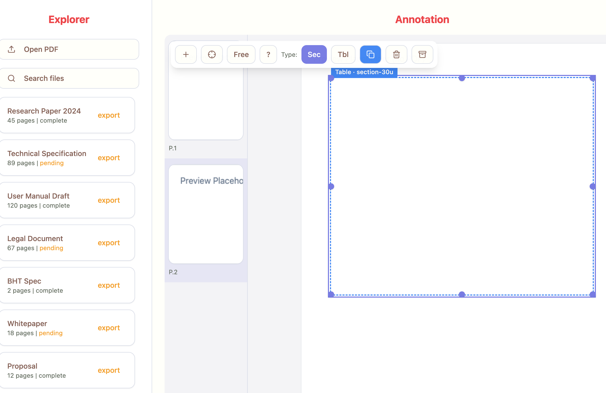

#url:
http://192.168.86.49:8080/classic?v=2

## Issue 1:
Location: Center Pane
Task: the app needs to preload the prototypes/tabbed/pdfs/BHT CV32A65X.pdf
for easier debugging. Currently you are preloading a placeholder

## Issue 2
Location: Left Pane
Task: the 'open pdf' button is inoperable. It needs to prove a modal to prototypes/tabbed/pdfs or somewhere relevant

---

Resolution (implemented)

- Preload default PDF via backend list:
  - On load, the app calls `/api/list` and selects `BHT CV32A65X.pdf` if present, else the first item.
  - Loads the PDF with `/api/pdf?rel=...` using pdfjs; falls back to a placeholder if backend is unavailable.
- Open PDF modal wired:
  - “Open PDF” opens a dialog listing files from `/api/list` (root = `SERVER_PDFS_ROOT`).
  - Filter field narrows results; selecting a file loads it into the center canvas and updates the left list highlight.
- Dev runner updated:
  - `scripts/dev.sh` sets `SERVER_PDFS_ROOT` to `prototypes/tabbed/pdfs` when present (fallback `data/pdfs`).
  - Vite proxy targets the actual backend port (8001 preferred, auto‑fallback to 8000 if 8001 busy).

Acceptance

1) Start with VS Code task `Dev: Clean + Backend(8001) + Vite(8080)`.
2) Visit `http://127.0.0.1:8080/classic`.
3) Center pane should display the BHT PDF (file name shown as selected in left list).
4) Click “Open PDF” → modal shows files under `prototypes/tabbed/pdfs`; filter works; selecting another file switches the viewer.
5) If backend is down, the viewer still works with a placeholder and no fatal errors.

Artifacts/Files

- `prototypes/tabbed/html/src/pages/ClassicLayout.tsx` (preload logic, Open PDF modal, server list integration)
- `scripts/dev.sh` (SERVER_PDFS_ROOT + proxy port detection)
- `scripts/smokes/tabbed_preload.mjs` (CDP smoke: preload + open modal + select BHT)

Status: Done
