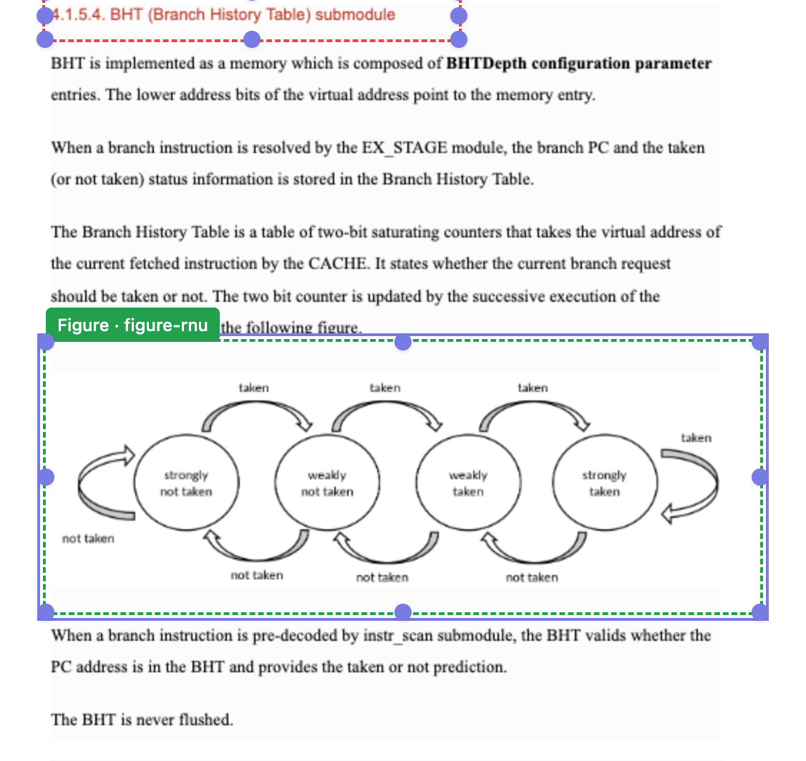
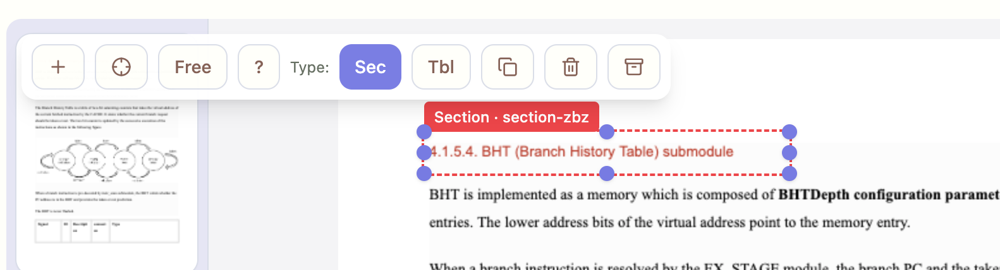

## Issues

### 1) PDF blurry
The PDF image resolution is too low. Increase resolution to prevent blurriness.

### 2) Top menu overlay over center pane
The top menu overlays the PDF area. It must be a separate top area (like the bottom pager) and must not obscure the PDF.

---

Resolution

- Crisp PDF rendering
  - Updated `renderPageCanvas` to render at `devicePixelRatio` (DPR-aware) and set CSS size separately.
  - Canvas backing store now uses DPR-scaled width/height for crispness on HiDPI; CSS size remains at layout pixels.
- Top toolbar separated
  - Added a sticky top toolbar row inside the annotation panel (`data-testid="top-toolbar"`).
  - The viewer/canvas scroll area is below it (`min-h-0` to avoid overlap). Toolbar includes New, Type toggles, Duplicate, Delete, Export, Zoom, Help, and HUD toggle.
  - The floating HUD remains available but is hidden by default and can be toggled; this prevents accidental obstruction.

Acceptance

- [ ] On `/classic`, a canvas appears under a non-overlapping top toolbar.
- [ ] Canvas is crisp on HiDPI: backstore/CSS width ratio ~= `devicePixelRatio`.
- [ ] Opening “HUD” overlay is optional and default is hidden.
- [ ] Scrolling does not cause toolbar to cover the canvas.

Artifacts/Files

- `prototypes/tabbed/html/src/lib/pdf.ts` (DPR-aware render)
- `prototypes/tabbed/html/src/pages/ClassicLayout.tsx` (sticky top toolbar, HUD toggle, layout fixes)
- Smokes:
  - `scripts/smokes/tabbed_crisp_toolbar.mjs` (checks crispness and toolbar non-overlap)
  - Included in `scripts/smokes/all.mjs`

Status: Done
