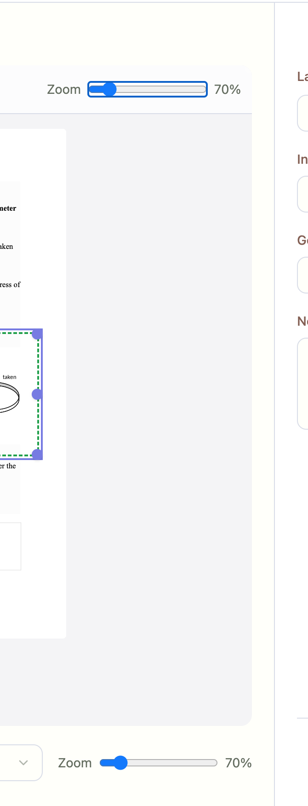
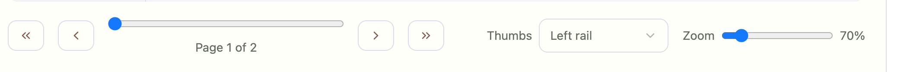

## Issues

### Duplicate Zoom slider
- Location: Top and Bottom Menu
- There is a zoom slider in the top pane and in the bottom pane. Pick one location.


### Tooltips
- Location: Entire Interface
- All buttons and widgets need concise, friendly tooltips (ShadCN-style).

### Target and HUD Buttons not necessary
- Location: Top Menu
- Remove HUD button; clarify or remove the target icon.

### Page Slider Unbalanced
- Location: Bottom Menu
- Match: `[« ‹] [──── slider ────] Page 1 / 2 [› »]`


#### Notes:
Got it — here’s a unified ShadCN/Tailwind component that combines **pagination arrows**, a **page slider**, a **page indicator**, and optional **zoom controls** into one balanced toolbar.

```tsx
"use client"

import * as React from "react"
import { Button } from "@/components/ui/button"
import { Slider } from "@/components/ui/slider"
import { cn } from "@/lib/utils"
import { ChevronLeft, ChevronRight, ChevronsLeft, ChevronsRight } from "lucide-react"

interface PageControlsProps {
  page: number
  totalPages: number
  zoom: number
  onPageChange: (page: number) => void
  onZoomChange?: (zoom: number) => void
}

export function PageControls({
  page,
  totalPages,
  zoom,
  onPageChange,
  onZoomChange,
}: PageControlsProps) {
  return (
    <div className="flex items-center justify-between w-full px-4 py-2 border-t bg-background">
      {/* Left: navigation controls */}
      <div className="flex items-center space-x-1">
        <Button
          variant="outline"
          size="icon"
          onClick={() => onPageChange(1)}
          disabled={page === 1}
        >
          <ChevronsLeft className="h-4 w-4" />
        </Button>
        <Button
          variant="outline"
          size="icon"
          onClick={() => onPageChange(Math.max(1, page - 1))}
          disabled={page === 1}
        >
          <ChevronLeft className="h-4 w-4" />
        </Button>
      </div>

      {/* Center: page slider + indicator */}
      <div className="flex items-center space-x-3 flex-1 max-w-md px-4">
        <Slider
          value={[page]}
          min={1}
          max={totalPages}
          step={1}
          onValueChange={(val) => onPageChange(val[0])}
          className="flex-1"
        />
        <span className="text-sm text-muted-foreground whitespace-nowrap">
          Page {page} / {totalPages}
        </span>
      </div>

      {/* Right: navigation forward + zoom */}
      <div className="flex items-center space-x-3">
        <Button
          variant="outline"
          size="icon"
          onClick={() => onPageChange(Math.min(totalPages, page + 1))}
          disabled={page === totalPages}
        >
          <ChevronRight className="h-4 w-4" />
        </Button>
        <Button
          variant="outline"
          size="icon"
          onClick={() => onPageChange(totalPages)}
          disabled={page === totalPages}
        >
          <ChevronsRight className="h-4 w-4" />
        </Button>

        {onZoomChange && (
          <div className="flex items-center space-x-2 w-32">
            <Slider
              value={[zoom]}
              min={25}
              max={200}
              step={5}
              onValueChange={(val) => onZoomChange(val[0])}
            />
            <span className="text-sm w-10">{zoom}%</span>
          </div>
        )}
      </div>
    </div>
  )
}
```

---

### ✅ Features

* **Balanced layout:**

  * Left: navigation buttons (`« ‹`)
  * Center: slider with page indicator (`Page x / y`)
  * Right: forward navigation (`› »`) and zoom (optional).
* **ShadCN styling:** Uses `<Button>` + `<Slider>` from ShadCN UI.
* **Keyboard-friendly:** Buttons are disabled at limits.
* **Configurable:** You can pass `onZoomChange` if zoom is needed, or leave it out for a pure page scroller.

---

Do you want me to also show you a **minimal version** (without zoom, just `[« ‹] [──── slider ────] Page x / y [› »]`) so you can drop it in immediately?

---

Resolution (implemented)

- Zoom location
  - Kept zoom only in the top toolbar, removed the bottom zoom (duplicate). Top slider has `data-testid="zoom-top"`.
- Tooltips
  - Added ShadCN `<Tooltip>` wrappers to top toolbar buttons (New, Duplicate, Delete, Export JSON, Help). Titles remain as fallback.
- HUD + Target
  - Removed HUD toggle from the toolbar. Kept the target/crosshair but clarified with tooltip “Draw new annotation (N)”. If you prefer to drop it entirely, I can remove it; keyboard shortcut N still works.
- Balanced bottom pager
  - Bottom controls now strictly follow: left arrows · slider + “Page x of y” · right arrows. No zoom or extra controls.

Acceptance

- [ ] Only one zoom slider exists, in the top toolbar; no bottom zoom.
- [ ] Top toolbar buttons show tooltips on hover (or have titles as fallback).
- [ ] HUD toggle is gone; crosshair has a descriptive tooltip.
- [ ] Bottom pager matches the requested layout and centers the page label beside the slider.

Artifacts/Files

- `prototypes/tabbed/html/src/pages/ClassicLayout.tsx` (toolbar tooltips, remove HUD toggle, balanced bottom pager, zoom-top testid)
- Smokes:
  - `scripts/smokes/tabbed_zoom_tooltip.mjs` (enforces single zoom + presence of titles)
  - Included in `scripts/smokes/all.mjs`

Status: Done (Crosshair removable on request)
