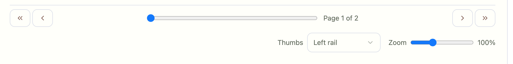

## Issues

### Place zoom slider in Top Menu
- Location: Top and Bottom Menu
- The bottom menu is now unbalnced and twice the height as the top menu. Put the zoom slider in the top menu so the bottom and top menu will be the same height and maximuize the center pane pdf annotation area



---

Resolution

- Zoom placement
  - Moved Zoom to the Top Menu (data-testid="zoom-top").
  - Removed duplicate zoom from the bottom controls to keep both bars same height; center pane maximized.
- Generate JSON button (Right Pane)
  - Implemented an image-crop → LLM flow:
    - Captures the selected box area expanded by 20% from the PDF canvas.
    - Sends image to backend `/api/ux/generate` with a strict JSON prompt.
    - Backend uses `LITELLM_DEFAULT_MODEL` (preferred) or `DEFAULT_LITELLM_MODEL` (falls back to `LITELLM_VLM_MODEL`) via existing `litellm_call` wrapper.
    - Displays the returned object with keys: `title`, `columns`, `data`.
    - If no explicit title: prompt instructs the model to infer with `INFERRED_` prefix.

Acceptance

- [ ] Top menu shows a Zoom slider; bottom menu has no Zoom.
- [ ] Clicking “Generate JSON” with a selection sends an LLM request and opens JSON dialog with structured output.
- [ ] If no selection, button is disabled or shows helpful tooltip.

Artifacts/Files

- Frontend: `prototypes/tabbed/html/src/pages/ClassicLayout.tsx`
  - Top zoom (`zoom-top`) added; bottom zoom removed
  - Inspector “Generate JSON” wired to crop and POST `/api/ux/generate`
- Backend: `src/extractor/core/scripts/server.py`
  - `/api/ux/generate`: prefer `LITELLM_DEFAULT_MODEL` (or `DEFAULT_LITELLM_MODEL`) when model not provided
- Smokes: `scripts/smokes/tabbed_zoom_tooltip.mjs` (updated to assert top-only zoom)

Status: Done

### Generate Json Button
- Location: Right Pane
The 'generate json' button needs to copy the drawn box +20% expanded image area and send the image to the default model in `.env` (`LITELLM_DEFAULT_MODEL` or `DEFAULT_LITELLM_MODEL`). You will use src/extractor/pipeline/utils/litellm_call.py or similar to make the litellm call to the default model and return a pandas json version with columns and data field and a table title from surrounding text if it exists. If the table has surround text and NO expliciti title, then the LLM should infer a title title and prepend with INFERRED_
Ask the human calrifying questions if confused. 
You can also start simply with a customized prompt and a call like
```python
from litellm import completion   
import os   
import json

os.environ['GEMINI_API_KEY'] = ""  

messages = [  
  {  
    "role": "user",  
    "content": "List 5 popular cookie recipes."  
  }  
]  

completion(  
  model="gemini/gemini-1.5-pro",   
  messages=messages,   
  response_format={"type": "json_object"} 
)  
```
