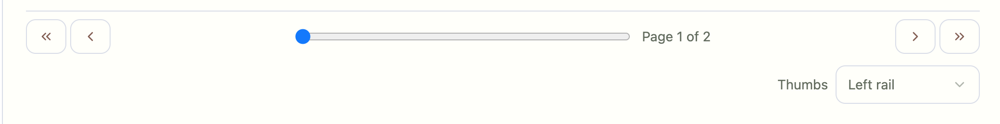
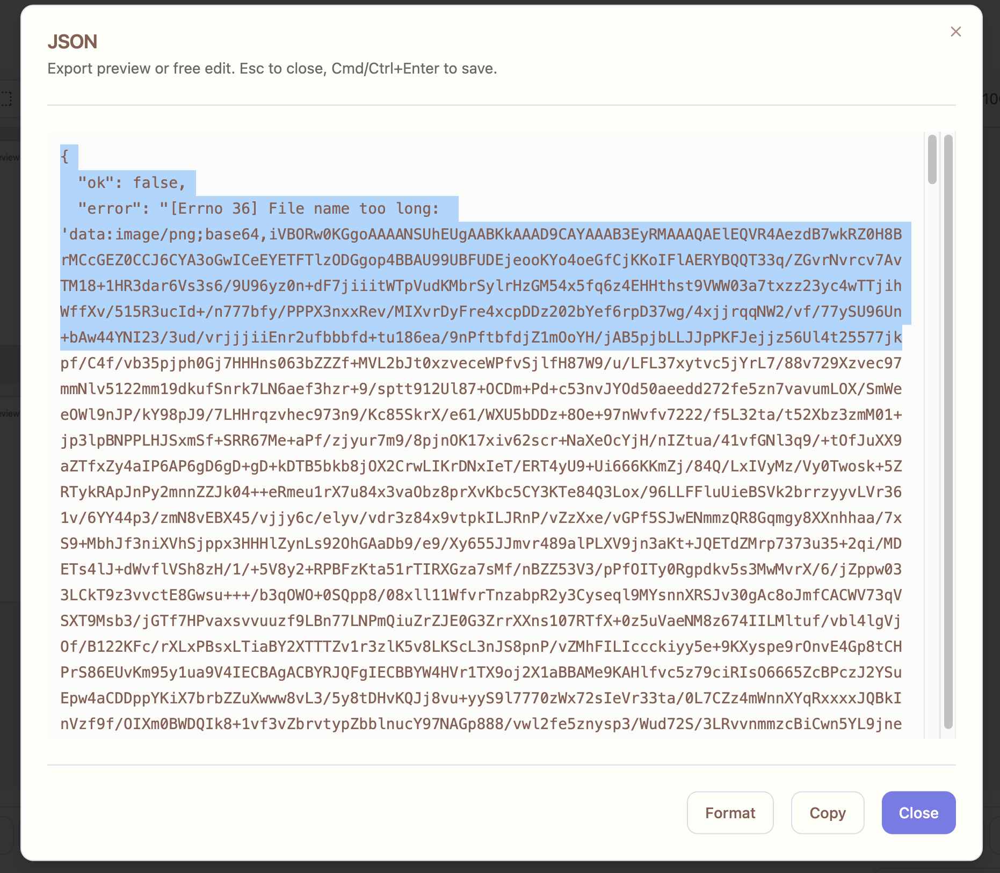

## Single-Row Bottom Pane (Classic)

Location: Bottom pane (Classic layout)

Problem
- Bottom area used two vertical rows: filmstrip, page controls, and a separate “Thumbs” selector row.
- This reduced the center canvas height and felt “double width”.

Why
- Keep the center pane as large as possible for annotation.

Fix
- Consolidate controls into one bottom row:
  - Inline the “Thumbs” selector inside page controls (right-aligned).
  - Reduce filmstrip height for a slimmer footprint.

Acceptance
- Bottom filmstrip mode shows a single-row controls bar beneath the thumbnails.
- “Thumbs” selector appears inside the page controls row (no extra row).
- A smoke test validates the layout and saves artifacts to `scripts/artifacts/`.

Screenshot (pre-fix for reference)

Smoke
- VS Code: task “Smokes: Tabbed (bottom single row)”
- CLI: `BASE_URL="http://127.0.0.1:8080/main" node scripts/smokes/tabbed_bottom_single_row.mjs`

Artifacts
- `scripts/artifacts/bottom_single_row_*.png`
- `scripts/artifacts/bottom_single_row_*.log`

---

## Generate JSON Button (Right Pane)

Problem
- The button should base64-encode the crop and call the LLM endpoint, returning well‑formatted JSON. Currently it produces only an image.

Status
- Real LLM smoke exists to validate end‑to‑end (see “Smokes: Tabbed (generate json REAL)”).

Screenshot (current)

