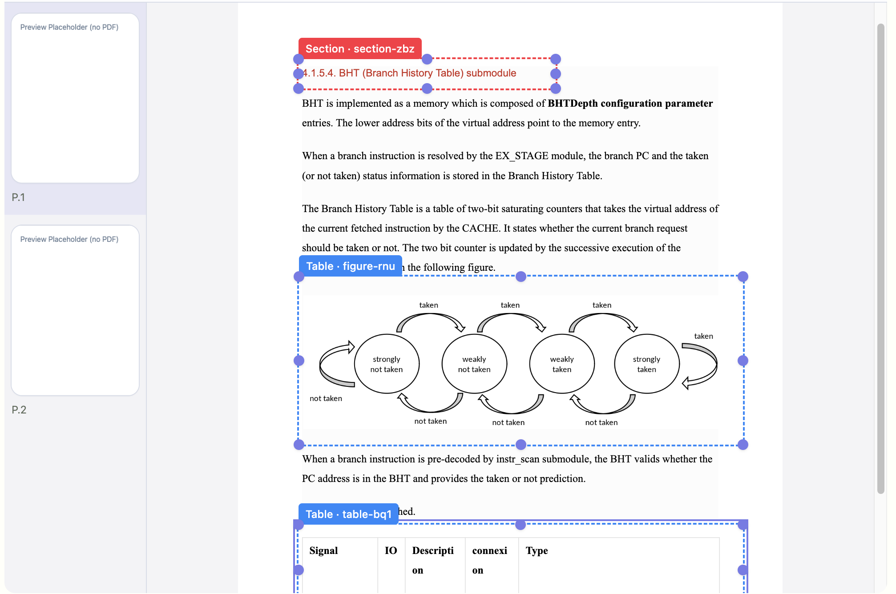
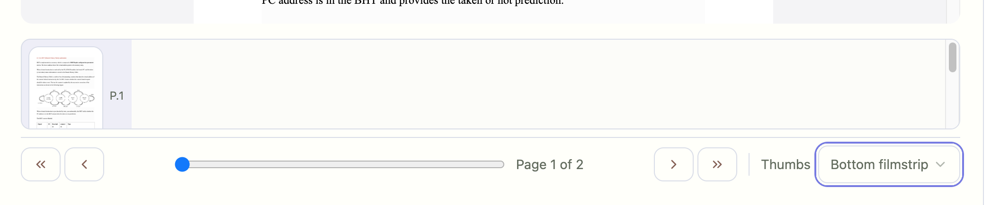
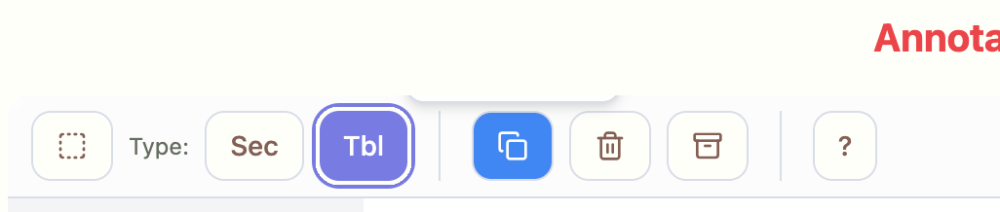
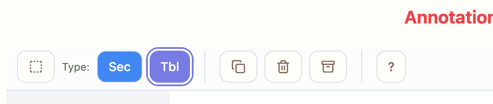
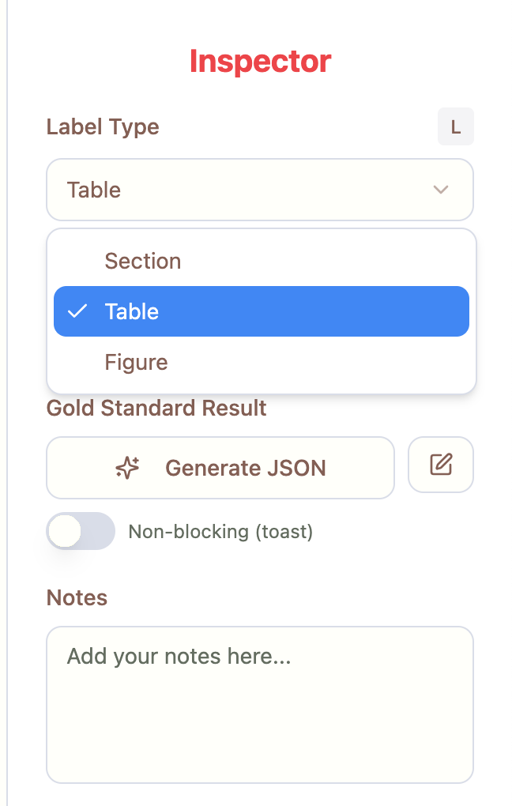

### No Page Thumbnails
Location: Left rail and bottom filmstrip

- Left Rail Mode — thumbnails render as placeholders only
  - Fixed: auto‑load first PDF and ensure image data URLs produced for page thumbs
  - Smoke: `scripts/smokes/tabbed_thumbnails_left.mjs`
    - Asserts at least two page thumbnail images are present

- Bottom Filmstrip Mode — only one thumbnail shows although doc has 2 pages
  - Fixed: for small docs (≤ 4 pages) render a simple row (no virtualization) so multiple thumbs are visible without scrolling
  - Smoke: `scripts/smokes/tabbed_thumbnails_bottom.mjs`
    - Asserts at least two page thumbnail images are present
  
Screenshots:

### Tooltips have no text
- Location: App-wide
- Fix/Verify: ShadCN TooltipProvider is at root; added tooltip on the new header button to validate behavior.
- Smoke: `scripts/smokes/tooltips_text.mjs` (checks tooltip content appears on hover)

### Delete Keypress
Location: Middle Pane
- Behavior exists (window keydown). Verified via smoke.
- Smoke: `scripts/smokes/delete_keypress.mjs` (draw → Delete → count decreases)

### Missing “Add Annotation”
- Location: Top menu
- Added: header button (Tag icon) opens Add Label dialog (`data-testid="btn-add-annotation"`)
- Smoke: `scripts/smokes/add_annotation_button.mjs` (click opens dialog)

---

Split & Tracked
- 008_thumbnails_left_rail.md
- 009_thumbnails_bottom_filmstrip.md
- 010_tooltips_text.md
- 011_delete_keypress.md
- 012_add_label_top_menu.md
