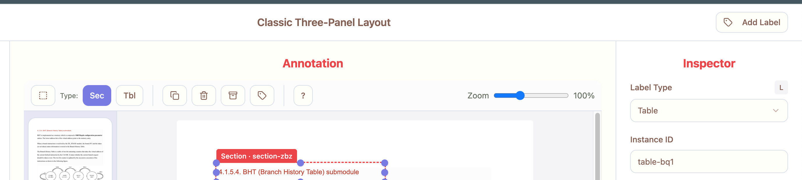

## Add Label icon in top center menu

Problem
- The “Add Label” (tag) icon was not visible in the main top center toolbar above the canvas as requested.

Fix
- Added a compact Tag icon button to the page controls toolbar (the top center row above the canvas), next to Duplicate / Delete / Export actions.
- The button opens the same “Add Label” dialog used in the HUD and header.
- Tooltip added: “Add label type”.

Files
- `prototypes/tabbed/html/src/pages/ClassicLayout.tsx`
  - New button: `data-testid="btn-add-annotation-top"`
  - Tooltip+title included for mouseover text.

Smoke (verification)
- Script: `scripts/smokes/add_annotation_top_menu.mjs`
  - Checks that `btn-add-annotation-top` exists on `/classic`.
  - Artifact: `scripts/artifacts/add_top_menu_*.{log,png}`

How to run
1) Ensure dev server is running on 8080.
2) Run: `BASE_URL="http://127.0.0.1:8080" node scripts/smokes/add_annotation_top_menu.mjs`
3) Expect: `exists=true` in log and the Tag icon visible in the top toolbar next to Duplicate/Delete/Export.

Note
- A header button also exists (right of the page title) for easy access. The new toolbar icon ensures the action is available where the annotation buttons live.

Screenshot reference:

