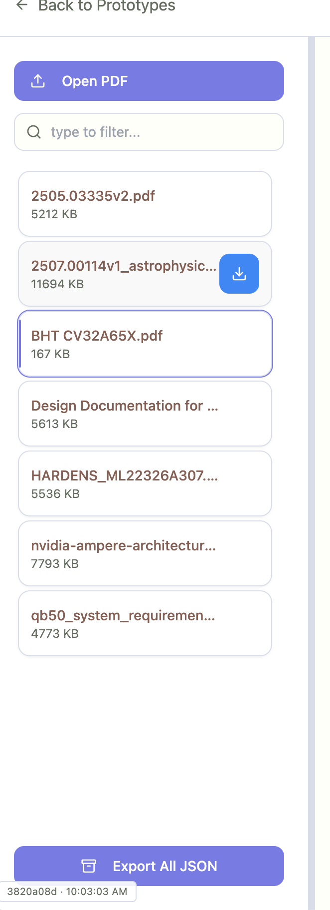

Short answer: no—the hover blue doesn’t need to be that large or saturated.

### Best practice for list-item hovers (ShadCN/Tailwind)

* **Keep the hit area full-row**, but use a **subtle hover** (2–6% tint) so scanning the list isn’t interrupted. Reserve strong color fills for **selected/current** states.
* **Differentiate states clearly**:

  * *Hover*: light bg (accent/muted), no bolding.
  * *Selected/current*: stronger bg + foreground swap.
  * *Keyboard focus*: ring, not a heavy fill.
* **Show trailing actions (e.g., download) on hover** with fade-in; keep them visible when selected.
* **Accessibility**: maintain 40–48px row height; `aria-selected`/`aria-current`; `focus-visible` ring.

### Recommended styles

Use ShadCN tokens so it themes correctly:

```tsx
<li>
  <button
    className={cn(
      "group w-full h-12 px-3 rounded-xl flex items-center justify-between text-left",
      "transition-colors",
      // hover — subtle, not a heavy blue slab
      "hover:bg-accent/40 dark:hover:bg-accent/30",
      // selected/current
      "data-[selected=true]:bg-accent data-[selected=true]:text-accent-foreground",
      // keyboard focus
      "focus-visible:outline-none focus-visible:ring-2 focus-visible:ring-ring focus-visible:ring-offset-2"
    )}
    aria-selected={selected}
    data-selected={selected}
  >
    <span className="truncate">2507.00114v1_astrophysics.pdf</span>

    <Button
      variant="ghost"
      size="icon"
      className="opacity-0 group-hover:opacity-100 data-[selected=true]:opacity-100"
      aria-label="Download"
    >
      <Download className="h-4 w-4" />
    </Button>
  </button>
</li>
```

### Optional variant (even lighter)

Keep hover neutral and use a **left border** for selected:

```tsx
"hover:bg-muted",
"data-[selected=true]:border-l-2 data-[selected=true]:border-primary",
```

This approach keeps the list calm, improves scanability, and preserves strong color for selection/focus instead of every hover.



---

Artifacts

- UX health (classic):
  - log: scripts/artifacts/ux_check_2025-09-15T16-44-17-969Z.log
  - screenshot: scripts/artifacts/ux_check_2025-09-15T16-44-17-969Z.png
- Smoke (issue_018: dialog item hit-area/hover):
  - log: scripts/artifacts/issue_018_2025-09-15T16-48-56-749Z.log
  - screenshot: scripts/artifacts/issue_018_2025-09-15T16-48-56-749Z.png

Notes

- Implemented subtle full-row hover and 48px hit area for PDF picker items in `prototypes/tabbed/html/src/pages/ClassicLayout.tsx`.
- Selection now uses `aria-selected` and `data-selected` with ShadCN tokens; focus shows a ring.
- Verified typecheck and health gate; added `scripts/smokes/issue_018.mjs` for regression coverage.
