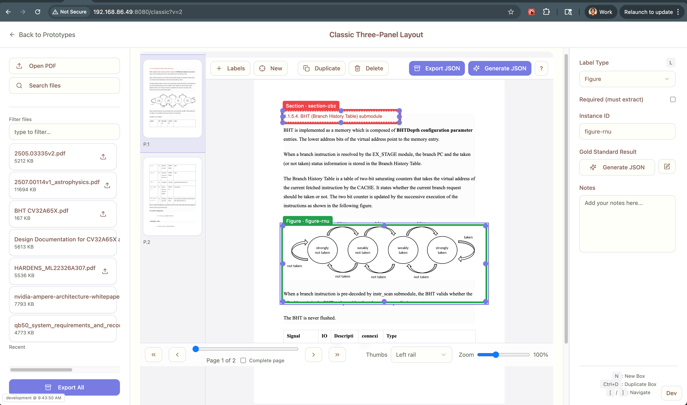

You’re not crazy—this is a classic “ghost server + cached assets” problem. Let’s fix it in two phases:

---

# Do this now (one-time reset)

1. **Kill every server bound to 8080 (and any preview):**

```bash
# Linux/WSL/Ubuntu
pkill -f "vite" || true
pkill -f "preview" || true
fuser -k 8080/tcp || true
```

2. **Hard-clean the frontend build cache:**

```bash
cd prototypes/tabbed/html
rm -rf node_modules/.vite .vite dist
npm ci
```

3. **Start dev with zero caching + forced fresh transform:**

```bash
# add --force to bypass Vite's transform cache
npm run dev -- --force
```

4. **Hard-reload the browser** on `http://192.168.86.49:8080/classic`
   Use Shift+Reload (or `Ctrl/Cmd+Shift+R`). If you have a PWA/service-worker, open DevTools → Application → Service Workers → *Unregister* + *Clear storage* (check all) → reload.

If you still don’t see changes, you’re almost certainly hitting a different server on the LAN that’s also serving `/classic`. Skip to “Bulletproof it forever.”

---

# Bulletproof it forever (make stale builds impossible)

## 1) Force **no-store** caching in Dev (both Vite and FastAPI)

**vite.config.ts**

```ts
import { defineConfig } from 'vite';
import react from '@vitejs/plugin-react';

export default defineConfig(({ mode }) => ({
  plugins: [react()],
  server: {
    host: '0.0.0.0',
    port: 8080,
    headers: mode === 'development' ? {
      'Cache-Control': 'no-store, no-cache, must-revalidate, proxy-revalidate',
      'Pragma': 'no-cache',
      'Expires': '0',
      'Surrogate-Control': 'no-store',
    } : {},
  },
  preview: {
    host: '0.0.0.0',
    port: 8080, // if you use preview on the same port, make sure you kill dev first
  },
}));
```

**FastAPI (dev) static files**

```python
# fastapi_app.py
from fastapi import FastAPI, Response, Request
from fastapi.staticfiles import StaticFiles

app = FastAPI()

# Serve /api first; if you also serve static via FastAPI in dev:
app.mount("/static", StaticFiles(directory="prototypes/tabbed/html/dist/assets", html=False), name="static")

@app.middleware("http")
async def no_cache_dev(request: Request, call_next):
    response: Response = await call_next(request)
    # Only in development; guard with an env var
    response.headers["Cache-Control"] = "no-store, no-cache, must-revalidate, proxy-revalidate"
    response.headers["Pragma"] = "no-cache"
    response.headers["Expires"] = "0"
    response.headers["Surrogate-Control"] = "no-store"
    return response
```

> If you run Vite directly and proxy `/api` → FastAPI, the Vite headers above are enough for the frontend; the middleware helps if FastAPI also serves any HTML/assets in other modes.

---

## 2) Add a **build marker** (commit + timestamp) visible in the UI and retrievable via endpoints

**package.json (build script writes a marker)**

```json
{
  "scripts": {
    "prebuild": "node scripts/write_build_info.mjs",
    "build": "vite build",
    "preview:8080": "vite preview --port 8080 --strictPort"
  }
}
```

**scripts/write\_build\_info.mjs**

```js
import { execSync } from 'node:child_process';
import { writeFileSync } from 'node:fs';

const gitRef = execSync('git rev-parse --short HEAD', {encoding:'utf8'}).trim();
const when = new Date().toISOString();
const payload = { git: gitRef || 'unknown', built_at: when };

writeFileSync('public/build.json', JSON.stringify(payload, null, 2));
console.log('Wrote public/build.json', payload);
```

**App root (React)**

```tsx
// BuildChip.tsx
import { useEffect, useState } from 'react';

export default function BuildChip() {
  const [info, setInfo] = useState<{git:string; built_at:string} | null>(null);
  useEffect(() => { fetch('/build.json', {cache: 'no-store'}).then(r=>r.json()).then(setInfo).catch(()=>{}); }, []);
  if (!info) return null;
  return (
    <div aria-label="build-info" className="fixed left-2 bottom-2 text-xs opacity-70">
      {info.git} · {new Date(info.built_at).toLocaleString()}
    </div>
  );
}
```

Now you and the agent can say “I see `e3fa21c · 9/13 09:42` in the bottom-left.” If your page doesn’t show the same git/time, it’s stale.

**Backend mirror endpoint (helps detect mismatches):**

```python
# /api/build
import subprocess, datetime
from fastapi import FastAPI
app = FastAPI()

@app.get("/api/build")
def api_build():
    try:
        git = subprocess.check_output(["git", "rev-parse", "--short", "HEAD"]).decode().strip()
    except Exception:
        git = "unknown"
    return {"git": git, "started_at": datetime.datetime.utcnow().isoformat()+"Z"}
```

On page load, compare `/build.json` (frontend) with `/api/build` (backend). If the git SHAs differ, show a banner: “Frontend and API are out of sync—hard reload.”

---

## 3) Eliminate **ghost servers** with a single-entry script that *always* kills before it starts

**scripts/dev.sh**

```bash
#!/usr/bin/env bash
set -euo pipefail
# Kill anything on 8080 and 8001 first
fuser -k 8080/tcp || true
fuser -k 8001/tcp || true

# Clean Vite caches in dev to avoid stale transforms
rm -rf prototypes/tabbed/html/node_modules/.vite prototypes/tabbed/html/.vite

# Start backend + frontend (adjust paths/commands to yours)
( cd backend && uvicorn fastapi_app:app --host 0.0.0.0 --port 8001 --reload ) &
BACK_PID=$!

( cd prototypes/tabbed/html && npm run dev -- --force ) &
FRONT_PID=$!

echo "Backend PID: $BACK_PID, Frontend PID: $FRONT_PID"
wait
```

**VS Code `tasks.json`** (use this single task instead of multiple ad-hoc ones)

```json
{
  "version": "2.0.0",
  "tasks": [
    {
      "label": "Dev: Clean + Backend(8001) + Vite(8080)",
      "type": "shell",
      "command": "./scripts/dev.sh",
      "options": { "shell": { "executable": "/bin/bash" } },
      "problemMatcher": [],
      "isBackground": false,
      "presentation": { "reveal": "always", "panel": "dedicated" }
    }
  ]
}
```

> Anyone clicks this one task: it **kills**, **cleans**, and **starts** both servers deterministically.

---

## 4) Make **preview** deterministic (prod-like) and mutually exclusive with dev

* Only ever run one of these per machine:

  * **Dev (HMR)**: `npm run dev -- --force`
  * **Preview (prod)**: `npm run build && npm run preview:8080`

Guard preview start with a kill:

```json
{
  "scripts": {
    "preview:8080": "fuser -k 8080/tcp || true && vite preview --port 8080 --strictPort"
  }
}
```

---

## 5) Disable/Control **Service Workers** (if using PWA)

If you use `vite-plugin-pwa`, stale SWs will win over your fresh builds.

* During dev, **disable** the plugin or set:

```ts
// vite.config.ts (within PWA config)
devOptions: { enabled: false }
```

* In prod, ensure:

  * `clientsClaim: true`, `skipWaiting: true`
  * Bump a `swVersion` each release so the SW actually updates.

---

## 6) Add **self-diagnostics** to the UI (automatic stale detection)

On app load:

* Fetch `/build.json` (frontend) and `/api/build` (backend).
* If **git differs** or `built_at` older than, say, 1 hour in dev, show a toast:
  “Stale frontend detected (git a1b2c vs api c3d4). Click to hard refresh.”

Small hook:

```tsx
useEffect(() => {
  async function check() {
    const fe = await fetch('/build.json', {cache:'no-store'}).then(r=>r.json()).catch(()=>null);
    const be = await fetch('/api/build', {cache:'no-store'}).then(r=>r.json()).catch(()=>null);
    if (fe && be && fe.git && be.git && fe.git !== be.git) {
      alert(`Frontend ${fe.git} ≠ Backend ${be.git}. Press Shift+Reload.`);
    }
  }
  check();
}, []);
```

---

## 7) CI/PR safety rail (prevents merge without fresh build)

* CI job runs `npm ci && npm run build` and **publishes `public/build.json` as an artifact**.
* The PR comment posts the resulting `{ git, built_at }`. If your live page doesn’t match, you’ll know instantly.

---

## 8) Human checklist for collaborators (pin it in the repo)

* Always start the stack via **“Dev: Clean + Backend(8001) + Vite(8080)”** task.
* Never run `vite preview` while dev is running.
* If the “build chip” isn’t visible or shows an old time/sha → hard reload, then run the **Dev** task again.
* If something looks wrong, visit `/build.json` directly in the browser and paste the contents into the PR/issue.

---

## Likely root causes of your current pain (and how the above fixes them)

* **A preview server left running** on 8080 → the kill-before-start script ends this.
* **Browser or SW caching** → dev headers set to `no-store` + SW disabled in dev.
* **Vite transform cache** after branch switches → `--force` and periodic `.vite` clean.
* **Multiple copies of the app** on the LAN serving `/classic` → the **build chip** makes mismatches obvious.
* **FastAPI (or a proxy) caching static** → middleware adds `no-store` headers.

---

If you apply the above, you will stop seeing “it works here but not there.” You’ll have:

* deterministic start/stop,
* explicit cache-busting,
* visual build identity,
* automatic stale detection,
* and a single VS Code task everyone uses.

If you want, I can also give you a tiny banner component that lights up red if the frontend/backend SHAs differ so nobody misses it.
