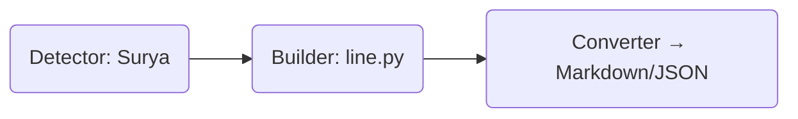

# Builders Module

This package **builds higher-level document structures** from low-level detection output.

| File | Purpose |
|------|---------|
| `line.py` | Groups OCR text boxes into coherent text **lines** using Surya detection + ftfy cleanup. |
| `paragraph.py` | (planned) Merge lines into paragraphs with spacing heuristics. |
| `table.py` | (planned) Assemble detected cell boxes into JSON table structures. |

The Builders layer sits between raw **detection/ocr** and the public **converters/renderers** APIs.



## Development Status
* Only `line.py` is currently implemented.
* Tables and paragraph builders are stubs – see `003_cleanup_tasks.md` for next steps.

## Usage Example
```python
from extractor.core.builders.line import build_lines
lines = build_lines(ocr_results)  # returns List[Line]
```

## Maintainers
* @your-name – please update when extending this layer.
