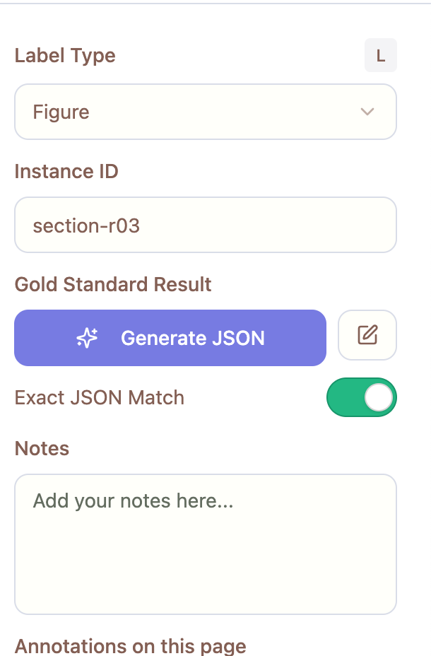
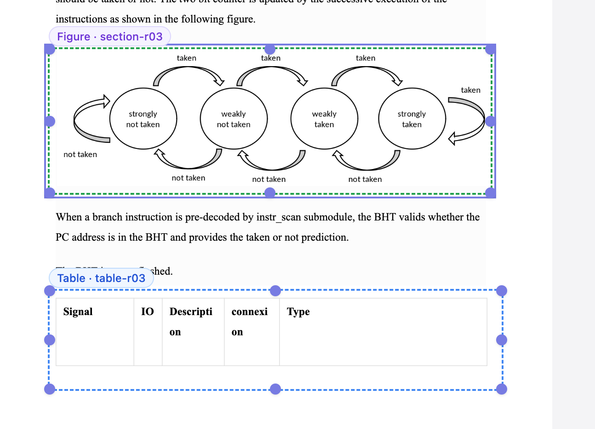
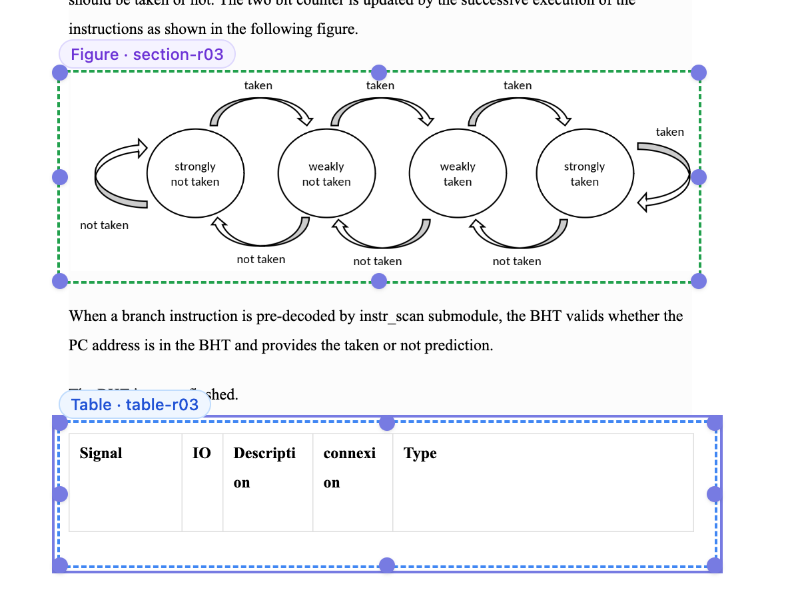

- 
## Dynamic ID change
Location Left: Pane
When you change the label type, the id needs to chane
chaning label type to  Section must change
table-ro3
to 
section-ro3
This change must also appear in the relevant boc label of the middile pan

## Label Highlight
Location: Middle Panel
When you select a box , the rectable highlights. The box label must also highlight--perhaps with a minimal/tasteful stroke/ring. Use the most tasteful/modern ShadCN component for this

